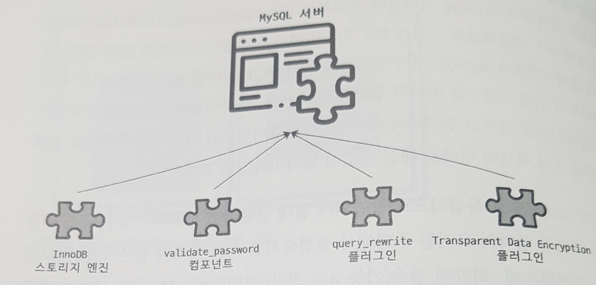

```sql
MySQL 서버는 사람의 머리 역할을 담당하는 MySQL 엔진과 손발 역할을 담당하는 스토리지 엔진으로 구분할 수 있다.
그리고 손과 발의 역할을 담당하는 스토리지 엔진은 핸들러 API를 만족하면
누구든지 스토리지 엔진을 구현해서 MySQL 서버에 추가해서 사용할 수 있다.
이번 장에서는 MySQL 엔진과MySQL 서버에서 기본으로 제공되는 InnoDB 스토리지 엔진,
그리고 MyISAM 스토리지 엔진을 구분해서 살펴보겠다.

4.1 MySQL 엔진 아키텍처

  먼저 MySQL의 쿼리를 작성하고 튜닝할 때 필요한 기본적인 MySQL 엔진의 구조를 훑어보겠다.

  MySQL 서버는 다른 DBMS에 비해 구조가 상당히 독특하다.
  사용자 입장에서 보면 거의 차이가 느껴지지 않지만 이러한 독특한 구조 때문에
  다른 DBMS에서는 가질 수 없는 엄청난 혜택을 누릴 수 있으며,
  반대로 다른 DBMS에서는 문제되지 않을 것들이 가끔 문제가 되기도 한다.

4.1.1 MySQL의 전체 구조

  ```
  
  그림 4.1 MySQL 서버의 전체 구조
  ```SQL

  77 ===============================================================================================================

  MySQL은 일반 상용 RDBMS와 같이 대부분의 프로그래밍 언어로부터 접근 방법을 모두 지원한다.
  MSQL 고유의 C API부터 시작해 JDBC나 ODBC, 그리고 .NET의 표준 드라이버를 제공하며,
  이러한 드라이버를 이용해 C/C++, PHP, 자바, 펄, 파이썬, 루비나 .NET 및
  코볼까지 모든 언어로MySQL 서버에서 쿼리를 사용할 수 있게 지원한다.

  MASQL 서버는 크게 MySQL 엔진과 스토리지 엔진으로 구분할 수 있다.
  이 책에서는 MySQL의 쿼리파서나 옵티마이저 등과 같은 기능을 스토리지 엔진과 구분하고자
  그림 4.1처럼 'MySQL 엔진'과 '스토리지 엔진'으로 구분했다.
  그리고 이 둘을 모두 합쳐서 그냥 MySQL 또는 MySQL 서버라고 표현하겠다.

4.1.1.1 MySQL 엔진

  MySQL 엔진은 클라이언트로부터의 접속 및 쿼리 요청을 처리하는 커넥션 핸들러와 SQL 파서 및 전처리기,
  쿼리의 최적화된 실행을 위한 옵티마이저가 중심을 이룬다.
  또한 MySQL은 표준 SQL(ANSI SQL) 문법을 지원하기 때문에
  표준 문법에 따라 작성된 쿼리는 타 DBMS와 호환되어 실행될 수 있다.

4.1.1.2 스토리지 엔진

  MySQL 엔진은 요청된 SQL 문장을 분석하거나 최적화하는 등 DBMS의 두뇌에 해당하는 처리를 수행하고,
  실제 데이터를 디스크 스토리지에 저장하거나 디스크 스토리지로부터
  데이터를 읽어오는 부분은 스토리지 엔진이 전담한다.
  MySQL 서버에서 MySQL 엔진은 하나지만 스토리지 엔진은 여러 개를 동시에 사용할 수 있다.
  다음 예제와 같이 테이블이 사용할 스토리지 엔진을 지정하면
  이후 해당 테이블의 모든 읽기 작업이나 변경 작업은 정의된 스토리지 엔진이 처리한다.

  mysql> CREATE TABLE test_table (fd1 INT, fd2 INT) ENGINE=INNODB;

  위 예제에서 test_table은 InnoDB 스토리지 엔진을 사용하도록 정의했다.
  이제 test_table에 대해INSERT, UPDATE, DELETE, SELECT, ... 등의 작업이 발생하면
  InnoDB 스토리지 엔진이 그러한 처리를 담당한다.
  그리고 각 스토리지 엔진은 성능 향상을 위해 키 캐시(MyISAM 스토리지 엔진)나
  InnoDB 버퍼 풀(InnoDB 스토리지 엔진)과 같은 기능을 내장하고 있다.

  78 ===============================================================================================================

4.1.1.3 핸들러 API

  MySQL 엔진의 쿼리 실행기에서 데이터를 쓰기나 원어이 할 때는 각 스토리지 엔진에 쓰기 또는 읽기를 하는데,
  이러한 요청을 핸들러(Handler) 요청이라 하고, 이기서 사용되는 API를 헨들러 API라고 한다.
  InnoDB 스토리지 엔진 또한 이 핸들러 API를 이용해 MySQL 엔진과 데이터를 주고받는다.
  이 핸들러 API를 통해 얼마나 많은 데이터(레코드) 작업이 있었는지는
  SHOW GLOBAL STATUS LIKE 'Handlerg%'; 명령으로 확인할 수 있다.

mysql> SHOW GLOBAL STATUS LIKE 'Handler%';
       +----------------------------+--------+
       | Variable_name              | Value  |
       +----------------------------+--------+
       | Handler_commit             | 2696   |
       | Handler_delete             | 184    |
       | Handler_discover           | 0      |
       | Handler_external_lock      | 155891 |
       | Handler_mrr_init           | 0      |
       | Handler_prepare            | 326    |
       | Handler_read_first         | 67     |
       | Handler_read_key           | 7731   |
       | Handler_read_last          | 10     |
       | Handler_read_next          | 8394   |
       | Handler_read_prev          | 0      |
       | Handler_read_rnd           | 0      |
       | Handler_read_rnd_next      | 13676  |
       | Handler_rollback           | 1      |
       | Handler_savepoint          | 0      |
       | Handler_savepoint_rollback | 0      |
       | Handler_update             | 352    |
       | Handler_write              | 840    |
       +----------------------------+--------+
       18 rows in set (0.02 sec)

  79 ===============================================================================================================

4.1.2 MySQL 스레딩 구조

  ```
  
  그림 4.2 MySQL의 스레딩 모델
  ```SQL

  MySQL 서버는 프로세스 기반이 아니라 스레드 기반으로 작동하며,
  크게 포그라운드(Foregrounri |스레드와 백그라운드(Background) 스레드로 구분할 수 있다.
  MySQL 서버에서 실행 중인 스레드 목록은
  다음과 같이 performance_schema 데이터베이스의 threads 테이블을 통해 확인할 수 있다.

  mysql> SELECT thread_id
              , name
              , type
              , processlist_user
              , processlist_host
             -- SELECT *
           FROM performance_schema.threads
          ORDER BY type
                 , thread_id
          ;
      +-----------+---------------------------------------------+------------+------------------+------------------+
      | thread_id | name                                        | type       | processlist_user | processlist_host |
      +-----------+---------------------------------------------+------------+------------------+------------------+
      |         1 | thread/sql/main                             | BACKGROUND | NULL             | NULL             |
      |         2 | thread/mysys/thread_timer_notifier          | BACKGROUND | NULL             | NULL             |
      |         4 | thread/innodb/io_ibuf_thread                | BACKGROUND | NULL             | NULL             |
      |         5 | thread/innodb/io_log_thread                 | BACKGROUND | NULL             | NULL             |
      |         6 | thread/innodb/io_read_thread                | BACKGROUND | NULL             | NULL             |
      |         7 | thread/innodb/io_read_thread                | BACKGROUND | NULL             | NULL             |
      |         8 | thread/innodb/io_read_thread                | BACKGROUND | NULL             | NULL             |
      |         9 | thread/innodb/io_read_thread                | BACKGROUND | NULL             | NULL             |
      |        10 | thread/innodb/io_write_thread               | BACKGROUND | NULL             | NULL             |
      |        11 | thread/innodb/io_write_thread               | BACKGROUND | NULL             | NULL             |
      |        12 | thread/innodb/io_write_thread               | BACKGROUND | NULL             | NULL             |
      |        13 | thread/innodb/io_write_thread               | BACKGROUND | NULL             | NULL             |
      |        14 | thread/innodb/page_flush_coordinator_thread | BACKGROUND | NULL             | NULL             |
      |        15 | thread/innodb/log_checkpointer_thread       | BACKGROUND | NULL             | NULL             |
      |        16 | thread/innodb/log_flush_notifier_thread     | BACKGROUND | NULL             | NULL             |
      |        17 | thread/innodb/log_flusher_thread            | BACKGROUND | NULL             | NULL             |
      |        18 | thread/innodb/log_write_notifier_thread     | BACKGROUND | NULL             | NULL             |
      |        19 | thread/innodb/log_writer_thread             | BACKGROUND | NULL             | NULL             |
      |        24 | thread/innodb/srv_lock_timeout_thread       | BACKGROUND | NULL             | NULL             |
      |        25 | thread/innodb/srv_error_monitor_thread      | BACKGROUND | NULL             | NULL             |
      |        26 | thread/innodb/srv_monitor_thread            | BACKGROUND | NULL             | NULL             |
      |        27 | thread/innodb/buf_resize_thread             | BACKGROUND | NULL             | NULL             |
      |        28 | thread/innodb/srv_master_thread             | BACKGROUND | NULL             | NULL             |
      |        29 | thread/innodb/dict_stats_thread             | BACKGROUND | NULL             | NULL             |
      |        30 | thread/innodb/fts_optimize_thread           | BACKGROUND | NULL             | NULL             |
      |        31 | thread/mysqlx/worker                        | BACKGROUND | NULL             | NULL             |
      |        32 | thread/mysqlx/worker                        | BACKGROUND | NULL             | NULL             |
      |        33 | thread/mysqlx/acceptor_network              | BACKGROUND | NULL             | NULL             |
      |        37 | thread/innodb/buf_dump_thread               | BACKGROUND | NULL             | NULL             |
      |        38 | thread/innodb/clone_gtid_thread             | BACKGROUND | NULL             | NULL             |
      |        39 | thread/innodb/srv_purge_thread              | BACKGROUND | NULL             | NULL             |
      |        40 | thread/innodb/srv_worker_thread             | BACKGROUND | NULL             | NULL             |
      |        41 | thread/innodb/srv_worker_thread             | BACKGROUND | NULL             | NULL             |
      |        42 | thread/innodb/srv_worker_thread             | BACKGROUND | NULL             | NULL             |
      |        44 | thread/mysqlx/acceptor_network              | BACKGROUND | NULL             | NULL             |
      |        47 | thread/sql/con_sockets                      | BACKGROUND | NULL             | NULL             |
      |        43 | thread/sql/event_scheduler                  | FOREGROUND | event_scheduler  | localhost        |
      |        46 | thread/sql/compress_gtid_table              | FOREGROUND | NULL             | NULL             |
      |        49 | thread/sql/one_connection                   | FOREGROUND | root             | localhost        |
      |        50 | thread/sql/one_connection                   | FOREGROUND | root             | localhost        |
      |        67 | thread/sql/one_connection                   | FOREGROUND | root             | localhost        |
      +-----------+---------------------------------------------+------------+------------------+------------------+

  전체 44개의 스레드가 실행 중이며,
  그중에서 41개의 스레드가 백그라운드 스레드이고 나머지 3개만 포그라운드 스레드로 표시돼 있다.
  그런데 이 중에서 마지막 'thread/sql/one_connection' 스레드만 실제 사용자의 요청을 처리하는 포그라운드 스레드다.
  백그라운드 스레드의 개수는 MySQL 서버의 설정

  81 ===============================================================================================================

  내용에 따라 가변적일 수 있다.
  동일한 이름이 스레드가 2개 이상씩 보이는 것은 MySQL 서버의 설정내용에 의해
  여러 스레드가 동일 작업을 병렬로 처리하는 경우다.

  참고 : 여기서 소개하는 스레드 모델은 MySQL 서버가 전통적으로 가지고 있던 스레드 모델이며,
         MySQL 커뮤니티 에디션에서 사용되는 모델이다.
         MySQL 엔터프라이즈 에디션과 Percona MySQL 서버에서는 전통적인 스레드 모델뿐 아니라
         스레드 풀(Thread Pool) 모델을 사용할 수도 있다.
         스레드 풀과 전통적인 스레드 모델의 가장 큰 차이점은 포그라운드 스레드와 커넥션의 관계다.
         전통적인 스레드 모델에서는 커넥션별로 포그라운드 스레드가 하나씩 생성되고 할당된다.
         하지만 스레드 풀에서는 커넥션과 포그라운드 스레드는 1:1관계가 아니라
         하나의 스레드가 여러 개의 커넥션 요청을 전담한다.
         스레드 물에 대한 자세한 설명은 4.1.9절 '스레드 풀'을 절을 참조하자.

4.1.2.1 포그라운드 스레드(클라이언트 스레드)

  포그라운드 스레드는 최소한 MySQL 서버에 접속된 클라이언트의 수만큼 존재하며,
  주로 각 클라이언트 사용자가 요청하는 쿼리 문장을 처리한다.
  클라이언트 사용자가 작업을 마치고 커넥션을 종료하면
  해당 커넥션을 담당하던 스레드는 다시 스레드 캐시(Thread cache)로 되돌아간다.
  이때 이미 스레드캐시에 일정 개수 이상의 대기 중인 스레드가 있으면
  스레드 캐시에 넣지 않고 스레드를 종료시켜 일정 개수의 스레드만 스레드 캐시에 존재하게 한다.
  이때 스레드 캐시에 유지할 수 있는 최대 스레드 개수는 thread_cache_size 시스템 변수로 설정한다.

    SHOW VARIABLES LIKE 'thread_cache_size%';
    +-------------------+-------+
    | Variable_name     | Value |
    +-------------------+-------+
    | thread_cache_size | 10    |
    +-------------------+-------+

  포그라운드 스레드는 데이터를 MySQL의 데이터 버퍼나 캐시로부터 가져오며,
  버퍼나 캐시에 없는 경우에는 직접 디스크의 데이터나 인덱스 파일로부터 데이터를 읽어와서 작업을 처리한다.
  MyISAM 테이블은 디스크 쓰기 작업까지 포그라운드 스레드가 처리하지만
  (MyISAM도 지연된 쓰기가 있지만 일반적인 방식은 아님)
  InnoDB 테이블은 데이터 버퍼나 캐시까지만 포그라운드 스레드가 처리하고,
  나머지 버퍼로부터 디스크까지 기록하는 작업은 백그라운드 스레드가 처리한다.

  참고 : MySQL에서 사용자 스레드와 포그라운드 스레드는 똑같은 의미로 사용된다.
         클라이언트가 MySQL 서버에 접속하게 되면 MySQL 서버는
         그 클라이언트의 요청을 처리해 줄 스레드를 생성해 그 클라이언트에게 할당한다.
         이 스레드는 DBMS의 앞단에서 사용자클라이언트)와 통신하기 때문에 포그라운드 스레드라고 하며,
         사용자가 요청한 작업을 처리하기 때문에 사용자 스레드라고도 한다.

  82 ===============================================================================================================

4.1.2.2 백그라운드 스레드

  MyISAM의 경우에는 별로 해당 시항이 없는 부분이지만 InnoDB는 다음과 같이 여러 가지 작업이 백1리운드로 처리된다.

  - 인서트 버퍼(Insert Buffer)를 병합하는 스레드
  - 로그를 디스크로 기록하는 스레드
  - InnoDB 버퍼 풀의 데이터를 디스크에 기록하는 스레드
  - 데이터를 버퍼로 읽어들이는 스레드
  - 잠금이나 데드락을 모니터링하는 스레드

  모두 중요한 역할을 하지만 그중에서도 가장 중요한 것은 로그 스레드(Log thread)와
  버퍼의 데이터를 디스크로 내려쓰는 작업을 처리하는 쓰기 스레드(Write thread)일 것이다.
  MySQL 5.5 버전부터 데이터 쓰기 스레드와 데이터 읽기 스레드의 개수를 2개 이상 지정할 수 있게 됐으며,
  innodb_write_io_threads와 innodb_read_io_threads 시스템 변수로 스레드의 개수를 설정한다.

    SHOW VARIABLES LIKE '%io_threads';
    +-------------------------+-------+
    | Variable_name           | Value |
    +-------------------------+-------+
    | innodb_read_io_threads  | 4     |
    | innodb_write_io_threads | 4     |
    +-------------------------+-------+

  InnoDB에서도 데이터를 일는 작업은 주로 클라이언트 스레드에서 처리되기 때문에
  읽기 스레드는 많이 설정할 필요가 없지만 쓰기 스레드는 아주 많은 작업을 백그라운드로 처리하기 때문에
  일반적인 내장 디스크를 사용할 때는 2~4 정도,
  DAS나 SAN과 같은 스토리지를 사용할 때는 디스크를 최적으로 사용할 수 있을 만큼 충분히 설정하는 것이 좋다.

  사용자의 요청을 처리하는 도중 데이터의 쓰기 작업은 지연(버퍼링)되어 처리될 수 있지만
  데이터의 읽기 작업은 절대 지연될 수 없다.
  그래서 일반적인 상용 DBMS에는 대부분 쓰기 작업을 버퍼링해서 일괄 처리하는 기능이 탑재돼 있으며,
  InnoDB 또한 이러한 방식으로 처리한다.
  하지만 MyISAM은 그렇지 않고 사용자 스레드가 쓰기 작업까지 함께 처리하도록 설계돼 있다.
  이러한 이유로 InnoDB에서는 INSERT, UPDATE, DELETE 쿼리로 데이터가 변경되는 경우
  데이터가 디스크의 데이터 파일로 완전히 저장될 때까지 기다리지 않아도 된다.
  하지만 MyISAM에서 일반적인 쿼리는 쓰기 버퍼링 기능을 사용할 수 없다.

  83 ===============================================================================================================

4.1.3 메모리 할당 및 사용 구조

  ```
  
  그림 4.3 MySQL의 메모리 사용 및 할당 구조
  ```SQL

  MySQL에서 사용되는 메모리 공간은 크게 글로벌 메모리 영역과 로컬 메모리 영역으로 구분할 수 있다.
  글로벌 메모리 영역의 모든 메모리 공간은 MySQL 서버가 시작되면서 운영체제로부터 할당된다.
  운영체제의 종류에 따라 다르겠지만 요청된 메모리 공간을 100% 할당해줄 수도 있고,
  그 공간만큼 예약해두고 필요할 때 조금씩 할당해주는 경우도 있다.
  각 운영체제의 메모리 할당 방식은 상당히 복잡하며,
  MySQL 서버가 사용하는 정확한 메모리의 양을 측정하는 것 또한 쉽지 않다.
  그냥 단순하게 MySQL의 시스템 변수로 설정해 둔 만큼 운영체제로부터 메모리를 할당받는다고 생각해도 된다.

  글로벌 메모리 영역과 로컬 메모리 영역은 MySQL 서버 내에 존재하는 많은 스레드가 공유해서
  사용하는 공간인지 여부에 따라 구분되며, 각각 다음과 같은 특성이 있다.

4.1.3.1 글로벌 메모리 영역

  일반적으로 클라이언트 스레드의 수와 무관하게 하나의 메모리 공간만 할당된다.
  단, 필요에 따라 2개이상의 메모리 공간을 할당받을 수도 있지만 클라이언트의 스레드 수와는 무관하며,
  생성된 글로벌 영역이 N개라 하더라도 모든 스레드에 의해 공유된다.

  대표적인 글로벌 메모리 영역은 다음과 같다.

    - 테이블 캐시
    - InnoDB 버퍼 풀
    - InnoDB 어댑티브 해시 인덱스
    - InnoDB 리두 로그 버퍼

  84 ===============================================================================================================

4.1.3.2 로컬 메모리 영역

  세션 메모리 영역이라고도 표현하며,
  MySQL 서버상에 존재하는 클라이언트 스레드가 쿼리를 처리하는 데 사용하는 메모리 영역이다.
  대표적으로 그림 4.3의 커넥션 버퍼와 정렬(소트) 버퍼 등이 있다.
  그림 4.2에서 볼 수 있듯이 클라이언트가 MySQL 서버에 접속하면
  MySQL 서버에서는 클라이언트 커넥션으로부터의 요청을 처리하기 위해 스레드를 하나씩 할당하게 되는데,
  클라이언트 스레드가 사용하는메모리 공간이라고 해서 클라이언트 메모리 영역이라고도 한다.
  클라이언트와 MySQL 서버와의 커넥션을 세션이라고 하기 때문에 로컬 메모리 영역을 세션 메모리 영역이라고도 표현한다.

  로컬 메모리는 각 클라이언트 스레드별로 독립적으로 할당되며 절대 공유되어 사용되지 않는다는 특징이 있다.
  일반적으로 글로벌 메모리 영역의 크기는 주의해서 설정하지만
  소트 버퍼와 같은 로컬 메모리영역은 크게 신경 쓰지 않고 설정하는데,
  최악의 경우(가능성은 희박하지만)에는 MySQL 서버가 메모리 부족으로 멈춰 버릴 수도 있으므로
  적절한 메모리 공간을 설정하는 것이 중요하다.
  로컬 메모리 공간의 또 한 가지 중요한 특징은 각 쿼리의 용도별로 필요할 때만 공간이 할당되고
  필요하지 않은 경우에는 MySQL이 메모리 공간을 할당조차도 하지 않을 수도 있다는 점이다.
  대표적으로 소트 버퍼나 조인 버퍼와 같은 공간이 그러하다.
  로컬 메모리 공간은 커넥션이 열려 있는 동안 계속 할당된 상태로 남아 있는 공간도 있고(커넥션 버퍼나 결과 버퍼)
  그렇지 않고 쿼리를 실행하는 순간에만 할당했다가 다시 해제하는 공간(소트 버퍼나 조인 버퍼)도 있다.

  대표적인 로컬 메모리 영역은 다음과 같다.

    - 정렬 버퍼(Sort buffer)
    - 조인 버퍼
    - 바이너리 로그 캐시
    - 네트워크 버퍼

  85 ===============================================================================================================

4.1.4 플러그인 스토리지 엔진 모델

  ```
  
  그림 4.4 MySQL 플러그인 모델
  ```SQL

  MySQL의 독특한 구조 중 대표적인 것이 바로 플러그인 모델이다.
  플러그인해서 사용할 수 있는 것이 스토리지 엔진만 있는 것은 아니다.
  전문 검색 엔진을 위한 검색어 파서(인덱싱할 키워드를 분리해내는 작업)도 플러그인 형태로 개발해서 사용할 수 있으며,
  사용자의 인증을 위한 Native Authentication과 Caching SHA-2 Authentication 등도
  모두 플러그인으로 구현되어 제공된다. MySQL은 이미 기본적으로 많은 스토리지 엔진을 가지고 있다.
  하지만 이 세상의 수많은 사용자의 요구 조건을 만족시키기 위해 기본적으로 제공되는 스토리지 엔진 이외에
  부가적인 기능을 더 제공하는 스토리지 엔진이 필요할 수 있으며,
  이러한 요건을 기초로 다른 전문 개발 회사 또는 사용자가 직접 스토리지 엔진을 개발하는 것도 가능하다.

  MySQL에서 쿼리가 실행되는 과정을 크게 그림 4.5와 같이 나눈다면 거의 대부분의 작업이 MySQL 엔진에서 처리되고,
  마지막 '데이터 읽기/쓰기' 작업만 스토리지 엔진에 의해 처리된다
  (만약 사용자가 새로운 용도의 스토리지 엔진을 만든다 하더라도
   DBMS의 전체 기능이 아닌 일부분의 기능만 수행하는 엔진을 작성하게 된다는 의미다).

  ```
  
  그림 4.5 MySQL 엔진과 스토리지 엔진의 처리 영역
  ```SQL

  86 ===============================================================================================================

  그림 4.5의 각 처리 영역에서 '데이터 읽기/쓰기' 직입은 대부분 1건의 레코드 단위 (예를 들이,
  특정 인스의 레코드 1건 읽기 또는 마지막으로 읽은 레코드의 다음 또는 이진 레코드 읽기와 같이)로 처리된다.
  그리고 MySQL을 사용하다 보면 '핸들리(Haneller)'라는 단어를 자주 집하게 될 것이다.
  핸들리리는 단어는 MySQL 서버의 소스코드로부터 넘어온 표현인데,
  이는 우리가 매일 타고 다니는 자동차로 유해 보면 쉽게 이해할 수 있다.
  사람이 핸들(운전대)을 이용해 자동차를 운진하듯이,
  프로그래밍 언어에서는 어떤 기능을 호출하기 위해 사용하는 운전대와
  같은 역할을 하는 객체를 핸들러(또는 핸들리 객체)라고 표현한다.
  MySQL 서버에서 MySQL 엔진은 사람 역할을 하고 각 스토리지 엔진은 자동차 역할을 하는데,
  MySQL 엔진이 스토리지 엔진을 조정하기 위해 핸들러라는 것을 사용하게 된다.

  MySQL에서 핸들러라는 것은 개념적인 내용이라서 완전히 이해하지 못하더라도 크게 문제되지는 않지만
  최소한 MySQL 엔진이 각 스토리지 엔진에게 데이터를 읽어오거나 저장하도록 명령하려면
  반드시 핸들러를 통해야 한다는 점만 기억하자.
  나중에 MySQL 서버의 상태 변수라는 것을 배울 텐데,
  이러한 상태 변수 가운데 'Handler'로 시작하는 것이 많다는 사실을 알게 될 것이다. 'Handler_'로 시작하는 상태 변수는
  'MySQL 엔진이 각 스토리지 엔진에게 보낸 명령의 횟수를 의미하는 변수'라고 이해하면 된다.
  MySQL에서 MyISAM이나 InnoDB와 같이 다른 스토리지 엔진을 사용하는 테이블에 대해
  쿼리를 실행하더라도 MySQL의 처리 내용은 대부분 동일하며,
  단순히 (그림 4.5의 마지막 단계인) '데이터 읽기/쓰기' 영역의 처리만 차이가 있을 뿐이다.
  실질적인 GROUP BY나 ORDER BY 등 복잡한 처리는 스토리지 엔진 영역이 아니라
  MySQL 엔진의 처리 영역인 '쿼리 실행기'에서 처리된다.

  그렇다면 MyISAM이나 InnoDB 스토리지 엔진 가운데 뭘 사용하는 별 차이가 없는 것 아닌가,
  라고 생각할 수 있지만 그렇진 않다.
  여기서 설명한 내용은 아주 간략하게 언급한 것일 뿐이고,
  단순히 보이는 '데이터 읽기/쓰기' 작업 처리 방식이 얼마나 달라질 수 있는가를
  이 책의 나머지 부분을 통해 깨닫게 될 것이다.
  여기서 중요한 내용은
  '하나의 쿼리 작업은 여러 하위 작업으로 나뉘는데,'
  '각 하위 작업이 MySQL 엔진 영역에서 처리되는지 아니면'
  '스토리지 엔진 영역에서 처리되는지 구분할 줄 알아야 한다'는 점이다.
  사실 여기서는 스토리지 엔진의 개념을 설명하기 위한 것도 있지만 각 단위 작업을 누가 처리하고
  'MySQL 엔진 영역'과 '스토리지 엔진 영역'의 차이를 설명하는 데 목적이 있다.

  이제 설치된 MySQL 서버(mysqld)에서 지원되는 스토리지 엔진이 어떤 것이 있는지 확인해보자.

  mysql> SHOW ENGINES;
         +--------------------+---------+---------------------------------------+--------------+------+------------+
         | Engine             | Support | Comment                               | Transactions | XA   | Savepoints |
         +--------------------+---------+---------------------------------------+--------------+------+------------+
         | MEMORY             | YES     | Hash based, stored in memory, usef... | NO           | NO   | NO         |
         | MRG_MYISAM         | YES     | Collection of identical MyISAM tab... | NO           | NO   | NO         |
         | CSV                | YES     | CSV storage engine                    | NO           | NO   | NO         |
         | FEDERATED          | NO      | Federated MySQL storage engine        | NULL         | NULL | NULL       |
         | PERFORMANCE_SCHEMA | YES     | Performance Schema                    | NO           | NO   | NO         |
         | MyISAM             | YES     | MyISAM storage engine                 | NO           | NO   | NO         |
         | InnoDB             | DEFAULT | Supports transactions, row-level l... | YES          | YES  | YES        |
         | BLACKHOLE          | YES     | /dev/null storage engine (anything... | NO           | NO   | NO         |
         | ARCHIVE            | YES     | Archive storage engine                | NO           | NO   | NO         |
         +--------------------+---------+---------------------------------------+--------------+------+------------+

  87 ===============================================================================================================

  Support 칼럼에 표시될 수 있는 값은 다음 4가지다.

    - YES      : MySQl 서버(mysqld)에 해당 스토리지 엔진이 포함돼 있고, 사용 가능으로 활성화된 상태임.
    - DEFAULT  : "YES"와 동일한 상태이지만 필수 스토리지 엔진임을 의미함.
                 (이 스토리지 엔진이 없으면 MySQL이 시작되지 않을 수도 있음을 의미한다)
    - NO       : 현재 MySQL 서버(mysqld)에 포함되지 않았음을 의미함.
    - DISABLED : 현재 MySQL 서버(mysqld)에 포함됐지만 파라미터에 의해 비활성화된 상태임.

  MySQL 서버(mysqld)에 포함되지 않은 스토리지 엔진(Support 칼럼이 NO로 표시되는)을 사용하려면
  MySQL 서버를 다시 빌드(컴파일)해야 한다.
  하지만 여러분의 MySQL 서버가 적절히 준비만 돼 있다면 플러그인 형태로 빌드된 스토리지 엔진 라이브러리를
  다운로드해서 끼워 넣기만 하면 사용할 수 있다.
  또한 플러그인 형태의 스토리지 엔진은 손쉽게 업그레이드할 수 있다.
  스토리지 엔진뿐만 아니라 모든 플러그인의 내용은 다음과 같이 확인할 수 있다.
  SHOW PLUGINS 명령으로 스토리지 엔진뿐 아니라
  인증 및 전문 검색용 파서와 같은 플러그인도 (설치돼 있다면) 확인할 수 있다.

  mysql> SHOW PLUGINS;
         +---------------------------------+----------+--------------------+---------+---------+
         | Name                            | Status   | Type               | Library | License |
         +---------------------------------+----------+--------------------+---------+---------+
         | binlog                          | ACTIVE   | STORAGE ENGINE     | NULL    | GPL     |
         | mysql_native_password           | ACTIVE   | AUTHENTICATION     | NULL    | GPL     |
         | sha256_password                 | ACTIVE   | AUTHENTICATION     | NULL    | GPL     |
         | caching_sha2_password           | ACTIVE   | AUTHENTICATION     | NULL    | GPL     |
         | sha2_cache_cleaner              | ACTIVE   | AUDIT              | NULL    | GPL     |
         | daemon_keyring_proxy_plugin     | ACTIVE   | DAEMON             | NULL    | GPL     |
         | CSV                             | ACTIVE   | STORAGE ENGINE     | NULL    | GPL     |
         | MEMORY                          | ACTIVE   | STORAGE ENGINE     | NULL    | GPL     |
         | InnoDB                          | ACTIVE   | STORAGE ENGINE     | NULL    | GPL     |
         | INNODB_TRX                      | ACTIVE   | INFORMATION SCHEMA | NULL    | GPL     |
         | INNODB_CMP                      | ACTIVE   | INFORMATION SCHEMA | NULL    | GPL     |
         | INNODB_CMP_RESET                | ACTIVE   | INFORMATION SCHEMA | NULL    | GPL     |
         | INNODB_CMPMEM                   | ACTIVE   | INFORMATION SCHEMA | NULL    | GPL     |
         | INNODB_CMPMEM_RESET             | ACTIVE   | INFORMATION SCHEMA | NULL    | GPL     |
         | INNODB_CMP_PER_INDEX            | ACTIVE   | INFORMATION SCHEMA | NULL    | GPL     |
         | INNODB_CMP_PER_INDEX_RESET      | ACTIVE   | INFORMATION SCHEMA | NULL    | GPL     |
         | INNODB_BUFFER_PAGE              | ACTIVE   | INFORMATION SCHEMA | NULL    | GPL     |
         | INNODB_BUFFER_PAGE_LRU          | ACTIVE   | INFORMATION SCHEMA | NULL    | GPL     |
         | INNODB_BUFFER_POOL_STATS        | ACTIVE   | INFORMATION SCHEMA | NULL    | GPL     |
         | INNODB_TEMP_TABLE_INFO          | ACTIVE   | INFORMATION SCHEMA | NULL    | GPL     |
         | INNODB_METRICS                  | ACTIVE   | INFORMATION SCHEMA | NULL    | GPL     |
         | INNODB_FT_DEFAULT_STOPWORD      | ACTIVE   | INFORMATION SCHEMA | NULL    | GPL     |
         | INNODB_FT_DELETED               | ACTIVE   | INFORMATION SCHEMA | NULL    | GPL     |
         | INNODB_FT_BEING_DELETED         | ACTIVE   | INFORMATION SCHEMA | NULL    | GPL     |
         | INNODB_FT_CONFIG                | ACTIVE   | INFORMATION SCHEMA | NULL    | GPL     |
         | INNODB_FT_INDEX_CACHE           | ACTIVE   | INFORMATION SCHEMA | NULL    | GPL     |
         | INNODB_FT_INDEX_TABLE           | ACTIVE   | INFORMATION SCHEMA | NULL    | GPL     |
         | INNODB_TABLES                   | ACTIVE   | INFORMATION SCHEMA | NULL    | GPL     |
         | INNODB_TABLESTATS               | ACTIVE   | INFORMATION SCHEMA | NULL    | GPL     |
         | INNODB_INDEXES                  | ACTIVE   | INFORMATION SCHEMA | NULL    | GPL     |
         | INNODB_TABLESPACES              | ACTIVE   | INFORMATION SCHEMA | NULL    | GPL     |
         | INNODB_COLUMNS                  | ACTIVE   | INFORMATION SCHEMA | NULL    | GPL     |
         | INNODB_VIRTUAL                  | ACTIVE   | INFORMATION SCHEMA | NULL    | GPL     |
         | INNODB_CACHED_INDEXES           | ACTIVE   | INFORMATION SCHEMA | NULL    | GPL     |
         | INNODB_SESSION_TEMP_TABLESPACES | ACTIVE   | INFORMATION SCHEMA | NULL    | GPL     |
         | MyISAM                          | ACTIVE   | STORAGE ENGINE     | NULL    | GPL     |
         | MRG_MYISAM                      | ACTIVE   | STORAGE ENGINE     | NULL    | GPL     |
         | PERFORMANCE_SCHEMA              | ACTIVE   | STORAGE ENGINE     | NULL    | GPL     |
         | TempTable                       | ACTIVE   | STORAGE ENGINE     | NULL    | GPL     |
         | ARCHIVE                         | ACTIVE   | STORAGE ENGINE     | NULL    | GPL     |
         | BLACKHOLE                       | ACTIVE   | STORAGE ENGINE     | NULL    | GPL     |
         | FEDERATED                       | DISABLED | STORAGE ENGINE     | NULL    | GPL     |
         | ngram                           | ACTIVE   | FTPARSER           | NULL    | GPL     |
         | mysqlx_cache_cleaner            | ACTIVE   | AUDIT              | NULL    | GPL     |
         | mysqlx                          | ACTIVE   | DAEMON             | NULL    | GPL     |
         +---------------------------------+----------+--------------------+---------+---------+

  88 ===============================================================================================================

  MySQL 서버에서는 스토리지 엔진뿐만 아니라 다양한 기능을 플러그인 형태로 지원한다.
  인증이나 전문 검색 파서 또는 쿼리 재작성과 같은 플러그인이 있으며,
  비밀번호 검증과 커넥션 제어 등에 관련된 다양한 플러그인이 제공된다.
  그뿐만 아니라 MySQL 서버의 기능을 커스텀하게 확장할 수 있게 플러그인 API가 매뉴얼에 공개돼 있으므로
  기존 MySQL 서버에서 제공하던 기능들을 확장하거나 완전히 새로운 기능들을 플러그인을 이용해 구현할 수도 있다.
  플러그인에 대한 자세한 정보는 MySQL 매뉴얼을 참조하자.

4.1.5 컴포넌트

  MySQL 8.0부터는 기존의 플러그인 아키텍처를 대체하기 위해 컴포넌트 아키텍처가 지원된다.
  MySQL 서버의 플러그인은 다음과 같은 몇 가지 단점이 있는데, 컴포넌트는 이러한 단점들을 보완해서 구현됐다.

  89 ===============================================================================================================

    - 플러그인은 오직 MySQL 서버와 인터페이스할 수 있고, 플러그인끼리는 통신할 수 없음.
    - 플러그인은 MySQL 서버의 변수나 함수를 직접 호출하기 때문에 안전하지 않음(캡술화 않됨)
    - 플러그인은 상호 의존 관계를 설정할 수 없어서 초기화가 어려움.

  MySQL 5.7 버전까지는 비밀번호 검증 기능이 플러그인 형태로 제공됐지만
  MySQL 8.0의 비밀번호 검증 기능은 컴포넌트로 개선됐다.
  컴포넌트의 간단한 사용법을 비밀번호 검증 기능 컴포넌트를 통해 살펴보자.

  -- || validate_password 컴포넌트 설치
  mysql> INSTALL COMPONENT 'file://component_validate_password';

  -- || 설치된 컴포넌트 확인
  mysql> SELECT * FROM mysql.component;
         +--------------+--------------------+------------------------------------+
         | component_id | component_group_id | component_urn                      |
         +--------------+--------------------+------------------------------------+
         |            1 |                  1 | file://component_validate_password |
         +--------------+--------------------+------------------------------------+

  플러그인과 마찬가지로 컴포넌트도 설치하면서 새로운 시스템 변수를 설정해야 할 수도 있으니
  컴포넌트를 사용하기 전에 관련 매뉴얼을 살펴보자.
  MySQL 서버에서 기본으로 제공되는 컴포넌트에 대한 자세한 설명과
  컴포넌트 개발과 관련된 자세한 사항은 MySQL 매뉴얼을 참조하자.

  90 ===============================================================================================================

4.1.6 쿼리 실행 구조

  ```
  
  그림 4.6 쿼리 실행 구조
  ```SQL

  그림 4.6은 쿼리를 실행하는 관점에서 MySQL의 구조를 간략하게 그림으로 표현한 것이며,
  다음과 같이 기능별로 나눠 볼 수 있다.

4.1.6.1 쿼리 파서

  쿼리 파서는 사용자 요청으로 들어온 쿼리 문장을 토큰(MySQL이 인식할 수 있는 최소 단위의 어휘나 기호)으로 분리해
  트리 형태의 구조로 만들어 내는 작업을 의미한다.
  쿼리 문장의 기본 문법 오류는 이 과정에서 발견되고 사용자에게 오류 메시지를 전달하게 된다.

4.1.6.2 전처리기

  파서 과정에서 만들어진 파서 트리를 기반으로 쿼리 문장에 구조적인 문제점이 있는지 확인한다.
  각 토큰을 테이블 이름이나 칼럼 이름, 또는 내장 함수와 같은 개체를 매핑해
  해당 객체의 존재 여부와 객체의 접근 권한 등을 확인하는 과정을 이 단계에서 수행한다.
  실제 존재하지 않거나 권한상 사용할 수 없는 개체의 토큰은 이 단계에서 걸러진다.

  4.1.6.3 옵티마이저

  옵티마이저란 사용자의 요청으로 들어온 쿼리 문장을 저렴한 비용으로 가장 빠르게 처리할지를 결정하는 역할을 담당하며,
  DBMS의 두뇌에 해당한다고 볼 수 있다. 이 책에서는 대부분 옵티마이저가 선택 하는 내용을 설명할 것이며,
  어떻게 하면 옵티마이지가 더 나은 선택을 할 수 있게 유도하는가를 알러줄 것이다.
  그만큼 옵티마이저의 역할은 중요하고 영향 범위 또한 아주 넓다.

  91 ===============================================================================================================

4.1.6.4 실행 엔진

  옵티마이저가 두뇌라면 실행 엔진과 핸들러는 손과 발에 비유할 수 있다
  (좀 더 재미있게 회사로 비유한다면 옵티마이저는 회사의 경영진,
   실행 엔진은 중간 관리자, 핸들러는 각 업무의 실무자로 비유할 수 있다),
  실행 엔진이 하는 일을 더 쉽게 이해할 수 있게 간단하게 예를 들어 살펴보자.
  옵티마이저가 GROUP BY를 처리하기 위해 임시 테이블을 사용하기로 결정했다고 해보자.

    1. 실행 엔진이 핸들러에게 임시 테이블을 만들라고 요청
    2. 다시 실행 엔진은 WHERE 절에 일치하는 레코드를 읽어오라고 핸들러에게 요청
    3. 읽어온 레코드들을 1번에서 준비한 임시 테이블로 저장하라고 다시 핸들러에게 요청
    4. 데이터가 준비된 임시 테이블에서 필요한 방식으로 데이터를 읽어 오라고 핸들러에게 다시 요청
    5. 최종적으로 실행 엔진은 결과를 사용자나 다른 모듈로 넘김

  즉, 실행 엔진은 만들어진 계획대로 각 핸들러에게 요청해서 받은 결과를
      또 다른 핸들러 요청의 입력으로 연결하는 역할을 수행한다.

4.1.6.5 핸들러(스토리지 엔진)

  앞에서 잠깐 언급한 것처럼 핸들러는 MySQL 서버의 가장 밑단에서
  MySQL 실행 엔진의 요청에 따라 데이터를 디스크로 저장하고 디스크로부터 읽어 오는 역할을 담당한다.
  핸들러는 결국 스토리지 엔진을 의미하며,
  MyISAM 테이블을 조작하는 경우에는 핸들러가 MyISAM 스토리지 엔진이 되고,
  InnoDB 테이블을 조작하는 경우에는 핸들러가 InnoDB 스토리지 엔진이 된다.

4.1.7 복제

  MySQL 서버에서 복제(Replication)는 매우 중요한 역할을 담당하며,
  지금까지 MySQL 서버에서 복제는 많은 발전을 거듭해왔다.
  그래서 MySQL 서버의 복제에 관해서는 별도의 장에서 다루기로 하고,
  기본적인 복제의 아키텍처 또한 16장 '복제'에서 살펴보겠다.

  92 ===============================================================================================================

4.1.8 쿼리 캐시

  MySQL 서버에서 쿼리 캐시(Query Cache)는 빠른 응답을 필요로 하는
  웹 기반의 응용 프로그램에서 매우 중요한 역할을 담당했다.
  쿼리 캐시는 SQL의 실행 결과를 메모리에 캐시하고,
  동일 SQL 쿼리가 시행되면 테이블을 읽지 않고 즉시 결과를 반환하기 때문에 매우 빠른 성능을 보였다.
  하지만 쿼리 캐지는 데이블의 데이터가 변경되면 캐시에 저장된 결과 중에서
  변경된 테이블과 관련된 것들은 모두 삭제(Invalidate)해야 했다.
  이는 심각한 동시 처리 성능 저하를 유발한다.
  또한 MySQL 서버가 발전하면서 성능이 개선되는 과정에서 쿼리 캐시는
  계속된 동시 처리 성능 저하와 많은 버그의 원인이 되기도 했다.

  결국 MySQL 8.0으로 올라오면서 쿼리 캐시는 MySQL 서버의 기능에서 완전히 제거되고,
  관련된 시스템 변수도 모두 제거됐다.
  MySQL 서버의 쿼리 캐시 기능은 아주 독특한 환경(데이터 변경은 거의 없고 읽기만 하는 서비스)에서는
  매우 훌륭한 기능이지만 이런 요건을 가진 서비스는 흔치 않다.
  실제 쿼리 캐시 기능이 큰 도움이 됐던 서비스는 거의 없었다.
  이 같은 이유로 MySQL 서버에서 쿼리 캐시를 제거한 것은 좋은 선택이라고 생각한다.
  실제로 큰 도움은 되지 않지만 수많은 버그의 원인으로 지목되는 경우가 많았기 때문이다.

4.1.9 스레드 풀

  MySQL 서버 엔터프라이즈 에디션은 스레드 풀(Thread Pool) 기능을 제공하지만
  MySQL 커뮤니티 에디션은 스레드 풀 기능을 지원하지 않는다.
  여기서는 MySQL 엔터프라이즈 에디션에 포함된 스레드풀 대신
  Percona Server에서 제공하는 스레드 풀 기능을 살펴보고자 한다.

  우선 MySQL 엔터프라이즈 스레드 풀 기능은 MySQL 서버 프로그램에 내장돼 있지만
  Percona Server의 스레드 풀은 플러그인 형태로 작동하게 구현돼 있다는 차이점이 있다.
  만약 MySQL 커뮤니티 에디션에서도 스레드 풀 기능을 사용하고자 한다면
  동일 버전의 Percona Server에서 스레드 풀 플러그인 라이브러리(thread_pool.so 파일)를
  MySQL 커뮤니티 에디션 서버에 설치(INSTALL PLUGIN 명령)해서 사용하면 된다.

  스레드 풀은 내부적으로 사용자의 요청을 처리하는 스레드 개수를 줄여서 동시 처리되는 요청이 많다 하더라도
  MySQL 서버의 CPU가 제한된 개수의 스레드 처리에만 집중할 수 있게 해서 서버의 자원 소모를 줄이는 것이 목적이다.
  많은 사람들이 MySQL 서버에서 스레드 풀만 설치하면 성능이 그냥 두 배쯤 올라간 거리고 기대하는데,
  스레드 풀이 실제 서비스에서 눈에 띄는 성능 향상을 보여준 경우는 드물었다.

  93 ===============================================================================================================

  또한 스레드 풀은 잎에서 소개한 것치림 동시에 실행 중인 스레드들을 CPU가 최대한 잘 처리해낼 수 있는 수준으로
  줄여서 빨리 처리하게 하는 기능이기 때문에 스케줄링 과정에서 CPU 시간을 제대로 확보하지 못하는 경우에는
  쿼리 처리가 더 느려지는 사례도 발생할 수 있다는 점에 주의하자.
  물론 제한된 수의 스레드만으로 CPU가 처리하도록 직절히 유도한다면 CPU의 프로세서 친화(Processor attinity)도 높이고
  운영체제 입장에서는 불필요한 컨텍스트 스위치(Context switch)를 줄여서 오버헤드를 낮출 수 있다.

  Percona Server의 스레드 풀은 기본적으로 CPU 코어의 개수만큼 스레드 그룹을 생성하는데,
  스레드 그룹의 개수는 thread_pool_size 시스템 변수를 변경해서 조정할 수 있다.

    SHOW VARIABLES LIKE '%thread_pool_size%';
    +-------------------+-------+
    | Variable_name     | Value |
    +-------------------+-------+
    | NULL              | NULL  |
    +-------------------+-------+

  하지만 일반적으로는 CPU 코어의 개수와 맞추는 것이 CPU 프로세서 친화도를 높이는 데 좋다.
  MySQL 서버가 처리해야 할 요청이 생기면 스레드 풀로 처리를 이관하는데,
  만약 이미 스레드 풀이 처리 중인 작업이 있는 경우에는
  thread_pool_oversubscribe 시스템 변수(기본값은 3)에 설정된 개수만큼 추가로 더 받아들여서 처리한다.

    SHOW VARIABLES LIKE '%thread_pool_oversubscribe%';
    +-------------------+-------+
    | Variable_name     | Value |
    +-------------------+-------+
    | NULL              | NULL  |
    +-------------------+-------+

  이 값이 너무 크면 스케줄링해야 할 스레드가 많아져서 스레드 풀이 비효율적으로 작동할 수도 있다.
  스레드 그룹의 모든 스레드가 일을 처리하고 있다면 스레드 풀은 해당 스레드 그룹에 새로운 작업
  스레드(Worker thread)를 추가할지, 아니면 기존 작업 스레드가 처리를 완료할 때까지 기다릴지 여부를 판단해야 한다.
  스레드 풀의 타이머 스레드는 주기적으로 스레드 그룹의 상태를 체크해서 thread_pool_stall_limit 시스템 변수에 정의된
  밀리초만큼 작업 스레드가 지금 처리 중인 작업을 끝내지 못하면 새로운 스레드를 생성해서 스레드 그룹에 추가한다.

    SHOW VARIABLES LIKE '%thread_pool_stall_limit%';
    +-------------------+-------+
    | Variable_name     | Value |
    +-------------------+-------+
    | NULL              | NULL  |
    +-------------------+-------+

  이때 전체 스레드 풀에 있는 스레드의 개수는 thread_pool_max_threads 시스템 변수에 설정된 개수를 넘어설 수 없다.

    SHOW VARIABLES LIKE '%thread_pool_max_threads%';
    +-------------------+-------+
    | Variable_name     | Value |
    +-------------------+-------+
    | NULL              | NULL  |
    +-------------------+-------+

  즉, 모든 스레드 그룹의 스레드가 각자 작업을 처리하고 있는 상태에서 새로운 쿼리 요청이 들어오더라도
  스레드 풀은 thread_pool_stall_limit 시간 동안 기다려야만 새로 들어온 요청을 지리할 수 있다는 뜻이다.
  따라서 응답 시간에 아주 민감한 서비스라면 thread_pool_stall_limit 시스템 변수를 적절히 낮춰서 설정해야 한다.
  그렇다고 해서 thread_pool_stall_limit을 0에 가까운 값으로 설정하는 것은 권장하지 않는다.
  thread_pool_stall_limit을 0에 가까운 값으로 설정해야 한다면 스레드 풀을 사용하지 않는 편이 나을 것이다.

  Percona Server의 스레드 풀 플러그인은 선순위 큐와 후순위 큐를 이용해
  특정 트랜잭션이나 쿼리를 우선적으로 처리할 수 있는 기능도 제공한다.
  이렇게 먼저 시작된 트랜잭션 내에 속한 SQL을 빨리 처리해주면 해당 트랜잭션이 가지고 있던
  잠금이 빨리 해제되고 잠금 경합을 낮춰서 전체적인 처리 성향상시킬 수 있다.

  94 ===============================================================================================================

  그림 4.7은 3명의 사용자로부터 요청이 유입된 순서를 보여주고,
  그림 4.8은 It On Server의 스레드 풀에서 지원하는 선순위 큐와 후순위 큐를 이용해 재배치한 작업의 순서를 보여준다.

  ```
  
  그림 4.7 사용자로부터 요청이 유입된 순서
  ```SQL

  ```
  
  그림 4.8 Percona Server의 선순위 후순위 큐로 재배치된 순서
  ```SQL

4.1.10 트랜잭션 지원 메타데이터

  데이터베이스 서버에서 테이블의 구조 정보와 스토어드 프로그램 등의 정보를
  데이터 딕셔너리 또는 메타데이터라고 하는데, MySQL 서버는 5.7 버전까지 테이블의 구조를 FRM 파일에 저장하고
  일부 스토어드 프로그램 또한 파일(* TRN, *. TRG, * PAR, ...) 기반으로 관리했다.
  하지만 이러한 파일 기반의 메타데이터는 생성 및 변경 작업이 트랜잭션을 지원하지 않기 때문에
  테이블의 생성 또는 변경 도중에 MySQL 서버가 비정상적으로 종료되면 일관되지 않은 상태로 남는 문제가 있었다.
  많은 사용자들이 이 같은 현상을 가리켜 '데이터베이스나 테이블이 깨졌다'라고 표현한다.

  MySQL 8.0 버전부터는 이러한 문제점을 해결하기 위해 테이블의 구조 정보나
  스토어드 프로그램의 코드 관련 정보를 모두 InnoDB의 테이블에 저장하도록 개선됐다.
  MySQL 서버가 작동하는 데 기본적으로 필요한 테이블들을 묶어서 시스템 테이블이라고 하는데,
  대표적으로 사용자의 인증과 권한에 관련된 테이블들이 있다.
  MySQL 서버 8.0 버전부터는 이런 시스템 테이블을 모두 InnoDB 스토리지 엔진을 사용하도록 개선했으며,
  시스템 테이블과 데이터 딕셔너리 정보를 모두 모아서 mysql DB에 저장하고 있다.
  mysql DB는 통째로 mysql.ibd라는 이름의 테이블스페이스에 저장된다.
  그래서 MySQL 서버의 데이터 디렉터리에 존재하는 mysql.ibd라는 파일은 다른 *.ibd 파일과 함께 특별히 주의해야 한다.

  95 ===============================================================================================================

  참고 : mysql DB에 데이터 딕셔너리를 저장하는 테이블이 저장된다고 했는데,
         실제 mysql DB에서 테이블의 목록을 살펴보면 실제 테이블의 구조가 저장된 테이블은 보이지 않을 것이다.
         데이터 딕셔너리 테이블의 데이터를 사용자가 임의로 수정하지 못하게 사용자의 화면에 보여주지만 않을 뿐
         실제로 테이블은 존재한다. 대신 MySQL 서버는 데이터 딕셔너리 정보를
         information_schema DB의 TABLES와 COLUMNS 등과 같은 뷰를 통해 조회할 수 있게 하고 있다.

         실제 information_schema에서 TABLES 테이블의 구조를 보면 뷰로 만들어져 있고
         TABLES 뷰는 mysql DB의 tables라는 이름의 테이블을 참조하고 있음을 확인할 수 있다.

         mysql> SHOW CREATE TABLE INFORMATION_SCHEMA.TABLES;
                +--------+-------------------------------------------+----------------------+----------------------+
                | View   | Create View                               | character_set_client | collation_connection |
                +--------+-------------------------------------------+----------------------+----------------------+
                | TABLES | CREATE ALGORITHM=UNDEFINED DEFINER=`mysql.| utf8                 | utf8_general_ci      |
                |        |   VIEW `information_schema`.`TABLES`      |                      |                      |
                |        |     AS SELECT (`cat`.`name` collate utf8_t|                      |                      |
                |        |             , (`sch`.`name` collate utf8_t|                      |                      |
                |        |             , (`tbl`.`name` collate utf8_t|                      |                      |
                |        |             , `tbl`.`type`                |                      |                      |
                |        |             , if((`tbl`.`type` = 'BASE TAB|                      |                      |
                |        |             , if((`tbl`.`type` = 'VIEW'),N|                      |                      |
                |        |             , `tbl`.`row_format`          |                      |                      |
                |        |             , if( (`tbl`.`type` = 'VIEW'),|                      |                      |
                |        |                 , internal_table_rows( `sc|                      |                      |
                |        |                                      , `tb|                      |                      |
                |        |                                      , if(|                      |                      |
                |        |                                      , `tb|                      |                      |
                |        |                                      , (`t|                      |                      |
                |        |                                      , `ts|                      |                      |
                |        |                                      , coa|                      |                      |
                |        |                                      , coa|                      |                      |
                |        |                                      )    |                      |                      |
                |        |                 ) AS `TABLE_ROWS`         |                      |                      |
                |        |             , if( (`tbl`.`type` = 'VIEW'),|                      |                      |
                |        |                 , internal_avg_row_length(|                      |                      |
                |        |                                          ,|                      |                      |
                |        |                                          ,|                      |                      |
                |        |                                          ,|                      |                      |
                |        |                                          ,|                      |                      |
                |        |                                          ,|                      |                      |
                |        |                                          ,|                      |                      |
                |        |                                          ,|                      |                      |
                |        |                                          )|                      |                      |
                |        |                 ) AS `AVG_ROW_LENGTH`     |                      |                      |
                |        |             , if( (`tbl`.`type` = 'VIEW'),|                      |                      |
                |        |                 , internal_data_length( `s|                      |                      |
                |        |                                       , `t|                      |                      |
                |        |                                       , if|                      |                      |
                |        |                                       , `t|                      |                      |
                |        |                                       , (`|                      |                      |
                |        |                                       , `t|                      |                      |
                |        |                                       , co|                      |                      |
                |        |                                       , co|                      |                      |
                |        |                                       )   |                      |                      |
                |        |                 ) AS `DATA_LENGTH`        |                      |                      |
                |        |             , if( (`tbl`.`type` = 'VIEW'),|                      |                      |
                |        |                 , internal_max_data_length|                      |                      |
                |        |                                           |                      |                      |
                |        |                                           |                      |                      |
                |        |                                           |                      |                      |
                |        |                                           |                      |                      |
                |        |                                           |                      |                      |
                |        |                                           |                      |                      |
                |        |                                           |                      |                      |
                |        |                                           |                      |                      |
                |        |                 ) AS `MAX_DATA_LENGTH`    |                      |                      |
                |        |             , if( (`tbl`.`type` = 'VIEW'),|                      |                      |
                |        |                 , internal_index_length( `|                      |                      |
                |        |                                        , `|                      |                      |
                |        |                                        , i|                      |                      |
                |        |                                        , `|                      |                      |
                |        |                                        , (|                      |                      |
                |        |                                        , `|                      |                      |
                |        |                                        , c|                      |                      |
                |        |                                        , c|                      |                      |
                |        |                                        )  |                      |                      |
                |        |                 ) AS `INDEX_LENGTH`       |                      |                      |
                |        |             , if( (`tbl`.`type` = 'VIEW'),|                      |                      |
                |        |                 , internal_data_free( `sch|                      |                      |
                |        |                                     , `tbl|                      |                      |
                |        |                                     , if((|                      |                      |
                |        |                                     , `tbl|                      |                      |
                |        |                                     , (`tb|                      |                      |
                |        |                                     , `ts`|                      |                      |
                |        |                                     , coal|                      |                      |
                |        |                                     , coal|                      |                      |
                |        |                                     )     |                      |                      |
                |        |                 ) AS `DATA_FREE`          |                      |                      |
                |        |             , if( (`tbl`.`type` = 'VIEW'),|                      |                      |
                |        |                 , internal_auto_increment(|                      |                      |
                |        |                                          ,|                      |                      |
                |        |                                          ,|                      |                      |
                |        |                                          ,|                      |                      |
                |        |                                          ,|                      |                      |
                |        |                                          ,|                      |                      |
                |        |                                          ,|                      |                      |
                |        |                                          ,|                      |                      |
                |        |                                          ,|                      |                      |
                |        |                                          )|                      |                      |
                |        |                 ) AS `AUTO_INCREMENT`     |                      |                      |
                |        |             , `tbl`.`created` AS `CREATE_T|                      |                      |
                |        |             , if( (`tbl`.`type` = 'VIEW'),|                      |                      |
                |        |                 , internal_update_time( `s|                      |                      |
                |        |                                       , `t|                      |                      |
                |        |                                       , if|                      |                      |
                |        |                                       , `t|                      |                      |
                |        |                                       , (`|                      |                      |
                |        |                                       , `t|                      |                      |
                |        |                                       , co|                      |                      |
                |        |                                       , co|                      |                      |
                |        |                                       )   |                      |                      |
                |        |                 ) AS `UPDATE_TIME`        |                      |                      |
                |        |             , if( (`tbl`.`type` = 'VIEW'),|                      |                      |
                |        |                 , internal_check_time( `sc|                      |                      |
                |        |                                      , `tb|                      |                      |
                |        |                                      , if(|                      |                      |
                |        |                                      , `tb|                      |                      |
                |        |                                      , (`t|                      |                      |
                |        |                                      , `ts|                      |                      |
                |        |                                      , coa|                      |                      |
                |        |                                      , coa|                      |                      |
                |        |                                      )    |                      |                      |
                |        |                 ) AS `CHECK_TIME`         |                      |                      |
                |        |             , `col`.`name` AS `TABLE_COLLA|                      |                      |
                |        |             , if( (`tbl`.`type` = 'VIEW'),|                      |                      |
                |        |                 , internal_checksum( `sch`|                      |                      |
                |        |                                    , `tbl`|                      |                      |
                |        |                                    , if((`|                      |                      |
                |        |                                    , `tbl`|                      |                      |
                |        |                                    , (`tbl|                      |                      |
                |        |                                    , `ts`.|                      |                      |
                |        |                                    , coale|                      |                      |
                |        |                                    , coale|                      |                      |
                |        |                                    )      |                      |                      |
                |        |                 ) AS `CHECKSUM`           |                      |                      |
                |        |             , if( (`tbl`.`type` = 'VIEW'),|                      |                      |
                |        |                 , get_dd_create_options( `|                      |                      |
                |        |                                        , i|                      |                      |
                |        |                                        , i|                      |                      |
                |        |                                        )  |                      |                      |
                |        |                 ) AS `CREATE_OPTIONS`     |                      |                      |
                |        |             , internal_get_comment_or_erro|                      |                      |
                |        |                                           |                      |                      |
                |        |                                           |                      |                      |
                |        |                                           |                      |                      |
                |        |                                           |                      |                      |
                |        |                                           |                      |                      |
                |        |          FROM ( ( ( ( (      `tables` `tbl|                      |                      |
                |        |                         join `schemata` `s|                      |                      |
                |        |                           on ( (`tbl`.`sch|                      |                      |
                |        |                       ) join `catalogs` `c|                      |                      |
                |        |                           on ( (`cat`.`id`|                      |                      |
                |        |                     )   left              |                      |                      |
                |        |                         join `collations` |                      |                      |
                |        |                           on ( (`tbl`.`col|                      |                      |
                |        |                   )     left              |                      |                      |
                |        |                         join `tablespaces`|                      |                      |
                |        |                           on ( (`tbl`.`tab|                      |                      |
                |        |                 )       left              |                      |                      |
                |        |                         join `table_stats`|                      |                      |
                |        |                           on ( (     (`tbl|                      |                      |
                |        |                                  and (`sch|                      |                      |
                |        |                                )          |                      |                      |
                |        |                              )            |                      |                      |
                |        |               )                           |                      |                      |
                |        |         WHERE (     (0 <> can_access_table|                      |                      |
                |        |                 and (0 <> is_visible_dd_ob|                      |                      |
                |        |               )                           |                      |                      |
                +--------+-------------------------------------------+----------------------+----------------------+

         그리고 mysql DB에서 tables라는 이름의 테이블에 대해 SELECT를 실행해보면
         '테이블이 없음' 에러가 아니라 다음과 같이 '접근이 거절됨'이라고 출력된다.

         mysql> SELECT * FROM mysql.tables LIMIT 1;
                ERROR 3554 (HY000): Access to data dictionary table 'mysql.tables' is rejected.

  MySQL 8.0 버전부터 데이터 딕셔너리와 시스템 테이블이 모두 트랜잭션 기반의
  InnoDB 스토리지 엔진에 저장되도록 개선되면서 이제 스키마 변경 작업 중간에
  MySQL 서버가 비정상적으로 종료된다고 하더라도 스키마 변경이 완전한 성공 또는 완전한 실패로 정리된다.
  기존의 파일 기반 메타데이터를 사용할 때와 같이 작업 진행 중인 상태로 남으면서 문제를 유발하지 않게 개선된 것이다.

  MySQL 서버에서 InnoDB 스토리지 엔진을 사용하는 테이블은 메타 정보가 InnoDB 테이블 기반의 딕셔너리에 저장되지만
  MyISAM이나 CSV 등과 같은 스토리지 엔진의 메타 정보는 여전히 저장할 공간이 필요하다.
  MySQL 서버는 InnoDB 스토리지 엔진 이외의 스토리지 엔진을 사용하는 테이블들을 위해
  SDI(Serialized Dictionary Information) 파일을 사용한다.
  InnoDB 이외의 테이블들에 대해서는 SDI 포맷의 *.sdi 파일이 존재하며,
  이 파일은 기존의 * FRM 파일과 동일한 역할을 한다.
  그리고 SDI는 이름 그대로 직렬화(Serialized)를 위한 포맷이므로 InnoDB 테이블들의 구조도 SDI 파일로 변환할 수 있다.
  ibd2sdi 유틸리티를 이용하면 InnoDB 테이블스페이스에서 스키마 정보를 추출할 수 있는데,
  다음 예제는 mysql DB에 포함된 테이블의 스키마를 JSON 파일로 덤프한 것이다.

  96 ===============================================================================================================

  ibd2sdi 유틸리터로 추출한 테이블의 정보 중에는 MySQL 서버에서 SHOW TABLES 명령으로는 확인할 수 없던
  mysql.tables 딕셔너리 데이터를 위한 테이블 구조도 볼 수 있다.

  linux> ibd2sdi mysql_data_dir/mysql.ibd > mysql_schema.json
  linux> cat mysql_schema.json
         ...
         {   "type": 1
         ,   "id"  : 347
         ,   "object": {   "mysqld_version_id": 80021
                       ,   "dd_version"       : 80021
                       ,   "sdi_version"      : 80019
                       ,   "dd_object_type"   : "Table"
                       ,   "dd_object"        : {  "name"            : "tables"
                                                ,  "mysql_version_id": 80021
                                                ,  "created"         : 20200714052515
                                                ,  "last_altered"    : 20200714052515
                                                ,  "hidden"          : 1
                                                ,  "options"         : "avg_row_length=0;
                                                                        encrypt_type=N;
                                                                        explicit_tablespace=1;
                                                                        key_block_size=0;
                                                                        keys_disabled=0;
                                                                        pack_record=1;
                                                                        row_type=2;
                                                                        stats_auto_recalc=0;
                                                                        stats_persistent=0;
                                                                        stats_sample_pages=0;"
                                                , "columns"          : [
                                                {  "name":"id"
                                                , "type"                   : 9
                                                , "is_nullable"            : false
                                                , "is_zerofill"            : false
                                                , "is_unsigned"            : true
                                                , "is_auto_increment"      : true
                                                , "is_virtual"             : false
                                                , "hidden"                 : 1
                                                , "ordinal_position"       : 1
                                                , "char_length"            : 20
                                                , "numeric precision"      : 20
                                                , "numeric_scale"          : 0
                                                , "numeric_scale_null"     : false
                                                , "datetime_precision"     : 0
                                                , "datetime_precision_null": 1
                                                , ...

  97 ===============================================================================================================

4.2 InnoDB 스토리지 엔진 아키텍처

  지금까지 MySQL 엔진의 전체적인 구조를 살펴봤다.
  이번 절에서는 MySQL의 스토리지 엔진 가운데가장 많이 사용되는 InnoDB 스토리지 엔진을 간단히 살펴보자.
  InnoDB는 MySQL에서 사용할 수 있는 스토리지 엔진 중 거의 유일하게 레코드 기반의 잠금을 제공하며,
  그 때문에 높은 동시성 처리가 가능하고 안정적이며 성능이 뛰어나다. InnoDB의 개략적인 구조는 그림 4.9와 같다.

  ```
  
  그림 4.9 InnoDB 구조
  ```SQL

  그림 4.9는 InnoDB의 아키텍처를 아주 간단히 보여주는데,
  각 부분에 관한 자세한 설명은 InnoDB스토리지 엔진의 주요 특징들과 함께 하나씩 살펴보자.

  98 ===============================================================================================================

4.2.1 프라이머리 키에 의한 클러스터링

  InnoDB의 모든 테이블은 기본적으로 프라이머리 키를 기준으로 클러스터링되어 지장된다.
  즉, 프라이머리 키 값의 순서대로 디스크에 지장된다는 뜻이며,
  모든 세킨더리 인덱스는 레코드의 주소 대신 프린이 머리 키의 값을 논리적인 주소로 사용한다.
  프리이미리 키가 클리스터링 인덱스이기 때문에 프라이머리 기를 이용한 레인지 스캔은 상당히 빨리 처리될 수 있다.
  결과적으로 쿼리의 실행 계획에서 프리이머리 기는 기본적으로 다른 보조 인덱스에 비해 비중이 높게 설정
  (쿼리의 실행 계획에서 다른 보조 인덱스보다 프라이머리 키가 선택될 확률이 높음)된다.
  오라클 DBMS의 IOT(Index organizedtable)와 동일한 구조가 InnoDB에서는 일반적인 테이블의 구조가 되는 것이다.
  클러스터 키에 대해서는 8.8절 '클러스터링 인덱스'에서 다시 상세히 다루겠다.

  InnoDB 스토리지 엔진과는 달리 MyISAM 스토리지 엔진에서는 클러스터링 키를 지원하지 않는다.
  그래서 MyISAM 테이블에서는 프라이머리 키와 세컨더리 인덱스는 구조적으로 아무런 차이가 없다.
  프라이머리 키는 유니크 제약을 가진 세컨더리 인덱스일 뿐이다.
  그리고 MyISAM 테이블의 프라이머리 키를 포함한 모든 인덱스는 물리적인 레코드의 주소 값(ROWID)을 가진다.
  MyISAM 테이블의 구조와 인덱스에 대해서는 4.3.3절 '데이터 파일과 프라이머리 키(인덱스) 구조'를 참고하자.

4.2.2 외래 키 지원

  외래 키에 대한 지원은 InnoDB 스토리지 엔진 레벨에서 지원하는 기능으로
  MyISAM이나 MEMORY 테이블에서는 사용할 수 없다.
  외래 키는 데이터베이스 서버 운영의 불편함 때문에 서비스용 데이터베이스에서는 생성하지 않는 경우도 자주 있는데,
  그렇다 하더라도 개발 환경의 데이터베이스에서는 좋은 가이드 역할을 할 수 있다.
  InnoDB에서 외래 키는 부모 테이블과 자식 테이블 모두 해당 칼럼에 인덱스 생성이 필요하고,
  변경 시에는 반드시 부모 테이블이나 자식 테이블에 데이터가 있는지
  체크하는 작업이 필요하므로 잠금이 여러 테이블로 전파되고,
  그로 인해 데드락이 발생할 때가 많으므로 개발할 때도 외래 키의 존재에 주의하는 것이 좋다.

  수동으로 데이터를 적재하거나 스키마 변경 등의 관리 작업이 실패할 수 있다.
  물론 부모 테이블과 자식 테이블의 관계를 명확히 파악해서 순서대로 작업한다면
  문제없이 실행할 수 있지만 외래 키가 복잡하게 얽힌 경우에는 그렇게 간단하지 않다.
  또한 서비스에 문제가 있어서 긴급하게 뭔가 조치를 해야 하는데 이런 문제가 발생하면 더 조급해질 수도 있다.
  이런 경우에는 foreign_key_checks 시스템 변수를 OFF로 설정하면
  외래 키 관계에 대한 체크 작업을 일시적으로 멈출 수 있다.

    SHOW VARIABLES LIKE '%foreign_key_checks%';
    +--------------------+-------+
    | Variable_name      | Value |
    +--------------------+-------+
    | foreign_key_checks | ON    |
    +--------------------+-------+

  99 ===============================================================================================================

  외래 키 체크 작업을 일시적으로 멈추면 대략 레코드 적재니 식제 등의 작업도
  부가적인 체크가 필요 없기 때문에 훨씬 빠르지 처리할 수 있다.

  mysql> SET foreign_key_checks=OFF;
           -- // 작업 실행
  mysql> SET foreign_key_checks=ON;

  외래 키 체크를 일시적으로 해제했다고 해서 부모와 자식 테이블 간의 관계가
  깨진 상태로 그대로 유지해도 된다는 것을 의미하지는 않는다.
  예를 들어, 외래 키 체크를 일시적으로 중지한 상태에서 외래 키 관계를 가진 부모 테이블의 레코드를 삭제했다면
  반드시 자식 테이블의 레코드도 삭제해서 일관성을 맞춰준 후 다시 외래 키 체크 기능을 활성화해야 한다.
  그리고 foreign_key_checks가 비활성화되면 외래키 관계의 부모 테이블에
  대한 작업(ON DELETE CASCADE와 ON UPDATE CASCADE 옵션)도 무시하게 된다.

  참고 : foreign_key_checks 시스템 변수는 적용 범위를 GLOBAL과 SESSION 모두로 설정 가능한 변수다.
         그래서 이런 작업을 할 때는 다음과 같이 반드시 현재 작업을 실행하는
         세션에서만 외래 키 체크 기능을 멈추게 해야 한다.
         SESSION 키워드를 명시하지 않으면 자동으로 현재 세션의 설정만
         변경하기 때문에 다음 두 명령은 동일한 효과를 낸다.
         그리고 작업이 완료되면 반드시 현재 세션을 종료하거나
         현재 세션의 외래 키 체크를 다시 활성화하는 것도 잊지 말자.

  mysql> SET foreign_key_checks=OFF;
  mysql> SET SESSION foreign_key_checks=OFF;

4.2.3 MVCC(Multi Version Concurrency Control)

  일반적으로 레코드 레벨의 트랜잭션을 지원하는 DBMS가 제공하는 기능이며,
  MVCC의 가장 큰 목적은 잠금을 사용하지 않는 일관된 읽기를 제공하는 데 있다.
  InnoDB는 언두 로그(Undo log)를 이용해 이 기능을 구현한다.
  여기서 멀티 버전이라 함은 하나의 레코드에 대해 여러 개의 버전이 동시에 관리된다는 의미다.
  이해를 위해 격리 수준(Isolation level)이 READ_COMMITTED인 MySQL 서버에서
  InnoDB 스토리지 엔진을 사용하는 테이블의 데이터 변경을 어떻게 처리하는지 그림으로 한 번 살펴보자.

  100 ==============================================================================================================

  우선 다음과 같은 테이블에 한 건의 레코드를 INSERT한 다음 UPDATE해서 발생하는 변경 작업 및 절차를 확인해 보자.

  mysql> CREATE TABLE member
         ( m_id    INT          NOT NULL
         , m_name  VARCHAR(20)  NOT NULL
         , m_area  VARCHAR(100) NOT NULL
         , PRIMARY KEY     (m_id)
         , INDEX   ix_area (m_area)
         ) ;
  mysql> INSERT
           INTO member
                ( m_id
                , m_name
                , m_area
                )
         VALUES ( 12
                , '홍길동'
                , '서울'
                ) ;
  mysql> COMMIT;

  INSERT 문이 실행되면 데이터베이스의 상태는 그림 4.10과 같은 상태로 바뀔 것이다.

  ```
  
  그림 4.10 InnoDB의 버퍼 풀과 데이터 파일의 상태
  ```SQL

  그림 4.11은 MEMBER 테이블에 UPDATE 문장이 실행될 때의 처리 절차를 그림으로 보여준다.

  mysql> UPDATE member
            SET m_area = '경기'
          WHERE m_id = 12
         ;

  101 ==============================================================================================================

  ```
  
  그림 4.11 UPDATE 후 InnoDB 버퍼 풀과 데이터 파일 및 언두 영역의 변화
  ```SQL

  UPDATE 문장이 실행되면 커밋 실행 여부와 관계없이 InnoDB의 버퍼 풀은 새로운 값인 '경기'로 업데이 된다.
  그리고 디스크의 데이터 파일에는 체크포인트나 InnoDB의 Write 스레드에 의해
  새로운 값으로 업데이트돼 있을 수도 있고 아닐 수도 있다(InnoDB가 ACID를 보장하기 때문에
  일반적으로는 InnoDB의 버퍼 풀과 데이터 파일은 동일한 상태라고 가정해도 무방하다).
  아직 COMMIT이나 ROLLBACK이 되지 않은 상태에서 다른 사용자가 다음 같은 쿼리로
  작업 중인 레코드를 조회하면 어디에 있는 데이터를 조회할까?

  mysql> SELECT *
           FROM member
          WHERE m_id=12
         ;

  이 질문의 답은 MySQL 서버의 시스템 변수(transaction_isolation)에
  설정된 격리 수준(Isolation level)에 따라 다르다는 것이다.
  격리 수준이 READ_UNCOMMITTED인 경우에는 InnoDB 버퍼 풀이나
  데이터 파일로부터 변경되지 않은 데이터를 읽어서 반환한다.
  즉, 데이터가 커밋됐든 아니든 변경된 상태의 데이터를 반환한다.
  그렇지 않고 READ_COMMITTED나 그 이상의 격리 수준(REPEATABLE_READ, SERIALIZABLE)인 경우에는
  아직 커밋되지 않았기 때문에 InnoDB 버퍼 풀이나 데이터 파일에 있는 내용 대신
  변경되기 이전의 내용을 보관하고 있는 언두 영역의 데이터를 반환한다.
  이러한 과정을 DBMS에서는 MVCC라고 표현한다.
  즉, 하나의 레코드(회원 번호가 12인 레코드)에 대해 2개의 버전이 유지되고,
  필요에 따라 어느 데이터가 보여지는지 여러 가지 상황에 따라 달라지는 구조다.
  여기서는 한 개의 데이터만 가지고 설명했지만 관리해야 하는 예전 버전의 데이터는 무한히 많아질 수 있다

  102 ==============================================================================================================

  (트랜잭션이 길어지면 인구에서 관리하는 예전 데이터가 삭제되지 못하고 오랫동안 관리돼야 하며,
   자연히 언두 영역이 저장도는 시스템 테이블스페이스의 공간이 많이 늘어나는 상황이 발생할 수도 있다).

  지금까지 UPDATE 쿼리가 실행되면 InnoDB 버피 풀은 즉시 새로운 데이터로 변경되고
  기존 데이터는 선두 영역으로 복사되는 과정까지 살펴됐는데,
  이 상태에서 COMMIT 명령을 실행하면 InnoDB는 더 이상의 변경 작업 없이
  지금의 상태를 영구적인 데이터로 만들어 버린다.
  하지만 롤백을 실행하면 InnoDB는 언두 영역에 있는 백업된 데이터를 InnoDB 버퍼 풀로 다시 복구하고,
  언두 영역의 내용을 삭제해버린다.
  커밋이 된다고 언두 영역의 백업 데이터가 항상 바로 삭제되는 것은 아니다.
  이 언두 영역을 필요로 하는 트랜잭션이 더는 없을 때 비로소 삭제된다.

  4.2.4 잠금 없는 일관된 읽기(Non-Locking Consistent Read)

  InnoDB 스토리지 엔진은 MVCC 기술을 이용해 잠금을 걸지 않고 읽기 작업을 수행한다.
  잠금을 걸지 않기 때문에 InnoDB에서 읽기 작업은
  다른 트랜잭션이 가지고 있는 잠금을 기다리지 않고, 읽기 작업이 가능하다.
  격리 수준이 SERIALIZABLE이 아닌 READ_UNCOMMITTED나 READ_COMMITTED,
  REPEATABLE_READ 수준인 경우 INSERT와 연결되지 않은 순수한 읽기(SELECT) 작업은
  다른 트랜잭션의 변경 작업과 관계없이 항상 잠금을 대기하지 않고 바로 실행된다.
  그림 4.12에서 특정 사용자가 레코드를 변경하고 아직 커밋을 수행하지 않았다 하더라도
  이 변경 트랜잭션이 다른 사용자의 SELECT 작업을 방해하지 않는다.
  이를 '잠금 없는 일관된 읽기'라고 표현하며,
  InnoDB에서는 변경되기 전의 데이터를 읽기 위해 언두 로그를 사용한다.

  ```
  
  그림 4.12 잠겨진 레코드 읽기
  ```SQL

  103 ==============================================================================================================

  오랜 시간 동안 활성 상태인 트랜잭션으로 인해 MySQL 서버가 느려지거나 문제가 발생할 때가 가끔있는데,
  바로 이러한 일관된 읽기를 위해 언두 로그를 삭제하지 못하고 계속 유지해야 하기 때문에 밤생하는 문제다.
  따라서 트랜잭션이 시작됐다면 가능한 한 빨리 롤백이나 커밋을 통해 트랜잭션을 완하는 것이 좋다.

4.2.5 자동 데드락 감지

  InnoDB 스토리지 엔진은 내부적으로 잠금이 교착 상태에 빠지지 않았는지 체크하기 위해
  잠금 대기목록을 그래프(Vait-for List) 형태로 관리한다.
  InnoDB 스토리지 엔진은 데드락 감지 스레드를 가지고 있어서 데드락 감지 스레드가 주기적으로
  잠금 대기 그래프를 검사해 교착 상태에 빠진 트랜잭션들을 찾아서 그중 하나를 강제 종료한다.
  이때 어느 트랜잭션을 먼저 강제 종료할 것인지를 판단하는 기준은 트랜잭션의 언두 로그 양이며,
  언두 로그 레코드를 더 적게 가진 트랜잭션이 일반적으로 롤백의대상이 된다.
  트랜잭션이 언두 레코드를 적게 가졌다는 이야기는 롤백을 해도 언두 처리를 해야 할 내용이 적다는 것이며,
  트랜잭션 강제 롤백으로 인한 MySQL 서버의 부하도 덜 유발하기 때문이다.

  참고로 InnoDB 스토리지 엔진은 상위 레이어인 MySQL 엔진에서 관리되는
  테이블 잠금(LOCK TABLES명령으로 잠긴 테이블)은 볼 수가 없어서 데드락 감지가 불확실할 수도 있는데,
  innodb_table_locks 시스템 변수를 활성화하면 InnoDB 스토리지 엔진 내부의
  레코드 잠금뿐만 아니라 테이블 레벨의 잠금까지 감지할 수 있게 된다.
  특별한 이유가 없다면 innodb_table_locks 시스템 변수를 활성화하자.

    SHOW VARIABLES LIKE '%innodb_table_locks%';
    +--------------------+-------+
    | Variable_name      | Value |
    +--------------------+-------+
    | innodb_table_locks | ON    |
    +--------------------+-------+

  일반적인 서비스에서는 데드락 감지 스레드가 트랜잭션의 잠금 목록을 검사해서
  데드락을 찾아내는 작업은 크게 부담되지 않는다.
  하지만 동시 처리 스레드가 매우 많아지거나 각 트랜잭션이 가진 잠금의개수가 많아지면 데드락 감지 스레드가 느려진다.
  데드락 감지 스레드는 잠금 목록을 검사해야 하기 때문에 잠금 상태가 변경되지 않도록
  잠금 목록이 저장된 리스트(잠금 테이블)에 새로운 잠금을 걸고 데드락 스레드를 찾게 된다.
  데드락 감지 스레드가 느려지면 서비스 쿼리를 처리 중인 스레드는
  더는 작업을 진행하지 못하고 대기하면서 서비스에 악영향을 미치게 된다.
  이렇게 동시 처리 스레드가 매우 많은 경우 데드락 감지 스레드는 더 많은 CPU 자원을 소모할 수도 있다.

  이런 문제점을 해결하기 위해 MySQL 서버는 innodb_deadlock_detect 시스템 변수를 제공하며,
  innodb_deadlock_detect를 OFF로 설정하면 데드락 감지 스레드는 더는 작동하지 않게 된다.

    SHOW VARIABLES LIKE '%innodb_deadlock_detect%';
    +------------------------+-------+
    | Variable_name          | Value |
    +------------------------+-------+
    | innodb_deadlock_detect | ON    |
    +------------------------+-------+

  데드락 감지 스레드가 작동하지 않으면 InnoDB 스토리지 엔진 내부에서 2개 이상의 트랜잭션이 상대방이 가진
  잠금을 요구하는 상황(데드락 상황)이 발생해도 누군가가 중재를 하지 않기 때문에 무한정 대기하게 될 것이다.

  104 ==============================================================================================================

  하지만 innodb_lock_wait_timeout 시스템 변수를 활성화하면 이런 데드락 상황에서
  일정 시간이 지나면 자동으로 요청이 실패하고 에러 메시지를 반환하게 된다.

    SHOW VARIABLES LIKE '%innodb_lock_wait_timeout%';
    +--------------------------+-------+
    | Variable_name            | Value |
    +--------------------------+-------+
    | innodb_lock_wait_timeout | 50    |
    +--------------------------+-------+

  innodb_lock_wait_timeout은 초 단위로 설정한 수 있으며,
  잠금을 설정한 시간 동안 획득하지 못하면 쿼리는 실패하고 에리를 반환한다.
  데드락 감지 스레드가 부담되어 innodb_deadlock_detect를 OFF로 설정해서 비활성화하는 경우라면
  innodb_lock_wait_timeout을 기본값인 50초보다 훨씬 낮은 시간으로 변경해서 사용할 것을 권장한다.

    SHOW VARIABLES LIKE '%innodb_deadlock_detect%';
    +------------------------+-------+
    | Variable_name          | Value |
    +------------------------+-------+
    | innodb_deadlock_detect | ON    |
    +------------------------+-------+

  참고 : 구글(google.com)에서는 프라이머리 키 기반의 조회 및 변경이 아주 높은 빈도로 실행되는 서비스가 많았는데,
         이런 서비스는 매우 많은 트랜잭션을 동시에 실행하기 때문에
         데드락 감지 스레드가 상당히 성능을 저하시킨다는 것을 알아냈다.
         그리고 MySQL 서버의 소스코드를 변경해 데드락 감지 스레드를
         활성화 또는 비활성화할 수 있게 변경해서 사용했다.
         이 기능의 필요성을 인지하고 오라클에 이 기능을 요청해서 MySQL 서버에 추가된 것이다.
         만약 PK 또는 세컨더리 인덱스를 기반으로 매우 높은 동시성 처리를 요구하는 서비스가 있다면
         innodb_deadlock_detect를 비활성화해서 성능 비교를 해보는 것도 새로운 기회가 될 것이다.

4.2.6 자동화된 장애 복구

  InnoDB에는 손실이나 장애로부터 데이터를 보호하기 위한 여러 가지 메커니즘이 탑재돼 있다.
  그러한 메커니즘을 이용해 MySQL 서버가 시작될 때 완료되지 못한 트랜잭션이나 디스크에
  일부만 기록된 (Partial write) 데이터 페이지 등에 대한 일련의 복구 작업이 자동으로 진행된다.

  InnoDB 스토리지 엔진은 매우 견고해서 데이터 파일이 손상되거나
  MySQL 서버가 시작되지 못하는 경우는 거의 발생하지 않는다.
  하지만 MySQL 서버와 무관하게 디스크나 서버 하드웨어 이슈로
  InnoDB 스토리지 엔진이 자동으로 복구를 못 하는 경우도 발생할 수 있는데,
  일단 한 번 문제가 생기면 복구하기가 쉽지 않다.
  InnoDB 데이터 파일은 기본적으로 MySQL 서버가 시작될 때 항상 자동 복구를 수행한다.
  이 단계에서 자동으로 복구될 수 없는 손상이 있다면 자동 복구를 멈추고 MySQL 서버는 종료돼 버린다.

  이때는 MySQL 서버의 설정 파일에 innodb_force_recovery 시스템 변수를 설정해서 MySQL 서버를 시작해야 한다.

    SHOW VARIABLES LIKE '%innodb_force_recovery%';
    +-----------------------+-------+
    | Variable_name         | Value |
    +-----------------------+-------+
    | innodb_force_recovery | 0     |
    +-----------------------+-------+

  이 설정값은 MySQL 서버가 시작될 때 InnoDB 스토리지 엔진이 데이터 파일이나
  로그 파일의 손상 여부 검사 과정을 선별적으로 진행할 수 있게 한다.

    - InnoDB의 로그 파일이 손상됐다면 6으로 설정하고 MySQL 서버를 기동한다.
    - InnoDB 테이블의 데이터 파일이 손상됐다면 1로 설정하고 MySQL 서버를 기동한다.
    - 어떤 부분이 문제인지 알 수 없다면
      innodb_force_recovery 설정값을 1부터 6까지 변경하면서 MySQL을 재시해 본다.
      즉 innodb_force_recovery 설정값을 1로 설정한 후 MySQL 서버를 재시작해 보고,
      MySQL이 시작되지 않으면 다시 2로 설정하고 재시작해 보는 방식이다.
      innodb_force_recovery 값이 커질수록 그만큼 심각한 상황이어서
      데이터 손실 가능성이 커지고 복구 가능성은 적어진다.

  105 ==============================================================================================================

  일단 MySQL 서버가 기동되고 InnoDB 테이블이 인식된다면 mysaldump를 이용해 데이터를 가능한 만큼 백업하고
  그 데이터로 MySQL 서버의 DIB와 테이블을 다시 생성하는 것이 좋다.
  InnoDB의 복지를 위해 innodb_force_recovery 옵션에 설정 가능한 값은 1부터 6까지인데,
  각 숫자 값으로 복구되는 장애 상황과 해결 방법을 살펴보자.
  innodb_force_recovery가 0이 아닌 복구 모드에서는 SELECT 이외의 INSERT나 UPDATE, DELETE 같은 쿼리는 수행할 수 없다.

    - 1(SRV_FORCE_IGNORE_CORRUPT)
      InnoDB의 테이블스페이스의 데이터나 인덱스 페이지에서 손상된 부분이 발견돼도 무시하고 MySQL 서버를 시작한다.
      에러 로그 파일에 'Database page corruption on disk or a failed' 메시지가 출력될 때가 이 경우에 해당한다.
      이때는 mysqldump 프로그램이나 SELECT INTO OUTFILE...
      명령을 이용해 덤프해서 데이터베이스를 다시 구축하는 것이 좋다.

    - 2(SRV_FORCE_NO_BACKGROUND)
      InnoDB는 쿼리의 처리를 위해 여러 종류의 백그라운드 스레드를 동시에 사용한다.
      이 복구 모드에서는 이러한 백그라운드 스레드 가운데 메인 스레드를 시작하지 않고 MySQL 서버를 시작한다.
      InnoDB는 트랜잭션의 롤백을 위해 언두 데이터를 관리하는데,
      트랜잭션이 커밋되어 불필요한 언두 데이터는 InnoDB의
      메인 스레드에 의해 주기적으로 삭제(이를 Undo purge라고 함)된다.
      InnoDB의 메인 스레드가 언두 데이터를 삭제하는 과정에서 장애가 발생한다면 이 모드로 복구하면 된다.

    - 3(SRV_FORCE_NO_TRX_UNDO)
      InnoDB에서 트랜잭션이 실행되면 롤백에 대비해 변경 전의 데이터를 언두 영역에 기록한다.
      일반적으로 MySO 서버는 다시 시작하면서 언두 영역의 데이터를 먼저 데이터 파일에 적용하고
      그다음 리두 로그의 내용을 다시 덮어써서 장애 시점의 데이터 상태를 만들어낸다.
      그리고 정상적인 MySQL 서버의 시작에서는 최종적으로 커밋되지 않은 트랜잭션은 롤백을 수행하지만
      innodb_force_recovery가 3으로 설정되면 커밋되지 않은 트랜잭션의 작업을 롤백하지 않고 그대로 놔둔다.
      즉, 커밋되지 않고 종료된 트랜잭션은 계속 그 상태로 남아 있게 MySQL 서버를 시작하는 모드다.
      이때도 우선 MySQL 서버가 시작되면 mysqldump를 이용해 데이터를 백업해서 다시 데이터베이스를 구축하는 것이 좋다.

  106 ==============================================================================================================

    - 4(SRV_FORCE_NO_IBUF_MERGE)
      InnoDB는 INSERT, UPDATE, DELETE 등의 데이터 변경으로 인한 인덱스 변경 작업을 상황에 따라
      즉시 처리할 수도있고 인서트 버퍼에 저장해두고 나중에 처리할 수도 있다.
      이렇게 인서트 버퍼에 기록된 내용은 언제 데이터 파일에병(Merge)될지 알 수 없다.
      MySQL을 종료해도 병합되지 않을 수 있는데,
      만약 MySQL이 재시작되면서 인서트버퍼의 손상을 감지하면
      InnoDB는 에러를 발생시키고 MySQL 서버는 시작하지 못한다.
      이때 innodb_force_recovery를 4로 설정하면 InnoDB 스토리지 엔진이
      인서트 버퍼의 내용을 무시하고 강제로MySQL이 시작되게 한다.
      인서트 버퍼는 실제 데이터와 관련된 부분이 아니라 인덱스에 관련된 부분이므로
      테이블을 덤프한 후 다시 데이터베이스를 구축하면 데이터의 손실 없이 복구할 수 있다.

    - 5(SRV_FORCE_NO_UNDO_LOG_SCAN)
      MySQL 서버가 장애나 정상적으로 종료되는 시점에 진행 중인 트랜잭션이 있었다면
      MySQL은 그냥 단순히 그 커넥션을 강제로 끊어 버리고 별도의 정리 작업 없이 종료한다.
      MySQL이 다시 시작하면 InnoDB 엔진은 언두 레코드를 이용해 데이터 페이지를 복구하고
      리두 로그를 적용해 종료 시점이나 장애 발생 시점의 상태를 재현해 낸다.
      그리고 InnoDB는 마지막으로 커밋되지 않은 트랜잭션에서 변경한 작업은 모두 롤백 처리한다.
      그런데 InnoDB의 언두 로그를 사용할 수 없다면 InnoDB 엔진의 에러로 MySQL 서버를 시작할 수 없다.
      이때 innodb_force_recovery 옵션을 5로 설정하면 InnoDB 엔진이 언두 로그를 모두 무시하고 MySQL을 시작할수 있다.
      하지만 이 모드로 복구되면 MySQL 서버가 종료되던 시점에 커밋되지 않았던 작업도 모두 커밋된 것처럼 처리되므로
      실제로는 잘못된 데이터가 데이터베이스에 남는 것이라고 볼 수 있다.
      이때도 mysqldump를 이용해 데이터를 백업하고, 데이터베이스를 새로 구축해야 한다.

    - 6(SRV_FORCE_NO_LOG_REDO)
      InnoDB 스토리지 엔진의 리두 로그가 손상되면 MySQL 서버가 시작되지 못한다.
      이 복구 모드로 시작하면 InnoDB엔진은 리두 로그를 모두 무시한 채로 MySQL 서버가 시작된다.
      또한 커밋됐다 하더라도 리두 로그에만 기록되고 데이터 파일에 기록되지 않은 데이터는 모두 무시된다.
      즉, 마지막 체크포인트 시점의 데이터만 남게 된다.
      이때는 기존 InnoDB의 리두 로그는 모두 삭제(또는 별도의 디렉터리에 백업)하고 MySQL 서버를 시작하는 것이 좋다.
      MySQL 서버가 시작하면서 리두 로그가 없으면 새로 생성하므로 별도로 파일을 만들 필요는 없다.
      이때도mysqldump를 이용해 데이터를 모두 백업해서 MySQL 서버를 새로 구축하는 것이 좋다.

  위와 같이 진행했음에도 MySQL 서버가 시작되지 않으면 백업을 이용해 다시 구축하는 방법밖에 없다.
  백업이 있다면 마지막 백업으로 데이터베이스를 새로 구축하고,
  바이너리 로그를 사용해 최대한 장애 시점까지의 데이터를 복구할 수도 있다.
  마지막 풀 백업 시점부터 장애 시점까지의 바이너리 로그가있다면 InnoDB의 복구를 이용하는 것보다
  풀 백업과 바이너리 로그로 복구하는 편이 데이터 손실이더 적을 수 있다.
  백업은 있지만 복제의 바이너리 로그가 없거나 손실됐다면 마지막 백업 시점까지만복구할 수 있다.

  107 ==============================================================================================================

  더 자세한 내용은 MySQL 매뉴얼의 innodb_force_recovery 시스템 변수의 내용을 참조한다.

4.2.7 InnoDB 버퍼 풀

  InnoDB 스토리지 엔진에서 가장 핵심적인 부분으로,
  디스크의 데이터 파일이나 인덱스 정보를 베리에 캐시해 두는 공간이다.
  쓰기 작업을 지연시기 일괄 작업으로 처리할 수 있게 해주는 버퍼 역할같이 한다.
  일반적인 애플리케이션에서는 INSERT, UPDATE, DELETE처럼 데이터를 변경하는 쿼리는
  데이터 파일의 이곳저곳에 위치한 레코드를 변경하기 때문에 랜덤한 디스크 작업을 발생시킨다.
  하지만 배퍼 풀이 이러한 변경된 데이터를 모아서 처리하면 랜덤한 디스크 작업의 횟수를 줄일 수 있다.

4.2.7.1 버퍼 풀의 크기 설정

  일반적으로 전체 물리 메모리의 80% 정도를 InnoDB의 버퍼 풀로 설정하라는 내용의 게시물도 있데,
  그렇게 단순하게 설정해서 되는 값은 아니며,
  운영체제와 각 클라이언트 스레드가 사용할 메모리도 충분히 고려해서 설정해야 한다.
  MySQL 서버 내에서 메모리를 필요로 하는 부분은 크게 없지만
  아주 독특한 경우 레코드 버퍼가 상당한 메모리를 사용하기도 한다.
  레코드 버퍼는 각 클라이언트 세션에서 테이블의 레코드를 읽고 쓸 때 버퍼로 사용하는 공간을 말하는데,
  커넥션이 많고 사용하는 테이블도 많다면 레코드 버퍼 용도로 사용되는 메모리 공간이 꽤 많이 필요해질 수도 있다.
  MySQL 서버가 사용하는 레코드 버퍼 공간은 별도로 설정할 수 없으며,
  전체 커넥션 개수와 각 커넥션에서 읽고 쓰는 테이블의 개수에 따라서 결정된다.
  또한 이 버퍼 공간은 동적으로 해제되기도 하므로 정확히 필요한 메모리 공간의 크기를 계산할 수가 없다.

  다행히 MySQL 5.7 버전부터는 InnoDB 버퍼 풀의 크기를 동적으로 조절할 수 있게 개선됐다.
  그래서 가능하면 InnoDB 버퍼 풀의 크기를 적절히 작은 값으로 설정해서
  조금씩 상황을 봐 가면서 증가시키는 방법이 최적이다.
  일반적으로 회사에서 이미 MySQL 서버를 사용하고 있다면 그 서버의 메모리 설정을 기준으로
  InnoDB 버퍼 풀의 크기를 조정하면 된다.
  하지만 처음으로 MySQL 서버를 준비한다.면 다음과 같은 방법으로 InnoDB 버퍼 풀 설정을 찾아가는 방법을 권장한다.
  운영체제의 전체 메모리 공간이 8GB 미만이라면 50% 정도만 InnoDB 버퍼 풀로 설정하고
  나머지 메모리 공간은 MySQL 서버와 운영체제,
  그리고 다른 프로그램이 사용할 수 있는 공간으로 확보해주는 것이 좋다.
  전체 메모리 공간이 그 이상이라면 InnoDB 버퍼 풀의 크기를
  전체 메모리의 50%에서 시작해서 조금씩 올려가면서 최적점을 찾는다.
  운영체제의 전체 메모리 공간이 50GB 이상이라면,
  대략 15GB에서 30GB 정도를 운영체제와 다른 응용 프로그램을 위해서 남겨두고 나머지를 InnoDB 버퍼 풀로 할당하자.

  108 ==============================================================================================================

  innoDB 버퍼 풀은 innodb_buffer_pool_size 시스템 변수로 크기를 설정할 수 있으며,
  동적으로 버퍼 포크기를 확장할 수 있다.

    SHOW VARIABLES LIKE '%innodb_buffer_pool_size%';
    +-------------------------+---------+
    | Variable_name           | Value   |
    +-------------------------+---------+
    | innodb_buffer_pool_size | 8388608 | # (8*1024*1024)
    +-------------------------+---------+

  하지만 버퍼 풀의 크기 변경은 크리티컬한 변경이므로 가능하면 MySQL 버가 한가한 시점을 골라서 진행하는 것이 좋다.
  또한 InnoDB 버퍼 풀을 더 크게 변경하는 작업은 시스템 영향도가 크지 않지만,
  버퍼 풀의 크기를 줄이는 작업은 서비스 영향도가 매우 크므로
  가능하면 버퍼 풀의 크기를 줄이는 작업은 하지 않도록 주의하자.
  InnoDB 버퍼 풀은 내부적으로 128MB 청크 단위로 쪼개어 관리되는데,
  이는 버퍼 풀의 크기를 줄이거나 늘리기 위한 단위 크기로 사용된다.
  그래서 버퍼 풀의 크기를 줄이거나 늘릴 때는 128MB 단위로 처리된다.
  버퍼 풀의 크기를 동적으로 변경해야 한다면 반드시 먼저 MySQL 매뉴얼의 내용을 숙지하고 진행하기를 권장한다.

  InnoDB 버퍼 풀은 전통적으로 버퍼 풀 전체를 관리하는 잠금(세마포어)으로 인해 내부 잠금 경합을 많이 유발해왔는데,
  이런 경합을 줄이기 위해 버퍼 풀을 여러 개로 쪼개어 관리할 수 있게 개선됐다.
  버퍼 풀이 여러 개의 작은 버퍼 풀로 쪼개지면서 개별 버퍼 풀 전체를 관리하는
  잠금(세마포어) 자체도 경합이 분산되는 효과를 내게 되는 것이다.
  innodb_buffer_pool_instances 시스템 변수를 이용해 버퍼 풀을 여러 개로 분리해서 관리할 수 있는데,
  각 버퍼 풀을 버퍼 풀 인스턴스라고 표현한다.

    SHOW VARIABLES LIKE '%innodb_buffer_pool_instances%';
    +------------------------------+-------+
    | Variable_name                | Value |
    +------------------------------+-------+
    | innodb_buffer_pool_instances | 1     |
    +------------------------------+-------+

  기본적으로 버퍼 풀 인스턴스의 개수는 8개로 초기화되지만
  전체 버퍼 풀을 위한 메모리 크기가 1GB 미만이면 버퍼풀 인스턴스는 1개만 생성된다.
  버퍼 풀로 할당할 수 있는 메모리 공간이 40GB 이하 수준이라면 기본값인 8을 유지하고,
  메모리가 크다면 버퍼 풀 인스턴스당 5GB 정도가 되게 인스턴스 개수를 설정하는 것이 좋다.

4.2.7.2 버퍼 풀의 구조

  InnoDB 스토리지 엔진은 버퍼 풀이라는 거대한 메모리 공간을 페이지 크기(innodb_page_size 시스템 변수에 설정된)의
  조각으로 쪼개어 InnoDB 스토리지 엔진이 데이터를 필요로 할 때 해당 데이터 페이지를 읽어서 각 조각에 저장한다.
  버퍼 풀의 페이지 크기 조각을 관리하기 위해 InnoDB 스토리지 엔진은 크게 LRU(Least Recently Used) 리스트와
  플러시(Flush) 리스트, 그리고 프리(Free) 리스트라는 3개의 자료 구조를 관리한다.
  프리 리스트는 InnoDB 버퍼 풀에서 실제 사용자 데이터로 채워지지 않은 비어 있는 페이지들의 목록이며,
  사용자의 쿼리가 새롭게 디스크의 데이터 페이지를 읽어와야 하는 경우 사용된다.
  LRU 리스트는 그림 4.13과 같은 구조를 띠고 있는데,
  엄밀하게 LRU와 MRU(Most Recently Used) 리스트가 결합된 형태라고 보면 된다.
  그림 4.13에서 'Old 서브리스트' 영역은 LRU에 해당하며, 'New 서브리스트' 영역은 MRU 정도로 이해하면 된다.

  109 ==============================================================================================================

  ```
  
  그림 4.13 버퍼 풀 관리를 위한 LRU 리스트 구조
  ```SQL

  LRU 리스트를 관리하는 목적은 디스크로부터 한 번 읽어온 페이지를 최대한 오랫동안
  InnoDB 버퍼풀의 메모리에 유지해서 디스크 읽기를 최소화하는 것이다.
  InnoDB 스토리지 엔진에서 데이터를 찾는 과정은 대략 다음과 같다.

    1. 필요한 레코드가 저장된 데이터 페이지가 버퍼 풀에 있는지 검사
       A. InnoDB 어댑티브 해시 인덱스를 이용해 페이지를 검색
       B. 해당 테이블의 인덱스(B-Tree)를 이용해 버퍼 풀에서 페이지를 검색
       C. 버퍼 풀에 이미 데이터 페이지가 있었다면 해당 페이지의 포인터를 MRU 방향으로 승급
    2. 디스크에서 필요한 데이터 페이지를 버퍼 풀에 적재하고, 적재된 페이지에 대한 포인터를 LRU 헤더 부분에 추가
    3. 버퍼 풀의 LRU 헤더 부분에 적재된 데이터 페이지가 실제로 읽히면 MRU 헤더 부분으로 이동
       (Read Ahead와 같이 대량 읽기의 경우 디스크의 데이터 페이지가 버퍼 풀로 적재는 되지만
        실제 쿼리에서 사용되지는 않을 수도 있으며, 이런 경우에는 MRU로 이동되지 않음)
    4. 버퍼 풀에 상주하는 데이터 페이지는 사용자 쿼리가 얼마나 최근에 접근했었는지에 따라 나이(Age)가 부여되며,
       버퍼 풀에 상주하는 동안 쿼리에서 오랫동안 사용되지 않으면 데이터 페이지에 부여된 나이가 오래되고
       ('Aging'이라고 함) 결국 해당 페이지는 버퍼 풀에서 제거 된다.
       버퍼 풀의 데이터 페이지가 쿼리에 의해 사용되면 나이가 초기화되어 다시 젊어지고 MRU의 헤더 부분으로 옮겨진다.
    5. 필요한 데이터가 자주 접근됐다면 해당 페이지의 인덱스 키를 어댑티브 해시 인덱스에 추가

  참고 : 버퍼 풀에서 데이터 페이지를 삭제해 추가 공간을 확보하는 작업을 Eviction 이라고 한다.
         버퍼 풀 내부에서 최근 접근 여부에 따라서 데이터 페이지는 서로 경쟁하면서 MPU 또는 LPU로 이동하는 것이다.
         그리고 InnoDB 스토리지 엔진은 LPU의 끝으로 밀려 데이터 페이지들을 버퍼 풀에서 제거해서
         새로운 데이터 페이자를 적재할 수 있는 빈 공간을 준비한다.

  110 ==============================================================================================================

  그래서 처음 한 번 읽힌 데이터 페이지가 이후 자주 사용된다면 그 데이터 페이지는
  InnoDB 풀이 MINU 영역에서 계속 살아남게 되고,
  반대로 기의 사용되지 않는다면 새롭게 디스그에서 읽히는 데이터 페이지들에 밀려서
  LRU의 끝으로 밀리나 결국은 InnoD/3 비퍼 풀에서 제기될 것이다.

  부시 리스트는 디스크로 동기화되지 않은 데이터를 가진 데이터
  페이지(이를 더티 페이지라고 함)의 변경 시점 기준의 페이지 목록을 관리한다.
  디스크에서 읽은 상태 그대로 진혀 변경이 없다민 플러시리스트에 관리되지 않지만,
  일단 한 번 데이터 변경이 가해진 데이터 페이지는
  플러시 리스트에 관리되고 특정 시점이 되면 디스크로 기록돼야 한다.
  데이터가 변경되면 InnoDB는 변경 내용을 리두 로그에 기록하고 버퍼 풀의 데이터 페이지에도 변경 내용을 반영한다.
  그래서 리두 로그의 각 엔트리는 특징 데이터 페이지와 연결된다.
  하지만 리두 로그가 디스크로 기록됐다고 해서 데이터 페이지가 디스크로 기록됐다는 것을 항상 보장하지는 않는다.
  때로는 그 반대의 경우도 발생할 수 있는데,
  InnoDB 스토리지 엔진은 체크포인트를 발생시켜 디스크의 리두 로그와 데이터 페이지의 상태를 동기화하게 된다.
  체크포인트는 MySQL 서버가 시작될 때 InnoDB 스토리지 엔진이 리두 로그의
  어느 부분부터 복구를 실행해야 할지 판단하는 기준점을 만드는 역할을 한다.

4.2.7.3 버퍼 풀과 리두 로그

  InnoDB의 버퍼 풀과 리두 로그는 매우 밀접한 관계를 맺고 있다.
  InnoDB의 버퍼 풀은 서버의 메모리가 허용하는 만큼 크게 설정하면 할수록 쿼리의 성능이 빨라진다.
  물론 이미 디스크의 모든 데이터 파일이 버퍼 풀에 적재될 정도의
  버퍼 풀 공간이라면 더는 버퍼 풀 크기를 늘려도 성능에 도움이 되지 않겠지만,
  그렇지 않다면 디스크의 데이터가 버퍼 풀 메모리로 적재되면 성능이 좋아질 것이다.
  하지만 InnoDB 버퍼 풀은 데이터베이스 서버의 성능 향상을 위해
  데이터 캐시와 쓰기 버퍼링이라는 두 가지 용도가 있는데,
  버퍼 풀의 메모리 공간만 단순히 늘리는 것은 데이터 캐시 기능만 향상시키는 것이다.
  InnoDB 버퍼 풀의 쓰기 버퍼링 기능까지 향상시키려면 InnoDB 버퍼 풀과 리두 로그와의 관계를 먼저 이해해야 한다.

  ```
  
  그림 4.14 InnoDB 버퍼 풀과 리두 로그의 관계
  ```SQL

  111 ==============================================================================================================

  InnoDB의 버퍼 품은 디스크에서 읽은 상태로 전혀 변경되지 않은 클린 페이지(Clean Page)와 함께
  INSERT, UPDATE, DELETE 명령으로 변경된 데이터를 가진 더티 페이지(Dirty Page)도 가지고 있다.
  더티 페이지는 디스크와 메모리(버퍼 풀)의 데이터 상태가 다르기 때문에 언젠가는 디스크로 기록돼야 한다.
  하지만 더티 페이지는 버퍼 풀에 무한정 머무를 수 있는 것은 아니다.
  InnoDB 스토리지 엔진에리두 로그는 1개 이상의 고정 크기 파일을 연결해서 순환 고리처럼 사용한다.
  즉, 데이터 변경이 제발생하면 리두 로그 파일에 기록됐던 로 엔트리는 어느 순간 다시 새로운 로그 엔트리로 덮어 쓰다.
  그래서 InnoDB 스토리지 엔진은 전체 리두 로그 파일에서 재사용 가능한 공간과
  당장 재사용 불가능한 공간을 구분해서 관리해야 하는데,
  재사용 불가능한 공간을 활성 리두 로그(Active Redo Log)라고 한다.
  그림 4.14에서 화살표를 가진 엔트리들이 활성 리두 로그 공간인 것이다.

  리두 로그 파일의 공간은 계속 순환되어 재사용되지만 매번 기록될 때마다 로그 포지션은 계속 증가된 값을 갖게 되는데,
  이를 LSN(Log Sequence Number)이라고 한다.
  InnoDB 스토리지 엔진은 주기적으로 체크포인트 이벤트를 발생시켜
  리두 로그와 버퍼 풀의 더티 페이지를 디스크로 동기화하는데,
  이렇게 발생한 체크포인트 중 가장 최근 체크포인트 지점의 LSN이 활성 리두 로그 공간의 시작점이 된다.
  하지만 활성 리두 로그 공간의 마지막은 계속해서 증가하기 때문에 체크포인트와 무관하다.
  그리고 가장 최근 체크포인트의 LSN과 마지막 리두 로그 엔트리의
  LSN의 차이를 체크포인트 에이지(Checkpoint Age)라고 한다.
  즉 체크포인트 에이지는 활성 리두 로그 공간의 크기를 일컫는다.

  InnoDB 버퍼 풀의 더티 페이지는 특정 리두 로그 엔트리와 관계를 가지고,
  체크포인트가 발생하면 계크포인트 LSN보다 작은 리두 로그 엔트리와
  관련된 더티 페이지는 모두 디스크로 동기화돼야 한다.
  물론 당연히 체크포인트 LSN보다 작은 LSN 값을 가진 리두 로그 엔트리도 디스크로 동기화돼야 한다.

  이제 버퍼 풀의 더티 페이지 비율과 리두 로그 파일의 전체 크기가 어떤 관계인지 이해했으니
  실제 간단한 예제를 한번 생각해보자.

    1. InnoDB 버퍼 풀은 100GB이며 리두 로그 파일의 전체 크기는 100MB인 경우
    2. InnoDB 버퍼 풀은 100MB이며 리두 로그 파일의 전체 크기는 100GB인 경우

  1번의 경우 리두 로그 파일의 크기가 100MB밖에 안 되기 때문에
  체크포인트 에이지(CheckpointAge)도 최대 100MB만 허용된다.
  예를 들어, 평균 리두 로그 엔트리가 4KB였다면 25600개(100MB/4KB)
  정도의 더티 페이지만 버퍼 풀에 보관할 수 있게 된다.
  데이터 페이지가 16KB라고 가정한다면 허용 가능한 전체 더티 페이지의 크기는 400MB 수준밖에 안 되는 것이다.

  112 ==============================================================================================================

  결국 이 경우는 버퍼 풀의 크기는 매우 크지만 실제 쓰기 버퍼링을 위한 효과는 거의 못 보는 상황인 것이다.
  2번의 경우도 1번과 동일한 방식으로 계신해볼 수 있는데,
  대략 400GB 정도의 더티 페이지를 가질 수 있다.
  하지만 버퍼 풀의 크기가 100MB이기 때문에 최대 허용 가능한 더티 페이지는 100MB 크기가 된다
  (물론 sun0D13 버퍼 풀의 여러 가지 설정으로 인해 100MB까지는 아니지만 여기서는 설명의 편의를 위해서다).

  그렇다면 1번과 2번 중 어떤 경우가 좋은 것일까?
  사실 둘 다 좋은 설정은 아니라고 할 수 있다.
  1번의 경우는 잘못된 설정이라는 것을 쉽게 알 수 있다.
  그리고 2번의 경우는,
  만약 리두 로그 공간이 무조건 큰 게 좋다면 왜 오라클에서 기본값으로
  리두 로그 공간을 1~200GB로 설정하지 않았을까를 생각해보면 당연한 결과다.
  사실 2번의 경우는 이론적으로는 아무 문제가 없어 보여도 실제 이 상태로 서비스를 운영하다 보면
  급작스러운 디스크 쓰기가 발생할 가능성이 높다.
  버퍼 풀에 더티 페이지의 비율이 너무 높은 상태에서 갑자기 버퍼 풀이 필요해지는 상황이 오면
  InnoDB 스토리지 엔진은 매우 많은 더티 페이지를 한 번에 기록해야 하는 상황이 온다.
  처음부터 리두 로그 파일의 크기를 적절히 선택하기 어렵다면 버퍼 풀의 크기가
  100GB 이하의 MySQL 서버에서는 리두 로그 파일의 전체 크기를 대략 5~10GB 수준으로 선택하고
  필요할 때마다 조금씩 늘려가면서 최적값을 선택하는 것이 좋다.

  참고 : 당연한 이야기지만 버퍼 풀의 크기가 100GB라고 해서 리두 로그의 공간이 100GB가 돼야 한다는 것은 아니다.
         일반적으로 리두 로그는 변경분만 가지고 버퍼 풀은 데이터 페이지를 통째로 가지기 때문에
         데이터 변경이 발생해도리두 로그는 훨씬 작은 공간만 있으면 된다.

4.2.7.4 버퍼 풀 플러시(Buffer Pool Flush)

  MySQL 5.6 버전까지는 InnoDB 스토리지 더티 페이지 플러시 기능이 그다지 부드럽게 처리되지 않았다.
  예를 들어, 급작스럽게 디스크 기록이 폭증해서 MySQL 서버의 사용자 쿼리 처리 성능에 영향을 받는 경우가 많았다.
  하지만 MySQL 5.7 버전을 거쳐서 MySQL 8.0 버전으로 업그레이드되면서 대부분의 서비스에서는 더티 페이지를
  디스크에 동기화하는 부분(더티 페이지 플러시)에서 예전과 같은 디스크 쓰기 폭증 현상은 발생하지 않았다.
  여기서 InnoDB 스토리지 엔진의 더티 페이지의 디스크 쓰기 동기화와 관련된 시스템 설정을 살펴보겠지만
  특별히 서비스를 운영할 때 성능 문제가 발생하지 않는 상태라면 굳이 이 시스템 변수들을 조정할 필요는 없다.

  InnoDB 스토리지 엔진은 버퍼 풀에서 아직 디스크로 기록되지 않은 더티 페이지들을 성능상의 악영향 없이
  디스크에 동기화하기 위해 다음과 같이 2개의 플러시 기능을 백그라운드로 실행한다.

  113 ==============================================================================================================

  - 플러시 리스트(Flush_list) 플러시
  - LRU ZLA E(LRU_list) 플러시

4.2.7.4.1 플러시 리스트 플러시

  InnoDB 스토리지 엔진은 리두 로그 공간의 재활용을 위해 주기적으로
  오래된 리두 로그 엔트리가 사용하는 공간을 비워야 한다.
  그런데 이때 오래된 리두 로그 공간이 지워지려면 반드시 InnoDB 버퍼풀의 더티 페이지가 먼저 디스크로 동기화돼야 한다.
  이를 위해 InnoDB 스토리지 엔진은 주기적으로플러시 리스트(Flush_list) 플러시 함수를 호출해서
  플러시 리스트에서 오래전에 변경된 데이터 페이지순서대로 디스크에 동기화하는 작업을 수행한다.
  이때 언제부터 얼마나 많은 더티 페이지를 한 번에 디스크로 기록하느냐에 따라
  사용자의 쿼리 처리가 악영향을 받지 않으면서 부드럽게 처리된다.
  이를 위해 InnoDB 스토리지 엔진은 다음과 같은 시스템 변수들을 제공한다.

    SHOW VARIABLES LIKE 'innodb%';
    +------------------------------------------+-----------+
    | Variable_name                            | Value     |
    +------------------------------------------+-----------+
    | innodb_page_cleaners                     | 1         |
    | innodb_max_dirty_pages_pct_lwm           | 10.000000 |
    | innodb_max_dirty_pages_pct               | 90.000000 |
    | innodb_io_capacity                       | 200       |
    | innodb_io_capacity_max                   | 600       |
    | innodb_flush_neighbors                   | 0         |
    | innodb_adaptive_flushing                 | ON        |
    | innodb_adaptive_flushing_lwm             | 10        |
    | ...                                      | ...       |
    +------------------------------------------+-----------+

  InnoDB 스토리지 엔진에서 더티 페이지를 디스크로 동기화하는 스레드를 클리너 스레드(CleanerThread)라고 하는데,
  innodb_page_cleaners 시스템 변수는 클리너 스레드의 개수를 조정할 수 있게 해준다.
  InnoDB 스토리지 엔진은 여러 개의 InnoDB 버퍼 풀 인스턴스를 동시에 사용할 수 있는데,
  innodb_page_cleaners 설정값이 버퍼 풀 인스턴스 개수보다 많은 경우에는
  innodb_buffer_pool_instances 설정값으로 자동으로 변경한다.

    SHOW VARIABLES LIKE 'innodb_buffer_pool_instances%';
    +------------------------------+-------+
    | Variable_name                | Value |
    +------------------------------+-------+
    | innodb_buffer_pool_instances | 1     |
    +------------------------------+-------+

  즉, 하나의 클리너 스레드가 하나의 버퍼 풀 인스턴스를 체리하도록 자동으로 맞춰준다.
  하지만 innodb_page_cleaners 시스템 변수의 설정값이 버퍼 풀 인스턴스개수보다 적은 경우에는
  하나의 클리너 스레드가 여러 개의 버퍼 풀 인스턴스를 처리한다. 따라서 가능하면
  innodb_page_cleaners 설정값은 innodb_buffer_pool_instances 설정값과 동일한 값으로 설정하자.

  114 ==============================================================================================================

  innoDI 버퍼 풀은 클린 페이지뿐만 아니라 사용자의 DML(INSERT, UPDATE, DELETE)에
  의해 변경된 더이 페이지도 함께 가지고 있다.
  여기서 InnoDB 비퍼 풀은 한계가 있기 때문에 무한정 더티 페이지를 그대로 유지할 수 없다.
  기본적으로 InnoDB 스토리지 엔진은 전체 버퍼 풀이 가진 페이지의 90%까지 더티 페이지를 가질 수 있는데,
  때로는 이 값이 너무 높을 수도 있다.
  이런 경우에는 innodb_max_dirty_pages_pct라는 시스템 설정 변수를 이용해 더티 페이지의 비율을 조정할 수 있다.
  일반적으로 InnoDB 버퍼 풀은 더티 페이지를 많이 가지고 있을수록 디스크 쓰기 작업을
  버퍼링함으로써 여러 번의 디스크 쓰기를 한 번으로 줄이는 효과를 극대화할 수 있다.
  그래서 innodb_max_dirty_pages_pct 시스템 설정은 가능하면 기본값을 유지하는 것이 좋다.

  여기서 한 가지 더 문제점이 발생하는데,
  InnoDB 버퍼 풀에 더티 페이지가 많으면 많을수록 디스크쓰기 폭발(Disk IO Burst) 현상이 발생할 가능성이 높아진다.
  InnoDB 스토리지 엔진은 innodb_io_capacity 시스템 변수에 설정된 값을 기준으로 더티 페이지 쓰기를 실행한다.
  하지만 디스크로 기록되는 더티 페이지 개수보다 더 많은 더티 페이지가 발생하면
  버퍼 풀에 더티 페이지가 계속 증가하게 되고,
  어느 순간 더티 페이지의 비율이 90%를 넘어가면
  InnoDB 스토리지 엔진은 급작스럽게 더티 페이지를 디스크로 기록해야 한다고 판단한다.
  그래서 급작스럽게 디스크 쓰기가 폭증하는 현상이 발생한다.
  이런 문제를 완화하기 위해 InnoDB 스토리지 엔진에서는 innodb_max_dirty_pages_pct_lwm이라는 시스템 설정 변수를
  이용해 일정 수준 이상의 더티 페이지가 발생하면 조금씩 더티 페이지를 디스크로 기록하게 하고 있다.
  innodb_max_dirty_pages_lwm 시스템 변수의 기본값은 10% 수준인데,
  만약 더티 페이지의 비율이 얼마 되지 않는 상태에서 디스크 쓰기가 많이 발생하고 더티 페이지의 비율이
  너무 낮은 상태로 계속 머물러 있다면 innodb_max_dirty_pages_lwm 시스템 변수를 조금 더 높은 값으로
  조정하는 것도 디스크 쓰기 횟수를 줄이는 효과를 얻을 수 있다.

  innodb_io_capacity와 innodb_io_capacity_max 시스템 변수는 각 데이터베이스 서버에서
  어느 정도의 디스크 읽고 쓰기가 가능한지를 설정하는 값이다.
  innodb_io_capacity는 일반적인 상황에서 디스크가 적절히 처리할 수 있는 수준의 값을 설정하며,
  innodb_io_capacity_max 시스템 변수는 디스크가 최대의 성능을 발휘할 때
  어느 정도의 디스크 읽고 쓰기가 가능한지를 설정한다.
  여기서 언급하는 디스크 읽고 쓰기란 InnoDB 스토리지 엔진의 백그라운드 스레드가 수행하는 디스크 작업을 의미하는데,
  대부분 InnoDB 버퍼 풀의 더티 페이지 쓰기가 이에 해당한다.
  하지만 InnoDB 스토리지 엔진은 사용자의 쿼리를 처리하기 위해 디스크 읽기도 해야 한다.
  그래서 현재 장착된 디스크가 초당 1000 IOPS를 처리할 수 있다고 해서 이 값을
  그대로 innodb_io_capacity와 innodb_io_capacity_max 시스템 변수에 설정해서는 안 된다.

  115 ==============================================================================================================

  참고 : innodb_io_capacity와 innodb_io_capacity_max 시스템 변수에 1000을 설정한다고 해서
         초당 1000번의디스크 쓰기를 보장하는 것은 아니다.
         InnoDB 스토리지 엔진은 내부적인 최적화 알고리즘을 가지고 있어서 설정된 값들을 기준으로
         적당히 계산된 횟수만큼 더티 페이지 쓰기를 하기 때문이다.
         그래서 innodb_io_capacity와 innodbbio_capacity_max 시스템 변수를 설정하고,
         어느 정도 디스크 쓰기를 하는지 관찰하면서 분석하고 패턴을 익하는 것이 중요하다.

  관리해야 할 MySQL 서버가 많다면 일일이 서버의 트래픽을 봐 가면서
  innodb_io_capacity와 inncoiio_capacity_max를 설정하는 것은 상당히 번거로운 일이 될 것이다.
  그래서 InnoDB 스토리지 엔진은 어댑티브 플러시(Adaptive flush)라는 기능을 제공한다.
  어댑티브 플러시는 innodb_adaptiveflushing 시스템 변수로 켜고 끌 수 있는데,
  기본값은 어댑티브 플러시를 사용하는 것이다.
  어댑티브 골러시 기능이 활성화되면 InnoDB 스토리지 엔진은 단순히 버퍼 풀의 더티 페이지 비율이나
  innodb_icapacity, innodb_io_capacity_max 설정값에 의존하지 않고 새로운 알고리즘을 사용한다.
  더티 페이지를어느 정도 디스크로 기록해야 할지는 사실 어느 정도 속도로 더티 페이지가 생성되는지를 분석하는 것인데,
  이는 결국 리두 로그가 어느 정도 속도로 증가하는지를 분석하는 것과 같다.
  그래서 어댑티브 골러시 알고리즘은 리두 로그의 증가 속도를 분석해서
  적절한 수준의 더티 페이지가 버퍼 풀에 유지될 수있도록 디스크 쓰기를 실행한다.
  innodb_adaptive_flushing_1wm 시스템 변수의 기본값은 10%인데,
  이는전체 리두 로그 공간에서 활성 리두 로그의 공간이 10% 미만이면
  어댑티브 플러시가 작동하지 않다가100%를 넘어서면 그때부터 어댑티브 플러시 알고리즘이 작동하게 한다.

  마지막으로 innodb_flush_neighbors 시스템 변수는 더티 페이지를 디스크에 기록할 때
  디스크에서 근접한 페이지 중에서 더티 페이지가 있다면 InnoDB 스토리지 엔진이 함께 묶어서
  디스크로 기록하게 해주는 기능을 활성화할지 결정한다.
  예전에 많이 사용하던 하드디스크(HDD)의 경우 디스크 읽고 쓰기는 매우 고비용의 작업이었다.
  그래서 많은 데이터베이스 서버들은 한 번이라도 디스크 읽고 쓰기를 줄이기 위해 많은 노력을 기울였는데,
  이웃 페이지들의 동시 쓰기(innodb_flush_neighbors)는 그러한 노력의 결과라고 볼 수 있다.
  데이터 저장을 하드디스크로 하고 있다면 innodb_flush_neighbors 시스템 변수를
  1 또는 2로 설정해서 활성화하는 것이 좋다.
  하지만 요즘은 대부분 솔리드 스테이트 드라이브(SSD)를 사용하기 때문에 기본값인 비활성 모드로 유지하는 것이 좋다.

  116 ==============================================================================================================

4.2.7.4.2 LRU 리스트 플러시

  innoDB 스토리지 엔진은 LRU 리스트에서 사용 빈도가 낮은 데이터 페이지들을 제기해서
  새로운 페이지들을 읽어올 공간을 만들어야 하는데,
  이를 위해 LRU 리스트(L.RU list) 플러시 함수가 사용된다.
  innoDB 스토리지 엔진은 LRU 리스트의 끝부분부터 시작해서
  최대 innodb_lru_scan_depth 시스템 변수에 설정된 개수만큼의 페이지들을 스캔한다.

    SHOW VARIABLES LIKE '%innodb_lru_scan_depth%';
    +-----------------------+-------+
    | Variable_name         | Value |
    +-----------------------+-------+
    | innodb_lru_scan_depth | 1024  |
    +-----------------------+-------+

  InnoDB 스토리지 엔진은 이때 스캔하면서 더티 페이지는 디스크에 동기화하게 하며,
  클린 페이지는 즉시 프리(Free) 리스트로 페이지를 옮긴다.
  InnoDB 스토리지 엔진은 InnoDB 버퍼 풀 인스턴스별로 최대 innodb_lru_scan_depth 개수만큼 스캔하기 때문에
  실질적으로 LRU 리스트의 스캔은 (innodb_buffer_pool_instances * innodb_lru_scan_depth) 수만큼 수행한다.

    SHOW VARIABLES LIKE '%innodb_buffer_pool_instances%';
    +------------------------------+-------+
    | Variable_name                | Value |
    +------------------------------+-------+
    | innodb_buffer_pool_instances | 1     |
    +------------------------------+-------+

4.2.7.5 버퍼 풀 상태 백업 및 복구

  InnoDB 서버의 버퍼 풀은 쿼리의 성능에 매우 밀접하게 연결돼 있다.
  쿼리 요청이 매우 빈번한 서버를 셧다운했다가 다시 시작하고 서비스를 시작하면
  쿼리 처리 성능이 평상시보다 1/10도 안 되는 경우가 대부분일 것이다.
  버퍼 풀에 쿼리들이 사용할 데이터가 이미 준비돼 있으므로 디스크에서
  데이터를 읽지 않아도 쿼리가 처리될 수 있기 때문이다.
  이렇게 디스크의 데이터가 버퍼 풀에 적재돼 있는 상태를 워밍업(Warning Up)이라고 표현하는데,
  버퍼 풀이 잘 워밍업된 상태에서는 그렇지 않은 경우보다 몇십 배의 쿼리 처리 속도를 보이는 것이 일반적이다.
  그래서 MySQL 5.5 버전에서는 점검을 위해 MySQL 서버를 셧다운했다가 다시 시작하는 경우 서비스를 오픈하기 전에
  강제 워밍업을 위해 주요 테이블과 인덱스에 대해 풀 스캔을 한 번씩 실행하고 서비스를 오픈했었다.

  하지만 MySQL 5.6 버전부터는 버퍼 풀 덤프 및 적재 기능이 도입됐다.
  서버 점검이나 기타 작업을 위해 MySQL 서버를 재시작해야 하는 경우 MySQL 서버를 셧다운하기 전에 다음과 같이
  innodb_buffer_pool_dump_now 시스템 변수를 이용해 현재 InnoDB 버퍼 풀의 상태를 백업할 수 있다.
  그리고 MySQL 서버를 다시 시작하면 innodb_buffer_pool_load_now 시스템 변수를
  이용해 백업된 버퍼 풀의 상태를 다시 복구할 수 있다.

    SHOW VARIABLES LIKE '%innodb_buffer_pool%';
    +-------------------------------------+-------+
    | Variable_name                       | Value |
    +-------------------------------------+-------+
    | innodb_buffer_pool_dump_now         | OFF   |
    | innodb_buffer_pool_load_now         | OFF   |
    | ...                                 | ...   |
    +-------------------------------------+-------+

  -- // MySQL 서버 셧다운 전에 버퍼 풀의 상태 백업
  mysql> SET GLOBAL innodb_buffer_pool_dump_now=ON;

  -- // MySQL 서버 재시작 후, 백업된 버퍼 풀의 상태 복구
  mysql> SET GLOBAL innodb_buffer_pool_load_now=ON;

  117 ==============================================================================================================

  InnoDB 버퍼 풀의 백업은 데이터 디렉터리에 ib_buffer_pool이라는 이름의 파일로 생성되는데,
  실제 이 파일의 크기를 보면 아무리 InnoDB 버퍼 풀이 크다 하더라도 몇십 MB 이하인 것을 알 수 있다.
  이는 InnoDB 스토리지 엔진이 버퍼 풀의 LRU 리스트에서
  적재된 데이터 페이지의 메타 정보만 가져와서 저장하기 때문이다.
  그래서 버퍼 풀의 백업은 매우 빨리 완료된다.
  하지만 백업된 버퍼 풀의 내용을 다시 버퍼 풀로 복구하는 과정은
  InnoDB 버퍼 풀의 크기에 따라 상당한 시간이 걸릴 수도 있다.
  이는 백업된 내용에서 각 테이블의 데이터 페이지를 다시 디스크에서 읽어와야 하기 때문이다.
  그래서 InnoDB 스토리지 엔진은 버퍼 풀을 다시 복구하는 과정이 어느 정도 진행됐는지 확인할 수 있게 상값을 제공한다.

    SHOW STATUS LIKE 'innodb_buffer_pool_dump_status' \G
    *************************** 1. row ***************************
    Variable_name: Innodb_buffer_pool_dump_status
            Value: Dumping of buffer pool not started

  버퍼 풀 적재 작업에 너무 시간이 오래 걸려서 중간에 멈추고자 한다면
  innodb_buffer_pool_load_abort 시스템 변수를 이용하면 된다.

    SHOW VARIABLES LIKE '%innodb_buffer_pool%';
    +-------------------------------------+-------+
    | Variable_name                       | Value |
    +-------------------------------------+-------+
    | innodb_buffer_pool_load_abort       | OFF   |
    | innodb_buffer_pool_dump_at_shutdown | ON    |
    | innodb_buffer_pool_load_at_startup  | ON    |
    | ...                                 | ...   |
    +-------------------------------------+-------+

  InnoDB의 버퍼 풀을 다시 복구하는 작업은 상당히 많은 디스크 읽기를 필요로 하기 때문에
  버퍼 풀 복구가 실행 중인 상태에서 서비스를 재개하는 것은 좋지 않은 선택일 수도 있다.
  그래서 버퍼 풀 복구 도중에 급히 서비스를 시작해야 한다면 다음과 같이 버퍼 풀 복구를 멈출 것을 권장한다.

  mysql> SET GLOBAL innodb_buffer_pool_load_abort=0N;

  지금까지 수동으로 InnoDB 버퍼 풀의 백업과 복구를 살펴봤는데,
  사실 이 작업을 수동으로 하기는 쉽지 않다.
  다른 작업을 위해 MySQL 서버를 재시작하는 경우 해야 할 작업에 집중한 나머지
  버퍼 풀의 백업과 복구 과정을 잊어버리기 십상이다.
  그래서 InnoDB 스토리지 엔진은 MySQL 서버가 셧다운되기 직전에 버퍼 풀의 백업을 실행하고,
  MySQL 서버가 시작되면 자동으로 백업된 버퍼 풀의 상태를 복구할 수 있는 기능을 제공한다.
  버퍼 풀의 백업과 복구를 자동화하려면 innodb_buffer_pool_dump_at_shutdown과
  innodb_buffer_pool_load_at_startup 설정을 MySQL 서버의 설정 파일에 넣어두면 된다.

  118 ==============================================================================================================


  참고 : InnoDB 버퍼 풀의 백업은 ib_buffer_pool 파일에 기록되는데,
         그렇다고 해서 반드시 셧다운하기 직전의 파일일 필요는 없다.
         InnoDB 스토리지 엔진은 ib_buffer_pool 파일에서 데이터 페이지의 목록을 가져와서
         실제 존재하는 데이터 페이지이면 InnoDB 버퍼 풀로 적재하지만 그렇지 않은 경우에는 그냥 조용히 무시해버린다.
         그래서 실제존재하지 않는 데이터 페이지 정보가 ib_buffer_pool 파일에 명시돼 있다고 해서
         MySQL 서버가 비정상적으로 종료되거나 하지는 않는다.

4.2.7.6 버퍼 풀의 적재 내용 확인

  MySQL 5.6 버전부터 MySQL 서버의 information_schema 데이터베이스의 innodb_buffer_page 테이블을 이용해
  InnoDB 버퍼 풀의 메모리에 어떤 테이블의 페이지들이 적재돼 있는지 확인할 수 있었다.
  하지만 InnoDB 버퍼 풀이 큰 경우에는 이 테이블 조회가 상당히 큰 부하를
  일으키면서 서비스 쿼리가많이 느려지는 문제가 있었다.
  그래서 실제 서비스용으로 사용되는 MySQL 서버에서는 버퍼 풀의 상태를 확인하는 것이 거의 불가능했다.

  MySQL 8.0 버전에서는 이러한 문제점을 해결하기 위해 information_schema 데이터베이스에
  innodb_cached_indexes 테이블이 새로 추가됐다.
  이 테이블을 이용하면 테이블의 인덱스별로 데이터 페이지가 얼마나 InnoDB 버퍼 풀에 적재돼 있는지 확인할 수 있다.

  mysql> SELECT it.name            table_name
              , ii.name            index_name
              , ici.n_cached_pages n_cached_pages
              # SELECT it.*, ii.*, ici.*
           FROM information_schema.innodb_tables it
          INNER
           JOIN information_schema.innodb_indexes ii
             ON ii.table_id = it.table_id
           LEFT OUTER
           JOIN information_schema.innodb_cached_indexes ici
             ON ici.index_id = ii.index_id
          WHERE it.name = CONCAT('sakila', '/', 'rental')
         ;
         +---------------+---------------------+----------------+
         | table_name    | index_name          | n_cached_pages |
         +---------------+---------------------+----------------+
         | sakila/rental | PRIMARY             |              4 |
         | sakila/rental | rental_date         |           NULL |
         | sakila/rental | idx_fk_inventory_id |           NULL |
         | sakila/rental | idx_fk_customer_id  |           NULL |
         | sakila/rental | idx_fk_staff_id     |           NULL |
         +---------------+---------------------+----------------+

  119 ==============================================================================================================

  조금만 응용하면 테이블 전체(인덱스 포함) 페이지 중에서 대략 어느 정도 비율이
  InnoDB 버퍼 적재돼 있는지 다음과 같이 확인해볼 수 있다.

  mysql> SELECT t.table_schema
              , t.table_name
              , ( SELECT SUM(ici.n_cached_pages) n_cached_pages
                    FROM information_schema.innodb_tables it
                   INNER
                    JOIN information_schema.innodb_indexes ii
                      ON ii.table_id = it.table_id
                    LEFT OUTER
                    JOIN information_schema.innodb_cached_indexes ici
                      ON ici.index_id = ii.index_id
                   WHERE it.name = CONCAT(t.table_schema, '/', t.table_name)
                )     AS total_cached_pages
              , t.data_length
              , t.index_length
              , t.data_free
              , @@innodb_page_size
              , ( ( t.data_length
                  + t.index_length
                  - t.data_free
                  )
                / @@innodb_page_size
                ) AS total_pages
              # SELECT t.*
           FROM information_schema.tables t
          WHERE t.table_schema = 'sakila'
          # AND t.table_name   = 'rental'
          ORDER BY total_cached_pages IS NULL ASC
                 , total_cached_pages ASC
         ;
         +--------------+----------------------------+--------------------+-------------+
         | TABLE_SCHEMA | TABLE_NAME                 | total_cached_pages | total_pages |
         +--------------+----------------------------+--------------------+-------------+
         | sakila       | rental                     |                  4 |    170.0000 |
         | sakila       | actor                      |               NULL |      2.0000 |
         | sakila       | actor_info                 |               NULL |        NULL |
         | sakila       | address                    |               NULL |      7.0000 |
         | sakila       | category                   |               NULL |      1.0000 |
         | sakila       | city                       |               NULL |      4.0000 |
         | sakila       | country                    |               NULL |      1.0000 |
         | sakila       | customer                   |               NULL |      8.0000 |
         | sakila       | customer_list              |               NULL |        NULL |
         | sakila       | film                       |               NULL |     17.0000 |
         | sakila       | film_actor                 |               NULL |     17.0000 |
         | sakila       | film_category              |               NULL |      5.0000 |
         | sakila       | film_list                  |               NULL |        NULL |
         | sakila       | film_text                  |               NULL |     12.0000 |
         | sakila       | inventory                  |               NULL |     23.0000 |
         | sakila       | language                   |               NULL |      1.0000 |
         | sakila       | nicer_but_slower_film_list |               NULL |        NULL |
         | sakila       | payment                    |               NULL |    136.0000 |
         | sakila       | sales_by_film_category     |               NULL |        NULL |
         | sakila       | sales_by_store             |               NULL |        NULL |
         | sakila       | staff                      |               NULL |      6.0000 |
         | sakila       | staff_list                 |               NULL |        NULL |
         | sakila       | store                      |               NULL |      3.0000 |
         +--------------+----------------------------+--------------------+-------------+

  아직 MySQL 서버는 개별 인덱스별로 전체 페이지 개수가 몇 개인지는
  사용자에게 알려주지 않기 때문에 information_schema의 테이블을 이용해도
  테이블의 인덱스별로 페이지가 InnoDB 버퍼 풀에 적재된 비율은 확인할 수가 없다.
  그래서 앞의 예제에서는 테이블 단위로 전체 데이터 페이지 개수와
  InnoDD 버퍼 풀에 적재된 데이터 페이지 개수의 합을 조회해본 것이다.

4.2.8 Double Write Buffer

  InnoDB 스토리지 엔진의 리두 로그는 리두 로그 공간의 낭비를 막기 위해 페이지의 변경된 내용만 기록한다.
  이로 인해 InnoDB의 스토리지 엔진에서 더티 페이지를 디스크 파일로 플러시할 때
  일부만 기록되는 문제가 발생하면 그 페이지의 내용은 복구할 수 없을 수도 있다.
  이렇게 페이지가 일부만 기 록되는 현상을 파셜 페이지(Partial-page) 또는 톤 페이지(Torn-page)라고 하는데,
  이런 현상은 하드웨어의 오작동이나 시스템의 비정상 종료 등으로 발생할 수 있다.

  InnoDB 스토리지 엔진에서는 이 같은 문제를 막기 위해 Double-Write 기법을 이용한다.
  그림 4.15는 InnoDB의 Double-Write 기법이 작동하는 방식을 표현한 것이다.
  그림 4.15에서와 같이 InnoDB에서 'A' ~ E까지의 더티 페이지를 디스크로 플러시한다고 가정해보자.

  120 ==============================================================================================================

  이때 InnoDB 스토리지 엔진은 실제 네이터 파일에 변경 내용을 기록하기 전에 'A' ~ 'E'까지의 더티 페이지를
  우선 묶어서 한 번의 디스크 쓰기로 시스템 테이블스페이스의 Doubleritte 비퍼에 기록한다.
  그리고 InnoDB 리지 엔진은 각 더티 페이지를 파일의 적당한 위치에 하나씩 랜덤으로 쓰기를 실행한다.

  ```
  
  그림 4.15 Double Write 작동 방식
  ```SQL

  이렇게 시스템 테이블스페이스의 Double Vrite 버퍼 공간에 기록된 변경 내용은 실제 데이터 파일에
  'A' ~ 'F' 더티 페이지가 정상적으로 기록되면 더이상 필요가 없어진다.
  DoublelVrite 버퍼의 내용은 실제 데이터 파일의 쓰기가 중간에 실패할 때만 원래의 목적으로 사용된다.
  'A'와 'B' 페이지는 정상적으로 기록됐지만 'C' 페이지가 기록되는 도중에
  운영체제가 비정상적으로 종료됐다고 가정해보자.
  그러면 InnoDB 스토리지 엔진은 재시작될 때 항상 DoubleVrite 버퍼의 내용과 데이터 파일의 페이지들을
  모두 비교해서 다른 내용을 담고 있는 페이지가 있으면 Double\Vrite 버퍼의 내용을 데이터 파일의 페이지로 복사한다.
  DoubleWrite 기능을 사용할지 여부는 innodb_doublewrite 시스템 변수로 제어할 수 있다.

    SHOW VARIABLES LIKE '%innodb_doublewrite%';
    +-------------------------------+-------+
    | Variable_name                 | Value |
    +-------------------------------+-------+
    | innodb_doublewrite            | ON    |
    | innodb_doublewrite_batch_size | 0     |
    | innodb_doublewrite_dir        |       |
    | innodb_doublewrite_files      | 2     |
    | innodb_doublewrite_pages      | 4     |
    +-------------------------------+-------+

  DoubleWrite 버퍼는 데이터의 안정성을 위해 자주 사용되는데,
  HDD처럼 자기 원판(Platter)이 회전하는 저장 시스템에서는 어차피 한 번의 순차 디스크 쓰기를 하는 것이기 때문에
  별로 부담이 되지 않지만 SSD처럼 랜덤 IO나 순차 IO의 비용이 비슷한 저장 시스템에서는 상당히 부담스럽다.
  하지만 데이터의 무결성이 매우 중요한 서비스에서는 Double Write의 활성화를 고려하는 것이 좋다.
  만약 데이터베이스 서버의 성능을 위해 InnoDB 리두 로그 동기화 설정(innodb_flush_log_at_trx_commit 시스템 변수)을
  1이 아닌 값으로 설정했다면 DoubleWrite도 비활성화하는 것이 좋다.

    SHOW VARIABLES LIKE '%innodb_flush_log_at_trx_commit%';
    +--------------------------------+-------+
    | Variable_name                  | Value |
    +--------------------------------+-------+
    | innodb_flush_log_at_trx_commit | 1     |
    +--------------------------------+-------+

  121 ==============================================================================================================

  주의 : 일반적으로 MySQL 서버에서는 복제를 이용해 동일 데이터에 대해 여러 개의 사본을 유지하기 때문에
         MySQL 서버가 비정상 종료되면 버리고 백업과 바이너리 로그를 이용해 다시 동기화하는 경우도 많다.
         MySQL 서버의 데터 무결성에 민감한 서비스라면 DoubleWrite뿐만 아니라 InnoDB의 리두 로그와
         복제를 위한 바이너리 로그 등 랜잭션을 COMMIT하는 시점에 동기화할 것들이 많다는 점에 주의하자.
         즉, 리두 로그는 동기화하지 않으면서(innotflush_log_at_trx_commit 시스템 변수가 1이 아닌 경우)
         DoubleWrite만 활성화한다는 것은 잘못된 선택이다.

4.2.9 언두 로그

  InnoDB 스토리지 엔진은 트랜잭션과 격리 수준을 보장하기 위해 DML(INSERT, UPDATE, DELETE)로
  변경되기 이전 버전의 데이터를 별도로 백업한다.
  이렇게 백업된 데이터를 언두 로그(Undo Log)라고 한다.
  언두 로그가 어떻게 사용되는지 간단히 한번 살펴보자.

    - 트랜잭션 보장
      트랜잭션이 롤백되면 트랜잭션 도중 변경된 데이터를 변경 전 데이터로 복구해야 하는데,
      이때 언두 로그에 백업해둔 이전 버전의 데이터를 이용해 복구한다.
    - 격리 수준 보장
      특정 커넥션에서 데이터를 변경하는 도중에 다른 커넥션에서 데이터를 조회하면 트랜잭션 격리 수준에
      맞게 변경중인 레코드를 읽지 않고 언두 로그에 백업해둔 데이터를 읽어서 반환하기도 한다.

  언두 로그는 InnoDB 스토리지 엔진에서 매우 중요한 역할을 담당하지만 관리 비용도 많이 필요하다.
  여기서는 언두 로그가 어떤 문제점을 가지고 있고,
  이를 위해 InnoDB 스토리지 엔진이 어떤 기능을 제공하는지 살펴보자.

4.2.9.1 언두 로그 레코드 모니터링

  언두 로그의 데이터가 어떻게 저장되고 어떤 목적으로 사용되는지 살펴보자.
  언두 영역은 INSERT, UPDATE, DELETE 같은 문장으로 데이터를 변경했을 때
  변경되기 전의 데이터(이전 데이터)를 보관하는 곳이다.
  예를 들어, 다음과 같은 업데이트 문장을 실행했다고 해보자.

  mysql> UPDATE member
            SET name = '홍길동'
          WHERE member_id = 1
         ;

  122 ==============================================================================================================

  위 문장이 실행되면 트랜잭션을 커밋하지 않아도 실제 데이터 파일(데이터/인덱스 버퍼) 내용은 '홍길동'으로 변경된다.
  그리고 변경되기 전의 값이 '벽계수'였다면, 언두 영역에는 '벽계수'라는 값이 백업되는 것이다.
  이 상태에서 사용자가 커밋하면 현재 상태가 그대로 유지되고,
  롤백하면 인두 영역의 백업된 데이터를 다시 데이터 파일로 복구한다.

  언두 로그의 데이터는 크게 두 가지 용도로 사용되는데,
  첫 번째 용도가 바로 위에서 언급한 트랜잭션의 롤백 대비용이다.
  두 번째 용도는 트랜잭션의 격리 수준을 유지하면서 높은 동시성을 제공하는 데 있다.
  트랜잭션의 격리 수준이라는 개념이 있는데,
  이는 동시에 여러 트랜잭션이 데이터를 변경하거나 조회할 때 한 트랜잭션의 작업 내용이
  다른 트랜잭션에 어떻게 보일지를 결정하는 기준이다.
  격리 수준과 언두 로그의 두 번째 사용법에 대한 자세한 설명은 5.4.3절 'REPEATABLE READ'에 나온 예제를 참조하자.

  MySQL 5.5 이전 버전의 MySQL 서버에서는 한 번 증가한 언두 로그 공간은 다시 줄어들지 않았다.
  예를 들어, 1억 건의 레코드가 저장된 100GB 크기의 테이블을 DELETE로 삭제한다고 가정해보자.
  그러면 MySQL 서버는 이 테이블에서 레코드를 한 건 삭제하고 언두 로그에 삭제되기 전 값을 저장한다.
  이렇게 1억 건의 레코드가 테이블에서는 삭제되지만 언두 로그로 복사돼야 한다.
  즉, 테이블의 크기만큼 언두 로그의 공간 사용량이 늘어나 결국 언두 로그 공간이 100GB가 되는 것이다.

  대용량의 데이터를 처리하는 트랜잭션뿐만 아니라
  트랜잭션이 오랜 시간 동안 실행될 때도 언두 로그의 양은 급격히 증가할 수 있다.
  트랜잭션이 완료됐다고 해서 해당 트랜잭션이 생성한 언두 로그를 즉시 삭제할 수 있는 것은 아니다.
  그림 4.16은 3개의 트랜잭션이 서로 시작과 종료 시점이 다르게 실행되는 것을 보여준다.
  그림 4.16에서 B 트랜잭션과 C 트랜잭션은 완료됐지만 가장 먼저 시작된 트랜잭션 A는 아직 완료되지 않은 상태다.
  이때 트랜잭션 B와 C는 각각 UPDATE와 DELETE를 실행했으므로 변경 이전의 데이터를 언두 로그에 백업했을 것이다.
  하지만 먼저 시작된 A 트랜잭션이 아직 활성 상태이기 때문에
  B와 C 트랜잭션의 완료 여부와 관계없이 B와 C 트랜잭션이 만들어낸 언두 로그는 삭제되지 않는다.

  123 ==============================================================================================================

  ```
  
  그림 4.16 장시간 활성화된 트랜잭션
  ```SQL

  일반적으로 응용 프로그램에서 트랜잭션 관리가 잘못된 경우 이런 현상이 발생할 수 있지만
  사용자의 실수로 인해 더 자주 문제가 되곤 한다.
  서비스용으로 사용되는 MySQL 서버에서 사용자가 트랜잭션을 시작한 상태에서
  완료하지 않고 하루 정도 방치했다고 가정해보자.
  그러면 InnoDB 스토리지 엔진은 이 트랜잭션이 시작된 시점부터 생성된 언두 로그를 계속 보존할 것이다.
  결국 InnoDB 스토리지 엔진의 언두 로그는 하루치 데이터 변경을 모두 저장하고,
  디스크의 언두 로그 저장 공간은 계속 증가한다.
  이렇게 누적된 언두 로그로 인해 디스크의 사용량이 증가하는 것은 그다지 큰 문제가 아닐 수도 있다.
  하지만 그동안 빈번하게 변경된 레코드를 조회하는 쿼리가 실행되면 InnoDB 스토리지 엔진은 언두 로그의 이력을
  필요한 만큼 스캔해야만 필요한 레코드를 찾을 수 있기 때문에 쿼리의 성능이 전반적으로 떨어지게 된다.

  MySQL 5.5 버전까지는 이렇게 언두 로그의 사용 공간이 한 번 늘어나면
  MySQL 서버를 새로 구축하지 않는 한 줄일 수가 없었다.
  언두 로그가 늘어나면 디스크 사용량뿐만 아니라 매번 백업할 때도 그만큼 더 복사를 해야 하는 문제점이 발생한다.
  다행스럽게도 MySQL 5.7과 MySQL 8.0으로 업그레이드되면서 언두 로그 공간의 문제점은 완전히 해결됐다.
  MySQL 8.0에서는 언두 로그를 돌아가면서 순차적으로 사용해 디스크 공간을 줄이는 것도 가능하며,
  때로는 MySQL 서버가 필요한 시점에 사용 공간을 자동으로 줄여 주기도 한다.

  하지만 여전히 서비스 중인 MySQL 서버에서 활성 상태의 트랜잭션이 장시간 유지되는 것은 성능상 좋지 않다.
  그래서 MySQL 서버의 언두 로그 레코드가 얼마나 되는지는 항상 모니터링하는 것이 좋은데,
  다음과 같이 MySQL 서버의 언두 로그 레코드 건수를 확인할 수 있다.

  124 ==============================================================================================================

  -- // MySQL 서버의 모든 버전에서 사용 가능한 명령
  mysql> SHOW ENGINE INNODB STATUS \G
         ...
         ------------
         TRANSACTIONS
         ------------
         Trx id counter 4301
         Purge done for trx's n:o < 4301 undo n:o < 0 state: running but idle
         History list length 0
         ...

         # MySQL 8.0 버전에서 사용 가능한 명령
         SELECT i.name
              , i.subsystem
              , i.count
              # SELECT i.*
           FROM information_schema.innodb_metrics i
          WHERE i.name      = 'trx_rseg_history_len'
            AND i.subsystem = 'transaction'
         ;
         +----------------------+-------------+-------+
         | NAME                 | SUBSYSTEM   | COUNT |
         +----------------------+-------------+-------+
         | trx_rseg_history_len | transaction |     0 |
         +----------------------+-------------+-------+

  MySQL 서버에서 실행되는 INSERT, UPDATE, DELETE 문장이 얼마나 많은 데이터를 변경하느냐에 따라
  평상시 언두 로그에 존재하는 레코드 건수는 상이할 수 있다.
  그래서 MySQL 서버별로 이 값은 차이를 보이는데,
  서버별로 안정적인 시점의 언두 로그 레코드 건수를 확인해 이를 기준으로
  언두 로그의 급증 여부를 모니터링하는 것이 좋다.

4.2.9.2 언두 테이블스페이스 관리

  언두 로그가 저장되는 공간을 언두 테이블스페이스(Undo Tablespace)라고 한다.
  언두 테이블스페이스는 MySQL 서버의 버전별로 많은 변화가 있었다.
  MySQL 5.6 이전 버전에서는 언두 로그가 모두 시스템 테이블스페이스(ibdata.ibd)에 저장됐다.
  하지만 시스템 테이블스페이스의 언두 로그는 MySQL 서버가 초기화될 때 생성되기 때문에 확장의 한계가 있었다.
  그래서 MySQL 5.6 버전에서는 innodb_undo_tablespaces 시스템 변수가 도입됐고,
  innodb_undo_tablespaces 시스템 변수를 2보다 큰 값을 설정하면 InnoDB 스토리지 엔진은 더이상 언두 로그를
  시스템 테이블스페이스에 저장하지 않고 별도의 언두 로그 파일을 사용한다.

    SHOW VARIABLES LIKE '%innodb_undo_tablespaces%';
    +-------------------------+-------+
    | Variable_name           | Value |
    +-------------------------+-------+
    | innodb_undo_tablespaces | 2     |
    +-------------------------+-------+

  하지만 MySQL 5.6 이후 버전에서도 innodb_undo_tablespaces를 0으로 설정하면
  여전히 MySQL 5.6 이전의 버전과 동일하게 언두 로그가 시스템 테이블스페이스에 저장됐다.

  125 ==============================================================================================================

  MySQL 8.0으로 업그레이드되면서(MySQL 8.0.14 버전부터) innodb_undo_tablespaces 시스템 변수는
  효력이 없어졌으며(Deprecated) 언두 로 그는 항상 시스템 테이블스페이스 외부의 별도 로그 파일에 기록되도록 개선됐다.

  그림 4.17은 언두 테이블스페이스가 어떤 형태로 구성되는지를 보여준다.
  하나의 언두 테이블스페이스는 1개 이상 128개 이하의 롤백 세그먼트를 가지며,
  롤백 세그먼트는 1개 이상의 인두 슬롯(Unct, Slot)을 가진다.

  ```
  
  그림 4.17 언두 테이블스페이스 구조
  ```SQL

  하나의 롤백 세그먼트는 InnoDB의 페이지 크기를 16바이트로 나눈 값의 개수만큼의 언두 슬롯을 가진다.
  예를 들어, InnoDB의 페이지 크기가 16KB라면 하나의 롤백 세그먼트는 1024개의 언두 슬롯을 갖게 된다.
  하나의 트랜잭션이 필요로 하는 언두 슬롯의 개수는 트랜잭션이 실행하는 INSERT, UPDATE, DELETE 문장의
  특성에 따라 최대 4개까지 언두 슬롯을 사용하게 된다.
  일반적으로는 트랜잭션이 임시테이블을 사용하지 않으므로
  하나의 트랜잭션은 대략 2개 정도의 언두 슬롯을 필요로 한다고 가정하면 된다.
  그래서 최대 동시 처리 가능한 트랜잭션의 개수는 다음 수식으로 예측해볼 수 있다.

  최대 동시 트랜잭션 수 = (InnoDB 페이지 크기) / 16 * (롤백 세그먼트 개수) * (언두 테이블스페이스 개수)

    SHOW VARIABLES LIKE '%innodb_rollback_segments%';
    +----------------------------+-------+
    | Variable_name              | Value |
    +----------------------------+-------+
    | innodb_rollback_segments   | 128   |
    +----------------------------+-------+

  가장 일반적인 설정인 16KB InnoDB에서 기본 설정(innodb_undo_tablespaces=2, innodb_rollback_segments=128)을
  사용한다고 가정하면 대략 2097152(=16 * 1024 * 128 * 2 / 2)개 정도의 트랜잭션이 동시에 처리 가능해진다.
  물론 일반적인 서비스에서 이 정도까지 동시 트랜잭션이 필요하진 않겠지만 기본값으로 해서
  크게 문제될 건 없으므로 가능하면 기본값을 유지하자.
  언두 로그 공간이 남는 것은 크게 문제되지 않지만 언두 로그 슬롯이 부족한 경우에는
  트랜잭션을 시작할 수 없는 심각한 문제가 발생한다.

  126 ==============================================================================================================

  언두 로그 관련 시스템 변수를 변경해야 한다면 직절히 필요한 동시 트랜잭션 개수에 맞게
  언두 테이블스페이스와 롤백 세그먼트의 개수를 설정해야 한다.

  MySQL. 8.0 이전까지는 한 번 생성된 언두 로그는 변경이 허용되지 않고 정적으로 사용됐지만
  MySQL 8.0 버전부터는 CREATE UNDO TABLESPACE나 DROP TABLESPACE 같은 명령으로
  새로운 언두 테이블 스페이스를 동적으로 추가하고 삭제할 수 있게 개선됐다.

    mysql> SELECT f.tablespace_name
                , f.file_name
                , f.data_free
                # SELECT f.*
             FROM information_schema.files f
            WHERE file_type LIKE 'UNDO LOG'
           ;
           +-----------------+------------+-----------+
           | TABLESPACE_NAME | FILE_NAME  | DATA_FREE |
           +-----------------+------------+-----------+
           | innodb_undo_001 | ./undo_001 |   7340032 |
           | innodb_undo_002 | ./undo_002 |   6291456 |
           +-----------------+------------+-----------+

    mysql> CREATE UNDO TABLESPACE extra_undo_003 ADD DATAFILE '/data/undo_dir/undo_003';

    mysql> SELECT f.tablespace_name
                , f.file_name
                # f.data_free
                # SELECT f.*
             FROM information_schema.files f
            WHERE file_type = 'UNDO LOG'
           ;
           +-----------------+-----------------------------+
           | TABLESPACE_NAME | FILE_NAME                   |
           +-----------------+-----------------------------+
           | innodb_undo_001 | ./undo_001                  |
           | innodb_undo_002 | ./undo_002                  |
           | extra_undo_003  | /data/undo_dir/undo_003.ibu |
           +-----------------+-----------------------------+

    -- // 언두 테이블스페이스를 비활성화
    mysql> ALTER UNDO TABLESPACE extra_undo_003 SET INACTIVE;

    -- // 비활성화된 언두 테이블스페이스 삭제
    mysql> DROP UNDO TABLESPACE extra_undo_003;

  127 ==============================================================================================================

  참고 : 여기서 잠깐 InnoDB 스토리지 엔진의 언두 로그 관리 방식에 대한 역사를 좀 살펴보자.
         MySQL 5.6 이전 버전에서는 언두 로그는 모두 시스템 테이블스페이스(fibdala.lbo)에 저장됐다.
         하지만 시스템 테이블스페이스의 언두 보그는 MySQL 서버가 초기화될 때 생성되기 때문에 확장의 한계가 있었다.
         그래서 MySQL 5.6 버전에서는 innodb_undo_tablespaces 시스템 변수가 도입됐고,
         innodb_undo_tablespaces 시스템 변수에 2보다 큰 값을 설정하면 InnoDB 스토리지 엔진은
         더이상 언두 로그를 시스템 테이블스페이스에 저장하지 않고 별도의 언두 로그 파일을 사용한다.

           SHOW VARIABLES LIKE '%innodb_undo_tablespaces%';
           +-------------------------+-------+
           | Variable_name           | Value |
           +-------------------------+-------+
           | innodb_undo_tablespaces | 2     |
           +-------------------------+-------+

         하지만 MySQL 5.6 이후 버전에서도 innodb_undo_tablespaces를 0으로 설정하면 여전히
         MySQL 5.6 이전의 버전과 동일하게 언두 로그가 시스템 테이블스페이스에 저장됐다.
         MySQL 8.0으로 업그레이드되면서(MySol 8.0.14 버전부터)
         innodb_undo_tablespaces 시스템 변수는 효력이 없어졌으며(Deprecated),
         언두 로그는 항상 시스템 테이블스페이스 외부의 별도 로그 파일에 기록되도록 개선됐다.

  언두 테이블스페이스 공간을 필요한 만큼만 남기고 불필요하거나
  과도하게 할당된 공간을 운영체제로 반납하는 것을 'Undo tablespace truncate'라고 한다.
  언두 테이블스페이스의 불필요한 공간을 잘라내는(Truncate) 방법은 자동과 수동으로 두 가지 방법이 있는데,
  두 가지 방법 모두 MySQL 8.0부터 지원된다.

  자동 모드: 트랜잭션이 데이터를 변경하면 이전 버전의 데이터를 언두 로그로 기록하는데,
             트랜잭션이 커밋되면 더 이상 언두 로그에 복사된 이전 값은 불필요해진다.
             InnoDB 스토리지 엔진의 퍼지 스레드(Purge Thread)는 주기적으로 깨어나서
             언두 로그 공간에서 불필요해진 언두 로그를 삭제하는 작업을 실행하는데,
             이 작업을 언두 퍼지(Undo Purge)라고 한다.
             MySQL 서버의 innodb_undo_log_truncate 시스템 변수가 ON으로 설정되면,
             퍼지 스레드는 주기적으로 언두 로그 파일에서 사용되지 않는 공간을 잘라내고 운영체제로 반납하게 된다.
             언두 로그 파일을 잘라내는 작업을 더 빈번하게 또는 덜 빈번하게 실행되게 하려면
             innodb_purge_rseg_truncate_frequency 시스템 변수의 값을 조정하면 된다.

               SHOW VARIABLES LIKE '%innodb_undo_log_truncate%';
               +--------------------------+-------+
               | Variable_name            | Value |
               +--------------------------+-------+
               | innodb_undo_log_truncate | ON    |
               +--------------------------+-------+

               SHOW VARIABLES LIKE '%innodb_purge_rseg_truncate_frequency%';
               +--------------------------------------+-------+
               | Variable_name                        | Value |
               +--------------------------------------+-------+
               | innodb_purge_rseg_truncate_frequency | 128   |
               +--------------------------------------+-------+

  수동 모드: innodb_undo_log_truncate 시스템 변수가 OFF로 설정되어 언두 로그 파일의
             잘라내기가 자동으로 실행되지 않거나 예상보다 자동 모드로 언두 테이블스페이스의 공간 반납이
             부진한 경우에는 언두 테이블스페이스를 비활성화해서 언두 테이블스페이스가 더이상 사용되지 않도록
             설정하면 퍼지 스레드는 비활성 상태의 언두 테이블스페이스를 찾아서 불필요한 공간을 잘라내고
             운영체제로 해당 공간을 반납하게 된다.
             반납이 완료되면 언두 테이블스페이스를 다시 활성화한다.
             그리고 수동 모드는 언두 테이블스페이스가 최소 3개 이상은 돼야 작동한다는 것도 기억해 두자.

  참고 : 물론 언두 로그가 삭제되는 기준은 이보다 더 복잡하긴 하지만 여기서는 이 정도 수준으로 이해해두자.

  128 ==============================================================================================================

  -- // 언두 테이블스페이스 비활성화
  mysql> ALTER UNDO TABLESPACE tablespace_name SET INACTIVE;

  -- || 퍼지 스레드에 의해 언두 테이블스페이스 공간이 반납되면 다시 활성화
  mysql> ALTER UNDO TABLESPACE tablespace_name SET ACTIVE;

4.2.10 체인지 버퍼

  RDBMS에서 레코드가 INSERT되거나 UPDATE될 때는 데이터 파일을 변경하는 작업뿐 아니라
  해당 테이블에 포함된 인덱스를 업데이트하는 작업도 필요하다.
  그런데 인덱스를 업데이트하는 작업은 랜덤하게디스크를 읽는 작업이 필요하므로 테이블에 인덱스가 많다면
  이 작업은 상당히 많은 자원을 소모하게된다.
  그래서 InnoDB는 변경해야 할 인덱스 페이지가 버퍼 풀에 있으면 바로 업데이트를 수행하지만
  그렇지 않고 디스크로부터 읽어와서 업데이트해야 한다면 이를 즉시 실행하지 않고 임시 공간에 지장해 두고
  바로 사용자에게 결과를 반환하는 형태로 성능을 향상시키게 되는데,
  이때 사용하는 임시 메모리 공간을 체인지 버퍼(Change Buffer)라고 한다.

  사용자에게 결과를 전달하기 전에 반드시 중복 여부를 체크해야 하는 유니크 인덱스는 체인지 버퍼를사용할 수 없다.
  체인지 버퍼에 임시로 저장된 인덱스 레코드 조각은 이후 백그라운드 스레드에 의해병합되는데,
  이 스레드를 체인지 버퍼 머지 스레드(Merge thread)라고 한다.
  MySQL 5.5 이전 버전까지는 INSERT 작업에 대해서만 이러한 버퍼링이 가능
  (그래서 MySQL 5.5 이전 버전까지는 이 버퍼를 인서트 버퍼라고 함)했는데,
  MySQL 5.5부터 조금씩 개선되면서 MySQL 8.0에서는 INSERT, DELETE,UPDATE로 인해 키를 추가하거나
  삭제하는 작업에 대해서도 버퍼링이 될 수 있게 개선됐다.
  또 MySQL 5.5 이전 버전에서는 별도의 시스템 변수 설정 없이 기본적으로 기능이 활성화됐지만
  MySQL 5.5부터는 innodb_change_buffering이라는 시스템 변수가 새로 도입되어
  작업의 종류별로 체인지 버퍼를 활성화할 수 있으며,
  체인지 버퍼가 비효율적일 때는 체인지 버퍼를 사용하지 않게 설정할 수 있게 개선됐다.
  innodb_change_buffering 시스템 변수에 설정할 수 있는 값은 다음과 같다.

    SHOW VARIABLES LIKE '%innodb_change_buffering%';
    +-------------------------------+-------+
    | Variable_name                 | Value |
    +-------------------------------+-------+
    | innodb_change_buffering       | all   |
    +-------------------------------+-------+

    - all     : 모든 인덱스 관련 작업(inserts + deletes + purges)을 버퍼링
    - none    : 버퍼링 안함
    - inserts : 인덱스에 새로운 아이템을 추가하는 작업만 버퍼링
    - deletes : 인덱스에서 기존 아이템을 삭제하는 작업(삭제됐다는 마킹 작업)만 버퍼링
    - changes : 인덱스에 추가하고 삭제하는 작업만(inserts + deletes)버퍼링
    - purges  : 인덱스 아이템을 영구적으로 삭제하는 작업만 버퍼링(백그라운드 작업)

  129 ==============================================================================================================

  체인지 버퍼는 기본적으로 InnoDB 버퍼 풀로 설정된 메모리 공간의 25%까지 사용할 수 있게 설정되 있으며,
  필요하다면 InnoDB 버퍼 풀의 50%까지 사용하게 설정할 수 있다.
  체인지 버퍼가 너무 많버퍼 풀 공간을 사용하지 못하도록 한다거나
  INSERT나 UPDATE 등이 너무 빈번하게 실행되어 체인지 버퍼가 더 많은 버퍼 풀을 사용할 수 있게 하고자 한다면
  innodb_change_buffer_max_size 시스템 변수에 비율을 설정하면 된다.

    SHOW VARIABLES LIKE '%innodb_change_buffer_max_size%';
    +-------------------------------+-------+
    | Variable_name                 | Value |
    +-------------------------------+-------+
    | innodb_change_buffer_max_size | 25    |
    +-------------------------------+-------+

  체인지 버퍼가 버퍼 풀의 메모리를 얼마나 사용 중인지,
  그리고 얼마나 많은 변경 사항을 버퍼링하고 있는지는 다음과 같이 확인할 수 있다.

  -- // 체인지 버퍼가 사용 중인 메모리 공간의 크기
  mysql> SELECT m.event_name
              , m.current_number_of_bytes_used
              # SELECT m.*
           FROM performance_schema.memory_summary_global_by_event_name m
          WHERE m.event_name = 'memory/innodb/ibuf0ibuf'
         ;
         +-------------------------+---------------------------+
         | EVENT_NAME              | HIGH_NUMBER_OF_BYTES_USED |
         +-------------------------+---------------------------+
         | memory/innodb/ibuf0ibuf |                       136 |
         +-------------------------+---------------------------+

  -- // 체인지 관련 오퍼레이션 처리 횟수
  mysql> SHOW ENGINE INNODB STATUS \G
         ...
         -------------------------------------
         INSERT BUFFER AND ADAPTIVE HASH INDEX
         -------------------------------------
         Ibuf: size 1, free list len 0, seg size 2, 0 merges
         merged operations:
          insert 0, delete mark 0, delete 0
         discarded operations:
          insert 0, delete mark 0, delete 0
         ...

4.2.11 리두 로그 및 로그 버퍼

  리두 로그(Redo Log)는 트랜잭션의 4가지 요소인 ACID 중에서 D(Durable)에
  해당하는 영속성과 가장 밀접하게 연관돼 있다.
  리두 로그는 하드웨어나 소프트웨어 등 여러 가지 문제점으로 인해 MySQL 서버가 비정상적으로 종료됐을 때
  데이터 파일에 기록되지 못한 데이터를 잃지 않게 해주는 안전장치다.

  130 ==============================================================================================================

  MySQL 서버를 포함한 대부분 데이터베이스 서버는 데이터 변경 내용을 로그로 민저 기록한다.
  거의모든 DBMS에서 데이터 파일은 쓰기보다 읽기 성능을 고려한 자료 구조를 가지고 있기 때문에
  데이터파일 쓰기는 디스크의 랜덤 액세스가 필요하다.
  그래서 변경된 데이터를 데이터 파일에 기록하려면 상대적으로 큰 비용이 필요하다.
  이로 인한 성능 저하를 막기 위해 데이터베이스 서버는 쓰기 비용이 낮은 자료 구조를 가진 리두 로그를 가지고 있으며,
  비정상 종료가 발생하면 리두 로그의 내용을 이용해데이터 파일을 다시 서버가 종료되기 직전의 상태로 복구한다.
  데이터베이스 서버는 ACID도 중요하지만 성능도 중요하기 때문에 데이터 파일뿐만 아니라 리두 로그를 버퍼링할 수 있는
  InnoDB 버퍼 풀이나 리두 로그를 버퍼링할 수 있는 로그 버퍼와 같은 자료 구조도 가지고 있다.

  MySQL 서버가 비정상 종료되는 경우 InnoDB 스토리지 엔진의 데이터 파일은
  다음과 같은 두 가지종류의 일관되지 않은 데이터를 가질 수 있다.

    1. 커밋됐지만 데이터 파일에 기록되지 않은 데이터
    2. 롤백됐지만 데이터 파일에 이미 기록된 데이터

  1번의 경우 리두 로그에 저장된 데이터를 데이터 파일에 다시 복사하기만 하면 된다.
  하지만 2번의 경우에는 리두 로그로는 해결할 수 없는데,
  이때는 변경되기 전 데이터를 가진 언두 로그의 내용을 가져와 데이터 파일에 복사하면 된다.
  그렇다고 해서 2번의 경우 리두 로그가 전혀 필요하지 않은 것은 아니다.
  최소한 그 변경이 커밋됐는지,
  롤백됐는지, 아니면 트랜잭션의 실행 중간 상태였는지를 확인하기위해서라도 리두 로그가 필요하다.

  데이터베이스 서버에서 리두 로그는 트랜잭션이 커밋되면
  즉시 디스크로 기록되도록 시스템 변수를 설정하는 것을 권장한다.
  그리고 당연히 그렇게 돼야만 서버가 비정상적으로 종료됐을 때
  직전까지의 트랜잭션 커밋 내용이 리두 로그에 기록될 수 있고,
  그 리두 로그를 이용해 장애 직전 시점까지의 복구가가능해진다.
  하지만 이처럼 트랜잭션이 커밋될 때마다 리두 로그를 디스크에 기록하는 작업은 많은 부하를 유발한다.
  그래서 InnoDB 스토리지 엔진에서 리두 로그를 어느 주기로 디스크에 동기화할지를
  결정하는 innodb_flush_log_at_trx_commit 시스템 변수를 제공한다.

    SHOW VARIABLES LIKE '%innodb_flush_log_at%';
    +--------------------------------+-------+
    | Variable_name                  | Value |
    +--------------------------------+-------+
    | innodb_flush_log_at_timeout    | 1     |
    | innodb_flush_log_at_trx_commit | 1     |
    +--------------------------------+-------+


  참고 : 그래서 일부 DBMS에서는 리두 로그를 WAL 로그라고도 한다.
         WAL은 Writ Ahead Log 의 줄임말인데, 데이터를 디스크에 기록하기 전에 먼저 기록되는 로그라는 의미다.

  131 ==============================================================================================================

  innodb_flush_log_at_trx_commit 시스템 변수는 다음과 같은 값을 가질 수 있다.

    - innodb_flush_log_at trx_commit = 0 : 1초에 한 번씩 리두 로그를 디스크로 기록(write)하고 동기화(Sync) 실행한다.
                                           그래서 서버가 비정상 종료되면 최대 1초 동안의 트랜잭션은 커밋됐다고
                                           하더라도 해당 트랜잭션에서 변경한 데이터는 사라질 수 있다.
    - innodb_flush_log_at_trx_commit = 1 : 매번 트랜잭션이 커밋될 때마다 디스크로 기록되고 동기화까지 수행된다.
                                           그래서 트랜잭션이 일단 커밋되면
                                           해당 트랜잭션에서 변경한 데이터는 사라진다.
    - innodb_flush_log_at_trx_commit = 2 : 매번 트랜잭션이 커밋될 때마다 디스크로 기록(write)은 되지만
                                           실질적인 동기화(sync)는 1초에 한 번씩 실행된다.
                                           일단 트랜잭션이 커밋되면 변경 내용이
                                           운영체제의 메모리 버퍼로 기록되는 것이 보장된다.
                                           그래서 MySQL 서버가 비정상 종료됐더라도 운영체제가 정상적으로 작동한다면
                                           해당 트랜션의 데이터는 사라지지 않는다.
                                           MySQL 서버와 운영체제가 모두 비정상적으로 종료되면
                                           최근 1초 동안의 트랜째서데이터는 사라질 수도 있다.

  innodb_flush_log_at_trx_commit 시스템 변수가 0이나 2로 설정되는 경우
  디스크 동기화 작업이 항상 1초 간격으로 실행되는 것은 아니다.
  스키마 변경을 위한 DDL이 실행되면 리두 로그가 디스크로 동기화되기 때문에
  InnoDB 스토리지 엔진이 스키마 변경을 위한 DDL을 실행했다면 1초보다 간격이 작을수도 있다.
  하지만 스키마 변경 작업은 자주 실행되는 작업은 아니므로
  리두 로그는 최대 1초 정도 손실이 발생할 수 있다는 정도로 기억해두자.
  또한 innodb_flush_log_at_trx_commit 시스템 변수가 0이나2인 경우,
  디스크 동기화 시간 간격을 innodb_flush_log_at_timeout 시스템 변수를 이용해 변경할 수 있다.
  기본값은 1초이며, 일반적인 서비스에서 이 간격을 변경할 만한 특별한 이유는 없을 것으로 보인다.

  InnoDB 스토리지 엔진의 리두 로그 파일들의 전체 크기는
  InnoDB 스토리지 엔진이 가지고 있는 버퍼 풀의 효율성을 결정하기 때문에 신중히 결정해야 한다.
  리두 로그 파일의 크기는 innodb_log_file_size 시스템 변수로 결정하며,
  innodb_log_files_in_group 시스템 변수는 리두 로그 파일의 개수를 결정한다.

    SHOW VARIABLES LIKE '%innodb_log_file%';
    +---------------------------+----------+
    | Variable_name             | Value    |
    +---------------------------+----------+
    | innodb_log_file_size      | 50331648 | # (48*1024*1024)
    | innodb_log_files_in_group | 2        |
    +---------------------------+----------+

  그래서 전체 리두 로그 파일의 크기는 두 시스템 변수의 곱으로 결정된다.
  그리고 리두 로그 파일의 전체 크기가 InnoDB 버퍼 풀의 크기에 맞게 적절히 선택돼야
  InnoDB 스토리지 엔진이 적절히 변경된 내용을 버퍼 풀에 모았다가 한 번에 모아서 디스크에 기록할 수 있다.
  하지만 사용량(특히 변경 작업)이 매우 많은 DBMS 서버의 경우에는 이 리두 로그의 기록 작업이 큰 문제가 되는데,
  이러한 부분을 보완하기 위해 최대한 ACID 속성을 보장하는 수준에서 버퍼링한다.
  이러한 리두 로그 버퍼링에 사용되는 공간이 로그 버퍼다.

  로그 버퍼의 크기는 기본값인 16MB 수준에서 설정하는 것이 적합한데,
  BLOB이나 TEXT와 같이 큰데이터를 자주 변경하는 경우에는 더 크게 설정하는 것이 좋다.

  132 ==============================================================================================================

  참고 : ACID는 데이터베이스에서 트랜잭션의 무결성을 보장하기 위해 꼭 필요한 4가지 요소(기능)를 의미한다.

           - 'A'는 Atomic의 첫 글자로, 트랜잭션은 원자성 작업이어야 함을 의미한다.
           - 'C'는 Consistenl의 첫 글자로, 일관성을 의미한다.
           - 'I'는 Isolaled의 첫 글자로, 격리성을 의미한다.
           - 'D'는 Durable의 첫 글자이며, 한 번 저장된 데이터는 지속적으로 유지돼야 함을 의미한다.

         일관성과 격리성은 쉽게 정의하기는 힘들지만,
         이 두 가지 속성은 서로 다른 두 개의 트랜잭션에서 동일 데이터를 조회하고
         변경하는 경우에도 상호 간섭이 없어야 한다는 것을 의미한다.

4.2.11.1 리두 로그 아카이빙

  MySQL S.0 버전부터 InnoDB 스토리지 엔진의 리두 로그를 아카이빙할 수 있는 기능이 추가됐다.
  MySQL 엔터프라이즈 백업이나 Xtrabackup 툴은 데이터 파일을 복사하는 동안
  InnoDB 스토리지 엔진의 리두 로그에 쌓인 내용을 계속 추적하면서 새로 추가된 리두 로그 엔트리를 복사한다.
  데이터 파일을 복사하는 동안 추가된 리두 로그 엔트리가 같이 백업되지 않는다면
  복사된 데이터 백업 파일은 일관된 상태를 유지하지 못한다.
  그런데 MySQL 서버에 유입되는 데이터 변경이 너무 많으면 리두 로그가 매우 빠르게 증가하고,
  엔터프라이즈 백업이나 Xtrabackup 툴이 새로 추가되는 리두 로그 내용을 복사하기도 전에 덮어쓰일 수도 있다.
  이렇게 아직 복사하지 못한 리두 로그가 덮어쓰이면
  백업 툴이 리두 로그 엔트리를 복사할 수 없어서 백업은 실패하게 된다.
  MySQL 8.0의 리두 로그 아카이빙 기능은 데이터 변경이 많아서
  리두 로그가 덮어쓰인다고 하더라도 백업이 실패하지 않게 해준다.

  백업 툴이 리두 로그 아카이빙을 사용하려면 먼저 MySQL 서버에서 아카이빙된 리두 로그가
  저장될 디렉터리를 innodb_redo_log_archive_dirs 시스템 변수에 설정해야 하며,
  이 디렉터리는 운영체제의MySQL 서버를 실행하는 유저(일반적으로 mysql 유저)만 접근이 가능해야 한다.

    SHOW VARIABLES LIKE '%innodb_redo_log_archive_dirs%';
    +------------------------------+-------+
    | Variable_name                | Value |
    +------------------------------+-------+
    | innodb_redo_log_archive_dirs |       |
    +------------------------------+-------+

  linux> mkdir /var/log/mysql_redo_archive
  linux> cd /var/log/mysql_redo_archive
  linux> mkdir 20200722
  linux> chmod 700 20200722

  mysql> SET GLOBAL innodb_redo_log_archive_dirs='backup:/var/log/mysql_redo_archive';

  133 ==============================================================================================================

  디렉터리가 준비되면 다음과 같이 리두 로그 아카이빙을 시작하도록
  innodb_redo_log_archive_star UTDI(사용자 정의 함수: User Defined Function)를 실행하면 된다.
  innodb_redo_log_archive_Stars |D는 1개 또는 2개의 파리미터를 입력할 수 있는데,
  첫 번째 파라미터는 리두 로그를 아카이빙한다.렉터리에 대한 레이블이며 두 번째 파라미터는 서브디렉터리의 이름이다.
  두 번째 파라미터는 입력지 않아도 되는데,
  이때는 innodb_redo_log_archive_dirs 시스템 변수의 레이블에
  해당하는 디렉터리별도 서브디렉터리 없이 리두 로그를 복사한다.

  mysql> DO innodb_redo_log_archive_start('backup', '20200722');

  이제 리두 로그 아카이빙이 정상적으로 실행되는지 확인하기 위해 간단히 데이터 변경 명령을 몇 개 실행해보자.

  mysql> CREATE TABLE test
         (  id bigint auto increment
         ,  data      mediumtext
         ,  PRIMARY   KEY(id)
         )  ;

  mysql> INSERT
           INTO test (data)
         SELECT repeat('123456789',10000)
           FROM employees salaries
          LIMIT 100
         ;

  INSERT를 실행하고 리두 로그 아카이빙 디렉터리를 확인해보면
  다음과 같이 리두 로그의 내용이 아카이빙 파일로 복사된 것을 확인할 수 있다.
  InnoDB의 리두 로그 아카이빙은 로그 파일이 로테이션될때 복사되는 것이 아니라 리두 로그 파일에
  로그 엔트리가 추가될 때 함께 기록되는 방식을 사용하고 있어서 데이터 변경이 발생하면
  즉시 아카이빙된 로그 파일의 크기가 조금씩 늘어나는 것을 확인할 수있다.

  linux> ls -alh 20200722/
         -r--r----- 1 matt.lee 991M 7 22 11:12 archive.5b30884e-7266-11ea-951c-f91ea9f6d340.000001.log

  리두 로그 아카이빙을 종료할 때는 innodb_redo_log_archive_stop UDF를 실행하면 된다.
  innodb_redo_log_archive_stop UDF를 실행하면
  InnoDB 스토리지 엔진은 리두 로그 아카이빙을 멈추고 아카이빙파일도 종료한다.
  하지만 아카이빙 파일을 삭제하지는 않기 때문에 사용이 완료되면 사용자가 수동으로 삭제해야 한다.

  mysql> DO innodb_redo_log_archive_stop();

  134 ==============================================================================================================

  innodb_redo_log_archive_start UDF를 실행한 세션이 계속 연결이 끊어지지 않고
  유지돼야 리두 로그 아카이빙이 계속 실행된다.
  만약 리두 로그 아카이빙을 시작한 세션이 innodb_redo_log_archive_stop UDF를 실행하기 전에 연결이 끊어진다면
  InnoDB 스토리지 엔진은 리두 로그 아카이빙을 멈추고 아가이빙 파일도 자동으로 삭제해버린다.
  이카이빙을 시작한 세션이 비정상적으로 종료되면서 아카이빙된 리두 로그도 쓸모가 없기 때문이다.
  그래서 아카이빙된 리두 로그를 정상적으로 사용하려면 커넥션을 그대로 유지해야 하며,
  작업이 완료되면 반드시 innodb_redo_log_archive_stop UDF를 호출해서 아카이빙을 정상적으로 종료해야 한다.

4.2.11.2 리두 로그 활성화 및 비활성화

  InnoDB 스토리지 엔진의 리두 로그는 하드웨어나 소프트웨어 등 여러 가지 문제점으로
  MySQL 서버가 비정상적으로 종료됐을 때 데이터 파일에 기록되지 못한 트랜잭션을 복구하기 위해 항상 활성화돼 있다.
  MySQL 서버에서 트랜잭션이 커밋돼도 데이터 파일은 즉시 디스크로 동기화되지 않는 반면,
  리두 로그(트랜잭션 로그)는 항상 디스크로 기록된다.

  MySQL 8.0 이전 버전까지는 수동으로 리두 로그를 비활성화할 수 있는 방법이 없었지만
  MySQL 8.0 버전부터는 수동으로 리두 로그를 활성화하거나 비활성화할 수 있게 됐다.
  그래서 MySQL 8.0 버전부터는 데이터를 복구하거나 대용량 데이터를 한번에 적재하는 경우
  다음과 같이 리두 로그를 비활성화해서 데이터의 적재 시간을 단축시킬 수 있다.

  mysql> ALTER INSTANCE DISABLE INNODB REDO_LOG;

  --- // 리두 로그를 비활성화한 후 대량 데이터 적재를 실행
  mysql> LOAD DATA ...

  mysql> ALTER INSTANCE ENABLE INNODB REDO_LOG;

  ALTER INSTANCE [ENABLE | DISABLE] INNODB REDO_LOG 명령을 실행한 후,
  Innodb_redo_log_enabled 상태 변수를 살펴보면 리두 로그가 활성화되거나 비활성화됐는지 확인할 수 있다.

  참고 : 물론 innodb_flush log_at_trx_commit 시스템 설정을 이 또는 2로 설정하면 트랜잭션이 커밋돼도
         리두 로그가 디스크로 즉시 동기화되지 않을 수도 있다.
         하지만 일반적으로 중요한 데이터인 경우 innodb_flush_log_at_trx_commit 시스템 변수는 1로 설정해서
         비정상적으로 MySQL 서버가 종료돼도 데이터가 손실되지 않게 하는 것이 좋다.

  135 ==============================================================================================================


  mysql> SHOW GLOBAL STATUS LIKE '%Innodb_redo_log_enabled%';
         +-------------------------+-------+
         | Variable_name           | Value |
         +-------------------------+-------+
         | Innodb_redo_log_enabled | ON    |
         +-------------------------+-------+

  mysql> ALTER INSTANCE DISABLE INNODB REDO_LOG;

  mysql> SHOW GLOBAL STATUS LIKE '%Innodb_redo_log_enabled%';
         +-------------------------+-------+
         | Variable_name           | Value |
         +-------------------------+-------+
         | Innodb_redo_log_enabled | OFF   |
         +-------------------------+-------+

  리두 로그를 비활성화하고 데이터 적재 작업을 실행했다면
  데이터 적재 완료 후 리두 로그를 다시 활성화하는 것을 잊지 말자.
  리두 로그가 비활성화된 상태에서 MySQL 서버가 비정상적으로 종료된다면
  MySQL 서버의 마지막 체크포인트 이후 시점의 데이터는 모두 복구할 수 없게 된다.
  더 심각한 문제는 MySQL 서버의 데이터가 마지막 체크포인트 시점의 일관된 상태가 아닐 수 있다는 것이다.
  예를 들어, 마지막 체크포인트가 10시 정각에 실행됐고,
  10시 1분에 MySQL 서버가 비정상적으로 종료됐다고 가정해보자.
  이때 리두 로그가 없었다면 재시작된 MySQL 서버의 데이터 파일의
  각 부분들은 10시 정각부터 10시 1분까지 다양한 시점의 데이터를 골고루 갖게 되는 것이다.

  주의 : MySQL 서버는 항상 새롭게 시작될 때 자신이 가진 리두 로그에서 데이터 파일에
         기록되지 못한 데이터가 있는지 검사를 하게 된다.
         그런데 ALTER INSTANCE DISABLE INNODB REDO_LOG 명령으로 리두 로그가
         비활성화된 상태에서 MySQL 서버가 비정상적으로 종료되면 리두 로그를
         이용한 복구가 불가능하기 때문에 MySQL 서버는 정상적으로 시작되지 못할 수도 있다.
         이렇게 리두 로그가 비활성화된 상태에서 MySQL 서버가 재시작되는 경우에는
         innodb_force_recovery 시스템 변수를 6으로 설정 후 다시 시작해야 한다.
         ALTER INSTANCE DISABLE INNODB REDO_LOG 명령으로 리두 로그를 비활성화한 후
         이런저런 작업을 하다 보면 다시 리두로그를 활성화하는 것을 잊어버리기도 하는데,
         이러한 경우 의도하지 않게 데이터가 손실될 수도 있으니 주의하자.

  그래서 데이터가 중요하지 않다 하더라도 서비스 도중에는 리두 로그를 활성화해서
  MySQL 서버가 비정상적으로 종료돼도 특정 시점의 일관된 데이터를 가질 수 있게 하자.
  만약 MySQL 서버가 비정상적으로 되어 데이터기 일부 손실돼도 괜찮다면 리두 로그를 비활성화하는 것보다
  innodb_flush_log_at_trx_commit 시스템 변수를 1이 아닌 0 또는 2로 설정해서 사용할 것을 권장한다.

    SHOW VARIABLES LIKE '%innodb_flush_log_at_trx_commit%';
    +--------------------------------+-------+
    | Variable_name                  | Value |
    +--------------------------------+-------+
    | innodb_flush_log_at_trx_commit | 1     |
    +--------------------------------+-------+

  136 ==============================================================================================================

4.2.12 어댑티브 해시 인덱스

  일반적으로 '인덱스'라고 하면 이는 테이블에 사용자가 생성해둔 B-Tree 인덱스를 의미한다.
  인덱스가 사용하는 알고리즘이 B-Tree는 아니더라도,
  사용자가 직접 테이블에 생성해둔 인덱스가 우리가 일반적으로 알고 있는 인덱스일 것이다.
  하지만 여기서 언급하는 '어댑티브 해시 인덱스(Aclaptive HashIndex)'는 사용자가 수동으로 생성하는 인덱스가 아니라
  InnoDB 스토리지 엔진에서 사용자가 자주요청하는 데이터에 대해 자동으로 생성하는 인덱스이며,
  사용자는 innodb_adaptive_hash_index 시스템변수를 이용해서
  어댑티브 해시 인덱스 기능을 활성화하거나 비활성화할 수 있다.

    SHOW VARIABLES LIKE '%innodb_adaptive_hash_index%';
    +----------------------------------+-------+
    | Variable_name                    | Value |
    +----------------------------------+-------+
    | innodb_adaptive_hash_index       | ON    |
    +----------------------------------+-------+

  B-Tree 인덱스에서 특정 값을 찾는 과정은 매우 빠르게 처리된다고 많은 사람이 생각한다.
  하지만 결국 빠르냐 느리냐의 기준은 상대적인 것이며,
  데이터베이스 서버가 얼마나 많은 일을 하느냐에 따라
  B-Tree 인덱스에서 값을 찾는 과정이 느려질 수도 있고 빨라질 수도 있다.
  B-Tree 인덱스에서 특정값을 찾기 위해서는 B-Tree의 루트 노드를 거쳐서 브랜치 노드,
  그리고 최종적으로 리프 노드까지 찾아가야 원하는 레코드를 읽을 수 있다.
  적당한 사양의 컴퓨터에서 이런 작업을 동시에 몇 개 실행한다고 해서 성능 저하가 보이지는 않을 것이다.
  하지만 이런 작업을 동시에 몇천 개의 스레드로 실행하면
  컴퓨터의 CPU는 엄청난 프로세스 스케줄링을 하게 되고 자연히 쿼리의 성능은 떨어진다.

  어댑티브 해시 인덱스는 이러한 B-Tree 검색 시간을 줄여주기 위해 도입된 기능이다.
  InnoDB 스토리지 엔진은 자주 읽히는 데이터 페이지의 키 값을 이용해 해시 인덱스를 만들고,
  필요할 때마다 어댑티브 해시 인덱스를 검색해서 레코드가 저장된 데이터 페이지를 즉시 찾아갈 수 있다.
  B-Tree를 루트 노드부터 리프 노드까지 찾아가는 비용이 없어지고
  그만큼 CPU는 적은 일을 하지만 쿼리의 성능은 빨라진다.
  그와 동시에 컴퓨터는 더 많은 쿼리를 동시에 처리할 수 있게 된다.

  해시 인덱스는 '인덱스 키 값'과 해당 인덱스 키 값이 저장된 '데이터 페이지 주소'의 쌍으로 관리되는데,
  인덱스 키 값은 'B-Tree 인덱스의 고유번호(Id)와 B-Tree 인덱스의 실제 키 값' 조합으로 생성된다.
  어댑티브 해시 인덱스의 키 값에 'B-Tree 인덱스의 고유번호'가 포함되는 이유는 InnoDB 스토리지 엔진에서
  어댑티브 해시 인덱스는 하나만 존재(물론 파티션되는 기능이 있지만)하기 때문이다.
  즉, 모든 B-Tree 인덱스에 대한 어댑티브 해시 인덱스가 하나의 해시 인덱스에 저장되며,
  특정 키 값이 어느인덱스에 속한 것인지도 구분해야 하기 때문이다.

  137 ==============================================================================================================

  그리고 '데이터 페이지 주소'는 실제 키 값이 저장된 데이터 페이지의 메모리 주소를 가지는데,
  이는 InnoDB 버퍼 풀에 로딩된 페이지의 주소를 의미한다.
  그래서 어냅디브 해시 인덱스는 비피 풀에 올려진 데이터 페이지에 대해서만 관리되고,
  버퍼 풀에서당 데이터 페이지가 없어지면 어댑티브 해시 인덱스에서도 해당 페이지의 정보는 사라진다.

  어댑티브 해시 인덱스가 보여줄 수 있는 성능 효과를 그래프로 잠시 살펴보자.

  ```
  
  그림 4.18 CPU 사용률 변화
  ```SQL

  ```
  
  그림 4.19 초당 쿼리 처리 수 변화
  ```SQL

  그림 4.18과 4.19는 다음과 같이 단순한 쿼리를 MySQL 서버가 최대한 처리할 수 있는 수준까지
  실행하는 상태에서 어댑티브 해시 인덱스를 활성화했을 때의 변화를 보여준다.

  mysql> SELECT fd1 FROM tab WHERE idx_fd2 IN (?, ?, ?, ?, ...);

  어댑티브 해시 인덱스가 활성화되지 않았을 때는 초당 20,000개 정도의 쿼리를 처리하면서 CPU 사용률은 100%였다.
  그런데 어댑티브 해시 인덱스를 활성화한 후 쿼리의 처리량은
  2배 가까이 늘어났음에도 불구하고 CPU 사용률은 오히려 떨어진 것을 볼 수 있다.
  물론 B-Tree의 루트 노드부터 검색이 많이 줄면서 InnoDB 내부 잠금(세마포어)의 횟수도 획기적으로 줄어든다.

  예전 버전까지는 어댑티브 해시 인덱스는 하나의 메모리 객체인 이유로
  어댑티브 해시 인덱스의 경합(Contention)이 상당히 심했다.
  그래서 MySQL 8.0부터는 내부 잠금(세마포어) 경합을 줄이기 위해어댑티브 해시 인덱스의 파티션 기능을 제공한다.

  138 ==============================================================================================================

  innodb_adaptive_hash_index_parts 시스템 변수를 이용해 파티션 개수를 변경할 수 있는데,
  기본값은 8개이며 만약 어댑티브 해시 인덱스가 성능에 많은 도이 된다면 파티션 개수를
  더 많이 설정하는 것도 어댑티브 해시 인덱스의 내부 잠금 경합을 줄이는 더 많은 도움이 될 것이다.

    SHOW VARIABLES LIKE '%innodb_adaptive_hash_index_parts%';
    +----------------------------------+-------+
    | Variable_name                    | Value |
    +----------------------------------+-------+
    | innodb_adaptive_hash_index_parts | 8     |
    +----------------------------------+-------+

  여기까지만 보면 InnoDB 스토리지 엔진의 어댑티브 해시 인덱스는 팔방미인처럼 보이지만,
  실제 어밥티브 해시 인덱스를 의도적으로 비활성화하는 경우도 많다.
  어댑티브 해시 인덱스가 성능 향상에 크게 도움이 되지 않는 경우는 다음과 같다.

    - 디스크 읽기가 많은 경우
    - 특정 패턴의 쿼리가 많은 경우(조인이나 LIKE 패턴 검색)
    - 매우 큰 데이터를 가진 테이블의 레코드를 폭넓게 읽는 경우

  그리고 다음과 같은 경우에는 성능 향상에 많은 도움이 된다.

    - 디스크의 데이터가 InnoDB 버퍼 풀 크기와 비슷한 경우(디스크 읽기가
    - 동등 조건 검색(동등 비교와 IN 연산자)이 많은 경우
    - 쿼리가 데이터 중에서 일부 데이터에만 집중되는 경우

  하지만 단순히 어댑티브 해시 인덱스가 도움이 될지 아닐지를 판단하기는 쉽지 않다.
  한 가지 확실한 것은 어댑티브 해시 인덱스는 데이터 페이지를 메모리(버퍼 풀) 내에서 접근하는 것을
  더 빠르게 만드는 기능이기 때문에 데이터 페이지를 디스크에서 읽어오는 경우가 빈번한
  데이터베이스 서버에서는 아무런 도움이 되지 않는다는 점이다.
  하나 더 기억해야 할 것은 어댑티브 해시 인덱스는 '공짜 점심'이 아니라는 것이다.
  어댑티브 해시 인덱스 또한 저장 공간인 메모리를 사용하며,
  때로는 상당히 큰 메모리 공간을 사용할 수도 있다.
  어댑티브 해시 인덱스 또한 데이터 페이지의 인덱스 키가 해시 인덱스로 만들어져야 하고 불필요한 경우 제거돼야 하며,
  어댑티브 해시 인덱스가 활성화되면 InnoDB 스토리지 엔진은
  그 키 값이 해시 인덱스에 있든 없든 검색해봐야 한다는 것이다.
  즉, 해시 인덱스의 효율이 없는 경우에도 InnoDB는 계속 해시 인덱스를 사용할 것이다.

  어댑티브 해시 인덱스는 테이블의 삭제 작업에도 많은 영향을 미친다.
  어떤 테이블의 인덱스가 어댑티브 해시 인덱스에 적재돼 있다고 가정해보자.
  이때 이 테이블을 삭제(DROP)하거나 변경(ALTER) 하려고 하면
  InnoDB 스토리지 엔진은 이 테이블이 가진 모든 데이터 페이지의 내용을 어댑티브 해시 인덱스 에서 제거해야 한다.

  139 ==============================================================================================================

  이로 인해 테이블이 삭제되거나 스키마가 변경되는 동안 상당히 많은 CPU 자사용하고,
  그만큼 데이터베이스 서버의 처리 성능이 느려진다. 이후 버전에서는 개선되겠지만
  MySQL 8.0.20 버전에서는 다음과 같은 INSTANT 알고리즘의 Online DDL도 상당한 시간이 소요되기도 한다.

  mysql> ALTER TABLE employees ADD address VARCHAR( 200), ALGORITHM=INSTANT;

  어댑티브 해시 인덱스의 도움을 많이 받을수록 테이블 삭제 또는
  변경 작업(Online DDL 포함)은 치명적인 작업이 되는 것이다.
  이는 어댑티브 해시 인덱스의 사용에 있어서 매우 중요한 부분이므로 주기억해 두자.

  어댑티브 해시 인덱스가 우리 서비스 패턴에 맞게 도움이 되는지
  아니면 불필요한 오버헤드만 만들고 있는지를 판단해야 하는데,
  정확한 판단을 할 수 있는 가장 쉬운 방법은 MySQL 서버의 상태 값들을 살펴보는 것이다.
  MySQL 서버에서 어댑티브 해시 인덱스는 기본적으로 활성화돼 있기 때문에 특별히 서버 설정을 변경하지 않았다면
  이미 어댑티브 해시 인덱스를 사용 중인 상태이며,
  아래 상태 값들이 유효한 통계를 가지고 있을 것이다.
  어댑티브 해시 인덱스가 비활성화돼 있다면 다음 상태 값 중에서 'hash searches/s' 의 값이 0으로 표시될 것이다.

  mysql> SHOW ENGINE INNODB STATUS \G
         ...
         -------------------------------------
         INSERT BUFFER AND ADAPTIVE HASH INDEX
         -------------------------------------
         ...
         Hash table size 2267, node heap has 1 buffer(s)
         Hash table size 2267, node heap has 1 buffer(s)
         Hash table size 2267, node heap has 0 buffer(s)
         Hash table size 2267, node heap has 1 buffer(s)
         Hash table size 2267, node heap has 1 buffer(s)
         Hash table size 2267, node heap has 1 buffer(s)
         Hash table size 2267, node heap has 2 buffer(s)
         Hash table size 2267, node heap has 4 buffer(s)
         0.00 hash searches/s, 0.00 non-hash searches/s
         ...

  140 ==============================================================================================================

  위의 결과를 보면, 초당 3.67(=2.04 + 1.03)번의 검색이 실행됐는데,
  그중 1.03번은 어댑티브 해시 인데스를 사용했으며 2.04번은 해시 인덱스를 사용하지 못했다는 것을 알 수 있다.
  여기서 searches는 쿼리의 실행 횟수를 의미하는 것이 아니라 쿼리가 처리되기 위해
  내부적으로 키 값의 검색이 몇 번 실행됐느나를 의미한다.
  어댑티브 해시 인덱스의 효율은 검색 횟수가 아니라 두 값의 비율(해시 인덱스 히트율)과
  어댑티브 해시 인덱스가 사용 중인 메모리 공간,
  그리고 서버의 CPU 사용량을 종합해서 판단해야 한다.
  위 예제에서는 28% 정도가 어댑티브 해시 인덱스를 이용했다는 것을 알 수 있다.
  이 서버의 CPU 사용량이 100%에 근접하다면 어댑티브 해시 인덱스는 효율적이라고 볼 수 있다.
  그런데 CPU 사용량은 높지 않은데 28% 정도의 히트율이라면
  어댑티브 해시 인덱스를 비활성화하는 편이 더 나을 수도 있다.
  이 경우에는 어댑티브 해시 인덱스가 사용 중인 메모리 사용량이 높다면 어댑티브 해시 인덱스를 비활성화해서
  InnoDB 버퍼 풀이 더 많은 메모리를 사용할 수 있게 유도하는 것도 좋은 방법이다.
  어댑티브 해시 인덱스의 메모리 사용량은 다음과 같이 performance_schema를 이용해서 확인 가능하다.

  mysql> SELECT m.event_name
              , m.current_number_of_bytes_used
              # SELECT m.*
           FROM performance_schema.memory_summary_global_by_event_name m
          WHERE m.event_name LIKE '%memory/innodb/adaptive hash index%'
         ;
         +-----------------------------------+------------------------------+
         | event_name                        | current_number_of_bytes_used |
         +-----------------------------------+------------------------------+
         | memory/innodb/adaptive hash index |                         1232 |
         +-----------------------------------+------------------------------+

4.2.13 InnoDB와 MyISAM, MEMORY 스토리지 엔진 비교

  지금까지는 MyISAM이 기본 스토리지 엔진으로 사용되는 경우가 많았다.
  MySQL 5.5부터는 InnoDB 스토리지 엔진이 기본 스토리지 엔진으로 채택됐지만
  MySQL 서버의 시스템 테이블(사용자 인증 관련된 정보와 복제 관련된 정보가 저장된 mysql DB의 테이블)은
  여전히 MyISAM 테이블을 사용했다.
  또한 전문 검색이나 공간 좌표 검색 기능은 MyISAM 테이블에서만 지원됐다.
  하지만 MySQL 8.0으로 업그레이드되면서 MySQL 서버의 모든 시스템 테이블이 InnoDB 스토리지 엔진으로 교체됐고,
  공간 좌표 검색이나 전문 검색 기능이 모두 InnoDB 스토리지 엔진을 지원하도록 개선됐다.
  MySQL 8.0 버전부터는 MySQL 서버의 모든 기능을 InnoDB 스토리지 엔진만으로 구현할 수 있게 된 것이다.
  InnoDB 스토리지 엔진에 대한 기능이 개선되는 만큼 MyISAM 스토리지 엔진의 기능은 도태되는 상황이며,
  이후 버전에서는 MyISAM 스토리지 엔진은 없어질 것으로 예상한다.

  141 ==============================================================================================================

  지금도 가끔씩 MyISAM이나 MEMORY 스토리지 엔진에 대한 성능상 장점을 기대하는 사용자들이 있는데,
  MySQL 5.1과 5.5 버전이라면 의미가 있는 비교겠지만 MySQL 8.0에서는 더이상 무의미한 비교가 될 것으로 보인다.
  이미 MySQL 8.0에서는 MySQL 서버의 모든 기능이 InnoDB 스토리지 엔기기반으로 재편됐고,
  MyISAM 스토리지 엔진만이 가지는 장점이 없는 상태다.

  때로는 MEMORY 스토리지 엔진이 MEMORY라는 이름 때문에 과대평가를 받는 경우가 있지만,
  MEMORY 스토리지 엔진 또한 동시 처리 성능에 있어서 InnoDB 스토리지 엔진을 따라갈 수 없다.
  MEMORY 스토리지 엔진은 모든 처리를 메모리에서만 수행하니 빠를 것이라고 예상할 수 있겠지만
  하나의 스레드에서만 데이터를 읽고 쓴다면 InnoDB보다 빠를 수 있다.
  하지만 MySQL 서버는 일반적으로 온라인 트랜잭션 처리를 위한 목적으로 사용되며,
  온라인 트랜잭션 처리에서는 동시 처리 성능이 매우 중요하다.
  동시에 몇십 또는 몇백 개의 클라이언트에서 쿼리 요청이 실행되는 경우라면
  MEMORY 스토리지 엔진은 테이블 수준의 잠금으로 인해 제대로 된 성능을 내지 못할 것이다.

  MySQL 서버는 사용자의 쿼리를 처리하기 위해 내부적으로 임시 테이블을 사용할 수도 있다.
  MySQ.5.7 버전까지만 해도 MEMORY 스토리지 엔진이 내부 임시 테이블의 용도로 사용됐다.
  하지만 MEMORY 스토리지 엔진은 가변 길이 타입의 칼럼을 지원하지 않는다는 문제점 때문에
  MySQL 8.0부터는 TempTable 스토리지 엔진이 MEMORY 스토리지 엔진을 대체해 사용되고 있다.
  MySQL 8.0에서는 internal_tmp_mem_storage_engine 시스템 변수를 이용해 내부 임시 테이블을 위해
  TempTable엔진을 사용할지 MEMORY 엔진을 사용할지 선택할 수 있다.

    SHOW VARIABLES LIKE '%internal_tmp_mem_storage_engine%';
    +---------------------------------+-----------+
    | Variable_name                   | Value     |
    +---------------------------------+-----------+
    | internal_tmp_mem_storage_engine | TempTable |
    +---------------------------------+-----------+

  internal_tmp_mem_storage_engine 시스템 변수의 기본값은 TempTable인데,
  이를 MEMORY 스토리지 엔진으로 변경할 수 있다.
  하지만 굳이 MEMORY 스토리지 엔진을 선택해서 얻을 수 있는 장점이 없어졌으며,
  MEMORY 스토리지 엔진은 이전 버전과의 호환성 유지 차원일 뿐 향후 버전에서는 제거될 것으로 보인다.

  142 ==============================================================================================================

4.3 MyISAM 스토리지 엔진 아키텍처

  MyISAM 스토리지 엔진의 성능에 영향을 미치는 요소인 키 캐시와 운영체제의 캐시/버퍼에 대해 살펴보자.
  그림 4.20은 MyISAM 스토리지 엔진의 간략한 구조를 보여준다.

  ```
  
  그림 4.20 MyISAM 스토리지 엔진 구조
  ```SQL

4.3.1 키 캐시

  InnoDB의 버퍼 풀과 비슷한 역할을 하는 것이 MyISAM의 키 캐시(Key cache, 키 버퍼라고도 불림)다.
  하지만 이름 그대로 MyISAM 키 캐시는 인덱스만을 대상으로 작동하며,
  또한 인덱스의 디스크 쓰기 작업에 대해서만 부분적으로 버퍼링 역할을 한다.
  키 캐시가 얼마나 효율적으로 작동하는지는 다음수식으로 간단히 확인할 수 있다.

  키 캐시 히트율(Hit rate) = 100 - (Key_reads / Key_read_requests * 100)

  Key_reads는 인덱스를 디스크에서 읽어 들인 횟수를 저장하는 상태 변수이며,
  Key_read_requests는 키캐시로부터 인덱스를 읽은 횟수를 저장하는 상태 변수다.
  이 상태 값을 알아보려면 다음과 같이 SHOWGLOBAL STATUS 명령을 사용하면 된다.

  143 ==============================================================================================================

  mysql> SHOW GLOBAL STATUS LIKE 'key%';
         +------------------------+-------+
         | Variable_name          | Value |
         +------------------------+-------+
         | Key_blocks_not_flushed | 0     |
         | Key_blocks_unused      | 6698  |
         | Key_blocks_used        | 0     |
         | Key_read_requests      | 0     |
         | Key_reads              | 0     |
         | Key_write_requests     | 0     |
         | Key_writes             | 0     |
         +------------------------+-------+

  매뉴얼에서는 일반적으로 키 캐시를 이용한 쿼리의 비율(히트율, Hit rate)을 99% 이상으로 유지하라고 권장한다.
  히트율이 99% 미만이라면 키 캐시를 조금 더 크게 설정하는 것이 좋다.
  하지만 32비트 운영체제에서는 하나의 키 캐시에 4GB 이상의 메모리 공간을 설정할 수 없다.
  64비트 운영체제에서는 OS_PER_PROCESS_LIMIT 값에 설정된 크기만큼의 메모리를 할당할 수 있다.
  제한 값 이상의 키 캐시를 할당하고 싶다면 기본(Default) 키 캐시 이외에
  별도의 명명된(이름이 붙은) 키 캐시 공간을 설정해야 한다.
  기본(Default) 키 캐시 공간을 설정하는 파라미터는 key_buffer_size다.

    SHOW VARIABLES LIKE '%key_buffer_size%';
    +-----------------+---------+
    | Variable_name   | Value   |
    +-----------------+---------+
    | key_buffer_size | 8388608 | # (8*1024*1024)
    +-----------------+---------+

  key_buffer_size = 4GB
  kbuf_board.key_buffer_size = 2GB
  kbuf_comment.key_buffer_size = 2GB

  위와 같이 설정하면 기본 키 캐시 4GB와 kbuf_board와 kbuf_comment라는 이름의 키 캐시가 각각 2GB씩 생성된다.
  하지만 기본 키 캐시 이외의 명명된 키 캐시 영역은 아무런 설정을 하지 않으면
  메모리 할당만 해두고 사용하지 않게 된다는 점에 주의해야 한다.
  즉, 기본(Default)이 아닌 명명된 추가 키 캐시는 어떤 인덱스를 캐시할지
  MySQL(MyISAM 스토리지 엔진)에 알려줘야 한다
  (왜 키 캐시의 이름을 kbuf_board와 kbuf_comment로 지정했는지 이해될 것이다).
  그럼 명명된 각 키 캐시에 게시판 테이블(board)의 인덱스와 코멘트 테이블(comment)의 인덱스가 캐시되도록 설정해 보자.

  mysql> CACHE INDEX db1. board, db2.board IN kbuf_board;
  mysql> CACHE INDEX db1.comment, db2.comment IN kbuf_ f_comment;

  이렇게 설정하면 비로소 board 테이블의 인덱스는 kbuf_board 키 캐시를,
  comment 테이블의 인덱스는 kbuf_commnet 키 캐시를 사용할 수 있다.
  나머지 테이블의 인덱스는 예전과 동일하게 기본 키 캐시를 사용한다.
  키 캐시에 대한 더 자세한 설명은 MySQL 매뉴얼의 'Multiple Key caches' 부분을 참고하자.

  144 ==============================================================================================================

4.3.2 운영체제의 캐시 및 버퍼

  MyISAM 테이블의 인덱스는 키 캐시를 이용해 디스크를 검색하지 않고도 충분히 빠르게 검색할 수 있다.
  하지만 MyISAM 테이블의 데이터에 대해서는 디스크로부터의 I/O를 해결해 줄 만한
  어떠한 캐시나 버퍼링 기능도 MyISAM 스토리지 엔진은 가지고 있지 않다.
  그래서 MyISAM 테이블의 데이터 읽기나 쓰기 작업은 항상
  운영체제의 디스크 읽기 또는 쓰기 작업으로 요청될 수밖에 없다.
  물론 대부분의 운영체제에는 디스크로부터 읽고 쓰는 파일에 대한 캐시나 버퍼링 메커니즘을 탑재하고 있기 때문에
  MySQL 서버가 요청하는 디스크 읽기 작업을 위해 매번 디스크의 파일을 읽지는 않는다.

  운영체제의 캐시 기능은 InnoDB처럼 데이터의 특성을 알고 전문적으로 캐시나 버퍼링을 하지는 못하지만,
  그래도 여전히 없는 것보다는 낫다.
  운영체제의 캐시 공간은 남는 메모리를 사용하는 것이 기본 원칙이다.
  전체 메모리가 8GB인데 MySQL이나 다른 애플리케이션에서 메모리를 모두 사용해 버린다면
  운영체제가 캐시 용도로 사용할 수 있는 메모리 공간이 없어진다.
  이런 경우에는 MyISAM 테이블의 데이터를 캐시하지 못하며,
  결론적으로 MyISAM 테이블에 대한 쿼리 처리가 느려진다.
  데이터베이스에서 MyISAM 테이블을 주로 사용한다면 운영체제가
  사용할 수 있는 캐시 공간을 위해 충분한 메모리를 비워둬야 이러한 문제를 방지할 수 있다.

  MyISAM이 주로 사용되는 MySQL에서 일반적으로 키 캐시는 최대 물리 메모리의 40% 이상을 넘지 않게 설정하고,
  나머지 메모리 공간은 운영체제가 자체적인 파일 시스템을 위한 캐시 공간을 마련할 수 있게 해주는 것이 좋다.

  4.3.3 데이터 파일과 프라이머리 키(인덱스) 구조

  InnoDB 스토리지 엔진을 사용하는 테이블은 프라이머리 키에 의해서 클러스터링되어 저장되는 반면,
  MyISAM 테이블은 프라이머리 키에 의한 클러스터링 없이 데이터 파일이 힙(Heap) 공간처럼 활용된다.
  즉 MyISAM 테이블에 레코드는 프라이머리 키 값과 무관하게 INSERT되는 순서대로 데이터 파일에 저장된다.
  그리고 MyISAM 테이블에 저장되는 레코드는 모두 ROWID라는 물리적인 주소값을 가지는데,
  프라이머리 키와 세컨더리 인덱스는 모두 데이터 파일에 저장된 레코드의 ROWID 값을 포인터로 가진다.

  MyISAM 테이블에서 ROWID는 가변 길이와 고정 길이의 두 가지 방법으로 저장될 수 있다.

  145 ==============================================================================================================

  - 고정 길이 ROWID
    자주 사용되지는 않지만 MyISAM 테이블을 생성할 때 MAX_ROWS 옵션을 사용할 수 있는데,
    MyISAM 테이블을 할 때 MAX_ROWS 옵션을 명시하면
    MySQL 서버는 최대로 가질 수 있는 레코드가 한정된 테이블을 생성한다.
    이렇지 MAX_ROWS 옵션에 의해 MyISAM 테이블이 가질 수 있는 레코드의 개수가 한정되면
    MyISAM 테이블은 ROWID |으로 4바이트 정수를 사용한다. 이때 레코드가 INSERT된 순번이 ROWID로 사용된다.

  - 가변 길이 ROWID
    MyISAM 테이블을 생성할 때 MAX_ROWS 옵션을 설정하지 않으면
    MyISAM 테이블의 ROWID는 최대 myisam_data_pointer_size 시스템 변수에 설정된 바이트 수만큼의 공간을 사용한다.
    myisam_data_pointer_size 시스템 변수의 기본값은 7이므로
    MyISAM 테이블의 ROWID는 2바이트부터 7바이트까지 가변적인 ROWID를 갖게는데,
    그중에서 첫 번째 바이트는 ROWID의 길이를 저장하는 용도로 사용하고 나머지 공간은 실제 ROWID를 지하는 데 사용한다.
    MyISAM 테이블이 가변적인 ROWID를 가지면 데이터 파일에서 레코드의 위치(offset)가 ROWS로 사용된다.
    그래서 MAX_ROWS 옵션이 명시되지 않은 MyISAM 테이블의 최대 크기는 256TB(29))가 되는 것이다.
    만약 256TB 이상 크기의 데이터 파일이 필요한 경우에는 myisam_data_pointer_size 시스템 변수를 8로 설정하면
    MyISAM 테이블의 데이터 파일 크기를 최대 64PB(268-1)까지 저장할 수 있게 된다.

      SHOW VARIABLES LIKE '%myisam%';
      +---------------------------+----------------------+
      | Variable_name             | Value                |
      +---------------------------+----------------------+
      | myisam_data_pointer_size  | 6                    |
      | myisam_max_sort_file_size | 107374182400         | # (100*1024*1024*1024)
      | myisam_mmap_size          | 18446744073709551615 | # (16*1024*1024*1024*1024*1024*1024)
      | myisam_recover_options    | OFF                  |
      | myisam_repair_threads     | 1                    |
      | myisam_sort_buffer_size   | 38797312             | # (37*1024*1024)
      | myisam_stats_method       | nulls_unequal        |
      | myisam_use_mmap           | OFF                  |
      +---------------------------+----------------------+

4.4 MySQL 로그 파일

  MySQL 서버에서 서버의 상태를 진단할 수 있는 많은 도구들이 지원되지만
  이러한 기능들은 많은 지식을 필요로 하는 경우가 많다.
  하지만 로그 파일을 이용하면 MySQL 서버의 깊은 내부 지식이 없어도
  MySQL의 상태나 부하를 일으키는 원인을 쉽게 찾아서 해결할 수 있다.
  많은 사용자가 로그 파일의 내용을 무시하고 다른 방법으로 해결책을 찾으려고 노력하곤 하는데,
  무엇보다 MySQL 서버에 문제가 생겼을 때는 다음에 설명하는 로그 파일들을 자세히 확인하는 습관을 들일 필요가 있다.

4.4.1 에러 로그 파일

  MySQL이 실행되는 도중에 발생하는 에러나 경고 메시지가 출력되는 로그 파일이다.
  에러 로그 파일의 위치는 MySQL 설정 파일(my.cnf)에서 log_error라는 이름의 파라미터로 정의된 경로에 생성된다.
  MySQL 설정 파일에 별도로 정의되지 않은 경우에는
  데이터 디렉터리(datadir 파라미터에 설정된 디렉터리)에 .err라는 확장자가 붙은 파일로 생성된다.
  여러 가지 메시지가 다양하게 출력되지만 다음에 소개되는 메시지들을 가장 자주 보게 될 것이다.

  146 ==============================================================================================================

4.4.1.1 MySQL이 시작하는 과정과 관련된 정보성 및 에러 메시지

  MySQL의 설정 파일을 변경하거나 데이터베이스가 비정상적으로 종료된 이후 다시 시작하는 경우에는 반드시
  MySQL 에러 로그 파일을 통해 설정된 변수의 이름이나 값이 명확하게 설정되고 의도한 대로 적용됐는지 확인해야 한다.
  MySQL 서버가 정상적으로 기동했고('mysqld: ready forcconnections' 메시지 확인),
  새로 변경하기나 추가한 파라미터에 대한 특별한 에러나 경고성 메시지가 없다면
  정상적으로 적용된 것으로 판단하면 된다.
  그렇지 않고 특정 변수가 무시(ignore)된 경우에는
  MySQL 서버는 정상적으로 기동하지만 해당 파라미터는 MySQL에 적용되지 못했음을 의미한다.
  그리고 변수명을 인식하지 못하거나 설정된 파라미터 값의 내용을 인식하지 못하는 경우에는
  MySQL 서버가 에러 메시지를 출력하고 시작하지 못했다는 메시지를 보여줄 것이다.

4.4.1.2 마지막으로 종료할 때 비정상적으로 종료된 경우 나타나는 InnoDB의 트랜잭션 복구 메시지

  InnoDB의 경우에는 MySQL 서버가 비정상적 또는 강제적으로 종료됐다면 다시 시작되면서 완료되지 못한
  트랜잭션을 정리하고 디스크에 기록되지 못한 데이터가 있다면 다시 기록하는 재처리 작업을 하게 된다.
  이 과정에 대한 간단한 메시지가 출력되는데,
  간혹 문제가 있어서 복구되지 못할 때는 해당 에러 메시지를 출력하고 MySQL은 다시 종료될 것이다.
  일반적으로 이 단계에서 발생하는 문제는 상대적으로 해결하기가 어려운 문제점일 때가 많고,
  때로는 innodb_force_recovery 파라미터를 이보다 큰 값으로 설정하고 재시작해야만 MySQL이 시작될 수도 있다.

    SHOW VARIABLES LIKE '%innodb_force_recovery%';
    +-----------------------------+-------+
    | Variable_name               | Value |
    +-----------------------------+-------+
    | innodb_force_recovery       | 0     |
    +-----------------------------+-------+

  innodb_force_recovery 파라미터에 대한 자세한 내용은
  4.2.6절 '자동화된 장애 복구'를 참조하거나 MySQL 매뉴얼을 참조하자.

4.4.1.3 쿼리 처리 도중에 발생하는 문제에 대한 에러 메시지

  쿼리 도중 발생하는 문제점은 사전 예방이 어려우며,
  주기적으로 에러 로그 파일을 검토하는 과정에서 알게 된다.
  쿼리의 실행 도중 발생한 에러나 복제에서 문제가 될 만한 쿼리에 대한 경고 메시지가 에러로그에 기록된다.
  그래서 자주 에러 로그 파일을 검토하는 것이 데이터베이스의 숨겨진 문제점을 해결하는 데 많이 도움될 것이다.

  147 ==============================================================================================================

4.4.1.4 비정상적으로 종료된 커넥션 메시지(Aborted connection)

  어떤 데이터베이스 서버의 로그 파일을 보면 이 메시지가 상당히 많이 누적돼 있는 경우가 있다.
  클라이언트 애플리케이션에서 정상적으로 접속 종료를 하지 못하고 프로그램이 종료된 경우
  MySQL 서버의 에러 로그 파일에 이런 내용이 기록된다.
  물론 중간에 네트워크에 문제가 있어서 의도하지 않게 접속이 끊어지는 경우에도 이런 메시지가 기록된다.
  이런 메시지가 아주 많이 기록된다면 애플리케이의 커넥션 종료 로직을 한번 검토해볼 필요가 있다.
  max_connect_errors 시스템 변숫값이 너무 낮게 설정된 경우
  클라이언트 프로그램이 MySQL 서버에 접속하지 못하고 "Host host_name' is blocked"라는 에러가 발생할 수도 있다.

    SHOW VARIABLES LIKE '%max_connect_errors%';
    +------------------------+-------+
    | Variable_name          | Value |
    +------------------------+-------+
    | max_connect_errors     | 100   |
    +------------------------+-------+

  이 메시지는 클라이언트 호스트에서 발생한 에러(커넥션 실패나 강제 4결 종료와 같은)의 횟수가
  max_connect_errors 변수의 값을 넘게 되면 발생하는데,
  이 경우 max_conneerrors 시스템 변수의 값을 증가시키면 된다.
  하지만 먼저 이 에러가 어떻게 발생하게 됐는지 그 원을 살펴보는 것이 좋다.

4.4.1.5 InnoDB의 모니터링 또는 상태 조회 명령(SHOW ENGINE INNODB STATUS같은)의 결과 메시지

  InnoDB의 테이블 모니터링이나 락 모니터링,
  또는 InnoDB의 엔진 상태를 조회하는 명령은 상대적으로 큰 메시지를 에러 로그 파일에 기록한다.
  InnoDB의 모니터링을 활성화 상태로 만들어 두고 그대로 유지하는 경우에는
  에러 로그 파일이 매우 커져서 파일 시스템의 공간을 다 사용해 버릴지도 모른다.
  모니터링을 사용한 이후에는 다시 비활성화해서 에러 로그 파일이 커지지 않게 만들어야 한다.

4.4.1.6 MySQL의 종료 메시지

  가끔 MySQL이 아무도 모르게 종료돼 있거나 때로는 아무도 모르게 재시작되는 경우를 본 적이 있을것이다.
  이러한 경우 에러 로그 파일에서 MySQL이 마지막으로 종료되면서
  출력한 메시지를 확인하는것이 왜 MySQL 서버가 종료됐는지 확인하는 유일한 방법이다.
  만약 누군가가 MySQL 서버를 종료시켰다면 에러 로그 파일에서
  'Received SHUTDOWN fronmm user ...'이라는 메시지를 확인할 수 있을것이다.
  그렇지 않고 아무런 종료 관련 메시지가 없거나 스택 트레이스(대표적으로 16진수의 주솟값이잔뜩 출력되는)와
  같은 내용이 출력되는 경우에는 MySQL 서버가 세그먼테이션 폴트(Segmentation fault)로
  비정상적으로 종료된 것으로 판단할 수 있다.
  세그먼테이션 폴트로 종료된 경우에는 스택 트레이스의 내용을 최대한 참조해서 MySQL의 버그와 연관이 있는지 조사한 후
  MySQL의 버전을 업그레이드하거나 회피책(WorkAround)을 찾는 것이 최적의 방법이다.
  에러 로그에 대한 상세한 내용은MySQL 매뉴얼의 'The Error Log' 절을 확인해 보자.

  148 ==============================================================================================================

4.4.2 제너럴 쿼리 로그 파일(제너럴 로그 파일, General log)

  가끔 MySQL 서버에서 실행되는 쿼리로 어떤 것들이 있는지 전체 목록을 뽑아서 검토해 볼 때가 있는데,
  이때는 쿼리 로그를 활성화해서 쿼리를 쿼리 로그 파일로 기록하게 한 다음, 그 파일을 검토하면 된다.
  쿼리 로그 파일에는 다음과 같이 시간 단위로 실행됐던 쿼리의 내용이 모두 기록된다.
  슬로우 쿼리로 그와는 조금 다르게 제너럴 쿼리 로그는 실행되기 전에
  MySQL이 쿼리 요청을 받으면 바로 기록하기 때문에 쿼리 실행 중에 에러가 발생해도 일단 로그 파일에 기록된다.

  /Users/matt/App/mysql-8.0.21-macos10.15-x86_64/bin/mysqld, Version: 8.0.21
  (MySQL Community Server - GPL). started with:
  Tcp port: 3306  Unix socket: /tmp/mysql.sock
  Time                              Id Command  Argument
  2020-07-19T15:27:34.549010+09:00  14 Connect  root@localhost on using Socket
  2020-07-19T15:27:34.549197+09:00  14 Query    select @@version_comment limit 1
  2020-07-19T15:27:39.874970+09:00  14 Query    show databases
  2020-07-19T15:27:43.877694+09:00  14 Query    SELECT DATABASE()
  2020-07-19T15:27:43.878707+09:00  14 Query    show databases
  2020-07-19T15:27:47.635497+09:00  14 Query    show tables
  2020-07-19T15:27:53.832132+09:00  14 Query    show table

  쿼리 로그 파일의 경로는 general_log_file이라는 이름의 파라미터에 설정돼 있다.

     SHOW VARIABLES LIKE '%general_%';
     +------------------+---------------------+
     | Variable_name    | Value               |
     +------------------+---------------------+
     | general_log      | OFF                 |
     | general_log_file | CHANGHEE-NOTEBO.log |
     +------------------+---------------------+

  또한 쿼리 로그를 파일이 아닌 테이블에 저장하도록 설정할 수 있으므로
  이 경우에는 파일이 아닌 테이블을 SQL로 조회해서 검토해야 한다.

  mysql> SHOW GLOBAL VARIABLES LIKE 'general_log_file';
         +------------------+------------------------------------------+
         | Variable_name    | Value                                    |
         +------------------+------------------------------------------+
         | general_log_file | /usr/local/mysql/data/localhost_matt.log |
         +------------------+------------------------------------------+

  쿼리 로그를 파일로 저장할지 테이블로 저장할지는 log_output 파라미터로 결정된다.

    SHOW VARIABLES LIKE '%log_output%';
    +---------------+-------+
    | Variable_name | Value |
    +---------------+-------+
    | log_output    | FILE  |
    +---------------+-------+

  제너럴 로그와 관련된 상세한 내용은
  MySQL 매뉴얼의 'log_output 설정 파라미터와 The General Query Log' 절을 참조하자.
  또한 로그 파일의 경로에 관련된 상세한 내용은
  MySQL 매뉴얼의 'Selecting General Query and Slow Query Log Output Destinations'를 참조하자.

  149 ==============================================================================================================

4.4.3 슬로우 쿼리 로그

  MySQL 서버의 쿼리 튜닝은 크게 서비스가 적용되기 전에 전체적으로 튜닝하는 경우와 서비스중에
  MySQL 서버의 전체적인 성능 저하를 검사하거나 정기적인 점검을 위한 튜닝으로 나눌 수 있다.
  전자의 경우에는 검토해야 할 대상 쿼리가 전부라서 모두 튜닝하면 되지만,
  후자의 경우에는 어떤 쿼리가 문제의 쿼리인지 판단하기가 상당히 어렵다.
  이런 경우에 서비스에서 사용되는 쿼리 중에서 어떤 쿼리가 문제인지를 판단하는데 슬로우 쿼리 로그가 많은 도움이 된다.

  슬로우 쿼리 로그 파일에는 long_query_time 시스템 변수에 설정한 시간
  (long_query_time 파라미터는 초단위로 설정하지만 소수점 값으로 설정하면 마이크로 초 단위로 설정 가능함)
  이상의 시간이 소요된쿼리가 모두 기록된다.

    SHOW VARIABLES LIKE '%long_query_time%';
    +-----------------+-----------+
    | Variable_name   | Value     |
    +-----------------+-----------+
    | long_query_time | 10.000000 |
    +-----------------+-----------+

  슬로우 쿼리 로그는 MySQL이 쿼리를 실행한 후,
  실제 소요된 시간을 기준으로 슬로우 쿼리 로그에 기록할지 여부를 판단하기 때문에
  반드시 쿼리가 정상적으로 실행이 완료돼야 슬로우 쿼리 로그에 기록될 수 있다.
  즉, 슬로우 쿼리 로그 파일에 기록되는 쿼리는 일단 정상적으로 실행이 완료됐고 실행하는 데 걸린 시간이
  long_query_time에 정의된 시간보다 많이 걸린 쿼리인 것이다.

  log_output 옵션을 이용해 슬로우 쿼리 로그를 파일로 기록할지 테이블로 기록할지 선택할 수 있다.
  log_output 옵션을 TABLE로 설정하면 제너럴 로그나 슬로우 쿼리 로그를
  mysql DB의 테이블(generallog와 slow_log 테이블)에 저장하며,
  FILE로 설정하면 로그의 내용을 디스크의 파일로 저장한다.
  log_output 옵션을 TABLE로 설정하더라도 mysql DB의 slow_log 테이블과
  general_log 테이블은 CSV 스토리지 엔진을 사용하기 때문에 결국 CSV 파일로 저장하는 것과 동일하게 작동한다.

  위와 같이 설정하면 실제 슬로우 쿼리 로그 파일에는 다음과 같은 형태로 내용이 출력된다.
  MySQL의 잠금 처리는 MySQL 엔진 레벨과 스토리지 엔진 레벨의 두 가지 레이어로 처리되는데,
  MyISAMI이나 MEMORY 스토리지 엔진과 같은 경우에는 별도의 스토리지 엔진 레벨의 잠금을 가지지 않지만
  InnoDB의 경우 MySQL 엔진 레벨의 잠금과 스토리지 엔진 자체 잠금을 가지고 있다.
  이런 이유로 슬로우 쿼리 로그에 출력되는 내용이 상당히 혼란스러울 수 있다.

  # Time: 2020-07-19T15:44:22.178484+09:00
  # User@Host: root[root] @ localhost [] Id: 14
  # Query_time: 1.180245 Lock_time: 0.002658 Rows_sent: 1   Rows_examined: 2844047
  use employees;
  SET timestamp=1595141060;
  select emp_no, max(salary) from salaries;

  150 ==============================================================================================================

  위의 슬로우 쿼리 로 내용을 한 빈 확인해 보자.
  이 내용은 슬로우 쿼리가 파일로 기록된 것을 일부 발제한 내용인데, 데이블로 지장된 슬로우 쿼리도 내용은 동일하다.

    - 'Time' 항목은 쿼리가 시작된 시간이 아니라 쿼리가 종료된 시점을 의미한다.
      그래서 쿼리가 언제 시작됐는지 확인하려면 'Time' 항목에 나온 시간에서 'Query_time '만큼 빼야 한다.
    - 'UserHost'는 쿼리를 실행한 사용자의 계정이다.
    - 'Query_time'은 쿼리가 실행되는 데 걸린 전체 시간을 의미한다.
      많이 혼동되는 부분 중 하나인 'Lock_time'은 사실 위에서 설명한 두 가지 레벨의 잠금 가운데
      MySQL 엔진 레벨에서 관장하는 테이블 잠금에 대한 대기 시간만 표현한다.
      위 예제의 경우, 이 SELECT 문장을 실행하기 위해 0.002658초간 테이블 락을 기다렸다는 의미가 되는데,
      여기서 한 가지 더 중요한 것은 이 값이 0이 아니라고 해서
      무조건 잠금 대기가 있었다고 판단하기는 어렵다는 것이다.
      'Lock_time'에 표기된 시간은 실제 쿼리가 실행되는데 필요한 잠금 체크와
      같은 코드 실행 부분의 시간까지 모두 포함되기 때문이다.
      즉, 이 값이 매우 작은 값이면 무시해도 무방하다.
    - 'Rows_examined'는 이 쿼리가 처리되기 위해 몇 건의 레코드에 접근했는지를 의미하며,
      'Rows_sent'는 실제 몇 건의 처리 결과를 클라이언트로 보냈는지를 의미한다.
      일반적으로 'Rows_examined' 의 레코드 건수는 높지만 'Rows_sent'에 표시된 레코드 건수가 상당히 적다면
      이 쿼리는 조금 더 적은 레코드만 접근하도록 튜닝해 볼 가치가 있는 것이다
      (GROUP BY나 COUNT(), MIN(), MAX( ), AVG() 등과 같은 집합 함수가 아닌 쿼리인 경우만 해당).

  MyISAM이나 'MEMORY' 스토리지 엔진에서는 테이블 단위의 잠금을 사용하고
  MVCC와 같은 메커니즘이 없기 때문에 SELECT 쿼리라고 하더라도 Lock_time이 1초 이상 소요될 가능성이 있다.
  하지만 가끔 InnoDB 테이블에 대한 SELECT 쿼리의 경우에도 Lock_time이 상대적으로 큰 값이 발생할 수 있는데,
  이는 InnoDB의 레코드 수준의 잠금이 아닌 MySQL 엔진 레벨에서 설정한 테이블 잠금 때문일 가능성이 높다.
  그래서 InnoDB 테이블에만 접근하는 쿼리 문장의 슬로우 쿼리 로그에서는
  Lock_time 값은 튜닝이나 쿼리 분석에 별로 도움이 되지 않는다.

  일반적으로 슬로우 쿼리 또는 제너럴 로그 파일의 내용이 상당히 많아서 직접 쿼리를 하나씩 검토하기에는
  시간이 너무 많이 걸리거나 어느 쿼리를 집중적으로 튜닝해야 할지 식별하기가 어려울 수도 있다.
  이런 경우에는 Perconia에서 개발한 Percona Toolkit의 pt-query-digest 스크립트를
  이용하면 쉽게 빈도나 처리 성능별로 쿼리를 정렬해서 살펴볼 수 있다.

  151 ==============================================================================================================

  ## General Log 파일 분석
  linux> pt-query-digest --type='genlog' general.log > parsed_general.log

  ## Slow Log 파일 분석
  linux> pt-query-digest --type="slowlog' mysql-slow.log > parsed_mysql-slog.log

  로그 파일의 분석이 완료되면 그 결과는 다음과 같이 3개의 그룹으로 나뉘어 저장된다.

4.4.3.1 슬로우 쿼리 통계

  분석 결과의 최상단에 표시되며,
  모든 쿼리를 대상으로 슬로우 쿼리 로그의 실행 시간(Exec time),
  그리고 잠금 대기 시간(Lock time) 등에 대해 평균 및 최소/최대 값을 표시한다.

  # 119s users time, 450ms system time, 94.90M rss, 308.31M VSZ
  # Current date: Sun Jul 19 07:10:33 2020
  # Hostname: shop-db-001
  # Files: mysql-slow.log
  # Overall: 434.11k total, 916 unique, 0.03 QPS, 0.30x Concurrency
  # Time range: 2020-02-23T19:35:20 to 2020-07-19T07:03:48
  # Attribute       total min     max    avg    95%  stddev median
  # ============ ======== === ======= ====== ====== ======= ======
  # Exec time    3845025s  1s  29119s     9s    45s     695     2s
  # Lock time         80s   0    51ms  184us  384us   269us  125us
  # Rows sent      15.23G   0  23.09M 36.79k 97.04k 381.15k   0.99
  # Rows examine  544.53G   0 267.39M  1.28M  9.30M   5.40M   0.99
  # Query size    205.97M  13 388.61k 497.42 964.41   1.53k 223.14

4.4.3.2 실행 빈도 및 누적 실행 시간순 랭킹

  각 쿼리별로 응답 시간과 실행 횟수를 보여주는데,
  pt-query-digest 명령 실행 시 --order-by 옵션으로 정렬 순서를 변경할 수 있다.
  Query ID는 실행된 쿼리 문장을 정규화(쿼리에 사용된 리터럴을 제거)해서 만들어진 해시 값을 의미하는데,
  일반적으로 같은 모양의 쿼리라면 동일한 Query ID를 가지게 된다.

  # Profile
  # Rank Query ID               Response time        Calls R/Call V/M
  # =========================== =================== ===== ======= =====
  # 1 0x47525E2A043E8AF899FD...  2311636,7007 60.1% 35353 65.3873 43.41 SELECT orders order_details
  # 2 0xB77F2FFEBF2338FD3B6C...   173684.6297  4.5% 73740  2.3554  0.21 SELECT users_details
  # 3 0x00EFC721F6035CC935AD...   152724.7593  4.0%  2153 70.9358 32.90 SELECT orders order_details
  # 4 0xE97971F13DB2D3E78175...   117188.5615  3.0% 36451  3.2150  0.47 SELECT users

  152 ==============================================================================================================

4.4.3.3 쿼리별 실행 횟수 및 누적 실행 시간 상세 정보

  Query ID별 쿼리를 쿼리 랭킹에 표시된 순서대로 자세한 내용을 보여준다.
  랭킹별 쿼리에서는 대상 테이블에 대해 어떤 쿼리인지만을 표시하는데,
  실제 상세한 쿼리 내용은 개별 쿼리의 정보를 확인해보면 된다.
  여기서는 쿼리가 얼마나 실행됐는지, 쿼리의 응답 시간에 대한 히스토그램 같은 상세한 내용을 보여준다.

  # Query 1: 0.00 QPS, 0.27x Concurrency, ID 0x47525E2A043E8AF899FDBA8EB30ADC13 at byte 216208909
  # This item is included in the report because it matches --limit.
  # Scores: V/M = 43.41
  # Time range: 2020-03-13T04:50:29 to 2020-06-20T21:34:19
  # Attribute    pct    total    min    max     avg    95% stddev median
  # ============ === ======== ====== ====== ======= ====== ====== ======
  # Count          8    35353
  # Exec time     60 2311637s     1s   252s     658   1755    53s    495
  # Lock time     15      13s  211us    1ms   361us  467us   57us  348Us
  # Rows sent      4  672.94M    17s 19.53k  19.49k 19.40k 733.28 19.40k
  # Rows examine  60  328.28G 39.06k 36.70M   9.51M 25.91M  7.82M  7.29M
  # Query size    16   33.78M    996   1003 1001.94 964.41      0 964.41
  # String:
  # Databases shop_db
  # Hosts 192.168.1.190
  # userss shopping
  # Query_time distribution
  # 1us
  # 10us
  # 100us
  # 1 ms
  # 10ms
  # 100ms
  # 1s #########
  # 10s+ ###############################################################
  # Tables
  # SHOW TABLE STATUS FROM `shop_db` LIKE `orders`\G
  # SHOW CREATE TABLE `shop_db`.`orders`\G
  # SHOW TABLE STATUS FROM `shop_db` LIKE 'order_details'\G
  # SHOW CREATE TABLE `shop_db`.`order_details`\G
  # EXPLAIN /* ! 50100 PARTITIONS*/ #
  SELECT * FROM (SELECT
  ...

  153 ==============================================================================================================
```