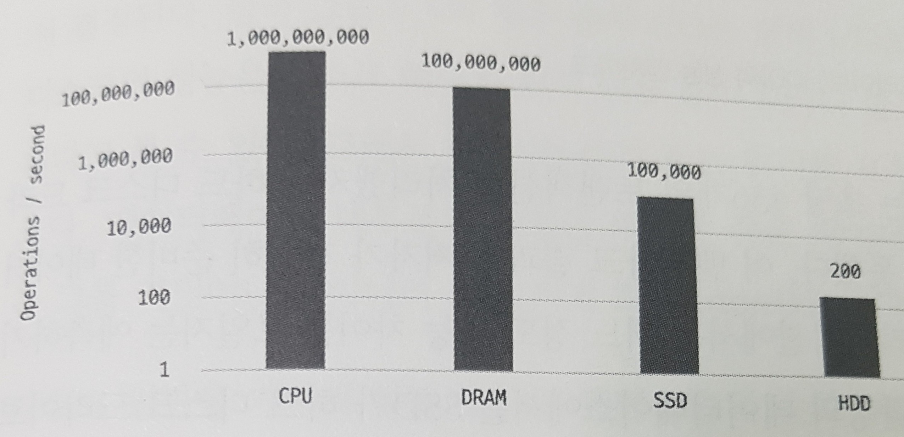
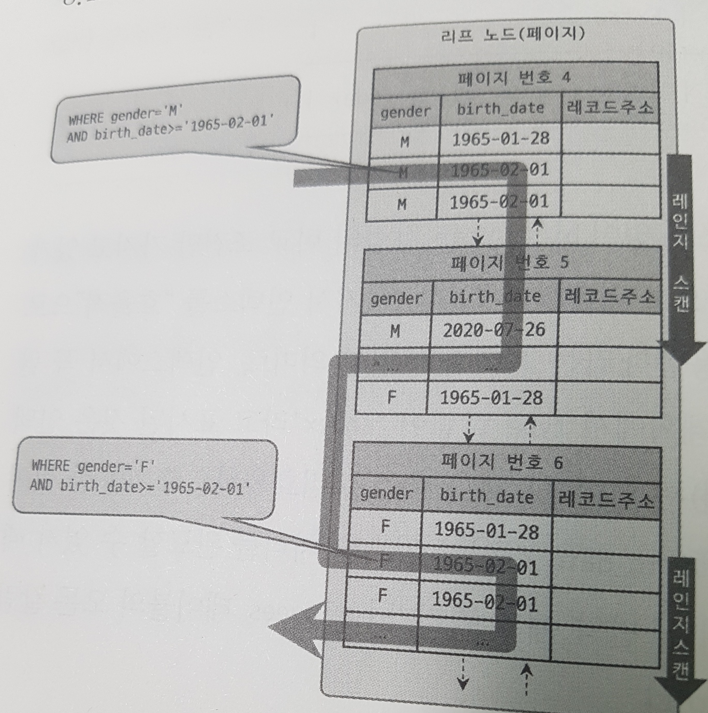

```SQL
인덱스는 데이터베이스 쿼리의 성능을 언급하면서 빼놓을 수 없는 부분이다.
이번 장에서는 MySQL쿼리의 개발이나 튜닝을 설명하기 전에 MySQL에서 사용 가능한 인덱스의 종류 및 특성을 간단히 살펴보겠다.

각 인덱스의 특성과 차이는 상당히 중요하며, 물리 수준의 모델링을 할 때도 중요한 요소가 될 것이다.
MySQL 8.0 버전까지 업그레이드되어 오면서 다른 상용 RDBMS에서 제공하는 많은 기능을 지원하게 됐으며,
기존의 MyISAM 스토리지 엔진에서만 제공하던 전문 검색이나 위치 기반 검색 기능도 모두 InnoDB 스토리지 엔진에서 사용할 수 있게 개선됐다.
하지만 아무리 MySQL 서버의 옵티마이저가 발전하고 성능이 개선됐다고 해도 여전히 관리자의 역할은 매우 중요하다.
그래서 인덱스에 대한 기본 지식은 지금도 앞으로도 개발자나 관리자에게 매우 중요한 부분이며, 쿼리 튜닝의 기본이 될 것이다.

8.1 디스크 읽기 방식

  인덱스에만 의존적인 용어는 아니지만, 이번 장에서 자주 언급되는 "랜덤(Random) I/O",
  "순차(Sequential) I/O"와 같은 디스크 읽기 방식을 먼저 간단히 알아보고 인덱스를 살펴보겠다.

  컴퓨터의 CPU나 메모리처럼 전기적 특성을 띤 장치의 성능은 짧은 시간 동안 매우 빠른 속도로 발전했지만
  디스크 같은 기계식 장치의 성능은 상당히 제한적으로 발전했다.
  비록 최근에는 자기 디스크 원판에 의존하는 하드 디스크보다 SSDD 드라이브가 많이 활용되고 있지만,
  여전히 데이터 저장 매체는 컴퓨터에서 가장 느린 부분이라는 사실에는 변함이 없다.
  데이터베이스나 쿼리 튜닝에 어느 정도 지식을 갖춘 사용자가 절감하고 있듯이
  데이터베이스의 성능 튜닝은 어떻게 디스크 I/O를 줄이느냐가 관건일 때가 상당히 많다.

8.1.1 하드 디스크 드라이브(HDD)와 솔리드 스테이트 드라이브(SSD)

  컴퓨터에서 CPU나 메모리 같은 주요 장치는 대부분 전자식 장치지만 하드 디스크 드라이브는 기계식 장치다.
  그래서 데이터베이스 서버에서는 항상 디스크 장치가 병목이 된다.
  이러한 기계식 하드 디스크 드라이브를 대체하기 위해 전자식 저장 매체인 SSD(Solid State Drive)가 많이 출시되고 있다.
  SSD도 기존 하드 디스크 드라이브와 같은 인터페이스(SATA나 SAS)를 지원하므로 내장 디스크나 DAS 또는 SAN에 그대로 사용할 수 있다.

  214 ================================================================================================================================

  SSD는 기존 하드 디스크 드라이브에서 데이터 저장용 플래너(원판)를 제기하고 그 대신 플래시 메모리하고 있다.
  그래서 디스크 원판을 기계적으로 회전시킬 필요가 없으므로 아주 빨리 데이터를 읽수 있다.
  플래시 메모리는 전원이 공급되지 않아도 데이터가 삭제되지 않는다.
  그리고 컴퓨터의 메모리(D-Ram) 보다는 느리지만 기계식 하드 디스크 드라이브보다는 훨씬 빠르다.

  ```
  
  그림 8.1 주요 장치의 초당 처리 횟수(수치가 클수록 빠른 장치를 의미)
  ```SQL

  그림 8.1은 컴퓨터의 주요 부품별 처리 속도를 보여준다.
  Y축의 "Operations / second"란 초당 처리 가능한 연산의 횟수를 의미하므로 이 값이 클수록 처리 속도가 빠르다는 것을 의미한다.
  그림 8.1에서 보다시피 메모리와 디스크의 처리 속도는 10만 배 이상의 차이를 보인다.
  그에 비해 플래시 메모리를 사용하는 SSD는 1000배 가량의 차이를 보인다.
  시중에 판매되는 SSD는 대부분 기존 하드 디스크 드라이브보다는 용량이 적으며 가격도 비싼 편이지만
  예전보다는 SSD가 훨씬 더 대중화된 상태이며 요즘은 DBMS용으로 사용할 서버에는 대부분 SSD를 채택하고 있다.

  디스크의 헤더를 움직이지 않고 한 번에 많은 데이터를 읽는 순차 I/O에서는
  SSD가 하드 디스크 드라이브보다 조금 빠르거나 거의 비슷한 성능을 보이기도 한다.
  하지만 SSD의 장점은 기존 하드 디스크 드라이브보다 랜덤 I/O가 훨씬 빠르다는 것이다.
  데이터베이스 서버에서 순차 I/O 작업은 그다지 비중이 크지 않고 랜덤 I/O를 통해 작은 데이터를 읽고 쓰는 작업이 대부분이므로
  SSD의 장점은 DBMS용 스토리지에 최적이라고 볼 수 있다.
  그림 8.2는 SSD와 하드 디스크 드라이브에서 랜덤 I/O의 성능을 벤치마크한 것이다.
  트랜잭션의 내용별로 수치는 많이 달라질 수 있으니 그림 8.2의 수치 자체보다는 SSD와 HDD를 비교하는 용도로만 수치를 살펴보자.

  215 ================================================================================================================================

  ```
  
  그림 8.2 솔리드 스테이트 드라이브(SSD)와 하드 디스크 드라이브(HDD)의 성능 벤치마크
  ```SQL

  그림 8.2의 벤치마크 결과를 살펴보면 SSD는 초당 436개의 트랜잭션을 처리했지만
  하드 디스크 드라이브는 초당 60개의 트랜잭션밖에 처리하지 못했다.
  이 벤치마크 결과는 저자가 간단히 준비한 데이터로 테스트한 내용이라서
  실제 여러분의 애플리케이션에서는 어느 정도 성능 차이를 보일지는 예측하기 어렵다.
  하지만 일반적인 웹 서비스(OLTP) 환경의 데이터베이스에서는 SSD가 하드 디스크 드라이브보다는 훨씬 빠르다.
  물론 애플리케이션을 직접 벤치마킹해볼 수 있다면 더 나은 선택을 할 수 있을 것이다.

8.1.2 랜덤 I/O와 순차 I/O

  랜덤 I/O라는 표현은 하드 디스크 드라이브의 플래터(원판)를 돌려서 읽어야 할 데이터가
  저장된 위치로 디스크 헤더를 이동시킨 다음 데이터를 읽는 것을 의미하는데, 사실 순차 I/O 또한 이 작업 과정은 같다.
  그렇다면 랜덤 I/O와 순차 I/O는 어떤 차이가 있을까? 그림 8.3을 잠깐 살펴보자.

  ```
  
  그림 8.3 순차 I/O(왼쪽)와 랜덤 I/O(오른쪽) 비교
  ```SQL

  216 ================================================================================================================================

  순차 I/O는 3개의 페이지(3 × 16KB)를 디스크에 기록하기 위해 1번 시스템 콜을 요청했지만,
  랜덤 I/O는 5개의 페이지를 디스크에 기록하기 위해 3번 시스템 콜을 요청했다.
  즉, 디스크에 기록해야 할 위치를 찾기 위해 순차 I/O는 디스크의 헤드를 1번 움직였고, 랜덤 I/O는 디스크 헤드를 3번 움직였다.
  그에 데이터를 쓰고 읽는 데 걸리는 시간은 디스크 헤더를 움직여서 읽고 쓸 위치로 옮기는 단계에서 결정된다.
  결국 그림 8.3의 경우 순차 I/O는 랜덤 I/O보다 거의 3배 정도 빠르다고 볼 수 있다.
  즉, 디스크의 성능은 디스크 헤더의 위치 이동 없이 얼마나 많은 데이터를 한 번에 기록하느냐에 의해 결정 된다고 볼 수 있다.
  그래서 여러 번 쓰기 또는 읽기를 요청하는 랜덤 I/O 작업이 작업 부하가 훨씬 더 크다.
  데이터베이스 대부분의 작업은 이러한 작은 데이터를 빈번히 읽고 쓰기 때문에
  MySQL 서버에는 그룹 커밋이나 바이너리 로그 버퍼 또는 InnoDB 로그 버퍼 등의 기능이 내장돼 있다.

  디스크 원판을 가지지 않는 SSD는 랜덤 I/O와 순차 I/O의 차이가 없을 것으로 예측하지만, 실제로는 그렇지 않다.
  SSD 드라이브에서도 랜덤 I/O는 여전히 순차 I/O보다 전체 스루풋(Throughpul) 이 떨어진다.
  그래서 SSD 드라이브의 사양에도 항상 순차 I/O와 랜덤 I/O의 성능 비교를 구분해서 명시한다.

  참고 : 이 책에서 소개하는 순차 I/O와 랜덤 I/O의 비교는 쉽게 이해할 수 있게 단순하게 비교해서 설명한 것이다.
         랜덤 I/O나 순차 I/O 모두 파일에 쓰기를 실행하면 반드시 동기화((sync 또는 flush 작업)가 필요하다.
         그런데 순차 I/O인 경우에도 이러한 파일 동기화 작업이 빈번히 발생한다면 랜덤 I/O와 같이 비효율적인 형태로 처리될 때가 많다.
         기업용으로 사용하는 데이터베이스 서버에는 캐시 메모리가 장착된 RAID 컨트롤러가 일반적으로 사용되는데,
         RAID 컨트롤러의 캐시 메모리는 아주 빈번한 파일 동기화 작업이 호출되는 순차 I/O를
         효율적으로 처리될 수 있게 변환하는 역할을 한다.
         하드 디스크 드라이브뿐만 아니라 SSD를 사용하는 경우에도 여전히 RAID 컨트롤러는 중요한 역할을 하기 때문에
         RAID 컨트롤러와 RAID 컨트롤러에 장착된 캐시의 성능을 무시하지 말자.

  사실 쿼리를 튜닝해서 랜덤 I/O를 순차 I/O로 바꿔서 실행할 방법은 그다지 많지 않다.
  일반적으로 쿼리를 튜닝하는 것은 랜덤 I/O 자제를 줄여주는 것이 목적이라고 할 수 있다.
  여기서 랜덤 I/O를 줄인다는 것은 쿼리를 처리하는 데 꼭 필요한 데이터만 읽도록 쿼리를 개선하는 것을 의미한다.

  참고 : 인덱스 레인지 스캔은 데이터를 읽기 위해 주로 랜덤 I/O를 사용하며, 풀 테이블 스캔은 순차 I/O를 사용한다.
         그래서 큰 테이블의 레코드 대부분을 읽는 작업에서는 인덱스를 사용하지 않고 테이블 스캔을 사용하도록 유도할 때도 있다.
         이는 순차 I/O가 랜덤 I/O보다 훨씬 빨리 많은 레코드를 읽어올 수 있기 때문인데,
         이런 형태는 OLTP(OnLine Transaction Processing) 성격의 웹 서비스보다는 데이터 웨어하우스나 통계 작업에서 자주 사용된다.

  217 ================================================================================================================================

8.2 인덱스란?

  많은 사람이 인덱스를 언급할 때는 항상 책의 맨 끝에 있는 찾아보기(또는 "색인")로 설명한다.
  책의 마지막에 있는 "찾아보기"가 인덱스에 비유된다면 책의 내용은 데이터 파일에 해당한다고 볼 수 있다.
  책의 찾아보기를 통해 알아낼 수 있는 페이지 번호는 데이터 파일에 저장된 레코드의 주소에 비유될 것이다.
  DBMS도 데이터베이스 테이블의 모든 데이터를 검색해서 원하는 결과를 가져오려면 시간이 오래 걸린다.
  그래서 칼럼(또는 칼럼들)의 값과 해당 레코드가 저장된 주소를 키와 값의 쌍(key - Valuepair)으로 삼아 인덱스를 만들어 두는 것이다.
  그리고 책의 "찾아보기"와 DBMS 인덱스의 공통점 가운데 중요한 것이 바로 정렬이다.
  책의 찾아보기도 내용이 많아지면 우리가 원하는 검색어를 찾아내는 데 시간이 걸릴 것이다.
  그래서 최대한 빠르게 찾아갈 수 있게 "그", "L", "ㄷ", ...과 같은 순서로 정렬돼 있는데,
  DBMS의 인덱스도 마찬가지로 칼럼의 값을 주어진 순서로 미리 정렬해서 보관한다.

  인덱스의 또 다른 특성을 설명하고자 이번에는 프로그래밍 언어의 자료 구조로 인덱스와 데이터 파일을 비교해 가면서 살펴보자.
  프로그래밍 언어별로 각 자료 구조의 이름이 조금씩 다르긴 하지만
  SortedList와 ArrayList라는 자료 구조는 익숙할 정도로 많이 들어봤을 것이다.
  SortedList는 DBMS의 인덱스와 같은 자료 구조이며, ArrayList는 데이터 파일과 같은 자료 구조를 사용한다.
  SortedList는 저장되는 값을 항상 정렬된 상태로 유지하는 자료 구조이며, ArrayList는 값을 저장되는 순서 그대로 유지하는 자료 구조다.
  DBMS의 인덱스도 SortedList와 마찬가지로 저장되는 칼럼의 값을 이용해 항상 정렬된 상태를 유지한다.
  데이터 파일은 ArrayList와 같이 저장된 순서대로 별도의 정렬 없이 그대로 저장해 둔다.

  그러면 이제 SortedList의 장단점을 통해 인덱스의 장단점을 살펴보자.
  SorteddList 자료 구조는 데이터가 저장될 때마다 항상 값을 정렬해야 하므로 저장하는 과정이 복잡하고 느리지만,
  이미 정렬돼 있어서 아주 빨리 원하는 값을 찾아올 수 있다.
  DBMS의 인덱스도 인덱스가 많은 테이블은 당연히 INSERT나 UPDATE, DELETE 문장의 처리가 느려진다.
  하지만 이미 정렬된 "찾아보기"용 표(인덱스)를 가지고 있기 때문에 SELECT 문장은 매우 빠르게 처리할 수 있다.

  결론적으로 DBMS에서 인덱스는 데이터의 저장(INSERT, UPDATE, DELETE) 성능을 희생하고 그 대신 데이터의 읽기 속도를 높이는 기능이다.
  여기서도 알 수 있듯이 테이블의 인덱스를 하나 더 추가할지 말지는 데이터의 저장 속도를 어디까지 희생할 수 있는지,
  읽기 속도를 얼마나 더 빠르게 만들어야 하느냐에 따라 결정해야 한다.
  SELECT 쿼리 문장의 WHERE 조건절에 사용되는 칼럼이라고 해서 전부 인덱스로 생성하면
  데이터 저장 성능이 떨어지고 인덱스의 크기가 비대해져 오히려 역효과만 불러올 수 있다.

  218 ================================================================================================================================

  인덱스는 데이터를 관리하는 방식(알고리즘)과 중복 값의 허용 여부 등에 따라 여러 가지로 나눠볼 수 있다.
  이 분류는 인덱스를 좀 더 효율적으로 설명하기 위해 저자가 임의로 분류한 것이다.
  이 책에서는 키(Key)라는 말과 인텍스(Index)는 같은 의미로 사용하겠다.
  인덱스를 역할별로 구분해 본다면 프라(Prinary key)와 보조 키(세컨더리 인덱스, Secondary key)로 구분할 수 있다.

    - 프라이머리 키는 이미 잘 아는 것처럼 그 레코드를 대표하는 칼럼의 값으로 만들어진 인덱스를 의미한다.
      이 칼럼(때로는 칼럼의 조합)은 테이블에서 해당 레코드를 식별할 수 있는 기준값이 되기 때문에 우리는 이를 식별자라고도 부른다.
      프라이머리 키는 NULL 값을 허용하지 않으며 중복을 허용하지 않는 것이 특징이다.

    - 프라이머리 키를 제외한 나머지 모든 인덱스는 세컨더리 인덱스(Secondary Index)로 분류한다.
      유니크 인덱스는 프라이머리 키와 성격이 비슷하고 프라이머리 키를 대체해서 사용할 수도 있다고 해서 대체 키라고도 하는데,
      별도로 분류하기도 하고 그냥 세컨더리 인덱스로 분류하기도 한다.

  데이터 저장 방식(알고리즘)별로 구분할 경우 사실 상당히 많은 분류가 가능하겠지만
  대표적으로 B-Tree 인덱스와 Hash 인덱스로 구분할 수 있다.
  그리고 최근에는 Fractal-Tree 인덱스나 로그 기반의 Merge-Tree 인덱스와 같은 알고리즘을 사용하는 DBMS도 개발되고 있다.
  물론 이 외에도 수많은 알고리즘이 있지만 대표적으로 시중의 RDBMS에서 많이 사용하는 알고리즘은 이 정도일 것이다.

    - B-Tree 알고리즘은 가장 일반적으로 사용되는 인덱스 알고리즘으로서, 상당히 오래전에 도입된 알고리즘이며 그만큼 성숙해진 상태다.
      B-Tree 인덱스는 칼럼의 값을 변형하지 않고 원래의 값을 이용해 인덱싱하는 알고리즘이다.
      MySQL 서버에서는 위치 기반 검색을 지원하기 위한 R-Tree 인덱스 알고리즘도 있지만,
      결국 R-Tree 인덱스는 B-Tree의 응용 알고리즘으로 볼 수 있다.

    - Hash 인덱스 알고리즘은 칼럼의 값으로 해시값을 계산해서 인덱싱하는 알고리즘으로, 매우 빠른 검색을 지원한다.
      하지만 값을 변형해서 인덱싱하므로 전방(Prefix) 일치와 같이 값의 일부만 검색하거나
      범위를 검색할 때는 해시 인덱스를 사용할 수 없다.
      Hash 인덱스는 주로 메모리 기반의 데이터베이스에서 많이 사용한다.

  데이터의 중복 허용 여부로 분류하면 유니크 인덱스(Unique)와 유니크하지 않은 인덱스(NonUnique)로 구분할 수 있다.
  인덱스가 유니크한지 아닌지는 단순히 같은 값이 1개만 존재하는지 1개 이상 존재할 수 있는지를 의미하지만,
  실제 DBMS의 쿼리를 실행해야 하는 옵티마이저에게는 상당히 중요한 문제가 된다.
  유니크 인덱스에 대해 동등 조건(Equal, =)으로 검색한다는 것은
  항상 1건의 레코드만 찾으면 더 찾지 않아도 된다는 것을 옵티마이저에게 알려주는 효과를 낸다.
  그뿐만 아니라 유니크 인덱스로 인한 MySQL의 처리 방식의 변화나 차이점이 상당히 많다.
  이러한 부분은 인덱스와 쿼리의 실행 계획을 살펴보면서 배울 것이다.

  [ Fractal-Tree나 로그 기반의 Merge-Tree 인덱스에 대한 자세한 내용은 인터넷을 참조하자.
    이들 인덱스 알고리즘은 MYSQL 서버의 범위는 아니므로 이 책에서는 설명을 생략하겠다. ]

  219 ================================================================================================================================

  인덱스의 기능별로 분류해보면 전문 검색용 인덱스나 공간 검색용 인덱스 등을 예로 들 수 있다.
  물론 이 밖에도 수없이 많은 인덱스가 있겠지만, MySQL을 사용할 때는 이 두 가지만으로도 충분하다.
  전문 검색이나 공간 검색용 인덱스는 뒤에서 좀 더 자세히 살펴보겠다.

8.3 B-Tree 인덱스

  B-Tree는 데이터베이스의 인덱싱 알고리즘 가운데 가장 일반적으로 사용되고, 가장 먼저 도입된 알고리즘이다.
  하지만 아직도 가장 범용적인 목적으로 사용되는 인덱스 알고리즘이다.
  B-Tree에는 여러 가지 변형된 형태의 알고리즘이 있는데, 일반적으로 DBMS에서는 주로 B+-Tree 또는 B*-Tree가 사용된다.
  인터넷상에서 쉽게 구할 수 있는 B-Tree의 구조를 설명한 그림 때문인지
  많은 사람들이 B-Tree의 "B"가 바이너리(이진) 트리라고 잘못 생각한다.
  하지만 B-Tree의 "B"는 "Binary(이진)"의 약자가 아니라 "Balanced"를 의미한다는 점에 주의하자.

  B-Tree는 칼럼의 원래 값을 변형시키지 않고 (물론 값의 앞부분만 잘라서 관리하기는 하지만)
  인덱스 구조체 내에서는 항상 정렬된 상태로 유지한다.
  전문 검색과 같은 특수한 요건이 아닌 경우, 대부분 인덱스는 거의 B-Tree를 사용할 정도로 일반적인 용도에 적합한 알고리즘이다.

8.3.1 구조 및 특성

  B-Tree 인덱스를 제대로 사용하려면 B-Tree의 기본적인 구조를 알아야 한다.
  B-Tree는 트리 구조의 최상위에 하나의 "루트 노드(Root node)"가 존재하고 그 하위에 자식 노드가 붙어 있는 형태다.
  트리 구조의 가장 하위에 있는 노드를 "리프 노드(Leaf node)"라 하고,
  트리 구조에서 루트 노드도 아니고 리프 노드도 아닌 중간의 노드를 "브랜치 노드(Branch node)"라고 한다.
  데이터베이스에서 인덱스와 실제 데이터가 저장된 데이터는 따로 관리되는데,
  인덱스의 리프 노드는 항상 실제 데이터 레코드를 찾아가기 위한 주솟값을 가지고 있다.
  그림 8.4는 B-Tree 인덱스의 각 노드와 데이터 파일의 관계를 표현한 것이다.

  220 ================================================================================================================================

  ```
  
  그림 8.4 B-Tree 인덱스의 구조
  ```SQL

  그림 8.4에서와같이 인덱스의 키 값은 모두 정렬돼 있지만, 데이터 파일의 레코드는 정렬돼 있지 않고 임의의 순서로 저장돼 있다.
  많은 사람들이 데이터 파일의 레코드는 INSERT된 순서대로 저장되는 것으로 생각하지만 그렇지 않다.
  만약 테이블의 레코드를 전혀 삭제하거나 변경하지 않고 INSERT만 수행한다면 맞을 수도 있다.
  하지만 레코드가 삭제되어 빈 공간이 생기면 그다음의 INSERT는 가능한 한
  삭제된 공간을 재활용하도록 DBMS가 설계되기 때문에 항상 INSERT된 순서로 저장되는 것은 아니다.

  참고 : 대부분 RDBMS의 데이터 파일에서 레코드는 특정 기준으로 정렬되지 않고 임의의 순서로 저장된다.
         하지만 InnoDB 테이블에서 레코드는 클러스터되어 디스크에 저장되므로 기본적으로 프라이머리 키 순서로 정렬되어 저장된다.
         이는 오라클의 IOT(Index organized table)나 MS-SQL의 클러스터 테이블과 같은 구조를 말한다.
         다른 DBMS에서는 클러스터링 기능이 선택 사항이지만,
         InnoDB에서는 사용자가 별도의 명령이나 옵션을 선택하지 않아도 디폴트로 클러스터링 테이블이 생성된다.
         클러스터링이란 비슷한 값을 최대한 모아서 저장하는 방식을 의미하는데, 더 자세한 내용은 나중에 다시 살펴보겠다.

  221 ================================================================================================================================

  인덱스는 테이블의 키 칼럼만 가지고 있으므로 나머지 칼럼을 읽으려면 데이터 파일에서 해당 레코드를 찾이야 한다.
  이를 위해 인덱스의 리프 노드는 데이터 파일에 저장된 레코드의 주소를 가진다.
  그림 8.5와 그림 8.6은 인덱스의 리프 노드와 데이터 파일의 이러한 관계를 보여준다.

  ```
  
  그림 8.5 B-Tree의 리프 노드와 테이블 데이터 레코드(MyISAM)

  
  그림 8.6 B-Tree의 리프 노드와 테이블 데이터 레코드(InnoDB)
  ```SQL

  222 ================================================================================================================================

  그림 8.5는 MISAM 테이블의 인덱스와 데이터 파일의 관계를 보이주는데, "레코드 주소"는 MyISAM테이블의 생성성 옵션에 따라
  레코드가 테이블에 INSERT된 순번이거나 데이터 파일 내의 위치(Offset)다.
  MyISAM 스토리지 엔진에서 인덱스의 구조는 4.3.3절 '데이터 파일과 프라이머리 키(인덱스) 구조'의 ROWID 설명을 참조하자,
  그림 8.6은 InnoDB 테이블의 인덱스의 데이터 파일의 관계를 보여주는데,
  DB 스토리지 엔진을 사용하는 테이블에서는 프라이머리 키가 ROWID의 역할을 한다.
  두 스토리지 엔진의 인덱스에서 가장 큰 차이점은 세컨더리 인덱스를 통해 데이터 파일의 레코드를 찾아가는 방법이 있다.
  MyISAM 테이블은 세컨더리 인덱스가 물리적인 주소를 가지는 반면
  InnoDB 테이블은 프라이머리 키를 주소처럼 사용하기 때문에 논리적인 주소를 가진다고 볼 수 있다.

  그래서 InnoDB 테이블에서 인덱스를 통해 레코드를 읽을 때는 그림 8.5에서처럼 데이터 파일을 바로 찾아가지 못한다.
  그림 8.6에서와같이 인덱스에 저장돼 있는 프라이머리 키 값을 이용해 프라이머리 키 인덱스를 한 번 더 검색한 후,
  프라이머리 키 인덱스의 리프 페이지에 저장돼 있는 레코드를 읽는다.
  즉, InnoDB 스토리지 엔진에서는 모든 세컨더리 인덱스 검색에서 데이터 레코드를 읽기 위해저는
  반드시 프라이머리 키를 저장하고 있는 B-Tree를 다시 한번 검색해야 한다.
  간단히 생각하면 이작업으로 인해 InnoDB 스토리지 엔진을 사용하는 테이블은 성능이 떨어질 것처럼 보이지만
  사실은 MyISAM 인덱스 구조와 InnoDB 인덱스 구조는 각각 장단점을 가지고 있다.
  자세한 내용은 8.8절 '클러스터링 인덱스'에서 자세히 살펴보자.

8.3.2 B-Tree 인덱스 키 추가 및 삭제

  테이블의 레코드를 저장하거나 변경하는 경우 인덱스 키 추가나 삭제 작업이 발생한다.
  인덱스 키 추가나 삭제가 어떻게 처리되는지 알아두면 쿼리의 성능을 쉽게 예측할 수 있을 것이다.
  또한 인덱스를 사용하면서 주의해야 할 사항도 함께 살펴보겠다.

8.3.2.1 인덱스 키 추가

  새로운 키 값이 B-Tree에 저장될 때 테이블의 스토리지 엔진에 따라 새로운 키 값이 즉시 인덱스에저장될 수도 있고 그렇지 않을 수도 있다.
  B-Tree에 저장될 때는 저장될 키 값을 이용해 B-Tree상의 적절한 위치를 검색해야 한다.
  저장될 위치가 결정되면 레코드의 키 값과 대상 레코드의 주소 정보를 B-Tree의 리프 노드에 저장한다.
  리프 노드가 꽉 차서 더는 저장할 수 없을 때는 리프 노드가 분리(Split)돼야 하는데, 이는 상위 브랜치 노드까지 처리의 범위가 넓어진다.
  이러한 작업 탓에 B-Tree는 상대적으로 쓰기 작업(새로운 키를 추가하는 작업)에 비용이 많이 드는 것으로 알려졌다.

  223 ================================================================================================================================

  인덱스 추가로 인해 INSERT나 UPDATE 문장이 어떤 영향을 받을지 궁금해하는 사람이 많다.
  하지만 이 질문에 명확하게 답하려면 테이블의 칼럼 수, 칼럼의 크기, 인덱스 칼럼의 특성 등을 확인해야 한다.
  대략적으로 계산하는 방법은 테이블에 레코드를 추가하는 작업 비용을 1이라고 가정하면
  해당 테이블의 인덱스에 키를 추가하는 작업 비용을 1.5 정도로 예측하는 것이다.
  일반적으로 테이블에 인덱스가 3개(테이블의 모든 인덱스가 B-Tree라는 가정하에)가 있다면
  이때 테이블에 인덱스가 하나도 없는 경우는 작업 비용이 1이고, 3개인 경우에는 5.5 정도의 비용(1.5 * 3 + 1) 정도로 예측한다.
  중요한 것은 이 비용의 대부분이 메모리와 CPU에서 처리하는 시간이 아니라
  디스크로부터 인덱스 페이지를 읽고 쓰기를 해야 해서 걸리는 시간이라는 점이다.

  MyISAM이나 MEMORY 스토리지 엔진을 사용하는 테이블에서는 INSERT 문장이 실행되면 즉시 새로운 키 값을 B-Tree 인덱스에 변경한다.
  하지만 InnoDB 스토리지 엔진은 이 작업을 조금 더 지능적으로 처리하는데,
  필요하다면 인덱스 키 추가 작업을 지연시켜 나중에 처리할 수 있다.
  하지만 프라이머리 키나 유니크 인덱스의 경우 중복 체크가 필요하기 때문에 즉시 B-Tree에 추가하거나 삭제한다.
  InnoDB 스토리지 엔진의 체인지 버퍼에 대해서는 4.2.10절 '체인지 버퍼'를 참조한다.

8.3.2.2 인덱스 키 삭제

  B-Tree의 키 값이 삭제되는 경우는 상당히 간단하다.
  해당 키 값이 저장된 B-Tree의 리프 노드를 찾아서 그냥 삭제 마크만 하면 작업이 완료된다.
  이렇게 삭제 마킹된 인덱스 키 공간은 계속 그대로 방치하거나 재활용할 수 있다.
  인덱스 키 삭제로 인한 마킹 작업 또한 디스크 쓰기가 필요하므로 이 작업 역시 디스크 I/O가 필요한 작업이다.
  MySQL 5.5 이상 버전의 InnoDB 스토리지 엔진에서는 이 작업 또한 버퍼링되어 지연 처리될 수도 있다.
  처리가 지연된 인덱스 키 삭제 또한 사용자에게는 특별한 악영향 없이 MySQL 서버가 내부적으로 처리하므로 특별히 걱정할 것은 없다.
  MyISAM이나 MEMORY 스토리지 엔진의 테이블에서는 체인지 버퍼와 같은 기능이 없으므로 인덱스 키 삭제가 완료된 후 쿼리 실행이 완료된다.

8.3.2.3 인덱스 키 변경

  인덱스의 키 값은 그 값에 따라 저장될 리프 노드의 위치가 결정되므로 B-Tree의 키 값이 변경되는 경우에는
  단순히 인덱스상의 키 값만 변경하는 것은 불가능하다.
  B-Tree의 키 값 변경 작업은 먼저 키 값을 삭제한 후, 다시 새로운 키 값을 추가하는 형태로 처리된다.
  키 값의 변경 때문에 발생하는 B-Tree 인덱스 키 값의 삭제와 추가 작업은 앞에서 설명한 절차대로 처리된다.
  결국 인덱스 키 값을 있다는 직업은 기존 인덱스 키 값을 삭제한 후 새로운 인덱스 키 값을 추가하는 작업으로 처리되고,
  InnoDB 스토리지 엔진을 사용하는 테이블에 대해서는 이 작업 모두 체인지 버퍼를 활용해 지연 처리 수있다.

  224 ================================================================================================================================

8.3.2.4 인덱스 키 검색

  INSERT, UPDATE, DELETE 작업을 할 때 인덱스 관리에 따르는 추가 비용을 감당하면서 인덱스를 구축하는 이유는 바로 빠른 검색을 위해서다.
  인덱스를 검색하는 작업은 B-Tree의 루트 노드부터 시작해 브랜치 노드를 거쳐 최종 리프 노드까지 이동하면서 비교 작업을 수행하는데,
  이 과정을 "트리 탐색"이라고 한다.
  인덱스 트리 탐색은 SELECT에서만 사용하는 것이 아니라
  UPDATE 나 DELETE를 처리하기 위해 항당 해당 레코드를 먼저 검색해야 할 경우에도 사용된다.
  B-Tree 인덱스를 이용한 검색은 100% 일치 또는 값의 앞부분(Left-most part)만 일치하는 경우에 사용할 수 있다.
  부등호("<, >") 비교 조건에서도 인덱스를 활용할 수 있지만,
  인덱스를 구성하는 키 값의 뒷부분만 검색하는 용도로는 인덱스를 사용할 수 없다.
  또한 인덱스를 이용한 검색에서 중요한 사실은 인덱스의 키 값에 변형이 가해진 후 비교되는 경우에는
  절대 B-Tree의 빠른 검색 기능을 사용할 수 없다는 것이다.
  이미 변형된 값은 B-Tree인덱스에 존재하는 값이 아니다.
  따라서 함수나 연산을 수행한 결과로 정렬한다거나 검색하는 작업은 B-Tree의 장점을 이용할 수 없으므로 주의해야 한다.

  InnoDB 스토리지 엔진에서 인덱스는 더 특별한 의미가 있다.
  InnoDB 테이블에서 지원하는 레코드 잠금이나 넥스트 키락(갭락)이 검색을 수행한
  인덱스를 잠근 후 테이블의 레코드를 잠그는 방식으로 구현돼 있다.
  따라서 UPDATE나 DELETE 문장이 실행될 때 테이블에 적절히 사용할 수 있는 인덱스가 없으면 불필요하게 많은 레코드를 잠근다.
  심지어 테이블의 모든 레코드를 잠글 수도 있다.
  InnoDB 스토리지 엔진에서는 그만큼 인덱스의 설계가 중요하고 많은 부분에 영향을 미친다.

8.3.3 B-Tree 인덱스 사용에 영향을 미치는 요소

  B-Tree 인덱스는 인덱스를 구성하는 칼럼의 크기와 레코드의 건수,
  그리고 유니크한 인덱스 키 값의 개수 등에 의해 검색이나 변경 작업의 성능이 영향을 받는다.

  225 ================================================================================================================================

8.3.3.1 인덱스 키 값의 크기

  InnoDB 스토리지 엔진은 디스크에 데이터를 저장하는 가장 기본 단위를 페이지(Page) 또는 블록(Block)이라고 하며,
  디스크의 모든 읽기 및 쓰기 작업의 최소 작업 단위가 된다.
  또한 페이지는 InnoDB 스토리지 엔진의 버퍼 풀에서 데이터를 버퍼링하는 기본 단위이기도 하다.
  인덱스도 결국은 페이지 단위로 관리되며, 앞의 그림 8.4에서 루트와 브랜치, 그리고 리프 노드를 구분한 기준이 바로 페이지 단위다.

  이진(Binaary) 트리는 각 노드가 자식 노드를 2개만 가지는데, DBMS의 B-Tree가 이진 트리라면 인덱스 검색이 상당히 비효율적일 것이다.
  그래서 B-Tree의 "B"가 이진(Binary) 트리의 약자는 아니라고 강조했던 것이다.
  일반적으로 DBMS의 B-Tree는 자식 노드의 개수가 가변적인 구조다.
  그러면 MySQL의 B-Tree는 자식 노드를 몇 개까지 가지는지 궁금할 것이다.
  그것은 바로 인덱스의 페이지 크기와 키 값의 크기에 따라 결정된다.
  MySQL 5.7 버전부터는 InnoDB 스토리지 엔진의 페이지 크기를 innodb_page_size 시스템 변수를 이용해
  4KB- 64KB 사이의 값을 선택할 수 있지만 기본값은 16KB다(이 책에서도 페이지의 기본 크기인 16KB를 기준으로 설명하겠다).

    SHOW VARIABLES LIKE '%innodb_page_size%';
    +------------------+-------+
    | Variable_name    | Value |
    +------------------+-------+
    | innodb_page_size | 16384 |
    +------------------+-------+

  인덱스의 키가 16바이트라고 가정하면 다음 그림과 같이 인덱스 페이지가 구성될 것이다.
  그림 8.7에서 자식 노드 주소라는 것은 여러 가지 복합적인 정보가 담긴 영역이며,
  페이지의 종류별로 대략 6바이트에서 12바이트까지 다양한 크기의 값을 가질 수 있다.
  여기서는 편의상 자식 노드 주소 영역이 평균적으로 12바이트로 구성된다고 가정하자.

  ```
  
  그림 8.7 인덱스 페이지의 구성
  ```SQL

  그림 8.7의 경우 하나의 인덱스 페이지(16KB)에 몇 개의 키를 저장할 수 있을까?
  계산해 보면 16*1024/(16+12) = 585개 저장할 수 있다.
  최종적으로 이 경우는 자식 노드를 585개를 가질 수 있는 B-Tree가 되는 것이다.
  그러면 인덱스 키 값이 커지면 어떤 현상이 발생할까?
  위의 경우에서 키 값의 크기가 두 배인 32바이트로 늘어났다고 가정하면 한 페이지에 인덱스 키를 16*1024/(32+12) = 372개 저장할 수 있다.

  226 ================================================================================================================================

  여러분의 SELECT 쿼리가 레코드 500개를 읽어야 한다면 전자는 인덱스 페이지 한번으로 해결될 수도 있지만,
  후자는 최소한 2번 이상 디스그로부터 읽어야 한다.
  결국 인덱스를 구성하의 크기가 커지면 디스크로부터 읽어이 하는 횟수가 늘어나고, 그만큼 느려진다는 것을 의미한다.
  또한 인덱스 키 값의 길이가 길어진다는 것은 전체적인 인덱스의 크기가 커진다는 것을 의미한다.
  하지만 인덱스를 캐시해 두는 InnoDB의 버퍼 풀이나 MyISAM의 키 캐시 영역은 크기가 제한적이기 때문에
  하나의 레코드를 위한 인덱스 크기가 커지면 커질수록 메모리에 캐시해 둘 수 있는 레코드 수는 줄어든다.
  그렇게 되면 자연히 메모리의 효율이 떨어지는 결과를 가져온다.

8.3.3.2 B-Tree 201

  B-Tree 인덱스의 깊이(Depth)는 상당히 중요하지만 직접 제어할 방법은 없다.
  여기서는 인덱스 키값의 평균 크기가 늘어나면 어떤 현상이 추가로 더 발생하는지 알아보겠다.
  그림 8.7의 예제를 다시 살펴보자.
  인덱스의 B-Tree 깊이가 3인 경우 최대 몇 개의 키 값을 가질 수 있는지 한 번 비교해 보자.
  키 값이 16바이트인 경우에는 최대 2억(585 * 585 * 585) 개 정도의 키 값을 담을 수 있지만,
  키 값이 32바이트로 늘어나면 5천만(372 * 372 * 372) 개로 줄어든다.
  B-Tree의 깊이는 MySQL에서 값을 검색할 때 몇 번이나 랜덤하게 디스크를 읽어야 하는지와 직결되는 문제다.
  결론적으로 인덱스 키 값의 크기가 커지면 커질수록 하나의 인덱스 페이지가 담을 수 있는 인덱스 키 값의 개수가 적어지고,
  그 때문에 같은 레코드 건수라 하더라도 B-Tree의 깊이(Depth)가 깊어져서 디스크 읽기가 더 많이 필요하게 된다는 것을 의미한다.

  여기서 언급한 내용은 사실 인덱스 키 값의 크기는 가능하면 작게 만드는 것이 좋다는 것을 강조하기 위함이고,
  실제로는 아무리 대용량 데이터베이스라도 13-Tree의 깊이(Depth)가 5단계 이상까지 깊어지는 경우는 흔치 않다.

8.3.3.3 선택도(기수성)

  인덱스에서 선택도(Selectivity) 또는 기수성(Caurdinality)은 거의 같은 의미로 사용되며,
  모든 인덱스키 값 가운데 유니크한 값의 수를 의미한다.
  전체 인덱스 키 값은 100개인데, 그중에서 유니크한 값의 수는 10개라면 기수성은 10이다.
  인덱스 키 값 가운데 중복된 값이 많아지면 많아질수록 기수성은 낮아지고 동시에 선택도 또한 떨어진다.
  인덱스는 선택도가 높을수록 검색 대상이 줄어들기 때문에 그만큼 빠르게 처리된다.

  227 ================================================================================================================================

  참고 : 선택도가 좋지 않다고 하더라도 정렬이나 그루핑과 같은 작업을 위해 인덱스를 만드는것이 훨씬 나은 경우도 많다.
         인덱스가 항상 검색에만 사용되는 것은 아니므로 여러 가지 용도를 고려해 적절히 인덱스를 설계할 필요가 있다.

  country라는 칼럼과 city라는 칼럼이 포함된 tb_test 테이블을 예로 들겠다.
  tb_test 테이블의 전체 레코드 건수는 1만 건이며, country 칼럼으로만 인덱스가 생성된 상태에서 아래의 두 케이스를 살펴보자.

  - 케이스 A: country 칼럼의 유니크한 값의 개수가 10개
  - 케이스 B: country 칼럼의 유니크한 값의 개수가 1,000개

  mysql> SELECT *
           FROM tb_test
          WHERE country = 'KOREA'
            AND city = 'SEOUL'
         ;

  MySQL에서는 인덱스의 통계 정보(유니크한 값의 개수)가 관리되기 때문에 city 칼럼의 기수성은 작업 범위에 아무런 영향을 미치지 못한다.
  위의 쿼리를 실행하면 A 케이스의 경우에는 평균 1,000건, B 케이스의 경우에는
  평균 10건이 조회될 수 있다는 것을 인덱스의 통계 정보(유니크한 값의 개수)로 예측할 수 있다.
  A 케이스와 B 케이스 모두 실제 모든 조건을 만족하는 레코드는 단 1건만 있었다면 A 케이스의 인덱스는 적합하지 않은 것이라고 볼 수 있다.
  A 케이스는 1건의 레코드를 위해 쓸모없는 999건의 레코드를 더 읽은 것이지만, B 케이스는 9건만 더 읽은 것이다.
  그래서 A 케이스의 경우 country 칼럼에 생성된 인덱스는 비효율적이다.
  물론 필요한 만큼의 레코드만 정확하게 읽을 수 있다면 최상이겠지만 현실적으로 모든 조건을
  만족하게 인덱스를 생성한다는 것은 불가능하므로 이 정도의 낭비는 무시할 수 있다.

  각 국가의 도시를 저장하는 tb_city라는 테이블을 예로 들어보겠다.
  tb_city 테이블은 1만 건의 레코드를 가지고 있는데, country 칼럼에만 인덱스가 준비돼 있다.
  tb_city 테이블에는 국가와 도시가 중복해서 저장돼 있지 않다고 가정하자.

  mysql> CREATE TABLE tb_city
         ( country VARCHAR(10)
         , city    VARCHAR(10)
         , INDEX   ix_country (country)
         ) ;

  228 ================================================================================================================================

  tb_city 테이블에 아래와 같은 쿼리를 한번 실행해 보자.
  이때 tb_city 테이블의 데이터 특성을 두 가지서 내부적인 쿼리나 인덱스의 효율성을 살펴보겠다.

  mysql> SELECT *
           FROM tb_test
          WHERE country = 'KOREA'
            AND city = 'SEOUL'
         ;

    - Country 칼럼의 유니크 값이 10개일 때
      Country 칼럼의 유니크 값이 10개이므로 tb_city 테이블에는 10개 국가(country)의 도시(city) 정보가 저장있는 것이다.
      MySQL 서버는 인덱스된 칼럼(country)에 대해서는 전체 레코드의 건수나 유니크한 값의 개수 등에 대한 통계 정보를 가지고 있다.
      여기서 전체 레코드 건수를 유니크한 값의 개수로 나눠보면
      하나의 키 값으로 검색했을 때 대략 몇 건의 레코드가 일치할지 예측할 수 있게 된다.
      즉, 이 케이스의 tb_city 테이블에서는 country = 'KOREA'라는 조건으로
      인덱스를 검색하면 1000건(10,000/10)이 일치하리라는 것을 예상할 수 있다.
      그런데 인덱스를 통해 검색된 1000건 가운데 city = 'SEOUL'인 레코드는 1건이므로 999건은 불필요하게 읽은 것으로볼 수 있다.

    - ccountry 칼럼의 유니크 값이 1000개일 때
      ccountry 칼럼의 유니크 값이 1000개이므로 tb_city 테이블에는 1000개 국가(country)의 도시(city) 정보가 저장돼 있는 것이다.
      이 케이스에서도 전체 레코드 건수를 국가 칼럼의 유니크 값 개수로 나눠보면
      대략 한 국가당대략 10개 정도의 도시 정보가 저장돼 있으리라는 것을 예측할 수 있다.
      그래서 이 케이스에서는 tb_city 테이블에서 country = 'KOREA'라는 조건으로 인덱스를 검색하면 10건(10,000/1,000)이 일치할 것이며,
      그 10건 중에서 City = 'SEOUL'인 레코드는 1건이므로 9건만 불필요하게 읽은 것이다.

  위 두 케이스의 테이블에서 똑같은 쿼리를 실행해 똑같은 결과를 받았지만,
  사실 두 쿼리가 처리되기위해 MySQL 서버가 수행한 작업 내용은 매우 크다는 것을 알 수 있다.
  이처럼 인덱스에서 유니크한값의 개수는 인덱스나 쿼리의 효율성에 큰 영향을 미친다.

8.3.3.4 읽어야 하는 레코드의 건수

  인덱스를 통해 테이블의 레코드를 읽는 것은 인덱스를 거치지 않고 바로 테이블의 레코드를 읽는 것보다 높은 비용이 드는 작업이다.
  테이블에 레코드가 100만 건이 저장돼 있는데, 그중에서 50만 건을 읽어야 하는 쿼리가 있다고 가정해 보자.
  이 작업은 전체 테이블을 모두 읽어서 필요 없는 50만 건을 버리는 것이 효율적일지,
  인덱스를 통해 필요한 50만 건만 읽어 오는 것이 효율적일지 판단해야 한다.

  229 ================================================================================================================================

  인덱스를 이용한 읽기의 손익 분기점이 얼마인지 판단할 필요가 있는데,
  일반적인 DBMS의 옵티마이저에서는 인덱스를 통해 레코드 1건을 읽는 것이 테이블에서
  직접 레코드 1건을 읽는 것보다 4~5배 정도 비용이 더 많이 드는 작업인 것으로 예측한다.
  즉, 인덱스를 통해 읽어야 할 레코드의 건수(물론 옵티마이저가 판단한 예상 건수)가 전체 테이블 레코드의 20~25%를 넘어서면
  인덱스를 이용하지 않고 테이블을 모두 직접 읽어서 필요한 레코드만 가려내는(필터링) 방식으로 처리하는 것이 효율적이다.

  전체 100만 건의 레코드 가운데 50만 건을 읽어야 하는 작업은 인덱스의 손익 분기점인 20~25%보다 훨씬 크기 때문에
  MySQL 옵티마이저는 인덱스를 이용하지 않고 직접 테이블을 처음부터 끝까지 읽어서 처리할 것이다.
  이렇게 많은 레코드(전체 레코드의 20~25% 이상)를 읽을 때는
  강제로 인덱스를 사용하도록 힌트를 추가해도 성능상 얻을 수 있는 이점이 없다.
  물론 이러한 작업은 MySQL의 옵티마이저가 기본적으로 힌트를 무시하고
  테이블을 직접 읽는 방식으로 처리하겠지만 기본으로 알고 있어야 할 사항이다.

8.3.4 B-Tree 인덱스를 통한 데이터 읽기

  어떤 경우에 인덱스를 사용하게 유도할지, 또는 사용하지 못하게 할지 판단하려면
  MySQL(더 정확히는 각 스토리지 엔진)이 어떻게 인덱스를 이용(경유)해서 실제 레코드를 읽어 내는지 알아야 한다.
  여기서는 MySQL이 인덱스를 이용하는 대표적인 방법 세 가지를 살펴보겠다.

8.3.4.1 인덱스 레인지 스캔

  인덱스 레인지 스캔은 인덱스의 접근 방법 가운데 가장 대표적인 접근 방식으로,
  뒤에서 설명할 나머지 두 가지 접근 방식보다는 빠른 방법이다.
  인덱스를 통해 레코드를 한 건만 읽는 경우와 한건 이상을 읽는 경우를 각각 다른 이름으로 구분하지만,
  이번 절에서는 모두 묶어서 "인덱스 레인지 스캔"이라고 표현했다.
  더 상세한 내용은 10장 '실행 계획'에서 다시 언급할 것이므로 그때 둘의 차이를 자세히 알아보자.
  여기서는 인덱스 B-Tree의 필요한 영역을 스캔하는 데 어떤 작업이 필요한지만 이해할 수 있으면 충분하다.
  다음 쿼리를 예제로 살펴보자.

  mysql> SELECT *
           FROM employees
          WHERE first_name BETWEEN 'Ebbe' AND 'Gad'
         ;

  [ 이 기준은 RDBMS 서버 종류별로 차이가 있으며, MySQL 서버에서는 코스트 모델 설정에 따라 변경될 수 있다.
    '코스트 모델에 대한 자세한 내용은 10.1.3절 코스트 모델(Cost Model)'을 참조한다. ]

  230 ================================================================================================================================

  ```
  
  그림 8.8 인덱스를 이용한 레인지 스캔
  ```SQL

  인덱스 레인지 스캔은 검색해야 할 인덱스의 범위가 결정됐을 때 사용하는 방식이다.
  검색하려는 값의 수나 검색 결과 레코드 건수와 관계없이 레인지 스캔이라고 표현한다.
  그림 8.8의 화살표에서도 알 수 있듯이 루트 노드에서부터 비교를 시작해 브랜치 노드를 거치고
  최종적으로 리프 노드까지 찾아 들어가야만 비로소 필요한 레코드의 시작 지점을 찾을 수 있다.
  일단 시작해야 할 위치를 찾으면 그때부더는 리프 노드의 레코드만 순서대로 읽으면 된다.
  이처럼 차례대로 쭉 읽는 것을 스캔이라고 표현한다.
  만약 스캔하다가 리프 노드의 끝까지 읽으면 리프 노드 간의 링크를 이용해 다음 리프 노드를 찾아서 다시 스캔한다.
  그리고 최종적으로 스캔을 멈춰야 할 위치에 다다르면 지금까지 읽은 레코드를 사용자에게 반환하고 쿼리를 끝낸다.
  그림 8.8에서 두꺼운 선은 스캔해야 할 위치 검색을 위한 비교 작업을 의미하며,
  두꺼운 화살표가 지나가는 리프 노드의 레코드 구간은 실제 스캔하는 범위를 표현한다.

  그림 8.8은 실제 인덱스만을 읽는 경우를 보여준다.
  하지만 B-Tree 인덱스의 리프 노드를 스캔하면서 실제 데이터 파일의 레코드를 읽어 와야 하는 경우도 많은데,
  이 과정을 좀 더 자세히 살펴보자.

  231 ================================================================================================================================

  ```
  
  그림 8.9 인덱스 레인지 스캔을 통한 데이터 레코드 읽기
  ```SQL

  B-Tree 인덱스에서 루트와 브랜치 노드를 이용해 스캔 시작 위치를 검색하고,
  그 지점부터 필요한 방향(오름차순 또는 내림차순)으로 인덱스를 읽어 나가는 과정을 그림 8.9에서 확인할 수 있다.
  중요한 것은 어떤 방식으로 스캔하는 관계없이,
  해당 인덱스를 구성하는 칼럼의 정순 또는 역순으로 정렬된 상태로 레코드를 가져온다는 것이다.
  이는 별도의 정렬 과정이 수반되는 것이 아니라 인덱스 자체의 정렬 특성 때문에 자동으로 그렇게 된다.

  그림 8.9에서 또 한 가지 중요한 것은 인덱스의 리프 노드에서 검색 조건에 일치하는 건들은
  데이터 파일에서 레코드를 읽어오는 과정이 필요하다는 것이다.
  이때 리프 노드에 저장된 레코드 주소로 데이터 파일의 레코드를 읽어오는데,
  레코드 한 건 한 건 단위로 랜덤 I/O가 한 번씩 일어난다.
  그림 8.9에서처럼 3건의 레코드가 검색 조건에 일치했다고 가정하면,
  데이터 레코드를 읽기 위해 랜덤 I/O가 최대 3번 필요한 것이다.
  그래서 인덱스를 통해 데이터 레코드를 읽는 작업은 비용이 많이 드는 작업으로 분류된다.
  그리고 인덱스를 통해 읽어야 할 데이터 레코드가 20~25%를 넘으면
  인덱스를 통한 읽기보다 테이블의 데이터를 직접 읽는 것이 더 효율적인 처리 방식이 된다.

  232 ================================================================================================================================

  인덱스 레인지 스캔은 다음과 같이 크게 3단계를 거친다는 점을 살펴봤다.

    1. 인덱스에서 조건을 만족하는 값이 저장된 위치를 찾는다. 이 과정을 인덱스 탐색(Index seek)이라고 한다.
    2. 1번에서 탐색된 위치부터 필요한 만큼 인덱스를 차례대로 쭉 읽는다.
       이 과정을 인덱스 스캔(Index scan)이라고 한다. (1번과 2번 합쳐서 인덱스 스캔으로 통칭하기도 한다.)
    3. 2번에서 읽어 들인 인덱스 키와 레코드 주소를 이용해 레코드가 저장된 페이지를 가져오고, 최종 레코드를 읽어온다.

  쿼리가 필요로 하는 데이터에 따라 3번 과정은 필요하지 않을 수도 있는데, 이를 커버링 인덱스라고 한다.
  커버링 인덱스로 처리되는 쿼리는 디스크의 레코드를 읽지 않아도 되기 때문에 랜덤 읽기가 상당히 줄어들고 성능은 그만큼 빨라진다.
  MySQL 서버에서는 1번과 2번 단계의 작업이 얼마나 수행됐는지를 인할 수 있게 다음과 같은 상태 값을 제공한다.

  mysql> SHOW STATUS LIKE 'Handler_%';
         +--------------------+----------+
         | Variable_name      | Value    |
         +--------------------+----------+
         | Handler_read_first | 71       |
         | Handler_read_last  | 1        |
         | Handler_read_key   | 567      |
         | Handler_read_next  | 34472331 |
         | Handler_read_prev  | 19       |
         | ...                | ...      |
         +--------------------+----------+

  Handler_read_key 상태 값은 1번 단계가 실행된 횟수,
  그리고 Handler_read_next와 Handler_read_prev는 2번 단계로 읽은 레코드 건수를 의미한다.
  Handler_read_next는 인덱스 정순으로 읽은 레코드 건수이며 Handler_read_prev는 인덱스 역순으로 읽은 레코드 건수다.
  그리고 Handler_read_first와 Handler_read_last는 인덱스의 첫 번째 레코드와 마지막 레코드를 읽은 횟수를 의미하는데,
  이 둘은 MIN() 또는 MAX()와 같이 제일 큰 값 또는 제일 작은 값만 읽는 경우 증가하는 상태 값이다.
  이 상태 값들은 읽은 레코드 건수를 의미하는데,
  실제 인덱스만 읽었는지 인덱스를 통해 테이블의 레코드를 읽었는지(3번 단계)는 구분하지 않는다.

  233 ================================================================================================================================

8.3.4.2 인덱스 풀 스캔

  인덱스 레인지 스캔과 마찬가지로 인덱스를 사용하지만 인덱스 레인지 스킨과는
  달리 인덱스의 치음부터 끝까지 모두 읽는 방식을 인덱스 풀 스캔이라고 한다.
  대표적으로 퀴리의 조건절에 사용된 칼럼이 인덱스의 첫 번째 칼럼이 아닌 경우 인덱스 풀 스캔 방식이 사용된다.
  예를 들이, 인덱스는 (A, B, C) 칼럼의 순서로 만들어져 있지만 쿼리의 조건절은 B 칼럼이나 C 칼럼으로 검색하는 경우다.

  일반적으로 인덱스의 크기는 테이블의 크기보다 작으므로 직접 테이블을 처음부터 끝까지 읽는 것보다는 인덱스만 읽는 것이 효율적이다.
  쿼리가 인덱스에 명시된 칼럼만으로 조건을 처리할 수 있는 경우 주로 이 방식이 사용된다.
  인덱스뿐만 아니라 데이터 레코드까지 모두 읽어야 한다면 절대 이 방식으로 처리되지 않는다.
  간단하게 그림으로 인덱스 풀 스캔의 처리 방식을 살펴보자.

  ```
  
  그림 8.10 인덱스 풀 스캔
  ```SQL

  그림 8.10에서 인덱스 풀 스캔의 예를 살펴볼 수 있다.
  먼저 인덱스 리프 노드의 제일 앞 또는 제일 뒤로 이동한 후,
  인덱스의 리프 노드를 연결하는 링크드 리스트(Linked list, 리프 노드 사이를 연결하는 세로로 그려진 두 쌍의 화살표)를
  따라서 처음부터 끝까지 스캔하는 방식을 인덱스 풀 스캔이라고 한다.
  이 방식은 인덱스 레인지 스캔보다는 빠르지 않지만 테이블 풀 스캔보다는 효율적이다.
  앞에서도 언급했듯이 인덱스에 포함된 칼럼만으로 쿼리를 처리할 수 있는 경우 테이블의 레코드를 읽을 필요가 없기 때문이다.
  인덱스의 전체 크기는 테이블 자체의 크기보다는 훨씬 작으므로
  인덱스 풀 스캔은 테이블 전체를 읽는 것보다는 적은 디스크 I/O로 쿼리를 처리할 수 있다.

  234 ================================================================================================================================

  주의 : 이 책에서 특별히 방식을 언급하지 않고 "인덱스를 사용한다"라고 표현한 것은 "인덱스 레인지 스캔"이나
         뒤에 명할 "루스 인덱스 스캔"방식으로 인덱스를 사용한다는 것을 의미한다.
         인덱스 풀 스캔 방식 또한 인덱스를 이용하는 것이지만 효율적인 방식은 아니며, 일반적으로 인덱스를 생성하는 목적은 아니다.
         역으로 테이블 전체를 읽거나 인덱스 풀 스캔 방식으로 인덱스를 사용하는 경우는 "인덱스를 사용하지 못한다"
         또는 "인덱스를 효율적으로 사용하지 한다"라는 표현을 사용했다.

8.3.4.3 루스 인덱스 스캔

  많은 사용자에게 루스(Loose) 인덱스 스캔라는 단어는 상당히 생소할 것이다.
  오라클과 같은 DBMS의 "인덱스 스킵 스캔"이라고 하는 기능과 작동 방식은 비슷하지만 MySQL에서는 이를 "루스 인덱스 스캔"이라고 한다.
  MySQL 5.7 버전까지는 MySQL의 루스 인덱스 스캔 기능이 많이 제한적이었지만,
  MySQL 8.0 버전부터는 다른 상용 DBMS에서 지원하는 인덱스 스킵 스캔과 같은 최적화를 조금씩 지원하기 시작했다.
  앞에서 소개한 두 가지 접근 방법("인덱스 레인지 스캔"과 "인덱스 풀 스캔")은
  "루스 인덱스 스캔"과는 상반된 의미에서 "타이트(Tight) 인덱스 스캔"으로 분류한다.
  루스 인덱스 스캔이란 말 그대로 느슨하게 또는 듬성듬성하게 인덱스를 읽는 것을 의미한다.

  ```
  
  그림 8.11 루스 인덱스 스캔(dept_name과 first_name 칼럼은 참조용으로 표시됨)
  ```SQL

  235 ================================================================================================================================

  루스 인덱스 스캔은 인덱스 레인지 스캔과 비슷하게 작동하지만
  중간에 필요치 않은 인덱스 키 값은 무시(SKIP)하고 다음으로 넘어가는 형태로 지리한다.
  일반적으로 GROUP BY 또는 집합 함수 가운데 MAX() 또는 MIN() 함수에 대해 최적화를 하는 경우에 사용된다.

  mysql> SELECT dept_no
              , MIN(emp_no)
           FROM dept emp
          WHERE dep_no BETWEEN 'd002' AND 'd004'
          GROUP BY dept_no
         ;

  이 쿼리에서 사용된 dept_emp 테이블은 dept_no와 emp_no라는 두 개의 칼럼으로 인덱스가 생성돼 있다.
  또한 이 인덱스는 (dept_no, emp_no) 조합으로 정렬까지 돼 있어서
  그림 8.11에서와같이 dept_no 그룹별로 첫 번째 레코드의 emp_no 값만 읽으면 된다.
  즉 인덱스에서 WHERE 조건을 만족하는 범위 전체를 다 스캔할 필요가 없다는 것을 옵티마이저는 알고 있기 때문에
  조건에 만족하지 않는 레코드는 무시하고 다음 레코드로 이동한다.
  그림 8.11을 보면 인덱스 리프 노드를 스캔하면서 불필요한 부분은 그냥 무시하고
  필요한 부분(회색 바탕 색깔의 레코드)만 읽었음을 알 수 있다.
  루스 인덱스 스캔을 사용하려면 여러 가지 조건을 만족해야 하는데, 이러한 제약 조건은 10장 '실행 계획'에서 자세히 언급하겠다.

8.3.4.4 인덱스 스킵 스캔

  데이터베이스 서버에서 인덱스의 핵심은 값이 정렬돼 있다는 것이며,
  이로 인해 인덱스를 구성하는 칼럼의 순서가 매우 중요하다.
  예를 들어, employees 테이블에 다음과 같은 인덱스를 생성해보자.

  mysql> ALTER TABLE employees ADD INDEX ix_gender_birthdate (gender, birth_date);

  이 인덱스를 사용하려면 WHERE 조건절에 gender 칼럼에 대한 비교 조건이 필수다.

  -- // 인덱스를 사용하지 못하는 쿼리
  mysql> SELECT *
           FROM employees
          WHERE birth_date >= '1965-02-01'
         ;

  -- // 인덱스를 사용할 수 있는 쿼리
  mysql> SELECT *
           FROM employees
          WHERE gender = 'M'
            AND birth_date >= '1965-02-01'
         ;

  236 ================================================================================================================================

  그래서 위의 두 쿼리 중에서 gender 칼럼과 birth_date 칼럼의 조건을 모두 가진 두 번째 퀴리는 인덱스으로 사용할 수 있지만
  gender 칼럼에 대한 비교 조건이 없는 첫 번째 쿼리는 인덱스를 사용수가 없었다.
  주로 이런 경우에는 birth_date 칼럼부터 시작하는 인덱스를 새로 생성해야만 했다.

  MySQL 8.0 버전부터는 옵티마이저가 gender 칼럼을 건너뛰어서 birth_date 칼럼만으로도
  인덱스 검가능하게 해주는 인덱스 스킵 스캔(Index skip scan) 최적화 기능이 도입됐다.
  물론 MySQL 8.0 이전 버전에서도 인덱스 스킵 스캔과 비슷한 최적화를 수행하는 루스 인덱스 스캔(Loose index scan)라는
  기능이 있었지만 루스 인덱스 스캔은 GROUP BY 작업을 처리하기 위해 인덱스를 사용하는 경우에만 적용할 수 있었다.
  하지만 MySQL 8.0 버전에 도입된 인덱스 스킵 스캔은 WHERE 조건절의 검색을 위사용 가능하도록 용도가 훨씬 넓어진 것이다.

  우선 인덱스 스킵 스캔 기능을 비활성화하고, MySQL. 8.0 이전 버전에서 어떤 실행 계획으로 처리됐는지를 한 번 살펴보자.

    SHOW VARIABLES LIKE '%optimizer_switch%';
    +------------------+------------------------------------------+
    | Variable_name    | Value                                    |
    +------------------+------------------------------------------+
    | optimizer_switch |   batched_key_access=off                 |
    |                  | , block_nested_loop=on                   |
    |                  | , condition_fanout_filter=on             |
    |                  | , derived_condition_pushdown=on          |
    |                  | , derived_merge=on                       |
    |                  | , duplicateweedout=on                    |
    |                  | , engine_condition_pushdown=on           |
    |                  | , firstmatch=on                          |
    |                  | , hash_join=on                           |
    |                  | , hypergraph_optimizer=off               |
    |                  | , index_condition_pushdown=on            |
    |                  | , index_merge=on                         |
    |                  | , index_merge_intersection=on            |
    |                  | , index_merge_sort_union=on              |
    |                  | , index_merge_union=on                   |
    |                  | , loosescan=on                           |
    |                  | , materialization=on                     |
    |                  | , mrr=on                                 |
    |                  | , mrr_cost_based=on                      |
    |                  | , prefer_ordering_index=on               |
    |                  | , semijoin=on                            |
    |                  | , skip_scan=on                           |
    |                  | , subquery_materialization_cost_based=on |
    |                  | , subquery_to_derived=off                |
    |                  | , use_index_extensions=on                |
    |                  | , use_invisible_indexes=off              |
    +------------------+------------------------------------------+

  mysql> SET optimizer_switch='skip_scan=off';

  mysql> EXPLAIN
         SELECT gender
              , birth_date
           FROM employees
          WHERE birth_date >= '1965-02-01'
         ;
         +----+-----------+-------+---------------------+--------------------------+
         | id | table     | type  | key                 | Extra                    |
         +----+-----------+-------+---------------------+--------------------------+
         |  1 | employees | index | ix_gender_birthdate | Using where; Using index |
         +----+-----------+-------+---------------------+--------------------------+

  위의 쿼리는 WHERE 조건절에 gender 칼럼에 대한 조건 없이 birth_date 칼럼의 비교 조건만 가지고 있기 때문에
  쉽게 ix_gender_birthdate 인덱스를 효율적으로 이용할 수 없다.
  여기서 인덱스를 "효율적"으로 이용한다는 것은 일반적으로 우리가 '인덱스를 이용한다'라는 표현과 동일한 의미로,
  인덱스에서 꼭 필요한 부분만 접근하는 것을 의미한다.
  위의 실행 계획에서 type 칼럼이 "index"라고 표시된 것은 인덱스를 처음부터 끝까지
  모두 읽었다(풀 인덱스 스캔)는 의미이므로 인덱스를 비효율적으로 사용한 것이다.
  이 예제 쿼리는 인덱스에 있는 gender 칼럼과 birth_date 칼럼만 있으면 처리를
  완료할 수 있기 때문에 ix_gender_birthdate 인덱스를 풀 스캔한 것이다.
  만약 예제 쿼리가 employees 테이블의 모든 칼럼을 가져와야 했다면 테이블 풀 스캔을 실행했을 것이다.

  237 ================================================================================================================================

  이제 MySQL 8.0 버전부터 도입된 인덱스 스킵 스캔을 활성화하고, 동일 쿼리의 실행 계획을 다시 확인해보자.

  mysql> SET optimizer_switch='skip_scan=on';

  mysql> EXPLAIN
         SELECT gender
              , birth_date
           FROM employees
          WHERE birth_date >= '1965-02-01'
         ;
         +----+-----------+-------+---------------------+----------------------------------------+
         | id | table     | type  | key                 | Extra                                  |
         +----+-----------+-------+---------------------+----------------------------------------+
         |  1 | employees | range | ix_gender_birthdate | Using where; Using index for skip scan |
         +----+-----------+-------+---------------------+----------------------------------------+

  이번에는 쿼리의 실행 계획에서 type 칼럼의 값이 "range"로 표시됐는데,
  이는 인덱스에서 꼭 필요한부분만 읽었다는 것을 의미한다.
  그리고 실행 계획의 Extra 칼럼에 "Using index for skip scan"이라는 문구가 표시됐는데,
  이는 ix_gender_birthdate 인덱스에 대해 인덱스 스킵 스캔을 활용해 데이터를 조회했다는 것을 의미한다.
  MySQL 옵티마이저는 우선 gender 칼럼에서 유니크한 값을 모두 조회해서 주어진 쿼리에
  gender 칼럼의 조건을 추가해서 쿼리를 다시 실행하는 형태로 처리한다.
  다음의 그림8.12는 인덱스 스킵 스캔이 어떻게 처리되는지를 보여준다.

  ```
  
  그림 8.12 인덱스 스킵 스캔
  ```SQL

  238 ================================================================================================================================

  gender 칼럼은 성별을 구분하는 칼럼으로 'M'과 'F' 값만 가지는 ENUM 타입의 칼럼이다.
  그래서 gender 칼럼에 대해서 가능한 값2개('M'과 'F')를 구한 다음,
  옵티마이저는 내부적으로 아래 2개의 쿼리를 실행하는 것과 비슷한 형태의 최적화를 실행하게 된다.

  mysql> SELECT gender
              , birth date
           FROM employees
          WHERE gender = 'M'
            AND birth_date = '1965-02-01'
         ;
  mysql> SELECT oender
              , birth date
           FROM employees
          WHERE gender = 'F'
            AND birth_date = '1965-02-01'
         ;

  주의 : 여기서 gender 칼럼이 ENUM( 'M', 'F') 타입이기 때문에 이런 처리가 가능한 것은 아니다.
         칼럼이 어떤 타입이더라도 MySOL 서버는 인덱스를 루스 인덱스 스캔과 동일한 방식으로 읽으면서
         인덱스에 존재하는 모든 값을 먼저 추출하고 그 결과를 이용해 인덱스 스킵 스캔을 실행한다.

  인덱스 스킵 스캔은 MySQL 8.0 버전에 새로이 도입된 기능이어서 아직 다음과 같은 단점이 있다.

  - WHERE 조건절에 조건이 없는 인덱스의 선행 칼럼의 유니크한 값의 개수가 적어야 함
  - 쿼리가 인덱스에 존재하는 칼럼만으로 처리 가능해야 함(커버링 인덱스)

  첫번째 조건은 쿼리 실행 계획의 비용과 관련된 부분인데,
  만약 유니크한 값의 개수가 매우 많다면 MySQL 옵티마이저는 인덱스에서 스캔해야 할 시작 지점을 검색하는 작업이 많이 필요해진다.
  그래서 쿼리의 처리 성능이 오히려 더 느려질 수도 있다.
  예를 들어 (emp_no, dept_no) 조합으로 만들어진 인덱스에서 스킵 스캔을 실행한다고 가정하면
  사원의 수만큼 레인지 스캔 시작 지점을 검색하는 작업이 필요해져 쿼리의 성능이 매우 떨어진다.
  그래서 인덱스 스킵 스캔은 인덱스의 선행 칼럼이 가진 유니크한 값의 개수가 소량일 때만 적용 가능한 최적화라는 것을 기억하자.

  두번째 제약 조건은 아래 예제 쿼리를 통해 한번 살펴보자.

  mysql> EXPLAIN
         SELECT *
           FROM employees
          WHERE birth_date >= '1965-02-01'
         ;
         +----+-----------+------+------+--------+-------------+
         | id | table     | type | key  | rows   I Extra       |
         +----+-----------+------+------+--------+-------------+
         |  1 | employees | ALL  | NULL | 300363 | Using where |
         +----+-----------+------+------+--------+-------------+

  239 ================================================================================================================================

  위의 쿼리는 WHERE 조건절은 동일하지만 SELECT 절에서 employees 테이블의 모든 칼럼을 조회하도록 변경했다.
  이 쿼리는 ix_gender_birthdate 인덱스에 포함된 gender 칼럼과 birth_date 칼럼 이외의 나머지 칼럼도 필요로 하기 때문에
  인덱스 스킵 스캔을 사용하지 못하고 풀 테이블 스캔으로 실행 계획을 수립한 것을 확인할 수 있다.
  하지만 이 제약 사항은 MySQL 서버의 옵티마이저가 개선되면 충분히 해결될 수 있는 부분으로 보인다.

8.3.5 다중 칼럼(Multi-column) 인덱스

  지금까지 살펴본 인덱스들은 모두 1개의 칼럼만 포함된 인덱스였다.
  하지만 실제 서비스용 데이터베이스에서는 2개 이상의 칼럼을 포함하는 인덱스가 더 많이 사용된다.
  두 개 이상의 칼럼으로 구성된 인덱스를 다중 칼럼 인덱스(또는 복합 칼럼 인덱스)라고 하며,
  또한 2개 이상의 칼럼이 연결됐다고 해서 "Concatenated Index" 라고도 한다.
  그림 8.13은 2개 이상의 칼럼을 포함하는 다중 칼럼 인덱스의 구조를 보여준다.

  ```
  
  그림 8.13 다중 칼럼 인덱스
  ```SQL

  240 ================================================================================================================================

  그림 8.13에서는 편의상 루트 노드는 생략했으나 실제로 데이터 레코드 건수가 작은 경우에는 브랜치 노드가 없는 경우도 있을 수 있다.
  하지만 루트 노드와 리프 노드는 항상 존재한다.
  그림 8.13은 대중일 때 각 인덱스를 구성하는 칼럼의 값이 어떻게 정렬되어 저장되는지 설명해준다.
  이 그림에서 중요한 것은 인덱스의 두 번째 칼럼은 첫 번째 칼럼에 의존해서 정렬돼 있다는 것이다.
  즉, 두 번 정렬은 첫 번째 칼럼이 똑같은 레코드에서만 의미가 있다는 것이다.
  그림 8.13에서는 칼럼이 2개뿐이지만, 만약 칼럼이 4개인 인덱스를 생성한다면 세 번째 칼럼은 두 번째 칼럼에 의존해서 정렬되고
  네 번째 칼럼은 다시 세 번째 칼럼에 의존해서 정렬된다.
  위의 예제에서 emp_no 값의 정렬 순서있다고 하더라도 dept_no 칼럼의 정렬 순서가 늦다면 인덱스의 뒤쪽에 위치한다.
  그래서 위의 그림에서 emp_no 값이 "10003"인 레코드가 인덱스 리프 노드의 제일 마지막(하단)에 위치하는 것이다.
  다중 칼럼 인덱스에서는 인덱스 내에서 각 칼럼의 위치(순서)가 상당히 중요하며, 그것을 아주 신중히 결야 하는 이유가 바로 그것이다.

8.3.6 B-Tree 인덱스의 정렬 및 스캔 방향

  인덱스를 생성할 때 설정한 정렬 규칙에 따라서 인덱스의 키 값은 항상 오름차순이거나 내림차순으로 결되어 저장된다.
  하지만 어떤 인덱스가 오름차순으로 생성됐다고 해서 그 인덱스를 오름차순으로만들을 수 있다는 뜻은 아니다.
  사실 그 인덱스를 거꾸로 끝에서부터 읽으면 내림차순으로 정렬된 인덱스로도 사용될 수 있다.
  인덱스를 어느 방향으로 읽을지는 쿼리에 따라 옵티마이저가 실시간으로 만들어내는 실행 계획에 따라 결정된다.

8.3.6.1 인덱스의 정렬

  일반적인 상용 DBMS에서는 인덱스를 생성하는 시점에 인덱스를 구성하는 각 칼럼의 정렬을 오름차순 또는 내림차순으로 설정할 수 있다.
  MySQL 5.7 버전까지는 칼럼 단위로 정렬 순서를 혼합(ASC와 DESC 혼합)해서 인덱스를 생성할 수 없었다.
  이런 문제점을 해결하기 위해 숫자 칼럼의 경우 -1을 곱한 값을 저장하는 우회 방법을 사용했었다.
  하지만 MySQL 8.0 버전부터는 다음과 같은 형태의 정렬슨서를 혼합한 인덱스도 생성할 수 있게 됐다.

  mysql> CREATE INDEX ix_teamname_userscore ON employees (team_name ASC, user_score DESC);

  241 ================================================================================================================================

  주의 : 아마도 MySQL 5.7에서도 위와 같이 오름차순 칼럼과 내림차순 칼럼을 혼합한 인덱스를 생성했다고 기억하는 사용자도 있을 것이다.
         실제 이렇게 인덱스를 생성해도 아무런 에러 없이 인덱스가 생성됐을 것이다.
         하지만 실제 인덱스는 모두 오름차순 정렬만으로 인덱스가 생성됐다.
         MySQL 5.7 버전까지는 ASC 또는 DESC 키워드는 앞으로 만들어질 버전에 대한 호환성을 위해 문법상으로만 제공된 것이다.

8.3.6.1.1 인덱스 스캔 방향

  first_name 칼럼에 대한 인덱스가 포함된 employees 테이블에 대해 다음 쿼리를 실행하는 과정을 한 번 살펴보자.
  MySQL은 이 쿼리를 실행하기 위해 인덱스를 처음부터 오름차순으로 끝까지 읽어
  first_name이 가장 큰(오름차순으로 읽었을 때 가장 마지막 레코드) 값 하나를 가져오는 것일까?

  mysql> SELECT *
           FROM employees
          ORDER BY first name DESC
          LIMIT 1
         ;

  그렇지 않다. 인덱스는 항상 오름차순으로만 정렬돼 있지만 인덱스를 최솟값부터 읽으면 오름차순으로 값을 가져올 수 있고,
  최댓값부터 거꾸로 읽으면 내림차순으로 값을 가져올 수 있다는 것을 MySQL 옵티마이저는 이미 알고 있다.
  그래서 위의 쿼리는 인덱스를 역순으로 접근해 첫 번째 레코드만 읽으면 된다.
  그림 8.14는 인덱스를 정순으로 읽는 경우와 역순으로 읽는 경우를 보여준다.

  ```
  
  그림 8.14 인덱스의 오름차순ASC)과 내림차순(DESC) 읽기
  ```SQL

  242 ================================================================================================================================

  즉 인덱스 생성 시점에 오름차순 또는 내림차순으로 정렬이 결정되지만
  쿼리가 그 인덱스를 사용하는 시점에 인덱스를 읽는 방향에 따라 오름차순 또는 내림차순 정렬 효과를 얻을 수 있다.
  오름차순으로 인덱스를 정순으로 읽으면 출력되는 결과 레코드는 자동으로 오름차순으로 정렬된 결과가 되고,
  역순으로 읽으면 그 결과는 내림차순으로 정렬된 상태가 되는 것이다.

  mysql> SELECT * FROM employees
          WHERE first_name >= 'Anneke'
          ORDER BY first_name ASC
          LIMIT 4
         ;
  mysql> SELECT *
           FROM employees
          ORDER BY first_name DESC
          LIMIT 5
         ;

  위의 첫 번째 쿼리는 first_name 칼럼에 정의된 인덱스를 이용해 "Anneke"라는 레코드를 찾은 후,
  정순으로 해당 인덱스를 읽으면서 4개의 레코드만 가져오면 아무런 비용을 들이지 않고도 원하는 정렬 효과를 얻을 수 있다.
  두 번째 쿼리는 이와 반대로 employees 테이블의 first_name 칼럼에 정의된 인덱스를
  역순으로 읽으면서 처음 다섯 개의 레코드만 가져오면 된다.
  쿼리의 ORDER BY 처리나 MIN() 또는 LAX() 함수 등의 최적화가 필요한 경우에도
  MySQL 옵티마이저는 인덱스의 읽기 방향을 전환해서 사용하도록 실행 계획을 만들어 낸다.

8.3.6.1.2 내림차순 인덱스

  MySQL 서버에서 다음 두 쿼리는 실제 내림차순인지 오름차순인지와 관계없이 인덱스를 읽는 순서만 변경해서 해결할수 있다는 것을 살펴봤다.

  mysql> SELECT *
           FROM employees
          ORDER BY first_name ASC
          LIMIT 10
         ;
  mysql> SELECT *
           FROM employees
          ORDER BY first_name DESC
          LIMIT 10
         ;

  물론 다음과 같이 2개 이상의 칼럼으로 구성된 복합 인덱스에서
  각각의 칼럼이 내림차순과 오름차순이 혼합된 경우에는 MySQL 8.0의 내림차순 인덱스로만 해결될 수 있다.

  mysql> CREATE INDEX ix_teamname_userscore ON employees (team_name ASC, user_score DESC);

  그렇다면 first_name 칼럼을 역순으로 정렬하는 요건만 있다면 다음 2개 인덱스 중에서 어떤 것을 선택하는 것이 좋을까?
  아니면 두 인덱스 모두 동일한 성능을 보일까?

  243 ================================================================================================================================

  mysql> CREATE INDEX ix_firstname_asc  ON employees (first_name ASC );
  mysql> CREATE INDEX ix_firstname_desc ON employees (first_name DESC);

  이 궁금증에 대한 답을 찾기 위해 MySQL 8.0부터 지원되는 내림차순 인덱스에 대해 조금 깊이 있게 살펴보자.

  우선 내용의 이해도를 높이기 위해 간단히 용어를 그림 8.15와 같이 정리했다.

  ```
  
  그림 8.15 인덱스 정순포워드) 스캔과 인덱스 역순(백워드) 스캔
  ```SQL

    - 오름차순 인덱스(Ascending index)     : 작은 값의 인덱스 키가 B-Tree의 왼쪽으로 정렬된 인덱스
    - 내림차순 인덱스(Descending index)    : 큰   값의 인덱스 키가 B-Tree의 왼쪽으로 정렬된 인덱스
    - 인덱스 정순 스캔(Forward index scan) : 인덱스 키의 크고 작음에 관계없이 인덱스 리프 노드의 왼쪽   페이지부터 오른쪽으로 스캔
    - 인덱스 역순 스캔(Backward index scan): 인덱스 키의 크고 작음에 관계없이 인덱스 리프 노드의 오른쪽 페이지부터 왼쪽으로   스캔

  이제 내림차순 인덱스의 필요성에 대해 간단한 테스트 결과를 살펴보면서 알아보자.
  간단한 테스트를 위해 다음과 같이 테스트용 테이블을 생성하고 대략 1천만 건 정도의 레코드를 준비해보자.

  mysql> CREATE TABLE t1
         ( tid              INT         NOT NULL AUTO_INCREMENT
         , TABLE_NAME       VARCHAR(64)
         , COLUMN_NAME      VARCHAR(64)
         , ORDINAL_POSITION INT
         , PRIMARY          KEY(tid)
         ) ENGINE=InnoDB
         ;

  244 ================================================================================================================================

  mysql> INSERT INTO t1
         SELECT NULL
              , TABLE_NAME
              , COLUMN_NAME
              , ORDINAL_POSITION
           FROM information_schema.COLUMNS
         ;

  mysql> INSERT INTO t1
         SELECT NULL
              , TABLE_NAME
              , COLUMN_NAME
              , ORDINAL_POSITION
           FROM t1
         ;
  -- // ... 12번 실행 ...

  mysql> SELECT COUNT(*) FROM t1;
         +----------+
         | COUNT(*) |
         +----------+
         | 12619776 |
         +----------+

  이제 이 테이블을 풀 스캔하면서 정렬만 수행하는 쿼리를 다음과 같이 한번 실행해보자.
  다음 두 쿼리는 테이블의 프라이머리 키를 정순 또는 역순으로 스캔하면서 마지막 레코드 1건만 반환한다.
  첫 번째 쿼리는 tid 칼럼의 값이 가장 큰 레코드 1건을, 그리고 두 번째 쿼리는 tid 칼럼의 값이 가장 작은 레코드 1건을 반환한다.
  하지만 LIMIT ... OFFSET ... 부분의 쿼리로 인해 실제 MySQL 서버는 테이블의 모든 레코드를 스캔해야 한다.

  mysql> SELECT *
           FROM t1
          ORDER BY tid ASC
          LIMIT 12619775, 1
         ;
  1 row in set (4.15 sec)

  mysql> SELECT *
           FROM 11
          ORDER BY tid DESC
          LIMIT 12619775, 1
         ;
  1 row in set (5.35 sec)

  1천2백여만 건을 스캔하는데, "1.2초 정도의 차이쯤이야!!"라고 생각할 수도 있다.
  하지만 비율로 따져보면 역순 정렬 쿼리가 정순 정렬 쿼리보다 28.9% 더 시간이 걸리는 것을 확인할 수 있다.
  하나의 인덱스를 정순으로 읽느냐 또는 역순으로 읽느냐에 따라 이런 차이가 발생한다는 것은 쉽게 이해하기 어려울 수 있다.
  MySQL 서버의 InnoDB 스토리지 엔진에서 정순 스캔과 역순 스캔은 페이지(블록) 간의
  양방향 연결 고리(Double linked list)를 통해 전진(Forward)하느냐 후진(Backward)하느냐의 차이만 있지만,
  실제 내부적으로는 InnoDB에서 인덱스 역순 스캔이 인덱스 정순 스캔에 비해 느릴 수밖에 없는 다음의 두 가지 이유가 있다.

  245 ================================================================================================================================

  - 페이지 잠금이 인덱스 정순 스캔(Forward index scan)에 적합한 구조
  - 페이지 내에서 인덱스 레코드가 단방향으로만 연결된 구조
    (그림 8.16에서 보다시피 InnoDB 페이지 내부에서 레코드들이 단방향으로만 링크를 가진 구조다.)

  ```
  
  그림 8.16 InnoDB 페이지 내에서 레코드들의 연결
  ```SQL

  참고 : 그림 8.16에서는 InnoDB 페이지 내부에서 레코드들이 정렬 순서대로 저장돼 있는 것처럼 표시돼 있지만
         실제로 InnoDB 페이지는 힙(Heap)처럼 사용되기 때문에 물리적으로 저장이 순서대로 배치되지는 않는다.
         그리고 각 데이터 페이지(InnoDB 스토리지 엔진에서 데이터 파일은 프라이머리 키 인덱스 자체라는 것에 주의하자)나
         인덱스 페이지의 엔트리(데이터 레코드 또는 인덱스 키는 키 값과 데이터를 가지는데,
         인덱스(프라이머리 키 인덱스와 세컨더리 인덱스 모두)의 루트 노드 또는 브랜치 노드라면 자식 노드의 주소를 가진다.
         프라이머리 키에서 리프 노드의 "데이터"는 실제 레코드의 칼럼 값들이며, 세컨더리 인덱스 페이지에서는 프라이머리 키 값을 가진다.

  내림차순과 오름차순 인덱스의 내부적인 차이로 인한 성능을 살펴봤다.
  이제 서비스 요건에 맞게 어떤 정렬 순서의 인덱스를 선택해야 할지 살펴보자.
  일반적으로 인덱스를 ORDER BY DESC하는 쿼리가 소량의 레코드에 드물게 실행되는 경우라면
  내림차순 인덱스를 굳이 고려할 필요는 없어 보인다.

  예를 들어, 다음 쿼리를 한번 살펴보자.

  mysql> SELECT *
           FROM tab
          WHERE userid = ?
          ORDER BY score DESC
          LIMIT 10
         ;

  이 쿼리의 경우 다음 두 가지 인덱스 모두 적절한 선택이 될 수 있다.

  246 ================================================================================================================================

  오름차순 인덱스: INDEX (userid ASC, score ASC)
  내림차순 인덱스: INDEX (userid DESC, Score DESC)

  하지만 위 쿼리가 많은 레코드를 조회하면서 빈번하게 실행된다면
  오름차순 인덱스보다는 내림차순 인덱스가 더 효율적이라고 볼 수 있다.

  또한 많은 쿼리가 인덱스의 앞쪽만 또는 뒤쪽만 집중적으로 읽어서 인덱스의 특정 페이지 잠금이 병목인 것으로 예상된다면
  쿼리에서 자주 사용되는 정렬 순서대로 인덱스를 생성하는 것이 잠금 병목 현상을 완화하는 데 도움이 될 것이다.

8.3.7 B-Tree 인덱스의 가용성과 효율성

  쿼리의 WHERE 조건이나 GROUP BY, 또는 ORDER BY 절이 어떤 경우에 인덱스를 사용할 수 있고
  어떤 방식으로 사용할 수 있는지 식별할 수 있어야 한다.
  그래야만 쿼리의 조건을 최적화하거나, 역으로 쿼리에 맞제 인덱스를 최적으로 생성할 수 있다.
  여기서는 어떤 조건에서 인덱스를 사용할 수 있고 어떨 때 사용할 수 없는지 살펴보겠다.
  또한 인덱스를 100% 활용할 수 있는지, 일부만 이용하게 되는지도 함께 살펴보겠다.

8.3.7.1 비교 조건의 종류와 효율성

  다중 칼럼 인덱스에서 각 칼럼의 순서와 그 칼럼에 사용된 조건이 동등 비교("=")인지 아니면 크다(">")또는 작다("<")
  같은 범위 조건인지에 따라 각 인덱스 칼럼의 활용 형태가 달라지며, 그 효율 또한 달라진다. 다음 예제를 한번 살펴보자.

  mysql> SELECT *
           FROM dept_emp
          WHERE dept_no = 'd002'
            AND emp_no >= 10114
         ;

  이 쿼리를 위해 dept_emp 테이블에 각각 칼럼의 순서만 다른 두 가지 케이스로 인덱스를 생성했다고 가정하자.
  위의 쿼리가 처리되는 동안 각 인덱스에 어떤 차이가 있었는지 살펴보자.

    - 케이스 A: INDEX (dept_no, emp_no)
    - 케이스 B: INDEX (emp_no, dept_no)

  247 ================================================================================================================================

  케이스 A 인덱스는 "dept_no = 'd002' AND emp_no >= 10144"인 레코드를 찾고,
  그 이후에는 dept_no가 'd002'가 아닐 때까지 인덱스를 그냥 쭉 읽기만 하면 된다.
  이 경우에는 읽은 레코드가 모두 사용자가 원하는 결과임을 알 수 있다.
  즉, 조건을 만족하는 레코드가 5건이라고 할 때, 5건의 레코드를 찾는 데 꼭 필요한 5번의 비교 작업만 수행한 것이므로
  상당히 효율적으로 인덱스를 이용한 것이다.
  하지만 케이스 B인덱스는 우선 "emp_no >= 10144 AND dept_no = 'd002'"인 레코드를 찾고,
  그 이후 모든 레코드에 대해 dept_no가 'd002'인지 비교하는 과정을 거쳐야 한다.
  그림 8.17은 두 인덱스의 검색 과정을 보여준다.

  ```
  
  그림 8.17 인덱스의 칼럼 순서로 인한 쿼리 실행 내역의 차이
  ```SQL

  이처럼 인덱스를 통해 읽은 레코드가 나머지 조건에 맞는지 비교하면서 취사선택하는 작업을 '필터링'이라고도 한다.
  케이스 B 인덱스에서는 최종적으로 dept_no = 'd002' 조건을 만족(필터링)하는 레코드 5건을 가져온다.
  즉, 이 경우에는 5건의 레코드를 찾기 위해 7번의 비교 과정을 거친 것이다.
  왜 이런 현상이 발생했을까? 그 이유는 그림 8.13 '다중 칼럼 인덱스'에서 설명한
  다중 칼럼 인덱스의 정렬 방식(인덱스의 N번째 키 값은 N-1번째 키 값에 대해서 다시 정렬됨) 때문이다.
  케이스 A 인덱스에서 2번째 칼럼인 emp_no는 비교 작업의 범위를 좁히는 데 도움을 준다.
  하지만 케이스 B 인덱스에서 2번째 칼럼인 dept_no는 비교 작업의 범위를 좁히는 데 아무런 도움을 주지 못하고,
  단지 쿼리의 조건에 맞는지 검사하는 용도로만 사용됐다.

  248 ================================================================================================================================

  공식적인 명칭은 아니지만 케이스 A 인덱스에서의 두 조건(dept_no = 'd002' 와 emp_no = 10144)과
  같이 작은 범위를 결정하는 조건을 '작업 범위 결정 조건'이라 하고,
  케이스 B 인덱스의 dept_no = 'd002' 조건이 비교 작업의 범위를 줄이지 못하고
  단순히 거름종이 역할만 하는 조건을 '필터링 조건' 또는 '체크 조건'이라고 표현한다.
  결국, 케이스 A 인덱스에서 dept_no 칼럼과 emp_no 칼럼은 모두 '작업 범위 결정'에 해당하지만,
  케이스 B 인덱스에서는 emp_no 칼럼만 '작업 범위 결정 조건'이고, dept_no 칼럼는 '필터링 조건'으로 사용된 것이다.
  작업 범위를 결정하는 조건은 많으면 많을수록 쿼리의 처리 성능는 높이지만 체크 조건은 많다고 해서
  (최종적으로 가져오는 레코드는 작게 만들지 몰라도) 쿼리의 처리 성능을 높이지는 못한다.
  오히려 쿼리 실행을 더 느리게 만들 때가 많다.

8.3.7.2 인덱스의 가용성

  B-Tree 인덱스의 특징은 왼쪽 값에 기준해서(Left-most) 오른쪽 값이 정렬돼 있다는 것이다.
  여기서 왼쪽이란 하나의 칼럼 내에서뿐만 아니라 다중 칼럼 인덱스의 칼럼에 대해서도 함께 적용된다.

    - 케이스 A: INDEX (first_name)
    - 케이스 B: INDEX (dept_no, emp_no)

  그림 8.18에서는 인덱스 키 값의 정렬만 표현하지만 사실은 인덱스 키 값의 이런 정렬 특성은 빠른 검색의 전제 조건이다.
  즉 하나의 칼럼으로 검색해도 값의 왼쪽 부분이 없으면 인덱스 레인지 스캔 방식의 검색이 불가능하다.
  또한 다중 칼럼 인덱스에서도 왼쪽 칼럼의 값을 모르면 인덱스 레인지 스캔을 사용할 수 없다.

  퀘이스 A의 인덱스가 지정된 employees 테이블에 대해 다음과 같은 쿼리가 어떻게 실행되는지 한번 살펴보자.

  249 ================================================================================================================================

  ```
  
  그림 8.18 왼쪽 값(Left-most)을 기준으로 정렬
  ```SQL

  mysql> SELECT *
           FROM employees
          WHERE first_name LIKE '%mer'
         ;

  이 쿼리는 인덱스 레인지 스캔 방식으로 인덱스를 이용할 수는 없다.
  그 이유는 first_name 칼럼에 저장된 값의 왼쪽부터 한 글자씩 비교해 가면서 일치하는 레코드를 찾아야 하는데,
  조건절에 주어진 상숫값('mer')에는 왼쪽 부분이 고정되지 않았기 때문이다.
  따라서 정렬 우선순위가 낮은 뒷부분의 값만으로는 왼쪽 기준(Left-most) 정렬 기반의 인덱스인 B-tree에서는 인덱스의 효과를 얻을 수 없다.
  케이스 B의 인덱스가 지정된 dept_emp 테이블에 대해 다음 쿼리가 어떻게 실행되는지 한번 살펴보자.

  mysql> SELECT *
           FROM dept_emp
          WHERE emp_no >= 10144
         ;

  인덱스가 (dept_no, emp_no) 칼럼 순서대로 생성돼 있다면
  인덱스의 선행 칼럼인 dept_no 조건 없이 emp_no 값으로만 검색하면 인덱스를 효율적으로 사용할 수 없다.
  케이스 B의 인덱스는 다중 칼럼으로 구성된 인덱스이므로 dept_no 칼럼에 대해 먼저 정렬한 후,
  다시 emp_no 칼럼값으로 정렬돼 있기 때문이다.
  여기서는 간단히 WHERE 조건절에 대한 내용만 언급했지만 인덱스의 왼쪽 값 기준 규칙은 GROUP BY 절이나 ORDER BY 절에도 똑같이 적용된다.
  GROUP BY나 ORDER BY에 대해서는 나중에 다시 자세히 살펴보겠다.

  250 ================================================================================================================================

8.3.7.3 가용성과 효율성 판단

  기본적으로 B-Tree 인덱스의 특성상 다음 조건에서는 사용할 수 없다.
  여기서 사용할 수 없다는 것은 범위 결정 조건으로 사용할 수 없다는 것을 의미하며,
  경우에 따라서는 체크 조건으로 인덱스를 사용할 수는 있다.

    - NOT EQUAL로 비교된 경우(">", "NOT IN", "NOT BETWEEN","IS NOT NULL")
      ... WHERE column <> 'N'
      ... WHERE column NOT IN (10,11,12)
      ... WHERE column IS NOT NULL

    - LIKE '%??'(앞부분이 아닌 뒷부분 일치) 형태로 문자열 패턴이 비교된 경우
      ... WHERE column LIKE '%승환'
      ... WHERE column LIKE '_승환'
      ... WHERE column LIKE '%승%'

    - 스토어드 함수나 다른 연산자로 인덱스 칼럼이 변형된 후 비교된 경우
      ... WHERE SUBSTRING(column,1,1) = 'X'
      ... WHERE DAYOF MONTH(column) = 1

    - NOT-DETERMINISTIC 속성의 스토어드 함수가 비교 조건에 사용된 경우
      ... WHERE Column = deterministic_function()

    - 데이터 타입이 서로 다른 비교(인덱스 칼럼의 타입을 변환해야 비교가 가능한 경우)
      ... WHERE char_column = 10
     ·더 자세한 내용은 15장 데이터 타입 참조

    - 문자열 데이터 타입의 콜레이션이 다른 경우
      ... WHERE utf8_bin_char_column = euckr_bin_char_column
      . 더 자세한 내용은 15.1.4절 '콜레이션(Collation)' 참조

  다른 일반적인 DBMS에서는 NULL 값이 인덱스에 저장되지 않지만 MySQL에서는 NULL 값도 인덱스에 저장된다.
  다음과 같은 WHERE 조건도 작업 범위 결정 조건으로 인덱스를 사용한다.

  mysql> WHERE column IS NULL ..

  251 ================================================================================================================================

  다중 칼럼으로 만들어진 인덱스는 어떤 조건에서 사용될 수 있고, 어떤 경우에 절대 사용할 수 없는지 살펴보자.
  다음과 같은 인덱스가 있다고 가정해 보자.

  INDEX ix_test ( column_1, column_2, column_3, column_n)

    - 작업 범위 결정 조건으로 인덱스를 사용하지 못하는 경우
      . column 1 칼럼에 대한 조건이 없는 경우
      . column_1 칼럼의 비교 조건이 위의 인덱스 사용 불가 조건 중 하나인 경우

    - 작업 범위 결정 조건으로 인덱스를 사용하는 경우(i는 2보다 크고 n보다 작은 임의의 값을 의미).
      . column_1 Column_(i-1) 칼럼까지 동등 비교 형태("=" 또는 "IN")로 비교
      . column_i 칼럼에 대해 다음 연산자 중 하나로 비교
        - 동등 비교("=" 또는 "IN")
        - 크다 작다 형태(")" 또는 "<")
        - LIKE로 좌측 일치 패턴(LIKE '승환%')

  위의 두 가지 조건을 p모두 만족하는 쿼리는 column_1부터 column_i까지는 작업 범위 결정 조건으로 사용되고,
  column_(i+1)부터 column_n까지의 조건은 체크 조건으로 사용된다.
  인덱스를 사용하는 경우와 그렇지 않은 상황에 해당하는 쿼리의 조건 몇 가지를 예제로 살펴보자.

  -- // 다음 쿼리는 인덱스를 사용할 수 없음
  mysql>.. WHERE column_1 > 2

  -- // 다음 쿼리는 column_1과 column_2까지 범위 결정 조건으로 사용됨
  mysql>.. WHERE column_1 = 1
             AND column_2 > 10

  -- // 다음 쿼리는 column_1, column_2, column_3까지 범위 결정 조건으로 사용됨
  mysql>.. WHERE Column_1 IN (1,2)
             AND Column_2  = 2
             AND column_3 <= 10

  -- // 다음 쿼리는 column_1, column_2, column_3까지 범위 결정 조건으로,
  -- // column_4는 체크 조건으로 사용됨
  mysql>.. WHERE column_1  = 1
             AND column_2  = 2
             AND column_3 IN (10,20,30)
             AND Column_4 <> 100

  -- // 다음 쿼리는 column_1, column_2, column_3, column_4까지 범위 결정 조건으로 사용됨
  -- // 좌측 패턴 일치 LIKE 비교는 크다 또는 작다 비교와 동급으로 생각하면 됨
  mysql>.. WHERE column_1  = 1
             AND column_2 IN (2,4)
             AND column_3  = 30
             AND column_4 LIKE '김승%'

  252 ================================================================================================================================

  -- // 다음 쿼리는 column_1, column_2, column_3, column 4, column 5 칼럼까지
  -- // 모두 범위 결정 조건으로 사용됨
  mysql>.. WHERE column_1 = 1
             AND column_2 = 2
             AND column_3 = 30
             AND Column_4 = '김승환'
             AND Column_5 = '서울'

  법위 결정 조건으로 인덱스를 사용하는 쿼리 패턴은 이 밖에도 상당히 많이 있겠지만,
  대표적 것은 기억해 두면 좀 더 효율적인 쿼리를 쉽게 작성할 수 있다.
  또한 여기서 설명하는 내용은 모두 B-Tree 인덱스의 특징이므로 MySQL뿐 아니라 대부분의 RDBMS에도 동일하게 적용된다.

8.4 R-Tree 인덱스

  아마도 MySQL의 공간 인텍스(Spatial Index)라는 말을 한 번쯤 들어본 적이 있을 것이다.
  공간 인덱는 R-Tree 인덱스 알고리즘을 이용해 2차원의 데이터를 인덱싱하고 검색하는 목적의 인덱스다.
  기본적인 내부 메커니즘은 B-Tree와 흡사하다.
  B-Tree는 인덱스를 구성하는 칼럼의 값이 1차원의 스칼라 값인 반면, R-Tree 인덱스는 2차원의 공간 개념 값이라는 것이다.

  최근 GPS나 지도 서비스를 내장하는 스마트 폰이 대중화되면서 SNS 서비스가 GIS와 GPS에 기반을 둔 서비스로 확장되고 있다.
  이러한 위치 기반의 서비스를 구현하는 방법은 여러 가지가 있겠지만
  MySQL의 공간 확장(Spatial Extension)을 이용하면 간단하게 이러한 기능을 구현할 수 있다.
  MASQL의 공간 확장에는 다음과 같이 크게 세 가지 기능이 포함돼 있다.

    - 공간 데이터를 저장할 수 있는 데이터 타입
    - 공간 데이터의 검색을 위한 공간 인덱스(R-Tree 알고리즘)
    - 공간 데이터의 연산 함수(거리 또는 포함 관계의 처리)

  이번 절에서는 공간 인덱스를 이해하는 데 필요한 기본적인 내용과 R-Tree 알고리즘을 살펴보겠다.
  더 자세한 내용은 12.2절 '공간 검색'을 참고한다.

  253 ================================================================================================================================

8.4.1 구조 및 특성

  MySQL은 공간 정보의 저장 및 김색을 위해 여러 가지 기하학적 도형(Geometry) 정보를 관리할 수 있는 네이터 타입을 제공한다.
  대표적으로 MySOL에서 지원하는 데이터 타입은 그림 8.19와 같다.

  ```
  
  그림 8.19 GEOMETRY 데이터 타입
  ```SQL

  그림 8.19의 마지막에 있는 GEOMMETRY 타입은 나머지 3개 타입의 슈퍼 타입으로, POINT와 LINE, POLYGON 객체를 모두 저장할 수 있다.

  공간 정보의 검색을 위한 R-Tree 알고리즘을 이해하려면 MBR이라는 개념을 알고 있어야 한다.
  그림 8.20은 그림 8.19에서 예시로 든 도형들의 MBR을 보여주는데,
  MBR이란 "Minimum Bounding Rectangle"의 약자로 해당 도형을 감싸는 최소 크기의 사각형을 의미한다.
  이 사각형들의 포함 관계를 B-Tree 형태로 구현한 인덱스가 R-Tree 인덱스다.

  ```
  
  그림 8.20경계 상자(MBR, Minimum Bounding Rectangle)
  ```SQL

  간단히 R-Tree의 구조를 살펴보자. 그림 8.21과 같은 도형(공간 데이터)이 있다고 해보자.

  254 ================================================================================================================================

  ```
  
  그림 8.21 공간(Spatial) 데이타
  ```SQL

  여기서는 표시되지 않았지만 단순히 X좌표와 Y좌표만 있는 포인트 데이터 또한 하나의 도형 객체가 될 있다.
  이러한 도형이 저장됐을 때 만들어지는 인덱스의 구조를 이해하려면 우선 이 도형들의 MBR 어떻게 되는지 알아볼 필요가 있다.
  그림 8.22는 이 도형들의 MBR을 3개의 레벨로 나눠서 그려본것이다

   - 최상위 레벨: R1, R2.
   - 차상위 레벨 R3, R4, R5, R6
   - 최하위 레벨: R7 ~ R14

  ```
  
  그림 8.22 공간(Spatial) 데이터의 MBR
  ```SQL

  최하위 레벨의 MBR(각 도형을 제일 안쪽에서 둘러싼 점선 상자)은 각 도형 데이터의 MBR을 의미한다.
  그리고 차상위 레벨의 MBR은 중간 크기의 MBR(도형 객체의 그룹)이다.
  그림 8.22의 예제에서 최상위 MBR은 R-Tree의 루트 노드에 저장되는 정보이며, 차상위 그룹 MBR은 R-Tree의 브랜치 노드가 된다.
  마지막으로 각 도형의 객체는 리프 노드에 저장되므로 그림 8.23과 같이 R-Tree 인덱스의 내부를 표현할 수 있다.

  255 ================================================================================================================================

  ```
  
  그림 8.23 공간(R-Tree, Spatial) 인덱스 구조
  ```SQL

8.4.2 R-Tree 인덱스의 용도

  R-Tree는 앞에서 언급한 MBR 정보를 이용해 B-Tree 형태로 인덱스를 구축하므로
  Rectangle의 'R'과 B-Tree의 'Tree'를 섞어서 R-Tree라는 이름이 붙여졌으며, 공간(Spatial) 인덱스라고도 한다.
  일반적으로는 WGS84(GPS) 기준의 위도, 경도 좌표 저장에 주로 사용된다.
  하지만 위도, 경도 좌표뿐 아니라 CAD/CAM 소프트웨어 또는
  회로 디자인 등과 같이 좌표 시스템에 기반을 둔 정보에 대해서는 모두 적용할 수 있다.

  그림 8.22에서도 알 수 있듯이 R-Tree는 각 도형(더 정확히는 도형의 MBR)의 포함 관계를 이용해 만들어진 인덱스다.
  따라서 ST_Contains() 또는 ST_Within( ) 등과 같은 포함 관계를 비교하는 함수로 검색을 수행하는 경우에만 인덱스를 이용할 수 있다.
  대표적으로는 '현재 사용자의 위치로부터 반경 5km 이내의 음식점 검색' 등과 같은 검색에 사용할 수 있다.
  현재 출시되는 버전의 MySQL에서는 거리를 비교하는 ST_Distance()와 ST_Distance_Sphere() 함수는 공간 인덱스를 효율적으로
  사용하지 못하기 때문에 공간에 인덱스를 사용할 수 있는 ST_Contains() 또는 ST Within()을 이용해 기리 기반의 검색을 해야한다.

  256 ================================================================================================================================

  ```
  
  그림 8.24 특정 지점을 기준으로 사각 박스 이내의 위치를 검색
  ```SQL

  그림 8.24에서 가운데 위치한 'P'가 기준점이다.
  기준점으로부터 반경 거리 5km 이내의 점(위치)들을 검색하려면
  우선 사각 점선의 상자에 포함되는(ST_Contains() 또는 ST_within() 함수 이용) 점들을 검색면 된다.
  여기서 ST_Contains()나 ST_Within() 연산은 사각형 박스와 같은 다각형(Polygon)으로만 연산할 수 있으므로
  반경 5knn를 그리는 원을 포함하는 최소 사각형(MBR)으로 포함 관계 비교를 수행한 것이다.
  점 'P6'은 기준점 P로부터 반경 5km 이상 떨어져 있지만 최소 사각형 내에는 포함된다.
  P6을 빼고 결과를 조회하려면 조금 더 복잡한 비교가 필요하다.
  P6을 결과에 포함해도 무방하다면 다음 쿼리와 같이 ST_Contains()나 ST_Within() 비교만 수행하는 것이 좋다.

  - // ST_Contains() 또는 ST_Within()을 이용해 "사각 상자"에 포함된 좌표 Px만 검색

  mysql> SELECT *
           FROM tb_location
          WHERE ST_Contains (1137 Atzt, px)
         ;

  mysql> SELECT *
           FROM tb_location
          WHERE ST_Within(px, 사각 상자)
         ;

  ST_Contains() 함수와 ST_Within() 함수는 거의 동일한 비교를 수행하지만 두 함수의 파라미터는 반대로 사용해야 한다.
  ST_Contains() 함수는 첫 번째 파라미터로 포함 경계를 가진 도형을 명시하고
  두 번째 피리미터로 포함되는 도형(포는 점 지표)을 명시해야 한다.
  하지만 ST_Within() 함수는 첫 번째 파라미터로 포함되는 도형(또는 점 Z)을 명시하고
  두 빈째 파라미터로 포함 경계를 가진 도형을 명시해 이 한다.

  257 ================================================================================================================================

  P6을 반드시 제거해야 한다면
  다음과 같이 ST_Contains() 비교의 결과에 대해 ST_Distance_Sphere() 함수를 이용해 다시 한번 필터링해야 한다.

  mysql> SELECT *
           FROM tb_location
          WHERE ST_Contains(사각상자, px) -- // 공간 좌표 Px가 사각 상자에 포함되는지 비교
            AND ST_Distance_Sphere(p, px) <= 5*1000 /* 5km */
         ;

8.5 전문 검색 인덱스

  지금까지 살펴본 인덱스 알고리즘은 일반적으로 크지 않은 데이터 또는 이미 키워드화한 작은 값에 대한 인덱싱 알고리즘이었다.
  대표적으로 MySQL의 B-Tree 인덱스는 실제 칼럼의 값이 1MB이더라도 1MB 전체의 값을 인덱스 키로 사용하는 것이 아니라
  1,000바이트(MyISAM) 또는 3072바이트(InnoDB) 까지만 잘라서 인덱스 키로 사용한다.
  또한 B-Tree 인덱스의 특성에서도 알아봤듯이 전체 일치 또는 좌측 일부 일치와 같은 검색만 가능하다.

  문서의 내용 전체를 인덱스화해서 특정 키워드가 포함된 문서를 검색하는 전문(Full Text) 검색에는
  InnoDB나 MyISAM 스토리지 엔진에서 제공하는 일반적인 용도의 B-Tree 인덱스를 사용할 수 없다.
  문서 전체에 대한 분석과 검색을 위한 이러한 인덱싱 알고리즘을 전문 검색(Full Text search) 인덱스라고 하는데,
  전문 검색 인덱스는 일반화된 기능의 명칭이지 전문 검색 알고리즘의 이름을 지칭하는 것은 아니다.

  또한 MySQL 8.0 버전부터는 InnoDB가 기본 스토리지 엔진이 됐으며
  모든 기능이 InnoDB 스토리지 엔진 중심으로 개선되고 있기 때문에 MyISAM보다는 InnoDB 스토리지 엔진 중심으로 소개하겠다.

  [ InnoDB의 로우 포맷(innodb_default_row_format 시스템 변수)이 DYNAMIC 또는 COMPRESSED인 경우 3072 바이트까지이며,
    로우 포맷이 REDUNDANT 또는 COMPACT인 경우 767 바이트까지만 가능하다.
    MySQL 8.0 버전의 innodb_default_row_format 시스템 변수의 기본 값은 DYNAMIC이므로
    MySQL 8.0 버전부터는 일반적으로 3072바이트까지 인덱스 키로 사용된다. ]

  258 ================================================================================================================================

8.5.1 인덱스 알고리즘

  전문 검색에서는 문서 본문의 내용에서 사용자가 검색하게 될 키워드를 분석해 내고,
  빠른 검색용으로 사용할 수 있게 이러한 키워드로 인덱스를 구축한다.
  키워드의 분석 및 인덱스 구축에는 여러 가지 방있을 수 있다.
  전문 검색 인덱스는 문서의 키워드를 인덱싱하는 기법에 따라 크게 단어의 어근 분석과 n-gran 분석 알고리즘으로 구분할 수 있다.
  예전에는 구분자(공백이나 일부 문장 기호를 기준으로 토큰을 분리)도 하나의 인덱싱 알고리즘처럼 생각됐지만
  MySQL 8.0 버전부터는 구분자 방식은 이미 어근 분석과 n-gram 알고리즘에 함께 포함되기 때문에 별도로 언급하지는 않겠다.

8.5.1.1 어근 분석 알고리즘

  MASQL 서버의 전문 검색 인덱스는 다음과 같은 두 가지 중요한 과정을 거쳐서 색인 작업이 수행된다.

    - 불용어(Stop Word) 처리
    - 어근 분석(Stemming)

  불용어 처리는 검색에서 별 가치가 없는 단어를 모두 필터링해서 제거하는 작업을 의미한다.
  불용어의 개수는 많지 않기 때문에 알고리즘을 구현한 코드에 모두 상수로 정의해서 사용하는 경우가 많고,
  유연성을 위해 불용어 자체를 데이터베이스화해서 사용자가 추가하거나 삭제할 수 있게 구현하는 경우도 있다.
  현재 MySQL 서버는 불용어가 소스코드에 정의돼 있지만, 이를 무시하고 사용자가 별도로 불용어를 정의할 수 있는 기능을 제공한다.

  어근 분석은 검색어로 선정된 단어의 뿌리인 원형을 찾는 작업이다.
  MySQL 서버에서는 오픈소스 형태소 분석 라이브러리인 MeCalb을 플러그인 형태로 사용할 수 있게 지원한다.
  한글이나 일본어의 경우 영어와 같이 단어의 변형 자체는 거의 없기 때문에
  어근 분석보다는 문장의 형태소를 분석해서 명사와 조사를 구분하는 기능이 더 중요한 편이다.
  사실 MeCalb은 일본어를 위한 형태소 분석 프로그램이며,
  서구권 언어를 위한 형태소 분석기는 MongoDB에서 사용되는 Snowball(http://snowballstem.org/)이라는 오픈소스가 있다.
  중요한 것은 각 국가의 언어가 서로 문법이 다르고 다른 방식으로 발전해왔기 때문에
  형태소 분석이나 어근 분석 또한 언어별로 방식이 모두 다르다는 것이다.
  그나마 한국어는 일본어와 많이 비슷하기 때문에 MeCalb을 이용해 한글 분석이 가능하다.

  [ https://taku910.github.io/mecab/ ]

  259 ================================================================================================================================

  하지만 MeCalb이 제대로 작동하려면 MeCalb 프로그램만 가져다 설치한다고 해결되는 것이 아니다.
  우선 단어 사전이 필요하며, 문장을 해체해서 각 단어의 품사를 식별할 수 있는 문장의 구조 인식이 필요하다.
  문장의 구조 인식을 위해서는 실제 언어의 샘플을 이용해 언어를 학습하는 과정이 필요한데,
  이 과정은 상당한 시간이 필요한 작업이다.
  MeCalb을 MySQL 서버에 적용하는 방법은 어렵지 않지만 한글에 맞게 완성도를 갖추는 작업은 많은 시간과 노력이 필요하다.

8.5.1.2 n-gram 알고리즘

  MeCalb을 위한 형태소 분석은 매우 전문적인 전문 검색 알고리즘이어서 만족할 만한 결과를 내기 위해서는 많은 노력과 시간을 필요로 한다.
  전문적인 검색 엔진을 고려하는 것이 아니라면 범용적으로 적용하기는 쉽지 않다.
  그래서 이런 단점을 보완하기 위한 방법으로 n-gram 알고리즘이 도입된 것이다. 형태소 분석이 문장을 이해하는 알고리즘이라면,
  n-gram은 단순히 키워드를 검색해내기 위한 인덱싱 알고리즘이라고 할 수 있다.
  n-gram이란 본문을 무조건 몇 글자씩 잘라서 인덱싱하는 방법이다.
  형태소 분석보다는 알고리즘이 단순하고 국가별 언어에 대한 이해와 준비 작업이 필요 없는 반면,
  만들어진 인덱스의 크기는 상당히 큰 편이다.
  n-grann에서 n은 인덱싱할 키워드의 최소 글자 수를 의미하는데,
  일반적으로는 2글자 단위로 키워드를 쪼개서 인덱싱하는 2-gram(또는 Bi-gram이라고도 한다) 방식이 많이 사용된다.
  여기서도 2글자 키워드 방식의 2-gram 위주로 알아보겠다.

  MySQL 서버의 n-gram 알고리즘을 이해하기 위해 2-gram 알고리즘으로 다음 문장의 토큰을 분리하는 방법을 한번 살펴보자.

    To be or not to be. That is the question

  각 단어는 다음과 같이 띄어쓰기(공백)와 마침표(.)를 기준으로 10개의 단어로 구분되고, 2글자씩 중첩해서 토큰으로 분리된다.
  주의해야 할 것은 각 글자가 중첩해서 2글자씩 토큰으로 구분됐다는 것이다.
  그래서 10글자 단어라면 그 단어는 2-gram 알고리즘에서는 (10-1)개의 토큰으로 구분된다.
  이렇게 구분된 각 토큰을 인덱스에 저장하기만 하면 된다.
  이때 중복된 토큰은 하나의 인덱스 엔트리로 병합되어 저장된다.

  260 ================================================================================================================================

  +----------+----------------------------------+
  | 토큰     | bl-gram(2-gram) 토큰             |
  +----------+----+----+----+----+----+----+----+
  | To       | to |    |    |    |    |    |    |
  +----------+----+----+----+----+----+----+----+
  | be       | be |    |    |    |    |    |    |
  +----------+----+----+----+----+----+----+----+
  | or       | or |    |    |    |    |    |    |
  +----------+----+----+----+----+----+----+----+
  | not      | no | ot |    |    |    |    |    |
  +----------+----+----+----+----+----+----+----+
  | to       | to |    |    |    |    |    |    |
  +----------+----+----+----+----+----+----+----+
  | be       | be |    |    |    |    |    |    |
  +----------+----+----+----+----+----+----+----+
  | That     | Th | ha | at |    |    |    |    |
  +----------+----+----+----+----+----+----+----+
  | is       | is |    |    |    |    |    |    |
  +----------+----+----+----+----+----+----+----+
  | question | qu | ue | es | st | ti | io | on |
  +----------+----+----+----+----+----+----+----+

  MySQL 서버는 이렇게 생성된 토큰들에 대해 불용어를 걸러내는 작업을 수행하는데,
  이때 불용어와 동일하거나 불용어를 포함하는 경우 걸러서 버린다.
  기본적으로 MySQL 서버에 내장된 불용어는 다음과 같이
  information_schema.innodb_ft_default_stopword 테이블을 통해 확인할 수 있다.

  mysql> SELECT *
           FROM information_schema.INNODB_FT_DEFAULT_STOPWORD
         ;
         +-------+
         | value |
         +-------+
         | a     |
         | about |
         | an    |
         | ...   |
         +-------+
  36 rows in set (0.00 sec)

  information_schema.innodb_ft_default_stopword 테이블에 등록된 불용어의 전체 목록은 다음과 같다.
  MySQL 서버에 내장된 불용어를 사용하지 않고, 사용자가 별도로 정의하는 방법은 다시 살펴보겠다.

  a        la      de      what     at     the     i     with
  about    of      en      when     be     this    in    und
  an       on      for     where    by     to      is    the
  are      or      from    who      com    was     it    www
  as       that    how     will

  261 ================================================================================================================================

  최종적으로 MySQL 서버에서 실제 저장되는 인덱스 엔트리는 다음과 같다.
  결과적으로 MySQL 서버는 다음 표의 출력(최종 인덱스 등록) 칼럼에 표시된 것들만 전문 김색 인덱스에 등록하는 것이다.

  -----------------------------------------------------------
  입력   불용어 일치    불용어 포함    출력(최종 인덱스 등록)
  -----+-----------------------------------------------------
   at  |                0
   be  | 0
   be  | 0
   es  |                               et
   ha  |                0
   he  |                               he
   io  |                0
   is  | 0
   no  |                               no
   on  | 0
   or  | 0
   ot  |                               ot
   qu  |                               qu
   st  |                               st
   Th  |                               Th
   th  |                               th
   ti  |                0
   To  | 0
   to  | 0
   ue  |                               ue
  -----+-----------------------------------------------------

  262 ================================================================================================================================

  물론 전문검색을 더 빠르게 하기 위해 2단계 인덱싱(프런트엔드와 백엔드 인덱스)과 같은 방법도 있지만
  서버는 이렇게 구분된 토큰을 (앞에서 배운) 단순한 B - Tree 인덱스에 저장한다.
  물론 성능향상을 위한 Merge-Tree 같은 기능을 가지고 있긴 하지만
  MySQL에서 구현하는 n-gram 알고리즘의 핵심 내용은 이 정도로 이해하면 된다.

8.5.1.3 불용어 변경 및 삭제

  앞서 살펴본 n-gramm의 토큰 파싱 및 불용어 처리 예시에서 결과를 보면
  "ti"와 "at", "ha" 같은 토큰들은 "a"와 ""i 철자가 불용어로 등록돼 있기 때문에 모두 걸러져서 버려졌다.
  실제로 이 같은 불용어 처리- 자에게 도움이 되기보다는 사용자를 더 혼란스럽게 하는 기능일 수도 있다.
  그래서 불용어 처리 자체를 완전히 무시하거나 MySQL 서버에 내장된 불용어 대신 사용자가 직접 불용어를 등록하는 방법권장한다.

8.5.1.4 전문 검색 인덱스의 불용어 처리 무시

  불용어 처리를 무시하는 방법은 두 가지가 있다.
  첫 번째로 스토리지 엔진에 관계없이 MySQL 서버의모든 전문 검색 인덱스에 대해 불용어를 완전히 제거하는 것이다.
  이를 위해서는 MySQL 서버의 설정일(my.cnf)의 ft_stopword_file 시스템 변수에 빈 문자열을 설정하면 된다.
  ft_stopword_file 시스템 변수는 MySQL 서버가 시작될 때만 인지하기 때문에
  설정을 변경하면 MySQL 서버를 재시작해야 변정 사항이 반영된다.

    SHOW VARIABLES LIKE '%ft_stopword_file%';
    +------------------+------------+
    | Variable_name    | Value      |
    +------------------+------------+
    | ft_stopword_file | (built-in) |
    +------------------+------------+

  ft_stopword_file=''

  ft_stopword_file 시스템 변수는
  MySQL 서버의 내장 불용어를 비활성화할 때도 사용할 수 있지만 사용자 정의 불용어를 적용할 때도 사용할 수 있다.
  사용자가 직접 정의한 불용어 목록을 저장한 파일의 경로를 ft_stopword_file 시스템 변수에 설정하면
  해당 경로의 파일에서 불용어 목록을 가져와 적용한다.

  두 번째로 InnoDB 스토리지 엔진을 사용하는 테이블의 전문 검색 인덱스에 대해서만 불용어 처리를 무시할 수도 있다.
  InnoDB 테이블의 전문 검색 인덱스의 불용어 처리를 무시하려면
  다음과 같이 innodb_ft_enable_stopword 시스템 변수를 OFF로 설정하면 된다.

    SHOW VARIABLES LIKE '%innodb_ft_enable_stopword%';
    +---------------------------+-------+
    | Variable_name             | Value |
    +---------------------------+-------+
    | innodb_ft_enable_stopword | ON    |
    +---------------------------+-------+

  이 경우 MySQL 서버의 다른 스토리지엔진(MyISAM 스토리지 엔진)을 사용하는 테이블은 여전히 내장 불용어 처리를 사용한다.
  innodb_ft_enable_stopword는 동적인 시스템 변수이므로 MySQL 서버가 실행 중인 상태에서도 변경할 수 있다.

  mysql> SET GLOBAL innodb_ft_enable_stopword=OFF;

  263 ================================================================================================================================

8.5.1.5 사용자 정의 불용어 사용

  때로는 MySQL 서버의 내장 불용어를 사용하지 않고,
  응용 프로그램의 특성에 맞게 사용자가 직접 정의한 불용어를 사용할 수도 있다.
  사용자 정의 불용어를 사용하는 방법은 두 가지다.

  첫 번째 방법은 불용어 목록을 파일로 저장하고,
  MySQL 서버 설정 파일에서 파일의 경로를 다음과 같이 ft_stopword_file 설정에 등록하면 된다.

    SHOW VARIABLES LIKE '%ft_stopword_file%';
    +------------------+------------+
    | Variable_name    | Value      |
    +------------------+------------+
    | ft_stopword_file | (built-in) |
    +------------------+------------+

  ft_stopword_file='/data/my_custom_stopword.txt'

  두 번째 방법은 InnoDB 스토리지 엔진을 사용하는 테이블의 전문 검색 엔진에서만 사용할 수 있는데,
  불용어의 목록을 테이블로 저장하는 방식이다.
  다음과 같이 불용어 테이블을 생성하고,
  innodb_ft_Server_stopword_table 시스템 변수에 불용어 테이블을 설정하면 된다.

    SHOW VARIABLES LIKE '%innodb_ft_Server_stopword_table%';
    +---------------------------------+-------+
    | Variable_name                   | Value |
    +---------------------------------+-------+
    | innodb_ft_server_stopword_table |       |
    +---------------------------------+-------+

  이때 불용어 목록을 변경한 이후 전문 검색 인덱스가 생성돼야만 변경된 불용어가 적용된다는 점에 주의하자.

  mysql> CREATE TABLE my_stopword(value VARCHAR(30)) ENGINE = INNODB;
  mysql> INSERT INTO my_stopword(value) VALUES ('MySQL');

  mysql> SET GLOBAL innodb_ft_server_stopword_table='mydb/my_stopword';
  mysql> ALTER TABLE tb_bi_gram ADD FULLTEXT INDEX fx_title_body(title, body) WITH PARSER ngram;

  innodb_ft_user_stopword_table 시스템 변수를 이용하는 방법도 있는데,

    SHOW VARIABLES LIKE '%innodb_ft_user_stopword_table%';
    +-------------------------------+-------+
    | Variable_name                 | Value |
    +-------------------------------+-------+
    | innodb_ft_user_stopword_table |       |
    +-------------------------------+-------+

  innodb_ft_server_stopword_table 시스템 변수와 사용법은 동일하다.
  단, 여러 전문 검색 인덱스가 서로 다른 불용어를 사용해야 하는 경우라면
  innodb_ft_user_stopword_table 시스템 변수를 이용하면 된다.

8.5.2 전문 검색 인덱스의 가용성

  전문 검색 인덱스를 사용하려면 반드시 다음 두 가지 조건을 갖춰야 한다.

    - 쿼리 문장이 전문 검색을 위한 문법(MATCHAGAINST)을 사용
    - 테이블이 전문 검색 대상 칼럼에 대해서 전문 인덱스 보유

  264 ================================================================================================================================

  음과 같이 테이블의 doc_body 칼럼에 전문 검색 인덱스를 생성했다고 해보자.

  mysql> CREATE TABLE tb_test
         ( doc_id   INT
         , doc_body TEXT
         , PRIMARY  KEY (doc_id)
         , FULLTEXT KEY fx_docbody (doc_body) WITH PARSER ngram
         ) ENGINE=InnoDB
         ;

  다음과 같은 검색 쿼리로도 원하는 검색 결과를 얻을 수 있을 것이다.
  하지만 전문 검색 인덱스를 이용 효율적으로 쿼리가 실행된 것이 아니라
  테이블을 처음부터 끝까지 읽는 풀 테이블 스캔으로 쿼리를 처리한다.

  mysql> SELECT *
           FROM tb_test
          WHERE doc_body LIKE '%애플%'
         ;

  전문 검색 인덱스를 사용하려면 반드시 다음 예제와 같이 MATCH (...) AGAINST (...) 구문으로 검색 쿼리를 작성해야 하며,
  전문 검색 인덱스를 구성하는 들은 MATCH 절의 괄호 안에 명시돼야 한다.

  mysql> SELECT *
           FROM tb_test
          WHERE MATCH(doc_body) AGAINST('애플' IN BOOLEAN MODE)
         ;

8.6 함수 기반 인덱스

  일반적인 인덱스는 칼럼의 값 일부(칼럼의 값 앞부분) 또는 전체에 대해서만 인덱스 생성이 허용된다.
  하지만 때로는 칼럼의 값을 변형해서 만들어진 값에 대해 인덱스를 구축해야 할 때도 있는데,
  이러한 경우 함수 기반의 인덱스를 활용하면 된다.
  MySQL 서버는 8.0 버전부터 함수 기반 인덱스를 지원하기 시작했는데,
  MySQL 서버에서 함수 기반 인덱스를 구현하는 방법은 다음과 같이 두 가지로 구분할 수 있다.

    - 가상 칼럼을 이용한 인덱스
    - 함수를 이용한 인덱스

  265 ================================================================================================================================

  MySQL 서버의 함수 기반 인덱스는 인덱싱할 값을 계산하는 과정의 차이만 있을 뿐,
  실제 인덱스의 내부적인 구조 및 유지관리 방법은 B-Tree 인덱스와 동일하다.
  그래서 함수 기반 인덱스의 내부 구조는 잎에서 살펴본 B-Tree 인덱스를 참고하자.
  여기서는 간단히 예제를 통해 가상 칼럼과 함수를 활용한 인덱스를 사용하는 방법만 살펴보겠다.

8.6.1 가상 칼럼을 이용한 인덱스

  다음과 같이 사용자의 정보를 저장하는 테이블이 있다고 가정해보자.

  mysql> CREATE TABLE user
         ( user_id    BIGINT
         , first_name VARCHAR(10)
         , last_name  VARCHAR(10)
         , PRIMARY    KEY (user_id)
         ) ;

  그런데 first_name과 last_name을 합쳐서 검색해야 하는 요건이 생겼다면
  이전 버전의 MySQL 서버에서는 full_name이라는 칼럼을 추가하고 모든 레코드에 대해 full_name을 업데이트하는 작업을 거쳐야 했다.
  그래야만 비로소 full_name 칼럼에 대해 인덱스를 생성할 수 있었다.
  하지만 MySQL 8.0 버전부터는 다음과 같이 가상 칼럼을 추가하고 그 가상 칼럼에 인덱스를 생성할 수 있게 됐다.

  mysql> ALTER TABLE user ADD full_name VARCHAR(30) AS (CONCAT(first_name,' ',last_name)) VIRTUAL
                        , ADD INDEX ix_fullname (full_name)
                        ;

  이제부터는 full_name 칼럼에 대한 검색도 새로 만들어진 ix_fullname 인덱스를 이용해 실행 계획이 만들어지는 것을 확인할 수 있다.

  mysql> EXPLAIN
         SELECT *
           FROM user
          WHERE full_name = 'Matt Lee'
         ;
         +----+-------------+-------+------+-------------+---------+-------+
         | id | select_type | table | type | key         | key_len | Extra |
         +----+-------------+-------+------+-------------+---------+-------+
         | 1  | SIMPLE      | user  | ref  | ix_fullname | 1023    | NULL  |
         +----+-------------+-------+------+-------------+---------+-------+

  266 ================================================================================================================================

  가상 칼럼이 VIRTUAL 이나 STORED 옵션 중 어떤 옵션으로 생성됐든 관계없이 해당 가상 칼럼에 인덱스를 정할 수 있다.
  가상 칼럼은 테이블에 새로운 칼럼을 추가하는 것과 같은 효과를 내기 때문에 실제 테이블의 구조가 변경된다는 단점이 있다.
  VIRTUAL과 STORED 옵션의 차이는 15.8절 '가상 칼럼(파생 칼럼)'에서 자세히 살펴보겠다.

8.6.2 함수를 이용한 인덱스

  가상 칼럼은 MySQL 5.7 버전에서도 사용할 수 있었지만 MySQL 5.7에서는 함수를 직접 인덱스 생성문에 사용할 수는 없었다.
  하지만 MySQL 8.0 버전부터는 다음과 같이 테이블의 구조를 변경하지 않고, 함수를 직접 사용하는 인덱스를 생성할 수 있게 됐다.

  mysql> CREATE TABLE user
         ( user_id    BIGINT
         , first_name VARCHAR(10)
         , last_name  VARCHAR(10)
         , PRIMARY    KEY (user_id)
         , INDEX      ix_fullname ((CONCAT(first_name,' ', last_name)))
         ) ;

  함수를 직접 사용하는 인덱스는 테이블의 구조는 변경하지 않고,
  계산된 결과값의 검색을 빠르게 만들어준다.
  함수 기반 인덱스를 제대로 활용하려면 반드시 조건절에 함수 기반 인덱스에 명시된 표현식이 그대로 사용돼야 한다.
  함수 생성 시 명시된 표현식과 쿼리의 WHERE 조건절에 사용된 표현식이 다르다면 (설령 결과는 같다고 하더라도)
  MySQL 옵티마이저는 다른 표현식으로 간주해서 함수 기반 인덱스를 사용하지 못한다.

  mysql> EXPLAIN
         SELECT *
           FROM user
          WHERE CONCAT(first_name,' ',last_name ) = 'Matt Lee'
         ;
         +----+-------------+-------+------+-------------+---------+-------+-------+
         | id | select_type | table | type | key         | key_len | ref   | Extra |
         +----+-------------+-------+------+-------------+---------+-------+-------+
         | 1  | SIMPLE      | user  | ref  | ix_fullname | 87      | const | NULL  |
         +----+-------------+-------+------+-------------+---------+-------+-------+

  만약 이 예제를 실행했을 때 옵티마이저가 표시하는 실행 계획이 "ix_fullname" 인덱스를 사용하지 않는 것으로 표시된다면
  CONCAT 함수에 사용된 공백 문자 리터럴 때문일 가능성이 높다.

  267 ================================================================================================================================

  이 경우 다음 3개 시스템 변수의 값을 동일 콜레이션(이 책에서는 "utf8mb4_0900_ai_ci"로 통일해 테스트했다)으로 일치시킨 후,
  다시 테스트를 수행해보자.

    - collation_connection
    - collation_database
    - collation_server

  주의 가상 칼럼과 함수를 직접 이용하는 인덱스를 구분해서 살펴봤는데,
  실제로 이 두 가지 방법은 사용법과 SQL 문장의 문법에서 조금 차이가 있다.
  하지만 실제 가상 칼럼(Virtual Column)을 이용한 방법과 직접 함수를 이용한 함수 기반 인덱스는 내부적으로 동일한 구현 방법을 사용한다.
  결국 여기서 알아본 방법은 내부적인 구현이 동일한 것이라고 볼 수 있으며,
  이는 어떤 방법을 사용하더라도 둘의 성능 차이는 발생하지 않는다는 것을 의미한다.

8.7 멀티 밸류 인덱스

  전문 검색 인덱스를 제외한 모든 인덱스는 레코드 1건이 1개의 인덱스 키 값을 가진다.
  즉, 인덱스 키와 데이터 레코드는 1:1의 관계를 가진다.
  하지만 멀티 밸류(Multi-Value) 인덱스는 하나의 데이터 레코드가 여러 개의 키 값을 가질 수 있는 형태의 인덱스다.
  일반적인 RDBMS를 기준으로 생각하면 이러한 인덱스는 정규화에 위배되는 형태다.
  하지만 최근 RDBMS들이 JSON 데이터 타입을 지원하기 시작하면서
  JSON의 배열 타입의 필드에 저장된 원소(Element)들에 대한 인덱스 요건이 발생한 것이다.

  JSON 포맷으로 데이터를 저장하는 MongoDB는 처음부터 이런 형태의 인덱스를 지원하고 있었지만
  MySQL 서버는 멀티 밸류 인덱스에 대한 지원 없이 JSON 타입의 칼럼만 지원했다.
  하지만 배열 형태에 대한 인덱스 생성이 되지 않아서 MongoDB의 기능과 많이 비교되곤 했다.
  하지만 MySQL 8.0 버전으로 업그레이드되면서 MySQL 서버의 JSON 관리 기능은
  이제 태생적으로 JSON을 사용했던 MongoDB에 비해서도 부족함이 없는 상태가 됐다.

  간단히 다음과 같이 신용 정보 점수를 배열로 JSON 타입 칼럼에 저장하는 테이블을 가정해보자.

  mysql> CREATE TABLE user
         ( user_id    BIGINT AUTO_INCREMENT PRIMARY KEY
         , first_name VARCHAR(10)
         , last_name  VARCHAR(10)
         , credit_info JSON
         , INDEX mx_creditscores ((CAST(credit_info->'$.credit_scores' AS UNSIGNED ARRAY)))
         ) ;

  268 ================================================================================================================================

  mysql> INSERT INTO user VALUES (1, 'Matt', 'Lee', '{"credit_scores" : [ 360, 353, 351]}');

  멀티 밸류 인덱스를 활용하기 위해서는 일반적인 조건 방식을 사용하면 안 되고,
  반드시 다음 함수들을 해서 검색해야 옵티마이저가 인덱스를 활용한 실행 계획을 수립한다.
  이제 신용 점수를 검색하는 쿼리를 한번 살펴보자.

    - MEMBER OF()
    - JSON_CONTAINS()
    - JSON_OVERLAPS()

  mysql> SELECT *
           FROM user
          WHERE 360 MEMBER OF(credit_info->'$.credit_scores')
         ;
         +---------+------------+-----------+------------------------------------+
         | user_id | first_name | last_name | credit_info                        |
         +---------+------------+-----------+------------------------------------+
         |       1 | Matt       | Lee       | {"credit_scores": [360, 353, 351]} |
         +---------+------------+-----------+------------------------------------+

  mysql> EXPLAIN
         SELECT *
           FROM user
          WHERE 360 MEMBER OF(credit_info->'$.credit_scores')
         ;
         +----+-------------+-------+------+----------------+---------+-------+-------------+
         | id | select_type | table | type | key            | key_len | ref   | Extra       |
         +----+-------------+-------+------+----------------+---------+-------+-------------+
         |  1 | SIMPLE      | user  I ref  | mx_creditscore | 9       | const | Using where |
         +----+-------------+-------+------+----------------+---------+-------+-------------+

  이 예제에서는 MEMBER OF() 연산자를 사용했지만 나머지 두 연산자도 모두 멀티 밸류 인덱스를 활용해 실행 계획이 만들어진다.

  269 ================================================================================================================================

  참고 : MySQL 서버의 Worklog에는 DECIMAL, INTEGER, DATETIME, VARCHAR/CHAR 타입에 대해 멀티 밸류 인덱스를 지원한다고 명시돼 있지만
         MySQL 8.0.21 버전에서는 CHAR/VARCHAR 타입에 대해서는 지원하지 않는다.
         하지만 곧 CHAR/VARCHAR 타입의 배열 형태 CAST와 멀티 밸류 인덱스가 지원될 것으로 예상한다.

         mysql> CREATE TABLE user
                ( user_id BIGINT AUTO_INCREMENT PRIMARY KEY
                , first_name VARCHAR(10)
                , last_name VARCHAR(10)
                , contacts JSON
                , INDEX mx_phoneno ((CAST(contacts->'$.phone_no' AS CHAR ARRAY)))
                ) ;
         ERROR 1235 (42000): This version of MySQL doesn`t yet support 'CAST-ing data to array of char/binary BLOBS'

8.8 클러스터링 인덱스

  클러스터링이란 여러 개를 하나로 묶는다는 의미로 주로 사용되는데,
  지금 설명하고자 하는 인덱스의 클러스터링도 그 의미를 크게 벗어나지 않는다.
  MySQL 서버에서 클러스터링은 테이블의 레코드를 비슷한 것(프라이머리 키를 기준으로)들끼리 묶어서 저장하는 형태로 구현되는데,
  이는 주로 비슷한 값들을 동시에 조회하는 경우가 많다는 점에 착안한 것이다.
  MySQL에서 클러스터링 인덱스는 InnoDB 스토리지 엔진에서만 지원하며, 나머지 스토리지 엔진에서는 지원되지 않는다.

8.8.1 클러스터링 인덱스

  클러스터링 인덱스는 테이블의 프라이머리 키에 대해서만 적용되는 내용이다.
  즉 프라이머리 키 값이 비슷한 레코드끼리 묶어서 저장하는 것을 클러스터링 인덱스라고 표현한다.
  여기서 중요한 것은 프라이머리 키 값에 의해 레코드의 저장 위치가 결정된다는 것이다.
  또한 프라이머리 키 값이 변경된다면 그 레코드의 물리적인 저장 위치가 바뀌어야 한다는 것을 의미하기도 한다.
  프라이머리 키 값으로 클러스터링된 테이블은 프라이머리 키 값 자체에
  대한 의존도가 상당히 크기 때문에 신중히 프라이머리 키를 결정해야 한다.

  [ https://dev.mysql.com/worklog/task/?id=8763 ]
  [ MySQL 서버에서 인덱스(index)와 키(key)는 동의어로 사용된다. 그래서 클러스터링 인덱스는 클러스터링 키라고도 한다. ]

  270 ================================================================================================================================

  클러스터링 인덱스는 프라이머리 키 값에 의해 레코드의 저장 위치가 결정되므로
  사실 인덱스 알고리라기보다 테이블 레코드의 저장 방식이라고 볼 수 있다.
  그래서 "클러스터링 인덱스"와 "클러스터지 이볼"은 동의어로 사용되기도 한다.
  또한 클러스터링의 기준이 되는 프라이머리 키는 클러스터링라고도 표현한다.
  일반적으로 InnoDB와 같이 항상 클러스터링 인덱스로 저장되는 테이블은 프라이기 기반의 검색이 매우 빠르며,
  대신 레코드의 저장이나 프라이머리 키의 변경이 상대적으로 느리다

  주의 : 일반적으로 B-Tree 인덱스도 인덱스 키 값으로 이미 정렬되어 저장된다.
         이 또한 어떻게 보면 인덱스의 키 값로 클러스터링된 것으로 생각할 수 있다.
         하지만 이러한 일반적인 B-Tree 인덱스를 클러스터링 인덱스라고 부르지는 않는다.
         테이블의 레코드가 프라이머리 키 값으로 정렬되어 저장된 경우만 "클러스터링 인덱스" 또는 클러스터링 테이블 이라고 한다.

  그림 8.25는 클러스터링 테이블의 특성을 이해하기 쉽도록 클러스터링 테이블의 구조를 그림으로 표현한 것이다.

  ```
  
  그림 8.25 클러스터링 테이블 인덱스) 구조
  ```SQL

  271 ================================================================================================================================

  그림 8.25의 클러스터링 인덱스 구조를 보면 클러스터링 테이블의 구조 자체는 일반 IB-Tree와 비슷하다.
  하지만 세컨더리 인덱스를 위한 B-Tree의 리프 노드와는 달리
  그림 8.25의 클러스터링 인덱스의 리프 노드에는 레코드의 모든 칼럼이 같이 저장돼 있음을 알 수 있다.
  즉, 클러스터링 테이블은 그 자체가 하나의 거대한 인덱스 구조로 관리되는 것이다.

  그림 8.25의 클러스터링 테이블에서 다음 쿼리와 같이 프라이머리 키(employees 테이블의 emp_no 칼럼)를
  변경하는 문장이 실행되면 클러스터링 테이블의 데이터 레코드에는 어떤 변화가 일어날까?

  mysql> UPDATE tb_test
            SET emp_no = 100002
          WHERE emp_no = 100007
         ;

  그림 8.25에서는 emp_no가 100007인 레코드는 3번 페이지에 저장돼 있음을 확인할 수 있다.
  하지만 그림 8.26에서는 emp_no가 100002로 변경되면서 2번 페이지로 이동한 것을 알 수 있다.
  실제로 프라이머리 키의 값이 변경되는 경우는 거의 없을 것이다.
  여기서는 클러스터링 테이블에서 프라이머리 키 값의 중요성을 다시 한번 강조하고,
  클러스터링 테이블의 작동 방식을 설명하기 위해 프라이머리 키 값의 변경 과정을 한번 살펴본 것이다.

  ```
  
  그림 8.26 업데이트 문장이 실행된 이후의 데이터 구조
  ```SQL

  272 ================================================================================================================================

  주의 : MyISAM 테이블이나 기타 InnoDB를 제외한 테이블의 데이터 레코드는 프라이머리 키나
         인덱스 키 값이 변경다고 해서 실제 데이터 레코드의 위치가 변경되지는 않는다.
         데이터 레코드가 INSERT될 때 데이터 파일의 끝또는 의의 빈 공간)에 저장된다.
         이렇게 한번 결정된 위치는 절대 바뀌지 않고,
         레코드가 저장된 주소는 MySQL 내부적으를 레코드를 식별하는 아이디로 인식된다.
         레코드가 저장된 주소를 로우 아이디(ROWAD)라고 표현하며,
         일부 DBMS에서는 이 값을 사용자가 직접 조회하거나 쿼리의 조건으로 사용할 수 있다.
         하지만 MySQL에서는 사용자에게 노출되지 않는다.

  그러면 프라이머리 키가 없는 InnoDB 테이블은 어떻게 클러스터링 테이블로 구성될까?
  프라이머리의가 없는 경우에는 InnoDB 스토리지 엔진이 다음 우선순위대로 프라이머리 키를 대체할 칼럼을 선택한다.

    1. 프라이머리 키가 있으면 기본적으로 프라이머리 키를 클러스터링 키로 선택
    2. NOT NULL 옵션의 유니크 인덱스(UNIQUE INDEX) 중에서 첫 번째 인덱스를 클러스터링 키로 선택
    3. 자동으로 유니크한 값을 가지도록 증가되는 칼럼을 내부적으로 추가한 후, 클러스터링 키로 선택

  InnoDB 스토리지 엔진이 적절한 클러스터링 키 후보를 찾지 못하는 경우
  InnoDB 스토리지 엔진이 내부적으로 레코드의 일련번호 칼럼을 생성한다.
  이렇게 자동으로 추가된 프라이머리 키(일련번호 칼럼)는 사용자에게 노출되지 않으며,
  쿼리 문장에 명시적으로 사용할 수 없다.
  즉, 프라이머리 키나 유니크 인덱스가 전혀 없는 InnoDB 테이블에서는 아무 의미 없는 숫자 값으로 클러스터링되는 것이며,
  이것은 우리에게 아무런 혜택을 주지 않는다.
  InnoDB 테이블에서 클러스터링 인덱스는 테이블당 단 하나만 가질 수 있는
  엄청난 혜택이므로 가능하다면 프라이머리 키를 명시적으로 생성하자.

8.8.2 세컨더리 인덱스에 미치는 영향

  프라이머리 키가 데이터 레코드의 저장에 미치는 영향을 알아봤다.
  이제 프라이머리 키가 세컨더리 인덱스(Secondary index)에 어떤 영향을 미치는지 한번 살펴보자.

  MyISAM이나 MEMORY 테이블 같은 클러스터링되지 않은 테이블은 INSERT될 때 처음 저장된 공간에서 절대 이동하지 않는다.
  데이터 레코드가 저장된 주소는 내부적인 레코드 아이디(ROWID) 역할을 한다고 언급한 바 있다.
  그리고 프라이머리 키나 세컨더리 인덱스의 각 키는 그 주소(ROVID)를 이용해 실제 데이터 레코드를 찾아온다.
  그래서 MyISAM 테이블이나 MEMORY 테이블에서는 프라이머리키와 세컨더리 인덱스는 구조적으로 아무런 차이가 없다.

  273 ================================================================================================================================

  그렇다면 InnoDB 테이블에서 세컨더리 인덱스가 실제 레코드가 저장된 주소를 가지고 있다면 어떻게 될까?
  클러스터링 키 값이 변경될 때마다. 데이터 레코드의 주소가 변경되고
  그때마다 해당 테이블의 모든 인덱스에 저장된 주솟값을 변경해야 할 것이다.
  이런 오버헤드를 제기하기 위해 InnoDB 테이블(클러스터링 테이블)의 모든 세컨더리 인덱스는
  해당 레코드가 저장된 주소가 아니라 프라이머리 키 값을 저장하도록 구현돼 있다.

  employees 테이블에서 first_name 칼럼으로 검색하는 경우 프라이머리 키로
  클러스터링된 InnoDB와 그렇지 않은 MyISAM에서 어떤 차이가 있는지 한번 살펴보자.

  mysql> CREATE TABLE employees
         ( emp_no     INT         NOT NULL
         , first_name VARCHAR(20) NOT NULL
         , PRIMARY    KEY (emp_no)
         , INDEX      ix_firstname (first_name)
           ;
  mysql> SELECT * FROM employees WHERE first_name='Aamer';

    - MyISAM : ix_firstname 인덱스를 검색해서 레코드의 주소를 확인한 후,
               레코드의 주소를 이용해 최종 레코드를 가져옴
    - InnoDB : ix_firstname 인덱스를 검색해 레코드의 프라이머리 키 값을 확인한 후,
               프라이머리 키 인덱스를 검색해서 최종 레코드를 가져옴

  InnoDB가 MyISAM보다 조금 더 복잡하게 처리된다는 것을 알 수 있다.
  하지만 InnoDB 테이블에서 프라이머리 키(클러스터링 인덱스)는 더 큰 장점을 제공하기 때문에 성능 저하에 대해 너무 걱정하지 않아도 된다.

8.8.3 클러스터링 인덱스의 장점과 단점

  지금까지 클러스터링 인덱스의 특성을 설명하면서 클러스터링 인덱스의 장단점을 조금씩 언급했다.
  여기서는 MyISAM과 같은 클러스터링되지 않은 일반 프라이머리 키와 클러스터링 인덱스를 비교했을 때의 상대적인 장단점을 정리해 보자.

  274 ================================================================================================================================

  ------+--------------------------------------------------------------------------------------------------------------------
   장점 | - 프라이머리 키(클러스터링 키로 검색할 때 처리 성능이 매우 빠름(특히, 프라이머리 키를 범위 검색하는 경우 매우빠름)
        | - 테이블의 모든 세컨더리 인덱스가 프라이머리 키를 가지고 있기 때문에 인덱스만으로 처리될 수 있는 경우가 많음
        |   (이를 커버링 인덱스라고 한다. 더 자세한 내용은 10장 '실행 계획'에서 다시 설명)
  ------+--------------------------------------------------------------------------------------------------------------------
   단점 | - 테이블의 모든 세컨더리 인덱스가 클러스터링 키를 갖기 때문에
        |   클러스터링 키 값의 크기가 클 경우 전체적으로 인덱스의 크기가 커짐
        | - 세컨더리 인덱스를 통해 검색할 때 프라이머리 키로 다시 한번 검색해야 하므로 처리 성능이 느림
        | - INSERT할 때 프라이머리 키에 의해 레코드의 저장 위치가 결정되기 때문에 처리 성능이 느림
        | - 프라이머리 키를 변경할 때 레코드를 DELETE하고 INSERT하는 작업이 필요하기 때문에 처리 성능이 느림
  ------+--------------------------------------------------------------------------------------------------------------------

  간단히 클러스터링 인덱스의 장단점을 살펴봤는데, 대부분 클러스터링 인덱스의 장점은 빠른 읽기(SELECT)이며,
  단점은 느린 쓰기(INSERT, UPDATE, DELETE)라는 것을 알 수 있다.
  일반적으로 웹 서비스와 같은 온라인 트랜잭션 환경(OLTP, On-Line Transaction Processing)에서는
  쓰기와 읽기의 비율이 2:8 또는 1:9 정도이기 때문에 조금 느린 쓰기를 감수하고 읽기를 빠르게 유지하는 것은 매우 중요하다.

8.8.4 클러스터링 테이블 사용 시 주의사항

  MyISAM과 같이 클러스터링되지 않은 테이블에 비해 InnoDB 테이블(클러스터링 테이블)에서는 조금 더 주의할 사항이 있다.

8.8.4.1 클러스터링 인덱스 키의 크기

  클러스터링 테이블의 경우 모든 세컨더리 인덱스가 프라이머리 키(클러스터링 키) 값을 포함한다.
  그래서 프라이머리 키의 크기가 커지면 세컨더리 인덱스도 자동으로 크기가 커진다.
  하지만 일반적으로 테이블에 세컨더리 인덱스가 4~5개 정도 생성된다는 것을 고려하면 세컨더리 인덱스 크기는 급격히 증가한다.
  5개의 세컨더리 인덱스를 가지는 테이블의 프라이머리 키가 10바이트인 경우와 50바이트인 경우를 한번 비교해 보자.

  --------------------+----------------------------------------------------------------------------------
   프라이머리 키 크기 |  레코드당 증가하는 인덱스 크기      100만 건 레코드 저장 시 증가하는 인덱스 크기
  --------------------+----------------------------------------------------------------------------------
   10바이트           |  10바이트 * 5 =  50바이트            50바이트 * 1,000,000 =  47MB
   50바이트           |  50바이트 * 5 = 250바이트           250바이트 * 1,000,000 = 238MB
  --------------------+----------------------------------------------------------------------------------

  275 ================================================================================================================================

  레코드 한 건 한 건을 생각하면 50바이트쯤이야 대수롭지 않지만
  레코드 건수가 100만 건만 돼도 인덱스의 크기가 거의 190MB(238MB - 47MB)나 증가했다.
  1,000만 건이 되면 1.9GB가 증가한다.
  또한 인덱스가 커질수록 같은 성능을 내기 위해 그만큼의 메모리가 더 필요해지므로
  InnoDB 테이블의 프라이머리 키는 신중하게 선택해야 한다.

8.8.4.2 프라이머리 키는 AUTO-INCREMENT보다는 업무적인 칼럼으로 생성(가능한 경우)

  다시 한번 강조하지만, InnoDB의 프라이머리 키는 클러스터링 키로 사용되며, 이 값에 의해 레코드의 위치가 결정된다.
  즉, 프라이머리 키로 검색하는 경우(특히 범위로 많은 레코드를 검색하는 경우)
  클러스터링되지 않은 테이블에 비해 매우 빠르게 처리될 수 있음을 의미한다.
  MyISAM과 같이 클러스터링되지 않는 테이블에서는 사실 프라이머리 키로 뭘 선택해도 성능의 차이는 별로 없을 수 있지만,
  InnoDB에서는 엄청난 차이를 만들어 낸다.
  또한 프라이머리 키는 그 의미만큼이나 중요한 역할을 하기 때문에 대부분 검색에서 상당히 빈번하게 사용되는 것이 일반적이다.
  그러므로 설령 그 칼럼의 크기가 크더라도 업무적으로 해당 레코드를 대표할 수 있다면 그 칼럼을 프라이머리 키로 설정하는 것이 좋다.

8.8.4.3 프라이머리 키는 반드시 명시할 것

  가끔 프라이머리 키가 없는 테이블을 자주 보게 되는데,
  가능하면 AUTO_INCREMENT 칼럼을 이용해서라도 프라이머리 키는 생성하는 것을 권장한다.
  InnoDB 테이블에서 프라이머리 키를 정의하지 않으면 InnoDB 스토리지 엔진이 내부적으로 일련번호 칼럼을 추가한다.
  하지만 이렇게 자동으로 추가된 칼럼은 사용자에게 보이지 않기 때문에 사용자가 전혀 접근(사용)할 수가 없다.
  즉, InnoDB 테이블에 프라이머리 키를 정의하지 않는 경우와
  AUTO_INCREMENT 칼럼을 생성하고 프라이머리 키로 설정하는 것이 결국 똑같다는 것이다.
  그렇다면 사용자가 사용할 수 있는 값(AUTO_INCREMENT 값)을 프라이머리 키로 설정하는 것이 좋을 것이다.
  또한 ROW 기반의 복제나 InnoDB Cluster에서는 모든 테이블이
  프라이머리 키를 가져야만 하는 정상적인 복제 성능을 보장하기도 하므로 프라이머리 키는 꼭 생성하자.

8.8.4.4 AUTO-INCREMENT 칼럼을 인조 식별자로 사용할 경우

  여러 개의 칼럼이 복합으로 프라이머리 키가 만들어지는 경우 프라이머리 키의 크기가 길어질 때가 가끔 있다.
  하지만 프라이머리 키의 크기가 길어도 세컨더리 인덱스가 필요치 않다면 그대로 프라이머리키를 사용하는 것이 좋다.
  세컨더리 인덱스도 필요하고 프라이머리 키의 크기도 길다면 AUTO_INCREMENT을 추가하고, 이를 프라이머리 키로 설정하면 된다.
  이렇게 프라이머리 키를 대체하기 위해 인위적으로 추가된 프라이머리 키를 인조 식별자(Surrogate key)라고 한다.
  그리고 로그 테이블과 같이 조회보다는 INSERT 위주의 테이블들은
  AUTO_INCREMENT를 이용한 인조 식별자를 프라이머리 키로 설정하는것이 성능 향상에 도움이 된다.

  276 ================================================================================================================================

8.9 유니크 인덱스

  유니크는 사실 인덱스라기보다는 제약 조건에 가깝다고 볼 수 있다.
  말 그대로 테이블이나 인덱스에 같은 없이 2개 이상 저장될 수 없음을 의미하는데,
  MySQL에서는 인덱스 없이 유니크 제약만 설정할 방법이 없다.
  유니크 인덱스에서 NULL도 저장될 수 있는데, NULL은 특정 값이 아니므로 2개 이상 저장될수 있다.
  MySQL에서 프라이머리 키는 기본적으로 NULL을 허용하지 않는 유니크 속성이 자동으로 부여된다.
  MyISAM이나 MEMORY 테이블에서 프라이머리 키는 사실 NULL이 허용되지 않는 유니크 인덱스와 같지만
  InnoDB 테이블의 프라이머리 키는 클러스터링 키의 역할도 하므로 유니크 인덱스와는 근본적으로 다르다.

8.9.1 유니크 인덱스와 일반 세컨더리 인덱스의 비교

  유니크 인덱스와 유니크하지 않은 일반 세컨더리 인덱스는 사실 인덱스의 구조상 아무런 차이점이 없다.
  유니크 인덱스와 일반 세컨더리 인덱스의 읽기와 쓰기를 성능 관점에서 한번 살펴보자.

8.9.1.1 인덱스 읽기

  많은 사람이 유니크 인덱스가 빠르다고 생각한다. 하지만 이것은 사실이 아니다.
  어떤 책에서는 유니크 인덱스는 1건만 읽으면 되지만
  유니크하지 않은 세컨더리 인덱스에서는 레코드를 한 건 더 읽어야하므로 느리다고 이야기한다.
  하지만 유니크하지 않은 세컨더리 인덱스에서 한 번 더 해야 하는 작업은 디스크 읽기가 아니라
  CPU에서 칼럼값을 비교하는 작업이기 때문에 이는 성능상 영향이 거의 없다고 볼 수 있다.
  유니크하지 않은 세컨더리 인덱스는 중복된 값이 허용되므로 읽어야 할 레코드가 많아서 느린 것이지,
  인덱스 자체의 특성 때문에 느린 것이 아니라는 것이다.
  즉, 레코드 1건을 읽는 데 0.1초가 걸렸고 2건을 읽을 때 0.2초가 걸렸다고 했을 때 후자를 느리게 처리됐다고 할 수 없는 것과 같은 이치다.
  하나의 값을 검색하는 경우, 유니크 인덱스와 일반 세컨더리 인덱스는 사용되는 실행 계획이다르다.
  하지만 이는 인덱스의 성격이 유니크한지 아닌지에 따른 차이일 뿐 큰 차이는 없다.
  1개의 레코드를 읽느냐 2개이상의 레코드를 읽느냐의 차이만 있다는 것을 의미할 뿐,
  읽어야 할 레코드 건수가 같다면 성능상의 차이는 미미하다.

  277 ================================================================================================================================


8.2.1.2 인덱스 쓰기

  새로운 레코드가 INSERN 나 인믹스 칼럼의 값이 변경되는 경우에는 인덱스 쓰기 작업이 필요하다.
  그런데 유니크 인덱스의 키 값을 쓸 때는 중복된 값이 있는지 없는지 체크하는 과정이 한 단계 더 필요하다.
  그래서 유니크하지 않은 세컨더리 인덱스의 쓰기보다 느리다.
  그런데 MySQL에서는 유니크 인덕스어 서 중복된 값을 체크할 때는 읽기 잠금을 사용하고,
  쓰기를 할 때는 쓰기 잠금을 사용하는데 이 과정에서 데드락이 아주 빈번히 발생한다.
  또한 InnoDB 스토리지 엔진에는 인덱스 키의 저장을 버퍼링하기 위해 체인지 버퍼(Change Buffer)가 사용된다.
  그래서 인덱스의 저장이나 변경 작업이 상당히 빨리 처리되지만,
  안타갑게도 유니크 인덱스는 반드시 중복 체크를 해야 하므로 작업 자체를 버퍼링하지 못한다.
  이 때문에 유니크 인덱스는 일반 세컨더리 인덱스보다 변경 작업이 더 느리게 작동한다.

8.9.2 유니크 인덱스 사용 시 주의사항

  꼭 필요한 경우라면 유니크 인덱스를 생성하는 것은 당연하다.
  하지만 더 성능이 좋아질 것으로 생각하고 불필요하게 유니크 인덱스를 생성하지는 않는 것이 좋다.
  그리고 하나의 테이블에서 같은 칼럼에 유니크 인덱스와 일반 인덱스를 각각 중복해서 생성해 둔 경우가 가끔 있는데,
  MySQL의 유니크 인덱스는 일반 다른 인덱스와 같은 역할을 하므로 중복해서 인덱스를 생성할 필요는 없다.
  즉, 다음과 같은 테이블에서 이미 nick_name이라는 칼럼에 대해서는
  유니크 인덱스인 ux_nickname이 있기 때문에 ix_nickname 인덱스는 필요하지 않다.
  이미 유니크 인덱스도 일반 세컨더리 인덱스와 같은 역할을 동일하게 수행할 수 있으므로
  다음과 같이 세컨더리 인덱스를 중복으로 만들어 줄 필요는 없다.

  mysql> CREATE TABLE tb_unique
         ( id INTEGER NOT NULL
         , nick_name VARCHAR(100)
         , PRIMARY KEY (id)
         , UNIQUE INDEX ux_nickname (nick_name)
         , INDEX ix nickname (nick_name)
         ) ;

  278 ================================================================================================================================

  그리고 가끔 똑같은 칼럼에 대해 프라이머리 키와 유니크 인덱스를 동일하게 생성한 경우도 있는데, 이 불필요한 중복이므로 주의하자.
  이 밖에도 유니크 인덱스는 쿼리의 실행 계획이나 테이블의 파티션에 미치는 영향이 있는데,
  자세한 내용은 10장 '실행 계획'과 13장 '파티션'에서 다루겠다.

  결론으로 유일성이 꼭 보장돼야 하는 칼럼에 대해서는 유니크 인덱스를 생성하되,
  꼭 필요하지 않다면 유니크 인덱스보다는 유니크하지 않은 세컨더리 인덱스를 생성하는 방법도 한 번씩 고려해 보자.

8.10 외래키

  MySQL에서 외래키는 InnoDB 스토리지 엔진에서만 생성할 수 있으며,
  외래키 제약이 설정되면 자동으로 연관되는 테이블의 칼럼에 인덱스까지 생성된다.
  외래키가 제거되지 않은 상태에서는 자동으로 생성된 인덱스를 삭제할 수 없다.

  InnoDB의 외래키 관리에는 중요한 두 가지 특징이 있다.

    - 테이블의 변경(쓰기 잠금)이 발생하는 경우에만 잠금 경합(잠금 대기)이 발생한다.
    - 외래키와 연관되지 않은 칼럼의 변경은 최대한 잠금 경합(잠금 대기)을 발생시키지 않는다.

  mysql> CREATE TABLE tb_parent
         ( id INT NOT NULL
         , fd VARCHAR(100) NOT NULL
         , PRIMARY KEY (id)
         ) ENGINE=InnoDB
         ;

  mysql> CREATE TABLE tb_child
         ( id      INT                  NOT NULL
         , pid     INT          DEFAULT     NULL -- // parent.id 칼럼 참조
         , fd      VARCHAR(100) DEFAULT     NULL
         , PRIMARY KEY (id)
         , KEY ix_parentid (pid)
         , CONSTRAINT child_ibfk_1
              FOREIGN KEY (pid)
           REFERENCES tb_parent (id)
            ON DELETE CASCADE
         ) ENGINE=InnoDB
         ;

  mysql> INSERT INTO tb_parent
         VALUES (1, 'parent-1')
              , (2, 'parent-2')
              ;
  mysql> INSERT INTO tb_child
         VALUES (100, 1, 'child-100')
              ;

  279 ================================================================================================================================

  위와 같은 테이블에서 언제 자식 테이블의 변경이 잠금 대기를 하고, 언제 부모 테이블의 변경이 감금 대기를 하는지 예제로 살펴보자.

8.10.1 자식 테이블의 변경이 대기하는 경우

  -----------+------------------------------------------------------------------
   작업 번호 |   커넥션-1                   커넥션-2
  -----------+------------------------------------------------------------------
   1         |   BEGIN;
  -----------+------------------------------------------------------------------
   2         |   UPDATE tb_parent
             |      SET fd ='changed-2'
             |    WHERE id = 2;
  -----------+------------------------------------------------------------------
   3         |                              BEGIN;
  -----------+------------------------------------------------------------------
   4         |                              UPDATE tb_child
             |                                 SET pid = 2
             |                               WHERE id = 100;
  -----------+------------------------------------------------------------------
   5         |   ROLLBACK;
  -----------+------------------------------------------------------------------
   6         |                              Query OK, 1 row affected (3.04 sec)
  -----------+------------------------------------------------------------------

  이 작업에서는 1번 커넥션에서 먼저 트랜잭션을 시작하고 부모(tb_parent) 테이블에서 id가 2인 레코드에 UPDATE를 실행한다.
  이 과정에서 1번 커넥션이 tb_parent 테이블에서 id가 2인 레코드에 대해 쓰기 잠금을 획득한다.
  그리고 2번 커넥션에서 자식 테이블(tb_child)의 외래키 칼럼(부모의 키를 참조하는 칼럼)인 pid를 2로 변경하는 쿼리를 실행해보자.
  이 쿼리(작업번호 4번)는 부모 테이블의 변경 작업이 완료될 때까지 대기한다.
  다시 1번 커넥션에서 ROLLBACK이나 COMMIT으로 트랜잭션을 종료하면 2번 커넥션의 대기 중이던 작업이 즉시 처리되는 것을 확인할 수 있다.
  즉 자식 테이블의 외래 키 칼럼의 변경(INSERT, UPDATE)은 부모 테이블의 확인이 필요한데,
  이 상태에서 부모 테이블의 해당 레코드가 쓰기 잠금이 걸려 있으면 해당 쓰기 잠금이 해제될 때까지 기다리게 되는 것이다.
  이것이 InnoDB의 외래키 관리의 첫 번째 특징에 해당한다.

  자식 테이블의 외래키(pid)가 아닌 칼럼(tb_child 테이블의 fd 칼럼과 같은)의 변경은
  외래키로 인한 잠금 확장(바로 위에서 살펴본 예제와 같은)이 발생하지 않는다.
  이것이 InnoDB의 외래키의 두 번째 특징에 해당한다.

  280 ================================================================================================================================

8.10.2 부모 테이블의 변경 작업이 대기하는 경우

  -----------+------------------------------------------------------------------
   작업 번호 |   커넥션-1                   커넥션-2
  -----------+------------------------------------------------------------------
   1         |   BEGIN;
  -----------+------------------------------------------------------------------
             |   UPDATE tb child
   2         |      SET fd = 'changed-100'
             |    WHERE id = 100;
  -----------+------------------------------------------------------------------
   3         |                              BEGIN;
  -----------+------------------------------------------------------------------
   4         |                              DELETE FROM tb_parent
             |                               WHERE id = 1;
  -----------+------------------------------------------------------------------
   5         |   ROLLBACK;
  -----------+------------------------------------------------------------------
   6         |                              Query OK, 1 row affected (6.09 sec)
  -----------+------------------------------------------------------------------

  변경하는 테이블의 순서만 변경해서 같은 예제를 만들어 봤다.
  첫 번째 커넥션에서 부모 키 "1"을 참조하는 자식 테이블의 레코드를 변경하면 tb_child 테이블의 레코드에 대해 쓰기 잠금을 획득한다.
  이 상태에서 2번 커넥션이 tb_parent 테이블에서 id가 1인 레코드를 삭제하는 경우
  이 쿼리(작업번호 4번)는 tb_child 테이블의 레코드에 대한 쓰기 잠금이 해제될 때까지 기다려야 한다.
  이는 자식 테이블(tb_child)이 생성될 때 정의된 외래키의 특성(ON DELETE CASCADE) 때문에
  부모 레코드가 삭제되면 자식 레코드도 동시에 삭제되는 식으로 작동하기 때문이다.

  데이터베이스에서 외래 키를 물리적으로 생성하려면 이러한 현상으로 인한 잠금 경합까지 고려해 모델링을 진행하는 것이 좋다.
  이처럼 물리적으로 외래키를 생성하면 자식 테이블에 레코드가 추가되는 경우
  해당 참조키가 부모 테이블에 있는지 확인한다는 것은 이미 다들 알고 있을 것이다.
  하지만 물리적인 외래키의 고려 사항은 이러한 체크 작업이 아니라 이러한 체크를 위해 연관 테이블에 읽기 잠금을 걸어야 한다는 것이다.
  또한 이렇게 잠금이 다른 테이블로 확장되면 그만큼 전체적으로 쿼리의 동시 처리에 영향을 미친다.

  281 ================================================================================================================================
```