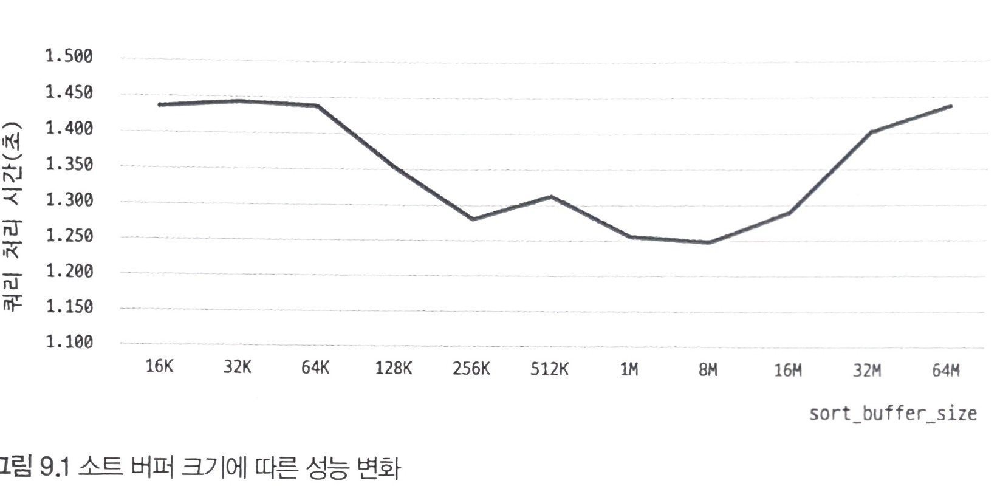
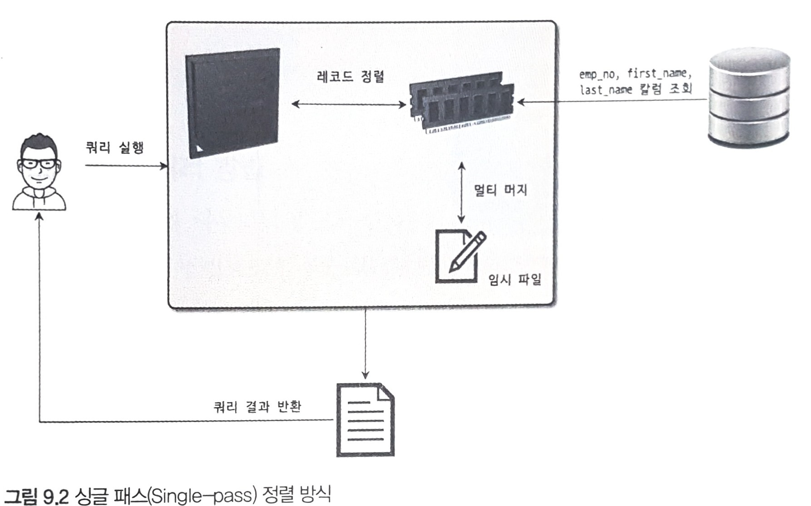
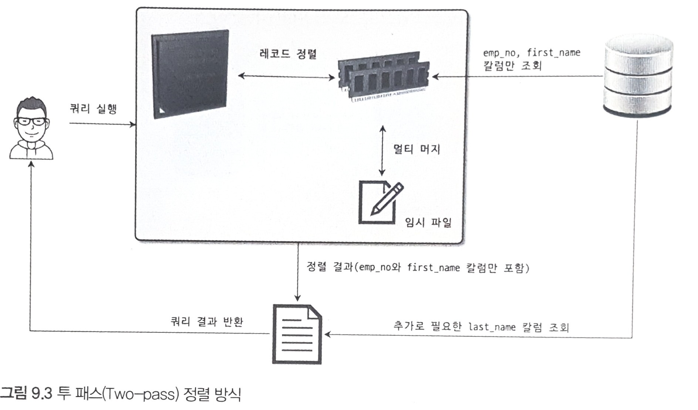
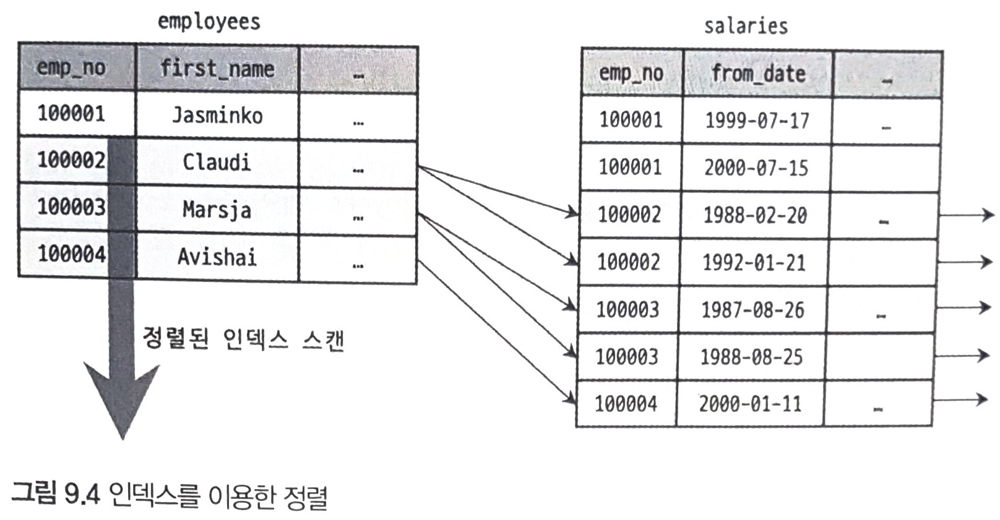
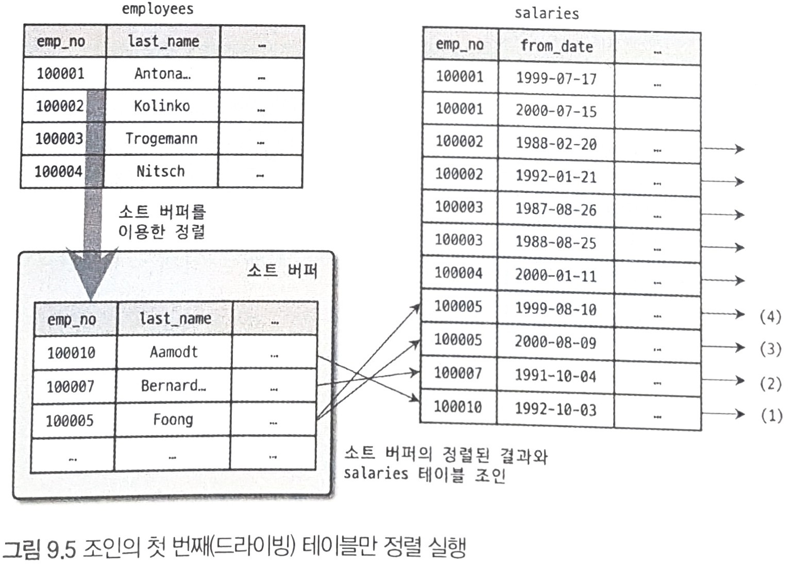
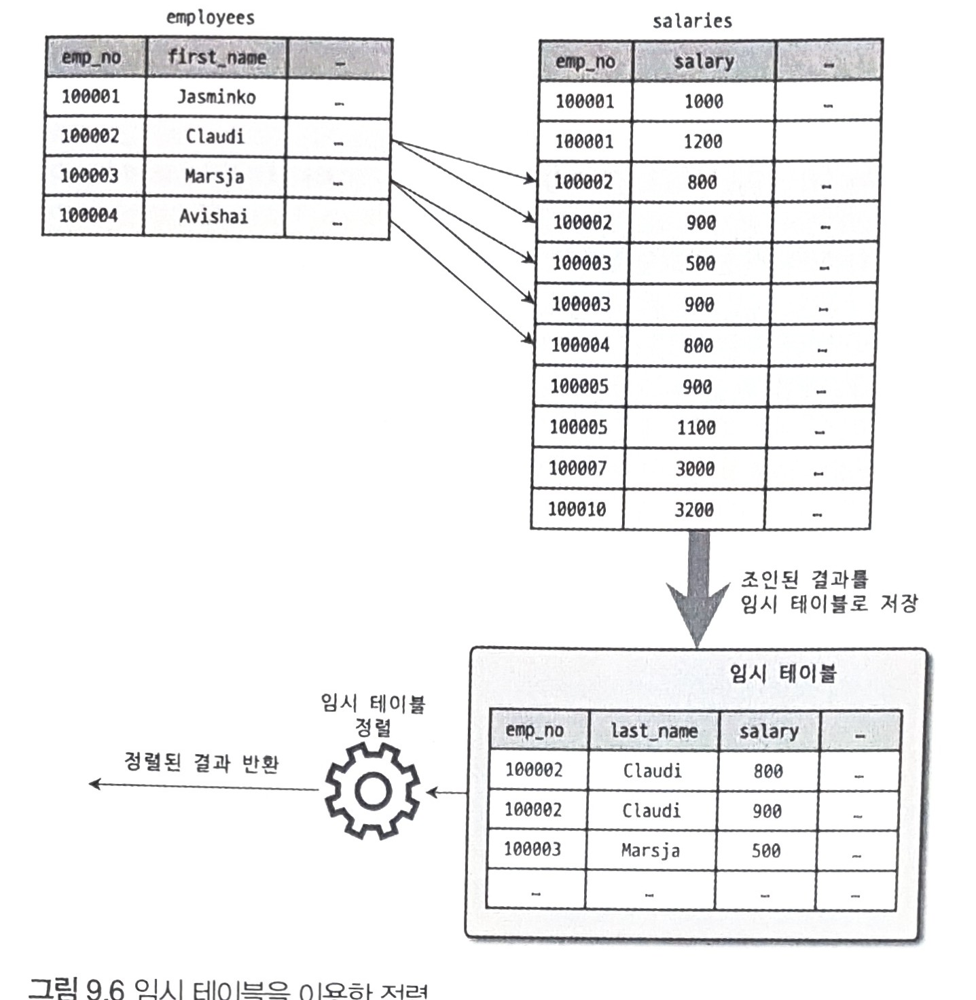
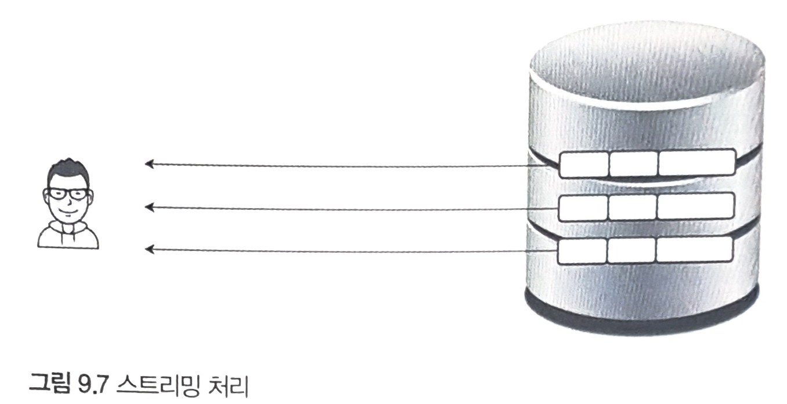
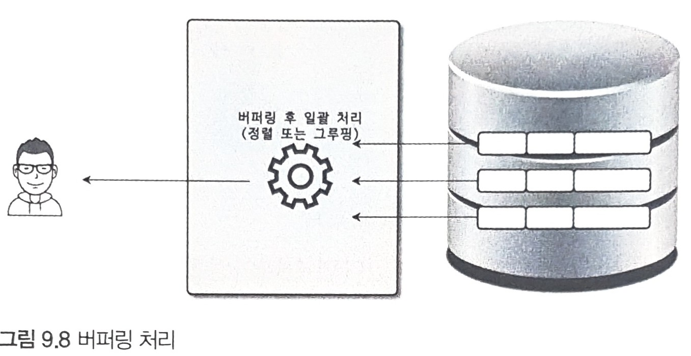

```SQL
MySQL 서버로 요청된 쿼리는 결과는 동일하지만 내부적으로 그 결과를 만들어내는 방법은 매우 다양하다.
이런 다양한 방법 중에서 어떤 방법이 최적이고 최소의 비용이 소모될지 결정해야 한다.
여행할 때도 인터넷이나 책 등을 참고해서 최소한의 비용이 드는 방법을 알아본 뒤에 여행 경로를 결정한다.
MySQL에서도 쿼리를 최적으로 실행하기 위해 각 테이블의 데이터가 어떤 분포로 저장돼 있는지 통계 정보를 참조하며,
그러한 기본 데이터를 비교해 최적의 실행 계획을 수립하는 작업이 필요하다.
MySQL 서버를 포함한 대부분의 DBMS에서는 옵티마이저가 이러한 기능을 담당한다.

MySQL에서는 EXPLAIN이라는 명령으로 쿼리의 실행 계획을 확인할 수 있는데,
EXPLAIN 명령의 결과에는 상당히 많은 정보가 출력된다.
실행 계획에 표시되는 내용을 제대로 이해하려면 MySQL 서버 옵티마이저가 실행하는 최적화에 대해 어느 정도 지식을 갖추고 있어야 한다.

이번 장에서는 MySQL 서버가 사용자의 요청을 처리하기 위해 데이터를 가공하는 기본 절차와
빠른 성능을 보장하기 위해 수행하는 최적화에 대해 살펴보겠다.

9.1 개요.

  어떤 DBMS는지 쿼리의 실행 계획을 수립하는 옵티마이저는 가장 복잡한 부분으로 알려져 있으며,
  옵티마이저가 만들어 내는 실행 계획을 이해하는 것 또한 상당히 어려운 부분이다.
  하지만 실행 계획을 이해할 수 있어야만 실행 계획의 불합리한 부분을 찾아내고,
  더 최적화된 방법으로 실행 계획을 수립하도록 유도할 수 있다.
  실행 계획을 살펴보기 전에 먼저 알고 있어야 할 몇 가지 사항을 살펴보자.

9.1.1 쿼리 실행 절차

  MySQL 서버에서 쿼리가 실행되는 과정은 크게 세 단계로 나눌 수 있다.

  1. 사용자로부터 요청된 SQL 문장을 잘게 쪼개서 MySQL 서버가 이해할 수 있는 수준으로 분리(파스 트리)한다.
  2. SQL의 파싱 정보(파스 트리)를 확인하면서 어떤 테이블부터 읽고 어떤 인덱스를 이용해 테이블을 읽을지 선택한다.
  3. 두 번째 단계에서 결정된 테이블의 읽기 순서나 선택된 인덱스를 이용해 스토리지 엔진으로부터 데이터를 가져온다.

  첫 번째 단계를 "SQL 파싱(Parsing)"이라고 하며,
  MySQL 서버의 "SQL 파서" 라는 모듈로 처리한다.
  SQL 문장이 문법적으로 잘못됐다면 이 단계에서 걸러진다.
  또한 이 단계에서 SQL 파스 트리"가 만들어진다.
  MySQL 서버는 SQL 문장 그 자체가 아니라 SQL 파스 트리를 이용해 쿼리를 실행한다.

  283 ================================================================================================================================

  두 번째 단계는 첫 번째 단계에서 만들어진 SQL 파스 트리를 참조하면서 다음과 같은 내용을 처리한다.

  - 불필요한 조건 제거 및 복잡한 연산의 단순화
  - 여러 테이블의 조인이 있는 경우 어떤 순서로 테이블을 읽을지 결정
  - 각 테이블에 사용된 조건과 인덱스 통계 정보를 이용해 사용할 인덱스를 결정
  - 가져온 레코드들을 임시 테이블에 넣고 다시 한번 가공해야 하는지 결정

  물론 이 밖에도 수많은 처리를 하지만 대표적으로 이러한 작업을 들 수 있다.
  두 번째 단계는 "최적도 및 실행 계획 수립" 단계이며,
  MySQL 서버의 "옵티마이저"에서 처리한다.
  또한 두 번째 단계가 완르되면 쿼리의 "실행 계획"이 만들어진다.
  세 번째 단계는 수립된 실행 계획대로 스토리지 엔진에 레코드를 읽어오도록 요청하고,
  MySQL 엔진에서는 스토리지 엔진으로부터 받은 레코드를 조인하거나 정는 작업을 수행한다.
  첫 번째 단계와 두 번째 단계는 거의 MySQL 엔진에서 처리하며,
  세 번째 단계는 MySQL 엔진과 스토리지 엔진이 동시에 참여해서 처리한다.

9.1.2 옵티마이저의 종류

  옵티마이저는 데이터베이스 서버에서 두뇌와 같은 역할을 담당한다.
  옵티마이저는 현재 대부분 DBMS가 선택하고 있는 비용 기반 최적화(Cost-based optimizer, CBO) 방법과
  예전 초기 버오라클 DBMS에서 많이 사용했던 규칙 기반 최적화 방법(Rule-based optimizer, RBO)으로 나눌 수 있다.

  - 규칙 기반 최적화는 기본적으로 대상 테이블의 레코드 건수나 선택도 등을 고려하지 않고
    옵티마이저에 나는 선순위에 따라 실행 계획을 수립하는 방식을 의미한다.
    이 방식에서는 통계 정보(테이블의 레코드 건수는 의 분포도를 조사하지 않고
    실행 계획이 수립되기 때문에 같은 쿼리에 대해서는 거의 항상 같은 실행 방음을 어 낸다.
    하지만 사용자의 데이터는 분포도가 매우 다양하기 때문에 규칙 기반의 최적화는 이미 오래 전부 DBMS에서 거의 사용되지 않는다.
  - 비용 기반 최적화는 쿼리를 처리하기 위한 여러 가지 가능한 방법을 만들고,
    각 단위 작업의 비용(부) 테이블의 예측된 통계 정보를 이용해 실행 계획별 비용을 산출한다.
    이렇게 산출된 실행 방법별로 비용이요되는 처리 방식을 선택해 최종적으로 쿼리를 실행한다.

  284 ================================================================================================================================

  규칙 기반 최적화는 각 테이블이나 인덱스의 통계 정보가 거의 없고
  상대적으로 느린 CPU 연산 탓에 비용 계산 과정이 부담스럽다는 이유로 사용되던 최적화 방법이다.
  현재는 대부분의 RDBMS가 비용 기반의 옵티마이저를 채택하고 있으며,
  MySQL 역시 마찬가지다.

9.2 기본 데이터 처리

  MySQL 서버를 포함한 모든 RDBMS는 데이터를 정렬하거나 그루핑하는 등의 기본 데이터 가공 기능을 가지고 있다.
  하지만 결과물은 동일하더라도 RDBMS별로 그 결과를 만들어 내는 과정은 천차만별이다.
  여기서는 이러한 기본적인 가공을 위해 MySQL 서버가 어떤 알고리즘을 사용하는지 간단히 살펴보겠다.

9.2.1 풀 테이블 스캔과 풀 인덱스 스캔

  인덱스 처리에 대한 자세한 내용은 이미 8장 인덱스'에서 살펴봤으므로 여기서는 풀 테이블 스캔에 대한 내용을 간단히 살펴보겠다.
  풀 테이블 스캔은 인덱스를 사용하지 않고 테이블의 데이터를 처음부터 끝까지 읽어서 요청된 작업을 처리하는 작업을 의미한다.
  MySQL 옵티마이저는 다음과 같은 조건이 일치할 때 주로 풀 테이블 스캔을 선택한다.

  - 테이블의 레코드 건수가 너무 작아서 인덱스를 통해 읽는 것보다
    풀 테이블 스캔을 하는 편이 더 빠른 경우(일반적으로 테이블이 페이지 1개로 구성된 경우)
  - WHERE 절이나 ON 절에 인덱스를 이용할 수 있는 적절한 조건이 없는 경우
  - 인덱스 레인지 스캔을 사용할 수 있는 쿼리라고 하더라도
    옵티마이저가 판단한 조건 일치 레코드 건수가 너무 많은 경우(인덱스의 B-Tree를 샘플링해서 조사한 통계 정보 기준)

  일반적으로 테이블의 전체 크기는 인덱스보다 훨씬 크기 때문에 테이블을 처음부터 끝까지 읽는 작업은 상당히 많은 디스크 읽기가 필요하다.
  그래서 대부분 DBMS는 풀 테이블 스캔을 실행할 때 한꺼번에 여러 개의 블록이나 페이지를 읽어오는 기능을 내장하고 있다.
  하지만 MySQL에는 풀 테이블 스캔을 실행할 때 한꺼번에 몇 개씩 페이지를 읽어올지 설정하는 시스템 변수는 없다.
  그래서 많은 사람들이 MySQL은 풀 테이블 스캔을 실행할 때 디스크로부터 페이지를 하나씩 읽어 오는 것으로 생각한다.

  285 ================================================================================================================================

  이것은 MyISAM 스토리지 엔진에는 맞는 이야기지만 InnoDB에서는 틀린 말이다.
  InnoDB 스토리지 엔진은 특정 테이블의 연속된 데이터 페이지가 읽히면
  백그라운드 스레드에 의해 리드 어헤드(Readahead) 작업이 자동으로 시작된다.
  리드 어헤드란 어떤 영역의 데이터가 앞으로 필요해지리라는 것을 예측해서
  요청이 오기 전에 미리 디스크에서 읽어 InnoDB의 버퍼 풀에 가져다 두는 것을 의미한다.
  즉, 풀 테이블 스캔이 실행되면 처음 몇 개의 데이터 페이지는 포그라운드 스레드(Foreground thread, 클라이언트 스레드)가
  페이지 읽기를 실행하지만 특정 시점부터는 읽기 작업을 백그라운드 스레드로 넘긴다.
  백그라운드 스레드가 읽기를 넘겨받는 시점부터는 한 번에 4개 또는 8개씩의 페이지를 읽으면서 계속 그 수를 증가시킨다.
  이때 한 번에 최대 64개의 데이터 페이지까지 읽어서 버퍼 풀에 저장해 둔다.
  포그라운드 스레드는 미리 버퍼 풀에 준비된 데이터를 가져다 사용하기만 하면 되므로 쿼리가 상당히 빨리 처리되는 것이다.

  MySQL 서버에서는 innodb_read_ahead_threshold 시스템 변수를 이용해
  InnoDB 스토리지 엔진이 연제 리드 어헤드를 시작할지 임계값을 설정할 수 있다.
  포그라운드 스레드에 의해 innodb_read_areer_threshold 시스템 변수에 설정된 개수만큼의 연속된 데이터 페이지가 읽히면
  InnoDB 스토리지 엔진은 백그라운드 스레드를 이용해 대량으로 그다음 페이지들을 읽어서 버퍼 풀로 적재한다.
  일반적으로 디폴트 설정으로도 충분하지만 데이터 웨어하우스용으로 MySQL을 사용한다면
  이 옵션을 더 낮은 스로 설정해서 더 빨리 리드 어헤드가 시작되게 유도하는 것도 좋은 방법이다.

  리드 어헤드는 풀 테이블 스캔에서만 사용되는 것이 아니라 풀 인덱스 스캔에서도 동일하게 사용된다.
  풀 테이블 스캔이 테이블을 처음부터 끝까지 스캔하는 것을 의미하듯이,
  풀 인덱스 스캔은 인덱스를 추음부터 끝까지 스캔하는 것을 의미한다.
  예를 들어, 다음과 같은 쿼리를 한번 생각해보자.

  mysql> SELECT COUNT(*) FROM employees;

  이 쿼리는 아무런 조건 없이 employees 테이블의 레코드 건수를 조회하고 있으므로 당연히 풀 테이블스캔을 할 것처럼 보인다.
  하지만 실제 실행 계획은 풀 테이블 스캔보다는 풀 인덱스 스캔을 하게 될 가능성이 높다.
  MySQL 서버는 앞의 예제와 같이 단순히 레코드의 건수만 필요로 하는 쿼리라면
  용기작은 인덱스를 선택하는 것이 디스크 읽기 횟수를 줄일 수 있기 때문이다.
  일반적으로 인덱스는 테이블의 2~3개 칼럼만으로 구성되기 때문에 테이블 자체보다는 용량이 작아서 훨씬 빠른 처리가 가능하다.
  하지만 다음과 같이 레코드에만 있는 칼럼이 필요한 쿼리의 경우에는 풀 인덱스 스캔을 활용하지 못고 풀 테이블 스캔을 한다.

  mysql> SELECT * FROM employees;

  286 ================================================================================================================================

9.2.2 병렬 처리

  MySQL 8.0 버전부터는 용도가 한정돼 있긴 하지만 처음으로 MySQL 서버에서도 쿼리의 병렬 처리가 가능해졌다.

  주의 : 여기서 설명하는 병렬 처리는 하나의 쿼리를 여러 스레드가 작업을 나누어 동시에 처리한다는 것을 의미한다.
         "MySQL 8.0 이전까지는 여러 개의 쿼리가 동시에 처리되지 못했나?"라는 의문을 가지는 독자는 없기를 바란다.
         여러 스레드가 동시에 각각의 쿼리를 처리하는 것은 MySQL 서버가 처음 만들어질 때부터 가능했다.

  MySQL 8.0에서는 innodb_parallel_read_threads라는 시스템 변수를 이용해
  하나의 쿼리를 최대 몇 개의 스레드를 이용해서 처리할지를 변경할 수 있다.
  아직 MySQL 서버에서는 쿼리를 여러 개의 스레드를 이용해 병렬로 처리하게 하는 힌트나 옵션은 없다.
  MySQL 8.0 버전에서는 다음 예제와 같이 아무런 WHERE 조건 없이 단순히 테이블의 전체 건수를 가져오는 쿼리만 병렬로 처리할 수 있다.

  mysql> SET SESSION innodb_parallel_read_threads=1; mysql> SELECT COUNT(*) FROM salaries; 1 row in set (0.32 sec)
  mysql> SET SESSION innodb_parallel_read_threads=2; mysql> SELECT COUNT(*) FROM salaries; 1 row in set (0.20 sec)
  mysql> SET SESSION innodb_parallel_read_threads=4; mysql> SELECT COUNT(*) FROM salaries; 1 row in set (0.18 sec)
  mysql> SET SESSION innodb_parallel_read_threads=8; mysql> SELECT COUNT(*) FROM salaries; 1 row in set (0.13 sec)

  287 ================================================================================================================================

  앞의 쿼리 실행 결과를 보면 병렬 처리용 스레드 개수가 늘어날수록 쿼리 지리에 길리는 시간이 줄어는 것을 확인할 수 있다.
  하지만 병렬 처리용 스레드 개수를 아무리 늘리더라도
  서비에 장착된 CPLA코어 개수를 넘어서는 경우에는 오히려 성능이 떨어질 수도 있으니 주의하자.

9.2.3 ORDER BY 처리(Using filesort)

  레코드 1~2건을 가져오는 쿼리를 제외하면 대부분의 SELECT 쿼리에서 정렬은 필수적으로 사용된다.
  데이터 웨어하우스처럼 대량의 데이터를 조회해서 일괄 처리하는 기능이 아니라면
  아마도 레코드 정요건은 대부분의 조회 쿼리에 포함돼 있을 것이다.
  정렬을 처리하는 방법은 인덱스를 이용하는 방법과쿼리가 실행될 때 "Filesort"라는 별도의 처리를 이용하는 방법으로 나눌 수 있다.

  장점단점INSERT, UPDATE, DELETE 쿼리가 실행될 때 이미 인덱스가 정렬돼 있어서 순서대로 읽기만 하면 되므로 매우 빠르다.
  인덱스 이용Filesort 이용인덱스를 생성하지 않아도 되므로 인덱스를 이용할 때의 단점이 장점으로 바뀐다.
  정렬해야 할 레코드가 많지 않으면 메모리에서 Filesort가 처리되므로 충분히 빠르다.

  물론 레코드를 정렬하기 위해 항상 "Filesort"라는 정렬 작업을 거쳐야 하는 것은 아니다.
  이미 인덱스를 이용한 정렬은 8.3.6절 B-TREE 인덱스의 정렬 및 스캔 방향에서 한번 살펴봤다.
  하지만 다음과같은 이유로 모든 정렬을 인덱스를 이용하도록 튜닝하기란 거의 불가능하다.

  정렬 기준이 너무 많아서 요건별로 모두 인덱스를 생성하는 것이 불가능한 경우

  - GROUP BY의 결과 또는 DISTINCT 같은 처리의 결과를 정렬해야 하는 경우
  - UNION의 결과와 같이 임시 테이블의 결과를 다시 정렬해야 하는 경우

  랜덤하게 결과 레코드를 가져와야 하는 경우

  INSERT, UPDATE, DELETE 작업 시 부가적인 인스 추가/삭제 작업이 필요하므로 느리다.
  인덱스 때문에 디스크 공간이 더 많이 필요하다.
  인덱스의 개수가 늘어날수록 InnoDB의 버퍼 풀을위한 메모리가 많이 필요하다.

  정렬 작업이 쿼리 실행 시 처리되므로 레코드 대상건수가 많아질수록 쿼리의 응답 속도가 느리다.

  MySQL 서버에서 인덱스를 이용하지 않고 별도의 정렬 처리를 수행했는지는
  실행 계획의 Extra 칼럼에 "Using filesort 메시지가 표시되는지 여부로 판단할 수 있다.

  288 ================================================================================================================================

  여기서는 MySQL의 정렬이 어떻게 치리되는지 살펴보고자 한다.
  MySQL의 정렬 특성을 이해하면 쿼리를 튜닝할 때 어떻게 하면 조금이라도 더 빠른 쿼리가 될지 쉽게 판단할 수 있을 것이다.

9.2.3.1 소트 버퍼

  MySQL은 정렬을 수행하기 위해 별도의 메모리 공간을 할당받아서 사용하는데,
  이 메모리 공간을 소트 버퍼(Sort buffer)라고 한다.
  소트 버퍼는 정렬이 필요한 경우에만 할당되며,
  버퍼의 크기는 정렬해야 할 레코드의 크기에 따라 가변적으로 증가하지만
  최대 사용 가능한 소트 버퍼의 공간은 sort_buffersize라는 시스템 변수로 설정할 있다.
  소트 버퍼를 위한 메모리 공간은 쿼리의 실행이 완료되면 즉시 시스템으로 반납된다.

  여기까지는 아주 이상적인 부분만 이야기했는데,
  지금부터 정렬이 왜 문제가 되는지 살펴보자.
  정렬해야 할 레코드가 아주 소량이어서 메모리에 할당된 소트 버퍼만으로 정렬할 수 있다면 아주 빠르게 정렬이 처리될 것이다.
  하지만 정렬해야 할 레코드의 건수가 소트 버퍼로 할당된 공간보다 크다면 어떨까?
  이때 MySQL은 정렬해야 할 레코드를 여러 조각으로 나눠서 처리하는데,
  이 과정에서 임시 저장을 위해 디스크를 사용한다.

  메모리의 소트 버퍼에서 정렬을 수행하고,
  그 결과를 임시로 디스크에 기록해 둔다.
  그리고 다음 레코드를 가져와서 다시 정렬해서 반복적으로 디스크에 임시 저장한다.
  이처럼 각 버퍼 크기만큼 정렬된 레코드를 다시 병합하면서 정렬을 수행해야 한다.
  이 병합 작업을 멀티 머지(Multi-merge)라고 표현하며,
  수행된 멀티 머지 횟수는 Sort_merge_passes라는 상태 변수(SHOW STATUS VARIABLES 명령 참조)에 누적해서 집계된다.

  이 작업들이 모두 디스크의 쓰기와 읽기를 유발하며,
  레코드 건수가 많을수록 이 반복 작업의 횟수가 많아진다.
  소트 버퍼를 크게 설정하면 디스크를 사용하지 않아서 더 빨라질 것으로 생각할 수도 있지만,
  실제 벤치마크 결과로는 큰 차이를 보이진 않았다.
  그림 9.1은 MySQL의 소트 버퍼 크기를 확장해가면서 다음 쿼리를 실행했을 때 소요되는 시간을 측정한 것이다.
  이 쿼리는 salaries 테이블의 2,844,047건 레코드를 모두 읽어서 정렬하는데,
  to_date 칼럼에 인덱스가 없기 때문에 쿼리 처리 시에 정렬 작업이 필요한 쿼리다.
  마지막의 LIMIT 절은 일부러 화면에 표시되는 내용을 최소화하기 위해서 추가해둔 옵션이다.

  289 ================================================================================================================================

  mysql> SELECT * FROM salaries ORDER BY to_date LIMIT 999999999.1;

  개인용 PC에서 실행해본 벤치마크에서는 MySQL의 소트 버퍼 크기가 256KB에서 8.MIB 사이적의 성능을 보였으며,
  256KB 미만 또는 8MB 이상부터는 소트 버퍼 크기 변화에 대해 성능 -보이지 않았다.
  때로는 더 큰 sort_buffer_size에서 성능이 더 빠르다는 게시물들도 있지만,
  이는 어떤 데이터를 정렬하는지,
  그리고 테스트하는 서버에서 메모리나 디스크의 특성에 따라 결과가질 수 있다.
  참고로 그림 9.1의 테스트는 동일 쿼리를 5번씩 실행했을 때의 평균 소요 시간을 그린다.

  1.5001.4501.4001.350시 1.300 쿼리 처리 시간(초)1.2501.200 + 1.1501.10016K32K6 4K128K256K512K1M8M16032M640 sort_buffer_size

  ```
  
  ```SQL

  sort_buffer_size 시스템 변수의 설정값이 무조건 크면 메모리에서 모두 처리되니 빨라질 것으로 조하지만 실제 결과는 그렇지 않다.
  그리고 리눅스 계열의 운영체제에서는 너무 큰 sort_buffer_size를 용하는 경우,
  큰 메모리 공간 할당 때문에 성능이 훨씬 떨어질 수도 있다.

  지금까지의 경험상 일반적인 트랜잭션 처리용 MySQL 서버의 소트 버퍼 크기는 56KB에서 1MB -이 적절해 보인다.
  4.1.3절 '메모리 할당 및 사용 구조에서 언급했듯이 MySQL은 글로벌 메모리과 세션(로컬) 메모리 영역으로 나눠서 생각할 수 있는데,
  정렬을 위해 할당하는 소트 버퍼는 세모리 영역에 해당한다.
  즉,
  소트 버퍼는 여러 클라이언트가 공유해서 사용할 수 있는 영역이 아니다.
  넥션이 많으면 많을수록,
  정렬 작업이 많으면 많을수록 소트 버퍼로 소비되는 메모리 공간이 귀공을 미한다.
  소트 버퍼의 크기를 10MB 이상으로 설정하면 대량의 레코드를 정렬하는 쿼리가
  여러 고에서 동시에 실행되면서 운영체제는 메모리 부족 현상을 겪을 수도 있다.
  더는 메모리 여유 공간는 경우에는 운영체제의 OOM-Killer가 여유 메모리를 확보하기 위해 프로세스를 강제로 종로이다.

  290 ================================================================================================================================

  그런데 OOM-Killer는 메모리를 가장 많이 사용하는 프로세스를 강제 종료하기 때문에
  일반적으로 메모리를 가장 많이 사용하는 MySQL 서버가 강제 종료 1순위가 된다.

  주의 : 소트 버퍼를 크게 설정해서 빠른 성능을 얻을 수는 없지만 디스크의 읽기와 쓰기 사용량은 줄일 수 있다.
         그래서 MySQL 서버의 데이터가 많거나 디스크의 /O 성능이 낮은 장비라면
         소트 버퍼의 크기를 더 크게 설정하는 것이 도움이 될 수도 있다.
         하지만 소트 버퍼를 너무 크게 설정하면 서버의 메모리가 부족해져서 MySQL 서버가 메모리 부족을 겪을 수도 있기 때문에
         소트 버퍼의 크기는 적절히 설정하는 것이 좋다.
         그리고 대량 데이터의 정렬이 필요한 경우 해당 세션의 소트 버퍼만 일시적으로 늘려서 쿼리를 실행하고
         다시 줄이는 것도 좋은 방법이다.

9.2.3.2 정렬 알고리즘

  레코드를 정렬할 때 레코드 전체를 소트 버퍼에 담을지 또는
  정렬 기준 칼럼만 소트 버퍼에 담을지에 따라 (공식적인 명칭은 아니지만)
  "싱글 패스(Single-pass)"와 "투 패스(Two-pass)" 2가지 정렬 모드로 나눌 수 있다.
  정렬을 수행하는 쿼리가 어떤 정렬 모드를 사용하는지는 다음과 같이 옵티마이저 트레이스 기능으로 확인할 수 있다.

  -- // 옵티마이저 트레이스 활성화
  mysql> SET OPTIMIZER_TRACE="enabled=on", END_MARKERS_IN_JSON=on;
  mysql> SET OPTIMIZER_TRACE_MAX_MEM_SIZE=1000000;

  -- // 쿼리 실행
  mysql> SELECT * FROM employees ORDER BY last_name LIMIT 100000,1;

  -- // 트레이스 내용 확인
  mysql> SELECT * FROM INFORMATION_SCHEMA OPTIMIZER_TRACE \G

  "filesort_priority_queue_optimization": {
  "limit": 100001 } /* filesort_priority_queue_optimization */, "filesort_execution": [ ] /* filesort_execution */, "filesort_summary": { .
  "memory_available": 262144, "key_size": 32, "row_size": 169,
  "max_rows_per_buffer": 1551, "num_rows_estimate": 936530, "num_rows_found": 300024, "num_initial_chunks_spilled_to_disk": 82, "peak_memory_used": 262144, "sort_algorithm": "std::stable_sort", "sort_mode" : "<fixed_sort_key, packed_additional_fields)" } /* filesort_summary */

  291 ================================================================================================================================

  출력된 내용에서 "filesort_summary" 섹션의 "sort_algorithm" 필드에 정렬 알고리즘이 표시도그
  "sort_mode" 필드에는 "(fixed_sort_key, packed_additional_fields>"가 표시된 것을 확인할 수 있다.
  정확히는 MySQL 서버의 정렬 방식은 다음과 같이 3가지가 있다.

  - <sort_key, rowid> : 정렬 키와 레코드의 로우 아이디(Row ID)만 가져와서 정렬하는 방식
  - <sort_key, additional_fields> : 정렬 키와 레코드 전체를 가져와서 정렬하는 방식으로, 레코드의 칼럼들은 고정 사이즈로 메모리 저장
  - <sort_key, packed_additional_fields> : 정렬 키와 레코드 전체를 가져와서 정렬하는 방식으로, 레코드의들은 가변 사이즈로 메모리 저장

  여기서는 첫 번째 방식을 "투 패스" 정렬 방식이라 명명하고,
  두 번째와 세 번째 방식을 싱글 패스렬 방식이라 명명하겠다.
  MySQL 5.7 버전부터 세 번째 방식이 도입됐는데,
  이는 정렬을 위한 메도리 공간의 효율적인 사용을 위해서 추가로 도입된 방식이다.

  참고 : 옵티마이저 트레이스 내용에서 "sort_algorithm" 필드에 보여진 "std::stable_sort"는
         MySQL 서버에서 실제 정렬을 수행할 때 사용한 라이브러리의 함수 이름을 보여준다.
         "std::stable_sort"는 C++의 STL(Standard Template Library)에서 제공되는 stable_sort() 함수를 사용했다는 것을 의미한다.
         하지만 운영체제별로 STL의 stable_sort() 함수가 어떤 정렬 알고리즘을 사용하는지는 조금씩 차이가 있다.
         리눅스 서버에서 사용하는 GNUCH의 STL에서는 퀵 소트(Quick-sort)와 힙 소트(Heap-sort) 알고리즘을 복합적으로 사용한다.

  292 ================================================================================================================================


9.2.3.2.1 싱글 패스 정렬 방식

  소트 버퍼에 정렬 기준 칼럼을 포함해 SELECT 대상이 되는 칼럼 전부를 담아서 정렬을 수행하는 정렬 방식이다.

  mysql> SELECT emp_no, first_name, last_name FROM employees ORDER BY first_name;

  위 쿼리와 같이 first_name으로 정렬해서 emp_no, first_name, last_name을
  SELECT하는 쿼리를 싱글 패스(Single-pass) 정렬 방식으로 처리하는 절차를 그림으로 보면 다음과 같다.

  레코드 정렬emp_no, first name,| last_nane 칼럼 조회쿼리 실행멀티 머지임시 파일쿼리 결과 반환

  ```
  
  ```SQL

  그림 9.2에서 알 수 있듯이,
  처음 employees 테이블을 읽을 때 정렬에 필요하지 않은 last_name 칼럼 까지 전부 읽어서 소트 버퍼에 담고 정렬을 수행한다.
  그리고 정렬이 완료되면 정렬 버퍼의 내용을 그대로 클라이언트로 넘겨주는 과정을 볼 수 있다.

9.2.3.2.2 투 패스 정렬 방식

  정렬 대상 칼럼과 프라이머리 키 값만 소트 버퍼에 담아서 정렬을 수행하고,
  정렬된 순서대로 다시 고라이머리 키로 테이블을 읽어서 SELECT할 칼럼을 가져오는 정렬 방식으로,
  싱글 패스 정렬 방식이 도입 되기 이전부터 사용하던 방식이다.

  293 ================================================================================================================================

  하지만 MySQL 8.0에서도 여전히 특정 조건에서는 투 패스(Tarpass) 정렬 방식을 사용한다.

  그림 9.3은 같은 쿼리를 MySQL의 예전 정렬 방식인 투 패스 방식으로 정렬하는 과정을 표현한 그다.
  처음 employees 테이블을 읽을 때는 정렬에 필요한 first_name 칼럼과 프라이머리 키인 erpre:어서 정렬을 수행했음을 알 수 있다.
  이 정렬이 완료되면 그 결과 순서대로 employees 테이블을더 읽어서 last_name을 가져오고,
  최종적으로 그 결과를 클라이언트 쪽으로 넘기는 과정을 확인할 수있다.

  레코드 정렬emp_no, first_name칼럼만 조회COCO쿼리 실행멀티 머지임시 파일정렬 결과
  (emp_no와 first_name 칼럼만 포함)쿼리 결과 반환추가로 필요한 last_name 칼럼 조회

  ```
  
  ```SQL

  MySQL의 예전 정렬 방식인 투 패스 방식은 테이블을 두 번 읽어야 하기 때문에
  상당히 불합리하지새로운 정렬 방식인 싱글 패스는 이러한 불합리가 없다.
  하지만 싱글 패스 정렬 방식은 더 많은 소트 -퍼 공간이 필요하다.
  즉, 대략 128KB의 정렬 버퍼를 사용한다면 이 쿼리는 투 패스 정렬 방식에 서는대략 7,000건의 레코드를 정렬할 수 있지만
  싱글 패스 정렬 방식에서는 그것의 반 정도밖에 정렬할 수없다.
  물론 이것은 소트 버퍼 공간의 크기와 레코드의 크기에 의존적이다.

  최신 버전에서는 일반적으로 싱글 패스 정렬 방식을 주로 사용한다.
  하지만 최신 버전의 MySQL라고 해서 항상 싱글 패스 정렬 방식을 사용하는 것은 아니다.
  다음의 경우, MySQL 서버는 싱글즈정렬 방식을 사용하지 못하고 투 패스 정렬 방식을 사용한다.

  294 ================================================================================================================================

  - 레코드의 크기가 max_length_for_sort_data 시스템 변수에 설정된 값보다 클 때
  - BLOB이나 TEXT 타입의 칼럼이 SELECT 대상에 포함할 때

  얼핏 생각해 보면 투 패스 정렬 방식이 더 빠를 것도 같지만 항상 그런 것은 아니다.
  싱글 패스 방식은 정렬 대상 레코드의 크기나 건수가 작은 경우 빠른 성능을 보이며,
  투 패스 방식은 정렬 대상 레코드의 크기나 건수가 상당히 많은 경우 효율적이라고 볼 수 있다.

  주의 : SELECT 쿼리에서 꼭 필요한 칼럼만 조회하지 않고,
         모든 칼럼(*)을 가져오도록 개발할 때가 많다.
         하지만 이는 정렬 버퍼를 몇 배에서 몇십 배까지 비효율적으로 사용할 가능성이 크다.
         SELECT 쿼리에서 꼭 필요한 칼럼만 조회하도록 쿼리를 작성하는 것이 좋다고 권장하는 것은 바로 이런 이유 때문이다.
         특히 정렬이 필요한 SELECT는 불필요한 칼럼을 SELECT하지 않게 쿼리를 작성하는 것이 효율적이다.
         이는 꼭 정렬 버퍼에만 영향을 미치는 것이 아니라 임시 테이블이 필요한 쿼리에서도 영향을 미친다.
         이에 대한 자세한 내용은 9.2.6절 '내부 임시 테이블 활용'에서 자세히 살펴보겠다.

9.2.3.3 정렬 처리 방법

  쿼리에 ORDER BY가 사용되면 반드시 다음 3가지 처리 방법 중 하나로 정렬이 처리된다.
  일반적으로 아래쪽에 있는 정렬 방법으로 갈수록 처리 속도는 떨어진다.

  +-------------------------------------------------+---------------------------------------------------+
  | 정렬 처리 방법                                  | 실행 계획의 Extra 칼럼 내용                       |
  +-------------------------------------------------+---------------------------------------------------+
  | 인덱스를 사용한 정렬                            | 별도 표기 없음                                    |
  | 조인에서 드라이빙 테이블만 정렬                 | "Using filesort" 메시지가 표시됨                  |
  | 조인에서 조인 결과를 임시 테이블로 저장 후 정렬 | "Using temporary; Using filesort" 메시지가 표시됨 |
  +-------------------------------------------------+---------------------------------------------------+

  먼저 옵티마이저는 정렬 처리를 위해 인덱스를 이용할 수 있을지 검토할 것이다.
  인덱스를 이용할 수 있다면 별도의 "Filesort" 과정 없이 인덱스를 순서대로 읽어서 결과를 반환한다.
  하지만 인덱스를 사용할 수 없다면 WHERE 조건에 일치하는 레코드를 검색해 정렬 버퍼에 저장하면서 정렬을 처리(Filesort)할 것이다.
  이때 MySQL 옵티마이저는 정렬 대상 레코드를 최소화하기 위해 다음 2가지 방법 중 하나를 선택한다.

  - 조인의 드라이빙 테이블만 정렬한 다음 조인을 수행
  - 조인이 끝나고 일치하는 레코드를 모두 가져온 후 정렬을 수행

  295 ================================================================================================================================

  일반적으로 조인이 수행되면서 레코드 건수와 레코드의 크기는 거의 배수로 불어나기 때문에
  가능면 드라이빙 테이블만 정렬한 다음 조인을 수행하는 방법이 효율적이다.
  그래서 두 번째 방법보다. 번째 방법이 더 효율적으로 처리된다. 3가지 정렬 처리 방법에 대해 하나씩 자세히 살펴보자.

9.2.3.3.1 인덱스를 이용한 정렬

  인덱스를 이용한 정렬을 위해서는 반드시 ORDER BY에 명시된 칼럼이 제일 먼저 읽는 테이블 조인용된 경우 드라이빙 테이블)에 속하고,
  ORDER BY의 순서대로 생성된 인덱스가 있어야 한다.
  또한 다절에 첫 번째로 읽는 테이블의 칼럼에 대한 조건이 있다면 그 조건과 ORDER BY는 같은 인덱스를 사수 있어야 한다.
  그리고 B-Tree 계열의 인덱스가 아닌 해시 인덱스나 전문 검색 인덱스 등에서는 스를 이용한 정렬을 사용할 수 없다.
  예외적으로 R-Tree도 B-Tree 계열이지만,
  특성상 이 방식을 용할 수 없다. 여러 테이블이 조인되는 경우에는 네스티드-루프(Nested-loop) 방식의 조인에서 방식을 사용할 수 있다.

  인덱스를 이용해 정렬이 처리되는 경우에는 실제 인덱스의 값이 정렬돼 있기 때문에 인덱스의 슨로 읽기만 하면 된다.
  실제로 MySQL 엔진에서 별도의 정렬을 위한 추가 작업을 수행하지는 않는 다음 예제처럼
  ORDER BY가 있든 없든 같은 인덱스를 레인지 스캔해서 나온 결과는 같은 순서로 출는 것을 확인할 수 있다.
  ORDER BY 절이 없어도 정렬이 되는 이유는 그림 9.4와 같이 employees의 프라이머리 키를 읽고,
  그다음으로 salaries 테이블을 조인했기 때문이다.

  mysql> SELECT *
           FROM employees e
              , salaries s
          WHERE S.emp_no = e.emp_no
            AND e.emp_no BETWEEN 100002 AND 100020
          ORDER BY e. emp_no
         ;

  -- // emp_no 칼럼으로 정렬이 필요한데, 인덱스를 사용하면서 자동으로 정렬이 된다고
  -- // 일부러 ORDER BY emp_no를 제거하는 것은 좋지 않은 선택이다.
  mysql> SELECT *
           FROM employees e
              , salaries s
          WHERE s.emp_no = e.emp_no
            AND e.emp_no BETWEEN 100002 AND 100020
         ;

  296 ================================================================================================================================

  employees salaries emp_no first_name emp_no from_date 100001 Jasminko 100001 1999-07-17 100002 Claudi 100001 2000-07-15 100003 Marsja 100002 1988-02-20 100004 Avishai 100002 1992-01-21 100003 1987-08-26 정렬된 인덱스 스캔 100003 1988-08-25 100004 2000-01-11

  ```
  
  ```SQL

  주의 : ORDER BY 절을 넣지 않아도 자동으로 정렬되므로 ORDER BY 절 자체를 쿼리에서 완전히 제거해서 쿼리를 작성하기도 한다.
         혹시 ORDER BY 절을 포함하면 MySQL 서버가 별도로 정렬 작업을 한 번 더 할까 봐 걱정스러워서다.
         하지만 MySQL 서버는 정렬을 인덱스로 처리할 수 있는 경우 부가적으로 불필요한 정렬 작업을 수행하지 않는다.
         그래서 인덱스로 정렬이 처리될 때는 ORDER BY가 쿼리에 명시된다고 해서 작업량이 더 늘지는 않는다.
         또한, 어떤 이유로 쿼리의 실행 계획이 조금 변경된다면 ORDER BY가 명시되지 않은 쿼리는
         결과를 기대했던 순서로 가져오지 못해서 애플리케이션의 버그로 연결될 수도 있다.
         하지만 ORDER BY 절을 명시해두면 성능상의 손해가 없음은 물론이고 이런 예외 상황에서도 버그로 연결되지 않는다.

  앞에서도 언급했듯이 인덱스를 사용한 정렬이 가능한 이유는 B-Tree 인덱스가 키 값으로 정렬돼 있기 때문이다.
  또한 조인이 네스티드-루프 방식으로 실행되기 때문에 조인 때문에 드라이빙 테이블의 인덱스 읽기 순서가 흐트러지지 않는다.
  하지만 조인이 사용된 쿼리의 실행 계획에 조인 버퍼(Join buffer)가 사용되면 순서가 흐트러질 수 있기 때문에 주의해야 한다.

9.2.3.3.2 조인의 드라이빙 테이블만 정렬

  일반적으로 조인이 수행되면 결과 레코드의 건수가 몇 배로 불어나고,
  레코드 하나하나의 크기도 늘어난다.
  그래서 조인을 실행하기 전에 첫 번째 테이블의 레코드를 먼저 정렬한 다음 조인을 실행하는 것이 정렬의 차선책이 될 것이다.
  이 방법으로 정렬이 처리되려면 조인에서 첫 번째로 읽히는 테이블(드라이빙 테이블)의 칼럼만으로 ORDER BY 절을 작성해야 한다.

  mysql> SELECT *
           FROM employees e
              , salaries s
          WHERE s.emp_no = e.emp_no
            AND e.emp_no BETWEEN 100002 AND 100010
          ORDER BY e.last_name
         ;

  297 ================================================================================================================================

  우선 WHERE 절이 다음 2가지 조건을 갖추고 있기 때문에 옵티마이저는 employees 테이블을 드라이이블로 선택할 것이다.

  - WHERE 절의 검색 조건("emp_no BETWEEN 100001 AND 100010")은 employees 테이블의 프라이머리 키를 주검색하면 작업량을 줄일 수 있다.
  - 드리븐 테이블(salaries)의 조인 칼럼인 emp_no 칼럼에 인덱스가 있다.

  검색은 인덱스 레인지 스캔으로 처리할 수 있지만
  ORDER BY 절에 명시된 칼럼은 employees 테이블 = 라이머리 키와 전혀 연관이 없으므로 인덱스를 이용한 정렬은 불가능하다.
  그런데 ORDER BY 절의 주기준 칼럼이 드라이빙 테이블(employees)에 포함된 칼럼임을 알 수 있다.
  옵티마이저는 드라이 다블만 검색해서 정렬을 먼저 수행하고, 그 결과와 salaries 테이블을 조인한 것이다.

  그림 9.5는 이 과정을 보여준다.

  1. 인덱스를 이용해 "emp_no BETWEEN 100001 AND 100010" 조건을 만족하는 9건을 검색
  2. 검색 결과를 last_name 칼럼으로 정렬을 수행(Filesort)
  3. 정렬된 결과를 순서대로 읽으면서 salaries 테이블과 조인을 수행해 86건의 최종 결과를 가져옴
     (그림 9.5의 1쪽에 있는 번호는 레코드가 조인되어 출력되는 순서를 의미).

  ```
  
  ```SQL

  298 ================================================================================================================================


9.2.3.3.3 임시 테이블을 이용한 정렬

  쿼리가 여러 테이블을 조인하지 않고,
  하나의 테이블로부터 SELECT해서 정렬하는 경우라면 임시 테이블이 필요하지 않다.
  하지만 2개 이상의 테이블을 조인해서 그 결과를 정렬해야 한다면 임시 테이블이 필요할 수도 있다.
  앞에서 살펴본 "조인의 드라이빙 테이블만 정렬"은 2개 이상의 테이블이 조인되면서 정렬이 실행되지만 임시 테이블을 사용하지 않는다.
  하지만 그 외 패턴의 쿼리에서는 항상 조인의 결과를 임시 테이블에 저장하고,
  그 결과를 다시 정렬하는 과정을 거친다.
  이 방법은 정렬의 3가지 방법 가운데 정렬해야 할 레코드 건수가 가장 많기 때문에 가장 느린 정렬 방법이다.
  다음 쿼리는 "드라이빙 테이블만 정렬"에서 살펴본 예제와 ORDER BY 절의 칼럼만 제외하고 같은 쿼리다.
  이 쿼리도 "드라이빙 테이블만 정렬과 같은 이유로 employees 테이블이 드라이빙 테이블로 사용되며,
  salaries 테이블이 드리븐 테이블로 사용될 것이다.
  
  mysql> SELECT * 
           FROM employees e
              , salaries s 
          WHERE s.emp_no = e.emp_no 
            AND e.emp_no BETWEEN 100002 AND 100010 
          ORDER BY s.salary
         ;
  
  하지만 이번 쿼리에서는 ORDER BY 절의 정렬 기준 칼럼이 드라이빙 테이블이 아니라 드리븐 테이블(salaries)에 있는 칼럼이다.
  즉 정렬이 수행되기 전에 salaries 테이블을 읽어야 하므로 이 쿼리는 조인된 데이터를 가지고 정렬할 수밖에 없다.
  
  + { id | table { type { key | Extra +-- { 1 He { range | PRIMARY { Using where; Using temporary; Using filesort | | ref | PRIMARY | NULL { 1 | s +----+
  
  쿼리의 실행 계획을 보면 Extra 칼럼에 "Using temporary; Using filesort"라는 코멘트가 표시된다.
  이는 조인의 결과를 임시 테이블에 저장하고,
  그 결과를 다시 정렬 처리했음을 의미한다.
  그림 9.()은 이 쿼리의 처리 절차를 보여준다.

  299 ================================================================================================================================

  ```
  
  ```SQL

9.2.3.3.4 정렬 처리 방법의 성능 비교

  주로 웹 서비스용 쿼리에서는 ORDER BY와 함께 LIMIT이 거의 필수로 사용되는 경향이 있다.
  일반적으 LIMIT은 테이블이나 처리 결과의 일부만 가져오기 때문에 MySQL 서버가 처리해야 할 작업량을 줄는 역할을 한다.
  그런데 ORDER BY나 GROUP BY 같은 작업은 WHERE 조건을 만족하는 레코드를 LIV만큼만 가져와서는 처리할 수 없다.
  우선 조건을 만족하는 레코드를 모두 가져와서 정렬을 수행하다.
  그루핑 작업을 실행해야만 비로소 LIMIT으로 건수를 제한할 수 있다.
  WHERE 조건이 아무리 인덱스를 활용하도록 튜닝해도 잘못된 ORDER BY나 GROUP BY 때문에 쿼리가 느려지는 경우가 자주 발생한다.

  쿼리에서 인덱스를 사용하지 못하는 정렬이나 그루핑 작업이 왜 느리게 작동할 수밖에 없는지 한펴보자.
  이를 위해 쿼리가 처리되는 방법을 "스트리밍 처리"와 "버퍼링 처리"라는 2가지 방식으로 해 보자.

  300 ================================================================================================================================


19.2.3.3.4.1 스트리밍 방식

  그림 9.7과 같이 서버 쪽에서 처리할 데이터가 얼마인지에 관계없이 조건에 
  일치하는 레코드가 검색될때마다 바로바로 클라이언트로 전송해주는 방식을 의미한다.
  이 방식으로 쿼리를 처리할 경우 클라이언트는 쿼리를 요청하고 곧바로 원했던 첫 번째 레코드를 전달받는다.
  물론 가장 마지막 레코드는 언제받을지 알 수 없지만, 이는 그다지 중요하지 않다.

  ```
  
  ```SQL

  그림 9.7과 같이 쿼리가 스트리밍(Streaming) 방식으로 처리될 수 있다면 
  클라이언트는 MySQL 서버가 일치하는 레코드를 찾는 즉시 전달받기 때문에 동시에 데이터의 가공 작업을 시작할 수 있다.
  웹 서비스 같은 OLTP 환경에서는 쿼리의 요청에서부터 첫 번째 레코드를 전달받게 되기까지의 응답 시간이중요하다.
  스트리밍 방식으로 처리되는 쿼리는 쿼리가 얼마나 많은 레코드를 조회하느냐에 상관없이빠른 응답 시간을 보장해준다.

  또한 스트리밍 방식으로 처리되는 쿼리에서 LIMIT처럼 결과 건수를 제한하는 조건들은 쿼리의 전체 실행 시간을 상당히 줄여줄 수 있다.
  매우 큰 테이블을 아무런 조건 없이 SELECT만 해보면 첫 번째 레코드는 아주 빨리 가져온다는 사실을 알 수 있다.
  물론 서버에서는 쿼리가 아직 실행되고 있는 도중이라도말이다.
  이것은 풀 테이블 스캔의 결과가 아무런 버퍼링 처리나 필터링 과정 없이 바로 클라이언트로스트리밍되기 때문이다.
  이 쿼리에 LIMIT 조건을 추가하면 전체적으로 가져오는 레코드 건수가 줄어들기 때문에
  마지막 레코드를 가져오기까지의 시간을 상당히 줄일 수 있다.

9.2.3.3.4.2 버퍼링 방식

  ORDER BY나 GROUP BY 같은 처리는 쿼리의 결과가 스트리밍되는 것을 불가능하게 한다.
  우선 WHERE 조건에 일치하는 모든 레코드를 가져온 후,
  정렬하거나 그루핑해서 차례대로 보내야 하기 때문이다.

  301 ================================================================================================================================

  MySQL 서버에서는 모든 레코드를 검색하고 정렬 작업을 하는 동안 
  클라이언트는 아무것도 하지 ..기다려야 하기 때문에 응답 속도가 느려진다.
  그렇기 때문에 이 방식을 스트리밍의 반대 표현으로 - 링(Buffering)이라고 표현해 본 것이다.
  
  그림 9.8에서 보는 바와 같이 버퍼링 방식으로 처리되는 쿼리는 먼저 결과를 모아서 
  MySQL 서버... 일괄 가공해야 하므로 모든 결과를 스토리지 엔진으로부터 가져올 때까지 기다려야 한다.
  그래서 링 방식으로 처리되는 쿼리는 LIMIT처럼 결과 건수를 제한하는 조건이 있어도 성능 향상에 별로 도용되지 않는다.
  네트워크로 전송되는 레코드의 건수를 줄일 수는 있지만 MySQL 서버가 해야 하는 그량에는 그다지 변화가 없기 때문이다.
  
  버퍼링 후 일괄 처리(정렬 또는 그루핑))

  ```
  
  ```SQL

  참고 : 스트리밍 처리는 어떤 클라이언트 도구나 API를 사용하느냐에 따라 그 방식에 차이가 있을 수도 있다. 대표적으로 JDBC 라이브러리를 이용해 "SELECT * FROM bigtable" 같은 쿼리를 실행하면 MySQL 서버는 레코드를 읽지다자 클라이언트로 그 결과를 전달할 것이다. 하지만 JDBC는 MySQL 서버로부터 받는 레코드를 일단 내부 버퍼에 모두 담아둔다. 그리고 마지막 레코드가 전달될 때까지 기다렸다가 모든 결과를 전달받으면 그때서야 비로소 클라이언트의 애플리케이션에 반환한다. 즉, MySQL 서버는 스트리밍 방식으로 처리해서 반환하지만 클라이언트의 JDBC 라이브러리가 버퍼링하는 것이다.

하지만 JDBC를 사용하지 않는 SQL 클라이언트 도구는 이러한 버퍼링을 하지 않기 때문에 아무리 큰 테이블이라고 하더라도 첫 번째 레코드는 매우 빨리 가져온다. JDBC 라이브러리가 자체적으로 레코드를 버퍼링하는 이유는 이 방식이 전체 처리(Throughput) 시간이 짧고 MySQL 서버와의 통신 횟수가 적어 자원 소모가 줄어들기 때문이다. 이 방식은 JDBC 라이브러리와 MySQL 서버가 대화형으로 데이터를 주고받는 것이 아니라 MySQL 서버는 데이터의 크기가 관계없이 무조건 보내고, JDBC MySQL 서버로부터 전송되는 데이터를 받아서 저장만 하므로 불필요한 네트워크청이 최소화되기 때문에 전체 처리량이 뛰어나다.

하지만 JDBC의 버퍼링 처리 방식은 기본 작동 방식이며, 아주 대량의 데이터를 가져와야 할 때는 MySQL AED JDBC 간의 전송 방식을 스트리밍 방식으로 변경할 수 있다.

  302 ================================================================================================================================


9.2.3.3절 정렬 처리 방법'에서 소개한 ORDER BY의 3가지 처리 방법 가운데 인덱스를 사용한 정렬 방식만 스트리밍 형태의 처리이며, 나머지는 모두 버퍼링된 후에 정렬된다. 즉 인덱스를 사용한 정렬 방식은 LIMIT으로 제한된 건수만큼만 읽으면서 바로바로 클라이언트로 결과를 전송해줄 수 있다. 하지만 인덱스를 사용하지 못하는 경우의 처리는 필요한 모든 레코드를 디스크로부터 읽어서 정렬한 후어야 비로소 LIMIT으로 제한된 건수만큼 잘라서 클라이언트로 전송해줄 수 있음을 의미한다.

조인과 함께 ORDER BY 절과 LIMIT 절이 사용될 경우 정렬 처리 방법별로 어떤 차이가 있는지 좀 더 자세히 살펴보자.

mysql> SELECT *

FROM tb_test1 t1, tb_test2 t2 WHERE t1.col1=t2.col1 ORDER BY t1.col2

LIMIT 10;

tb_test1 테이블의 레코드가 100건이고, tb_test2 테이블의 레코드가 1,000건(tb_test1의 레코드 1건당 tb_test2의 레코드가 10건씩 존재한다고 가정)이며, 두 테이블의 조인 결과는 전체 1,000건이라고 가정하고 정렬 처리 방법별로 읽어야 하는 레코드 건수와 정렬을 수행해야 하는 레코드 건수를 비교해 보자.

tb_test1이 드라이빙되는 경우

정렬 방법 읽어야 할 건수조인 횟수 정렬해야 할 대상 건수 0건인덱스 사용 tb_test1: 121tb_test2: 10건 1번 tb_test1:100건tb_test2: 1024 조인의 드라이빙 테이블만 정렬 100건(tb_test1 테이블의 레코드 건수만큼 정렬 필요) 1번 임시 테이블 사용 후 정렬tb_test1: 100건tb_test2: 1000건 100번 1,000건(tb testi 테이블의 레코드 (조인된 결과 레코드 건수를 제건수만큼 조인 발생) 정렬해야 함)

09. 옵티마이 LE

  303 ================================================================================================================================


tb_test2가 드라이빙되는 경우

정렬 방법 읽어야 할 건수조인 횟수 정렬해야 할 대상 건수인덱스 사용 tb_test2: 10건tb test1:10건 10번 0건조인의 드라이빙 테이블만 정렬tb_test2: 1000건tb test1: 10건 10번 1000건(tb_test2 테이블의 레코드 스만큼 정렬 필요) 임시 테이블 사용 후 정렬tb_test2: 1000건tb_test1: 100건 1,000번 1000건(tb_test2 테이블의 레코 (조인된 결과 레코드 건수를 트드 건수만큼 조인 발생) 정렬해야 함)

어느 테이블이 먼저 드라이빙되어 조인되는지도 중요하지만 어떤 정렬 방식으로 처리되는지는 더 큰 성능 차이를 만든다. 가능하다면 인덱스를 사용한 정렬로 유도하고, 그렇지 못하다면 최소한 드라이테이블만 정렬해도 되는 수준으로 유도하는 것도 좋은 튜닝 방법이라고 할 수 있다.

참고인덱스를 사용하지 못하고 별도로 Filesort 작업을 거쳐야 하는 쿼리에서 LIMIT 조건이 아무런 도움이 되지 못하는 것은 아니다. 정렬할 대상 레코드가 1,000건인 쿼리에 "LIMIT 10"이라는 조건이 있다면 MySQL 서버는 1,000건의 레코드를 모두 정렬하는 것이 아니라 필요한 순서(ASC 또는 DESC)대로 정렬해서 상위 10건만 정렬이 채워지면 정렬을 멈추고 결과를 반환한다. 하지만 MySQL 서버는 정렬을 위해 퀵 소트와 힙 소트 알고리즘을 사용한다. 이는 "LIMIT 10"을 만족하는 상위 10건을 정렬하기 위해 더 많은 작업이 필요할 수도 있음을 의미한다.

결론적으로, 인덱스를 사용하지 못하는 쿼리를 페이징 처리에 사용하는 경우 LIMIT으로 5~10건만 조회한다고 하더라도 쿼리가 기대만큼 아주 빨라지지는 않는다.

9.2.3.4 정렬 관련 상태 변수

MySQL 서버는 처리하는 주요 작업에 대해서는 해당 작업의 실행 횟수를 상태 변수로 저장한다. 정들과 관련해서도 지금까지 몇 건의 레코드나 정렬 처리를 수행했는지, 소트 버퍼 간의 병합 작업(멀티지)은 몇 번이나 발생했는지 등을 다음과 같은 명령으로 확인해 볼 수 있다.

mysql> FLUSH STATUS; mysql> SHOW STATUS LIKE 'Sort%'; { Variable_name { Value {

  304 ================================================================================================================================


| Sort_merge_passes | 13 | | Sort_range 10 | Sort_rows | 300024 : | Sort_scan 11 +

각 상태 값은 다음과 같은 의미가 있으며, 이 값들을 이용해 지금까지 MySQL 서버가 처리한 정렬 작업의 내용을 어느 정도 이해할 수 있다.

Sort_merge_passes는 멀티 머지 처리 횟수를 의미한다.

Sort_range는 인덱스 레인지 스캔을 통해 검색된 결과에 대한 정렬 작업 횟수다.

Sort_scan은 풀 테이블 스캔을 통해 검색된 결과에 대한 정렬 작업 횟수다. Sort_scan과 Sort_range는 둘 다 정렬 작업 횟수를 누적하고 있는 상태 값이다.

Sort_rows는 지금까지 정렬한 전체 레코드 건수를 의미한다.

이 예제의 결과를 해석해 보면 대략 다음과 같은 내용을 알아낼 수 있다.

풀 테이블 스캔의 결과를 1번(Sort_scan 상태 변수 값 정렬

단위 정렬 작업의 결과를 13번(Sort_merge_passes 상태 변수 값) 병합 처리

전체 정렬된 레코드 건수는 300,024건(Sort_rows 상태 변수 값)

9.2.4 GROUP BY 22/

GROUP BY 또한 ORDER BY와 같이 쿼리가 스트리밍된 처리를 할 수 없게 하는 처리 중 하나다. GROUP BY 절이 있는 쿼리에서는 HAVING 절을 사용할 수 있는데, HAVING 절은 GROUP BY 결과에 대해 필터링 역할을 수행한다. GROUP BY에 사용된 조건은 인덱스를 사용해서 처리될 수 없으므로 HAVING 절을 튜닝하려고 인덱스를 생성하거나 다른 방법을 고민할 필요는 없다.

GROUP BY 작업도 인덱스를 사용하는 경우와 그렇지 못한 경우로 나눠 볼 수 있다. 인덱스를 이용할 때는 인덱스를 차례대로 읽는 인덱스 스캔 방법과 인덱스를 건너뛰면서 읽는 루스 인덱스 스캔이라는 방법으로 나뉜다. 그리고 인덱스를 사용하지 못하는 쿼리에서 GROUP BY 작업은 임시 테이블을 사용한다.

  305 ================================================================================================================================


9.2.4.1 인덱스 스캔을 이용하는 GROUP BY(타이트 인덱스 스캔)

ORDER BY의 경우와 마찬가지로 조인의 드라이빙 테이블에 속한 칼럼만 이용해 그루핑할 때 GPGP :럼으로 이미 인덱스가 있다면 그 인덱스를 차례대로 읽으면서 그루핑 작업을 수행하고 그 결과로 기을 처리한다. GROUP BY가 인덱스를 사용해서 처리된다 하더라도 그룹 함수(Aggregation functic의 그룹값을 처리해야 해서 임시 테이블이 필요할 때도 있다. GROUP BY가 인덱스를 통해 처리되는 3는 이미 정렬된 인덱스를 읽는 것이므로 쿼리 실행 시점에 추가적인 정렬 작업이나 내부 임시로은 필요하지 않다. 이러한 그루핑 방식을 사용하는 쿼리의 실행 계획에서는 Extra 칼럼에 별도로 -BY 관련 코멘트("Using index for group-by)나 임시 테이블 사용 또는 정렬 관련 코멘트 Ttemporary, Using filesort")가 표시되지 않는다.

9.2.4.2 루스 인덱스 스캔을 이용하는 GROUP BY

루스(Loose) 인덱스 스캔 방식은 인덱스의 레코드를 건너뛰면서 필요한 부분만 읽어서 가져오는의미하는데, 옵티마이저가 루스 인덱스 스캔을 사용할 때는 실행 계획의 Extra 칼럼에 Tsing intefor group-by" 코멘트가 표시된다. 루스 인덱스 스캔을 사용하는 다음 예제를 한번 살펴보자.

mysql> EXPLAIN SELECT emp_no FROM salaries WHERE from_date='1985-03-01' GROUP BY emp_no;

salaries 테이블의 인덱스는 (emp_no, from_date)로 생성돼 있으므로 위의 쿼리 문장에서 WHERE인덱스 레인지 스캔 접근 방식으로 이용할 수 없는 쿼리다. 하지만 이 쿼리의 실행 계획은 다음과인덱스 레인지 스캔(range 타입)을 이용했으며, Extra 칼럼의 메시지를 보면 GROUP BY 처리까지스를 사용했다는 것을 알 수 있다.

+{ id { table { type key | Extra +----+ 1 | salaries { range | PRIMARY | Using where; Using index for group-by | +---

  306 ================================================================================================================================


MySQL 서버가 이 쿼리를 어떻게 실행했는지 순서대로 하나씩 살펴보자.

1. (emp_no, from_date) 인덱스를 차례대로 스캔하면서 emp_no의 첫 번째 유일한 값그룹 키) "10001"을 찾아낸다.

2. (emp_no, from_date) 인덱스에서 emp_no가 '10001'인 것 중에서 from_date 값이 ‘1985-03-01'인 레코드만 가져온다. 이 검색 방법은 1번 단계에서 알아낸 '10001' 값과 쿼리의 WHERE 절에 사용된 "from_date= '1985-3301" 조건을 합쳐서 "emp_no=10001 AND from_date='1985-03-01 " 조건으로 (emp_no, from_date) 인덱스를 검색하는 것과 거의 흡사하다.

3. (emp_no, from_date) 인덱스에서 emp_no의 그다음 유니크한(그룹 키) 값을 가져온다.

4. 3번 단계에서 결과가 더 없으면 처리를 종료하고, 결과가 있다면 2번 과정으로 돌아가서

반복 수행한다.

이 예제가 잘 이해되지 않는다면 10.3.12.24.2절 ‘루스 인덱스 스캔을 통한 GROUP BY 처리의 내용을 함께 참조하자. MySQL의 루스 인덱스 스캔 방식은 단일 테이블에 대해 수행되는 GROUP BY 처리에만 사용할 수 있다. 또한 프리픽스 인덱스(Prefix index, 칼럼값의 앞쪽 일부만으로 생성된 인덱스)는 루스 인덱스 스캔을 사용할 수 없다. 인덱스 레인지 스캔에서는 유니크한 값의 수가 많을수록 성능이 향상되는 반면 루스 인덱스 스캔에서는 인덱스의 유니크한 값의 수가 적을수록 성능이 향상된다. 즉, 루스 인덱스 스캔은 분포도가 좋지 않은 인덱스일수록 더 빠른 결과를 만들어낸다. 루스 인덱스 스캔으로 처리되는 쿼리에서는 별도의 임시 테이블이 필요하지 않다.

루스 인덱스 스캔이 사용될 수 있을지 없을지 판단하는 것은 WHERE 절의 조건이나 ORDER BY 절이 인덱스를 사용할 수 있을지 없을지 판단하는 것보다는 더 어렵다. 여기서는 여러 패턴의 쿼리를 살펴보고, 루스 인덱스 스캔을 사용할 수 있는지 없는지 판별하는 연습을 해보자. 우선, (coll, col2, col3) 칼럼으로 생성된 tb_test 테이블을 가정해보자. 다음의 쿼리들은 루스 인덱스 스캔을 사용할 수 있는 쿼리다. 쿼리의 패턴을 보고 어떻게 사용할 수 있는지를 생각해 보자.

SELECT coll, col2 FROM tb_test GROUP BY coli, col2; SELECT DISTINCT coli, col2 FROM tb_test; SELECT col1, MIN(col2) FROM tb_test GROUP BY coll; SELECT coli, col2 FROM tb_test WHERE coll < const GROUP BY coli, col2; SELECT MAX(col3), MIN(col3), Col1, col2 FROM tb_test WHERE col2 > Const GROUP BY Coll, col2; SELECT col2 FROM tb_test WHERE coll (const GROUP BY coli, col2; SELECT coll, col2 FROM tb_test WHERE col3 = const GROUP BY coli, col2;

09 옵티마이저와 친트

  307 ================================================================================================================================


다음 쿼리는 루스 인덱스 스캔을 사용할 수 없는 쿼리 패턴이다.

// MIN()과 MAX() 이외의 집합 함수가 사용됐기 때문에 루스 인덱스 스캔은 사용 불가 SELECT coli, SUM(co12) FROM tb_test GROUP BY coll;

// GROUP BY에 사용된 칼럼이 인덱스 구성 칼럼의 왼쪽부터 일치하지 않기 때문에 사용 불가 SELECT coll, col2 FROM tb_test GROUP BY col2, col3;

// SELECT 절의 칼럼이 GROUP BY와 일치하지 않기 때문에 사용 불가 SELECT coli, col3 FROM tb_test GROUP BY coli, col2;

참고 MySQL 8.0 버전부터는 루스 인덱스 스캔과 동일한 방식으로 작동하는 인덱스 스킵 스캔(Index Skip Sta 최적화도 도입됐다. MySQL 8.0 이전 버전까지는 GROUP BY 절의 처리를 위해서만 루스 인덱스 스캔이 사용되다 MySQL 8.0 버전부터는 인덱스 스킵 스캔이 도입되면서 옵티마이저가 쿼리에서 필요로 하는 레코드를 검색하는 트까지 루스 인덱스 스캔 방식으로 최적화가 가능해졌다. 인덱스 스킵 스캔 또한 루스 인덱스 스캔과 마찬가지로 조누락된 인덱스의 선행 칼럼이 유니크한 값을 많이 가질수록 쿼리 처리 성능이 떨어지게 된다. 그래서 인덱스 스킵 스에서도 선행 칼럼의 유니크한 값의 개수가 많으면 인덱스 스킵 스캔 최적화를 사용하지 않게 된다.

9.2.4.3 임시 테이블을 사용하는 GROUP BY

GROUP BY의 기준 칼럼이 드라이빙 테이블에 있는 드리븐 테이블에 있는 관계없이 인덱스를 전혀 사는지 못할 때는 이 방식으로 처리된다. 다음 쿼리를 잠깐 살펴보자.

mysql> EXPLAIN SELECT e.last_name, AVG(s.salary) FROM employees e, salaries s WHERE S. emp_no=e.emp_no GROUP BY e.last_name;

99이 쿼리의 실행 계획에서는 Extra 칼럼에 "Using temporary" 메시지가 표시됐다. 이 실행 임시 테이블이 사용된 것은 employees 테이블을 풀 스캔(ALL)하기 때문이 아니라 인덱스를 전혀 사는 수 없는 GROUP BY이기 때문이다.

+-- { id { table { type { key | rows | Extra

  308 ================================================================================================================================


+----+ 300584 | Using temporary 1 1le | 11s | ALL | NULL { ref | PRIMARY | 10 | NULL +----+

여기서 한 가지 주의 깊게 살펴봐야 할 부분은 실행 계획의 Extra 칼럼에 Tsing filesor"는 표시도 지 않고 "Using temporary"만 표시됐다는 것이다. MySQL 8.0 이전 버전까지는 GROUP B가 사용된 춰리는 그루핑되는 칼럼을 기준으로 묵시적인 정렬까지 함께 수행했다. 그래서 위 예제 리어 서와같이 GROUP BY는 있지만 ORDER BY 절이 없는 쿼리에 대해서는 기본적으로 그루핑 칼럼인 last_ree 칼금으로 정렬된 결과를 반환했다. 하지만 MySQL 8.0 버전부터는 이 같은 묵시적인 정렬은 더 이상 실행도 지 않게 바뀌었다.

MySQL 8.0에서는 GROUP BY가 필요한 경우 내부적으로 GROUP BY 절의 칼럼들로 구성된 유니크 인덱스를 가진 임시 테이블을 만들어서 중복 제거와 집합 함수 연산을 수행한다. 즉 위의 쿼리를 처리하기 위해 MySQL 서버는 다음과 같은 임시 테이블을 생성한다. 그리고 조인의 결과를 한 건씩 가져와 임시 테이블에서 중복 체크를 하면서 INSERT 또는 UPDATE를 실행한다. 즉 별도의 정렬 작업 없이 GROUP SY 가처리된다.

CREATE TEMPORARY TABLE ( last_name VARCHAR(16), salary INT, UNIQUE INDEX ux_lastname (last_name) );

하지만 MySQL 8.0에서도 GROUP BY와 ORDER BY가 같이 사용되면 명시적으로 정렬 작업을 실행한다. 다음은 동일한 쿼리에 ORDER BY 절을 추가한 예제인데, 이 쿼리의 실행 계획에서 Extra 칼럼에 Usingtemporary"와 함께 "Using filesort"가 표시된 것을 확인할 수 있다.

mysql> EXPLAIN SELECT e. last_name, AVG(s.salary) FROM employees e, salaries s WHERE S.emp_no=e.emp_no GROUP BY e.last_name ORDER BY e.last_name;

09 옵티마 트

  309 ================================================================================================================================


{id table type key I rows | Extra +-- | 1le ALL NULL | 300584 | Using temporary; Using filesort | { ref { PRIMARY | 10 | NULL | 1|s

참고MySQL 5.7 버전까지는 GROUP BY가 사용되면 자동으로 그루핑 칼럼을 기준으로 정렬이 수행됐는데, 정렬이 필요치 않은 경우라면 다음 쿼리와 같이 "ORDER BY NULL"을 추가로 사용할 것을 권장했다. "ORDER BY NULL"이 사용되면 MySQL 서버는 불필요한 추가 정렬 작업을 수행하지 않으므로 크진 않지만 성능 향상을 볼 수 있었다.

SELECT *

FROM employees GROUP BY last_name ORDER BY NULL;

하지만 MySQL 8.0 버전부터는 GROUP BY를 사용하더라도 묵시적인 정렬이 수행되지 않기 때문에 정렬된 결과가 될요치 않은 경우 굳이 GROUP BY 절 뒤에 "ORDER BY NULL" 구문을 추가하지 않아도 된다.

9.2.5 DISTINCT 처리

특정 칼럼의 유니크한 값만 조회하려면 SELECT 쿼리에 DISTINCT를 사용한다. DISTINCT는 MIN(), VAX() 도는 COUNT() 같은 집합 함수와 함께 사용되는 경우와 집합 함수가 없는 경우의 2가지로 구분해서 살펴보자. 이렇게 구분한 이유는 각 경우에 DISTINCT 키워드가 영향을 미치는 범위가 달라지기 때문이다. 그리고 집합 함수와 같이 DISTINCT가 사용되는 쿼리의 실행 계획에서 DISTINCT 처리가 인덱스를 사용하지할 때는 항상 임시 테이블이 필요하다. 하지만 실행 계획의 Extra 칼럼에는 "Using temporary" 더 시지가 출력되지 않는다.

9.2.5.1 SELECT DISTINCT ...

단순히 SELECT되는 레코드 중에서 유니크한 레코드만 가져오고자 하면 SELECT DISTINCT 형태의 쿼리 문장을 사용한다. 이 경우에는 GROUP BY와 동일한 방식으로 처리된다. 특히 MySQL 8.0 버전부터는 800BY를 수행하는 쿼리에 ORDER BY 절이 없으면 정렬을 사용하지 않기 때문에 다음의 두 쿼리는 내부적으로 같은 작업을 수행한다.

  310 ================================================================================================================================


mysql> SELECT DISTINCT emp_no FROM salaries; mysql> SELECT emp_no FROM salaries GROUP BY emp_no;

DISTINCT를 사용할 때 자주 실수하는 것이 있다. DISTINCT는 SELECT하는 레코드 투플 를 유니크하게 SELECT하는 것이지, 특정 칼럼만 유니크하게 조회하는 것이 아니다. 즉, 다음 쿼리에서 SELECT 하는 결과는 first_name만 유니크한 것을 가져오는 것이 아니라 (first_name, last_nare) 조합 전체가 유니크한 레코드를 가져오는 것이다.

mysql> SELECT DISTINCT first_name, last_name FROM employees;

가끔 DISTINCT를 다음과 같이 함수처럼 사용하는 사람도 있다.

mysql> SELECT DISTINCT(first_name), last_name FROM employees;

위의 쿼리는 얼핏 보면 first_name만 유니크하게 조회하고 last_name은 그냥 DISTINCT가 없을 때와 동일하게 조회하는 쿼리처럼 보인다. 그리고 실제로 상당히 그럴듯하게 아무런 에러 없이 실행되기 때문에 쉽게 실수할 수 있는 부분이다. 하지만 MySQL 서버는 DISTINCT 뒤의 괄호를 그냥 의미 없이 사용된 말호로 해석하고 제거해 버린다. DISTINCT는 함수가 아니므로 그 뒤의 괄호는 의미가 없는 것이다.

mysql> SELECT DISTINCT first_name, last_name FROM employees;

SELECT 절에 사용된 DISTINCT 키워드는 조회되는 모든 칼럼에 영향을 미친다. 절대로 SELECT하는 여러 칼럼 중에서 일부 칼럼만 유니크하게 조회하는 것은 아니다. 단, 이어서 설명할 집합 함수와 함께 사용된 DISTINCT의 경우는 조금 다르다.

9.2.5.2 집합 함수와 함께 사용된 DISTINCT

COUNT() 또는 MIN(), MAX() 같은 집합 함수 내에서 DISTINCT 키워드가 사용될 수 있는데, 이 경우에는 이반적으로 SELECT DISTINCT와 다른 형태로 해석된다. 집합 함수가 없는 SELECT 쿼리에서 DISTINT는 회하는 모든 칼럼의 조합이 유니크한 것들만 가져온다. 하지만 집합 함수 내에서 사용된 DISTINCT는 14합 함수의 인자로 전달된 칼럼값이 유니크한 것들을 가져온다.

mysql> EXPLAIN SELECT COUNT(DISTINCT s.salary) FROM employees e, salaries s

  311 ================================================================================================================================


WHERE e, emp_no=s. emp_no AND e.emp_no BETWEEN 100001 AND 100100;

이 쿼리는 내부적으로는 "COUNT(DISTINCT s.salary)"를 처리하기 위해 임시 테이블을 사용한다. .이 쿼리의 실행 계획에는 임시 테이블을 사용한다는 메시지는 표시되지 않는다. 이는 버그처럼 보만 지금까지 모든 버전의 MySQL 서버에서 보여주는 실행 계획에서 "Using temporary"를 표시는않고 있다.

{ id { table { type { key rows Extra +----+ 1le 100 Using where; Using index | { range | PRIMARY { ref | PRIMARY { 1 | s 10 NULL

위 쿼리의 경우에는 employees 테이블과 salaries 테이블을 조인한 결과에서 salary 칼럼의 만하기 위한 임시 테이블을 만들어서 사용한다. 이때 임시 테이블의 salary 칼럼에는 유니크 인덱스 |성되기 때문에 레코드 건수가 많아진다면 상당히 느려질 수 있는 형태의 쿼리다.

위의 쿼리에 COUNT(DISTINCT ...)를 하나 더 추가해서 다음과 같이 변경해보자. COUNT() 함수가 두 년 ·용된 다음 쿼리의 실행 계획은 위의 쿼리와 똑같이 표시된다. 하지만 다음 쿼리를 처리하려면 s. sale칼럼의 값을 저장하는 임시 테이블과 e.last_name 칼럼의 값을 저장하는 또 다른 임시 테이블이 필요.므로 전체적으로 2개의 임시 테이블을 사용한다.

mysql> SELECT COUNT(DISTINCT S. salary), COUNT(DISTINCT e.last_name) FROM employees e, salaries s WHERE e. emp_no=s. emp_no AND e. emp_no BETWEEN 100001 AND 100100;

위의 쿼리는 DISTINCT 처리를 위해 인덱스를 이용할 수 없어서 임시 테이블이 필요했다. 하지만 다음리와 같이 인덱스된 칼럼에 대해 DISTINCT 처리를 수행할 때는 인덱스를 풀 스캔하거나 레인지 스판면서 임시 테이블 없이 최적화된 처리를 수행할 수 있다.

  312 ================================================================================================================================


mysql> SELECT COUNT(DISTINCT emp_no) FROM employees; mysql> SELECT COUNT(DISTINCT emp_no) FROM dept_emp GROUP BY dept_no;

+ { id | table { type { key rows { Extra +-- | 1 | dept_emp | index | PRIMARY | 331143 | Using index |

|주의DISTINCT가 집합 함수 없이 사용된 경우와 집합 함수 내에서 사용된 경우 쿼리의 결과가 조금씩 달라지기 때문에 그 차이를 정확하게 이해해야 한다. 다음 3개 쿼리의 차이를 잘 기억해두자.

mysql> SELECT DISTINCT first_name, last_name FROM employees WHERE emp_no BETWEEN 10001 AND 10200; mysql> SELECT COUNT(DISTINCT first_name), COUNT(DISTINCT last_name) FROM employees WHERE emp_no BETWEEN 10001 AND 10200; mysql> SELECT COUNT(DISTINCT first_name, last_name) FROM employees WHERE emp_no BETWEEN 10001 AND 10200;

9.2.6 내부 임시 테이블 활용

MySQL 엔진이 스토리지 엔진으로부터 받아온 레코드를 정렬하거나 그루핑할 때는 내부적인 임시 테이블(Internal temporary table)을 사용한다. "내부적(Internal)"이라는 단어가 포함된 이유는 여기서이야기하는 임시 테이블은 "CREATE TEMPORARY TABLE" 명령으로 만든 임시 테이블과는 다르기 때문이다.일반적으로 MySQL 엔진이 사용하는 임시 테이블은 처음에는 메모리에 생성됐다가 테이블의 크기가커지면 디스크로 옮겨진다. 물론 특정 예외 케이스에는 메모리를 거치지 않고 바로 디스크어 임시 테이블이 만들어지기도 한다.

ON EN IN ME

  313 ================================================================================================================================

IND


MySQL 엔진이 내부적인 가공을 위해 생성하는 임시 테이블은 다른 세션이나 다른 쿼리에서는 볼 소없으며 사용하는 것도 불가능하다. 사용자가 생성한 임시 테이블(CREATE TEMPORARY TABLE)과는 달」부적인 임시 테이블은 쿼리의 처리가 완료되면 자동으로 삭제된다.

9.2.6.1 메모리 임시 테이블과 디스크 임시 테이블

MySQL 8.0 이전 버전까지는 원본 테이블의 스토리지 엔진과 관계없이 임시 테이블이 메모리를 할 때는 MEMORY 스토리지 엔진을 사용하며, 디스크에 저장될 때는 MyISAM 스토리지 엔진을 : 한다. 하지만 MySQL 8.0 버전부터는 메모리는 TempTable이라는 스토리지 엔진을 사용하고, 디스크에 저장되는 임시 테이블은 InnoDB 스토리지 엔진을 사용하도록 개선됐다.

기존 MEMORY 스토리지 엔진은 VARBINARY나 VARCHAR 같은 가변 길이 타입을 지원하지 못하기에 임시 테이블이 메모리에 만들어지면 가변 길이 타입의 경우 최대 길이만큼 메모리를 할당해서 했다. 이는 메모리 낭비가 심해지는 문제점을 안고 있었다. 그리고 디스크에 임시 테이블이 만들 때 사용되는 MyISAM 스토리지 엔진은 트랜잭션을 지원하지 못한다는 문제점을 안고 있었다. 그러 MySQL 8.0 버전부터는 MEMORY 스토리지 엔진 대신 가변 길이 타입을 지원하는 TempTable 스트리지 엔진이 도입됐으며, MyISAM 스토리지 엔진을 대신해서 트랜잭션 지원 가능한 InnoDB 스트지 엔진(또는 TempTable 스토리지 엔진의 MMAP 파일 버전)이 사용되도록 개선된 것이다.

MySQL 8.0 버전부터는 internal_tmp_mem_storage_engine 시스템 변수를 이용해 메모리용 임시 테이블을 MEMORY와 TempTable 중에서 선택할 수 있게 하고 있는데, 기본값은 TempTable이다. 그리고 TempTable이 최대한 사용 가능한 메모리 공간의 크기는 temptable_max_ram 시스템 변수로 제어할 수 있는데, 기본값은 1GB로 설정돼 있다. 임시 테이블의 크기가 1GB보다 커지는 경우 MySQL 서버는 메모리의 임시 테이블을 디스크로 기록하게 되는데, 이때 MySQL 서버는 다음의 2가지 디스크 저장식 중 하나를 선택한다.

- MMAP 파일로 디스크에 기록

- InnoDB 테이블로 기록

  314 ================================================================================================================================


|주의 MySQL 8.0 이전 버전에서는 메모리에 생성되는 내부 임시 테이블의 최대 크기를 아래 2개의 시스템 변수로 설정했다. 하지만 이 두 시스템 변수는 MEMORY 스토리지 엔진을 사용하는 임시 테이블에만 적용되고 TeroTale을 사용하는 경우에는 temptable_max_ram 시스템 변수로 결정된다. 메모리 임시 테이블을 위해서 NEMORY 스토리지 엔진을 사용한다면 다음의 두 시스템 변수도 같이 적절한 값으로 제어하자.

• tmp_table_size max_heap_table_size

MySQL 서버가 MMAP 파일로 기록할지 InnoDB 테이블로 전환할지는 terotable_use_ao 시스팀 변수로 설정할 수 있는데, 기본값은 ON으로 설정돼 있다. 즉, 메모리의 TenpTable 크기가 1GB를 넘으면 MySQL 서버는 메모리의 'TempTable을 MMAP 파일로 전환하게 된다. 메모리의 TempTable을 MMAP 파일로 전환하는 것은 InnoDB 테이블로 전환하는 것보다 오버헤드가 적기 때문에 terptable_use_mmap 시스템 변수의 기본값이 ON으로 선택된 것이다. 이때 디스크에 생성되는 임시 테이블은 fredir 시스템 변수에 정의된 디렉터리에 저장된다.

주의 MySQL 서버는 디스크의 임시 테이블을 생성할 때, 파일 오픈 후 즉시 파일 삭제를 실행 한다. 그리고 데이터를 저장하기 위해 해당 임시 테이블을 사용한다. 이렇게 함으로써 MySQL 서버가 종료되거나 해당 쿼리가 종료되면 임시 테이블은 즉시 사라지게 보장하는 것이다. 그뿐만 아니라 이렇게 함으로써 MySQL 서버 내부의 다른 스레드 또는 MySQL 서버 외부의 사용자가 해당 임시 테이블을 위한 파일을 변경 및 삭제하거나 볼 수 없게 하는 것이다.

이 같은 이유로 디스크에 저장된 임시 테이블이 저장되는 파일은 운영체제의 "dir" 또는 "Is -al' 같은 명령으로는 확인할 수 없다. 리눅스나 유닉스 계열의 운영체제에서는 "isof -p Spidof mysqld" 명령으로 임시 테이블이 몇개나 사용되는지 정도는 확인할 수 있으나 파일의 상태는 "deleted"로 표시될 것이다. lsof 명령의 결과로 보이는 임시 테이블 파일들이 모두 "deleted" 상태라고 해서 임시 테이블의 사용이 완료된 것이 아니라 사용되는 중이라는 것도 기억해두자.

메모리에 상주하던 임시 테이블이 디스크로 전환되는 경우 MMAP을 사용할지 InnoDB 테이블을 사용할지는 temptable_use_mmap 시스템 변수로 설정한다는 것과 디스크 기반의 임시 테이블로 전환되는 과정을 살펴봤다. 하지만 내부 임시 테이블이 메모리에 생성되지 않고 처음부터 디스크 테이블로 생성되는 경우도 있다. 이 경우에는 internal_tmp_disk_storage_engine 시스템 변수에 설정된 스토리지 선진이 사용된다. internal_tmp_disk_storage_engine 시스템 변수의 기본값은 InnoDB다.

1 파일이 오픈된 상태에서 삭제되면 운영체제는 그 파일을 즉시 삭제하지 않는

대신 운영체제는 파일을 참조하는 프로세스가 모두 없어지면 그대 자동으로 일을 이

09. 옵티마이저와 친트

  315 ================================================================================================================================

D


2.2.6.2 임시 테이블이 필요한 쿼리

다음과 같은 패턴의 쿼리는 MySQL 엔진에서 별도의 데이터 가공 작업을 필요로 하므로 대표적으로 내부 임시 테이블을 생성하는 케이스다. 물론 이 밖에도 인덱스를 사용하지 못할 때는 내부 임시 터블을 생성해야 할 때가 많다.

- ORDER BY와 GROUP BY에 명시된 칼럼이 다른 쿼리

" ORDER BYC GROUP BY에 명시된 칼럼이 조인의 순서상 첫 번째 테이블이 아닌 쿼리

- DISTINCT와 ORDER BY가 동시에 쿼리에 존재하는 경우 또는 DISTINCT가 인덱스로 처리되지 못하는 쿼리

- UNION이나 UNION DISTINCT가 사용된 쿼리(select_type 칼럼이 UNION RESULT인 경우)

쿼리의 실행 계획에서 select_type이 DERIVED인 쿼리

어떤 쿼리의 실행 계획에서 임시 테이블을 사용하는지는 Extra 칼럼에 "Using temporary"라는지가 표시되는지 확인하면 된다. 하지만 "Using temporary"가 표시되지 않을 때도 임시 테이블을 ·용할 수 있는데, 위의 예에서 마지막 3개 패턴이 그러한 예다. 첫 번째부터 네 번째까지의 쿼리 파트는 유니크 인덱스를 가지는 내부 임시 테이블이 만들어진다. 그리고 마지막 쿼리 패턴은 유니크 인덱스없는 내부 임시 테이블이 생성된다. 일반적으로 유니크 인덱스가 있는 내부 임시 테이블은 그렇지 않은 쿼리보다 처리 성능이 상당히 느리다.

|주의 MySQL 8.0 이전 버전까지는 UNION ALL이 사용된 쿼리(select_type 칼럼이 UNION RESULT인 경우도 함상 내부 임시 테이블을 사용해서 결과를 모은 후 결과를 반환했다. 하지만 MySQL 8.0 버전부터는 UNION ALL을 사용하는 쿼리는 더는 임시 테이블을 사용하지 않게 개선됐다. 그러나 UNION 또는 UNION DISTINCT를 사용하는 쿼리는 MySQL 8.0에서도 여전히 내부 임시 테이블을 사용한다. MySQL 서버에서 UNION은 DISTINCT를 생략한 것으로 판단하기 때문에 결과적으로 UNION DISTINCT와 동일한 기능이다. 그리고 이 둘은 모두 여러 결과 집합에서 중복을 제거하는 작업이 필요하기 때문에 임시 테이블을 이용한 중복 제거 작업이 필수적이다.

2.2.6.3 임시 테이블이 디스크에 생성되는 경우

내부 임시 테이블은 기본적으로는 메모리상에 만들어지지만 다음과 같은 조건을 만족하면 메모리 임테이블을 사용할 수 없게 된다. 그래서 이 경우에는 디스크 기반의 임시 테이블을 사용한다.

2. 물론 이 경우에도 옵티마이저가 쿼리 성능 향상을 위해 인덱스를 생성할 때도 있지만 유니크 인덱스가 아닌 중복이 허용되는 인덱스를 생성한다.

  316 ================================================================================================================================


- UNION이나 UNION ALL에서 SELECT되는 칼럼 중에서 길이가 512바이트 이상인 크기의 같이 는 중의

- GROUP BY나 DISTINCT 칼럼에서 512바이트 이상인 크기의 칼럼이 있는 경우

메모리 임시 테이블의 크기가 (MEMORY 스토리지 엔진에서) tmp_table size 또는 Pal ER RE := '스템 변수보다 크거나 (TempTable 스토리지 엔진에서) temptable_max_rer 시스템 논스 그로 큰 것으

주의MySQL 8.0.13 이전 버전까지는 BLOB이나 TEXT 칼럼을 가진 경우, 임시 테이블을 메모리에 동승하지 못하고 디스크에 생성했다. 하지만 MySQL 8.0.13 버전부터는 BLOB이나 TEXT 칼럼을 가진 임시 테이블에 대면서도 제모리에 임시 테이블을 생성할 수 있게 개선됐다. 하지만 메모리 임시 테이블이 TempTable 스토리지 엔진이 아니라MEMORY 스토리지 엔진을 사용하는 경우에는 여전히 디스크 임시 테이블을 사용한다.

9.2.6.4 임시 테이블 관련 상태 변수

실행 계획상에서 "Using temporary"가 표시되면 임시 테이블을 사용했다는 사실을 수 있다. 하지만임시 테이블이 메모리에서 처리됐는지 디스크에서 처리됐는지는 알 수 없으며, 몇 개의 일시 테이블이사용됐는지도 알 수 없다. "Using temporary"가 한 번 표시됐다고 해서 임시 테이블을 하나만 사용했다는 것을 의미하지는 않는다. 임시 테이블이 디스크에 생성됐는지 메모리에 생성됐는지 확인하려면MySQL 서버의 상태 변수(SHOW SESSION STATUS LIKE 'Created_tmpf'; )를 확인해 보면 된다.

mysql) FLUSH STATUS;

mysql> SELECT first_name, last_name FROM employees GROUP BY first_name, last_name;

mysql> SHOW SESSION STATUS LIKE 'Created_tmp%';

+--

| Variable name

| Created_tmp_disk_tables | { Created_tmp_tables

+

{ Value {

11

  317 ================================================================================================================================


테스트 쿼리를 실행하기 전에 먼저 "FLUSH STATUS" 명령을 실행해 현재 세션의 상태 값을 초기한다. 그리고 SELECT 쿼리를 실행한 후, 다시 상태 조회 명령을 실행해 보면 된다. 예제의 두 상태 변수된 값의 의미는 다음과 같다.

- Created_tmp_tables: 쿼리의 처리를 위해 만들어진 내부 임시 테이블의 개수를 누적하는 상태 값이다. 이 ..부 임시 테이블이 메모리에 만들어졌는지 디스크에 만들어졌는지를 구분하지 않고 모두 누적한다.

" Created_tmp_disk_tables: 디스크에 내부 임시 테이블이 만들어진 개수만 누적해서 가지고 있는 상태 2 -

위 예제에서 내부 임시 테이블의 사용 현황을 보자. 임시 테이블이 1개 생성됐는데, "Created_c__tables" 상태 변수 값의 변화를 보면 해당 임시 테이블이 디스크에 만들어졌었음을 알 수 있다.

9.3 고급 최적화

MySQL 서버의 옵티마이저가 실행 계획을 수립할 때 통계 정보와 옵티마이저 옵션을 결합해서 초실행 계획을 수립하게 된다. 옵티마이저 옵션은 크게 조인 관련된 옵티마이저 옵션과 옵티마이저 스리치로 구분할 수 있다. 조인 관련된 옵티마이저 옵션은 MySQL 서버 초기 버전부터 제공되던 옵이만, 많은 사람이 그다지 신경 쓰지 않는 편이다. 하지만 조인이 많이 사용되는 서비스에서는 알아야는 부분이기도 하다. 그리고 옵티마이저 스위치는 MySQL 5.5 버전부터 지원되기 시작했는데, 이들을 MySQL 서버의 고급 최적화 기능들을 활성화할지를 제어하는 용도로 사용된다.

9.3.1 옵티마이저 스위치 옵션

옵티마이저 스위치 옵션은 optimizer_switch 시스템 변수를 이용해서 제어하는데, optimizer_suiten스템 변수에는 여러 개의 옵션을 세트로 묶어서 설정하는 방식으로 사용한다. optimizer_switcn 시스론 변수에 설정할 수 있는 최적화 옵션은 다음과 같다.

옵티마이저 스위치 이름 기본값 설명batched_key_accessoffBKA 조인 알고리즘을 사용할지 여부 설정 block_nested_loopon Block Nested Loop 조인 알고리즘을 사용할지 여부 설정engine_condition_pushdownon Engine Condition Pushdown 기능을 사용할지 여부 설정 index_condition_pushdownon Index Condition Pushdown 기능을 사용할지 여부 설정

  318 ================================================================================================================================


옵티마이저 스위치 이름 기본값 설명 use_index_extensionson Index Extension 최적화를 사용할지 여부 설정 index_mergeon Index Merge 최적화를 사용할지 여부 설정index_merge_intersectionon Index Merge Intersection 최적화를 사용할지 여부 설정 index_merge_sort_unionon Index Merge Sort Union 최적화를 사용할지 여부 설정 index_merge_unionon Index Merge Union 최적화를 사용할지 여부 설정 mrron MRR 최적화를 사용할지 여부 설정mrr_cost_basedon비용 기반의 MRR 최적화를 사용할지 여부 설정 semijoinon 세미 조인 최적화를 사용할지 여부 설정 firstmatchon FirstMatch 세미 조인 최적화를 사용할지 여부 설정 loosescanon LooseScan 세미 조인 최적화를 사용할지 여부 설정 materializationon Materialization 최적화를 사용할지 여부 설정(Materialization 세미 조인 최적화 포함)subquery_materialization_cost_basedon비용 기반의 Materialization 최적화를 사용할지 여부 설정

각각의 옵티마이저 스위치 옵션은 "default"와 "on", "off" 중에서 하나를 설정할 수 있는데, on 으로 설정되면 해당 옵션을 활성화하고, "off'를 설정하면 해당 옵션을 비활성화한다. 그리고 default를 설정하면 기본값이 적용된다. 옵티마이저 스위치 옵션은 글로벌과 세션별 모두 설정할 수 있는 시스템 변수이므로 MySQL 서버 전체적으로 또는 현재 커넥션에 대해서만 다음과 같이 설정할 수 있다.

// MySQL 서버 전체적으로 옵티마이저 스위치 설정 mysql> SET GLOBAL optimizer_switch='index_merge=on, index_merge_union=on,...';

-- // 현재 커넥션의 옵티마이저 스위치만 설정 mysql> SET SESSION optimizer_switch='index_mergeron, index_merge_union=on,...';

또한 다음과 같이 "SET_VAR" 옵티마이저 힌트를 이용해 현재 쿼리에만 설정할 수도

있다.

mysql> SELECT /*+ SET_VAR(optimizer_switch='condition_fanout_filter=off") */

FROM ...

09. 옵티마이저와 친트

  319 ================================================================================================================================


2.3.1.1 MRR과 배치 키 액세스(mrr & batched_key_access)

MRR은 "Multi-Range Read"를 줄여서 부르는 이름인데, 매뉴얼에서는 DS-MRR(Disk Suveep Multi-Range Read)이라고도 한다. MySQL 서버에서 지금까지 지원하던 조인 방식은 드라이빙 테이블(조인에서 제일 먼저 읽는 테이블)의 레코드를 한 건 읽어서 드리븐 테이블(조인되는 테이블에서 드라이빙이 아닌 테이블들)의 일치하는 레코드를 찾아서 조인을 수행하는 것이었다. 이를 네스티드 루그조인(Nested Loop Join)이라고 한다. MySQL 서버의 내부 구조상 조인 처리는 MySQL 엔진이 처리하지만, 실제 레코드를 검색하고 읽는 부분은 스토리지 엔진이 담당한다. 이때 드라이빙 테이블의 리크드 건별로 드리븐 테이블의 레코드를 찾으면 레코드를 찾고 읽는 스토리지 엔진에서는 아무런 최적를 수행할 수가 없다.

이 같은 단점을 보완하기 위해 MySQL 서버는 조인 대상 테이블 중 하나로부터 레코드를 읽어서 조인 버퍼에 버퍼링한다. 즉, 드라이빙 테이블의 레코드를 읽어서 드리븐 테이블과의 조인을 즉시 실행하지 않고 조인 대상을 버퍼링하는 것이다. 조인 버퍼에 레코드가 가득 차면 비로소 MySQL 엔진은 버퍼링된 레코드를 스토리지 엔진으로 한 번에 요청한다. 이렇게 함으로써 스토리지 엔진은 읽어야 할 레코드들을 데이터 페이지에 정렬된 순서로 접근해서 디스크의 데이터 페이지 읽기를 최소화할 수 있는 것이다. 물론 데이터 페이지가 메모리(InnoDB 버퍼 풀)에 있다고 하더라도 버퍼 풀의 접근을 최소화할 수 있는 것이다.

이러한 읽기 방식을 MRR(Multi-Range Read)이라고 하며, MRR을 응용해서 실행되는 조인 방식을 BKA(Batched Key Access) 조인이라고 한다. BKA 조인 최적화는 기본적으로 비활성화돼 있는데. 이는 BKA 조인의 단점이 있기 때문이다. 쿼리의 특성에 따라 BKA 조인이 큰 도움이 되는 경우도 있지만, BKA 조인을 사용하게 되면 부가적인 정렬 작업이 필요해지면서 오히려 성능에 안 좋은 영향을 미치는 경우도 있다.

2.3.1.2 블록 네스티드 루프 조인(block_nested_loop)

MySQL 서버에서 사용되는 대부분의 조인은 네스티드 루프 조인(Nested Loop Join)인데, 조인의 연결 조건이 되는 칼럼에 모두 인덱스가 있는 경우 사용되는 조인 방식이다. 다음 예제 쿼리는 employees 테이블에서 first_name 조건에 일치하는 레코드 1건을 찾아서 salaries 테이블의 일치하는 레코드를 찾는 형태의 조인을 실행한다.

  320 ================================================================================================================================


mysql> EXPLAIN SELECT * FROM employees e INNER JOIN salaries s ON s. emp_no=e.emp_no AND s. from_date<=NOW() AND S.to_date>=NOW() WHERE e. first_name='Amor'; +-- { id { select_type | table { type { key { rows | Extra +--- le 1 | NULL | 1 | SIMPLE { 1 | SIMPLE { ref | ix_firstname | { ref | PRIMARY { Is 10 | Using where |

이러한 형태의 조인은 다음과 같이 프로그래밍 언어에서 마치 중첩된 반복 명령을 사용하는 것처럼 작동한다고 해서 네스티드 루프 조인(Nested Loop Join)이라고 한다. 다음 의사 코드(Psuedo Code)에서도 알 수 있듯이 레코드를 읽어서 다른 버퍼 공간에 저장하지 않고 즉시 드리븐 테이블의 레코드를 찾아서 반환한다는 것을 알 수 있다.

for(row1 IN employees) { for(row2 IN salaries) { if(condition_matched) return (rown, row2); } }

네스티드 루프 조인과 블록 네스티드 루프 조인(Block Nested Loop Join)의 가장 큰 차이는 조인 버퍼(join_buffer_size 시스템 설정으로 조정되는 조인을 위한 버퍼)가 사용되는지 여부와 조인에서 드라이빙 테이블과 드리븐 테이블이 어떤 순서로 조인되느냐다. 조인 알고리즘에서 "Block"이라는 단어가 사용되면 조인용으로 별도의 버퍼가 사용됐다는 것을 의미하는데, 조인 쿼리의 실행 계획에서 Extra 칼럼에 "Using Join buffer"라는 문구가 표시되면 그 실행 계획은 조인 버퍼를 사용한다는 것을 의미한다.

조인은 드라이빙 테이블에서 일치하는 레코드의 건수만큼 드리븐 테이블을 검색하면서 처리된다. 즉 드라이빙 테이블은 한 번에 쭉 읽지만, 드리븐 테이블은 여러 번 읽는다는 것을 의미한다. 예를 들어, 드라이빙 테이블에서 일치하는 레코드가 1,000건이었는데, 드리븐 테이블의 조인 조건이 인덱스를 이

  321 ================================================================================================================================

0


용할 수 없었다면 드리븐 테이블에서 연결되는 레코드를 찾기 위해 1,000번의 풀 테이블 스캔을 한다. 그래서 드리븐 테이블을 검색할 때 인덱스를 사용할 수 없는 쿼리는 상당히 느려지며, 옵티.. 저는 최대한 드리븐 테이블의 검색이 인덱스를 사용할 수 있게 실행 계획을 수립한다.

그런데 어떤 방식으로도 드리븐 테이블의 풀 테이블 스캔이나 인덱스 풀 스캔을 피할 수 없다면 옵티이저는 드라이빙 테이블에서 읽은 레코드를 메모리에 캐시한 후 드리븐 테이블과 이 메모리 캐시를 즈인하는 형태로 처리한다. 이때 사용되는 메모리의 캐시를 조인 버퍼(Join buffer)라고 한다. 조인 도는 join_buffer_size라는 시스템 변수로 크기를 제한할 수 있으며, 조인이 완료되면 조인 버퍼는 다르 해제된다.

두 테이블이 조인되는 다음 예제 쿼리에서 각 테이블에 대한 조건은 WHERE 절에 있지만, 두 테이블 간의 연결 고리 역할을 하는 조인 조건은 없다. 그래서 dept_emp 테이블에서 from_date>'2000-01-01'인 리크드(10,616건)와 employees 테이블에서 emp_no(109004 조건을 만족하는 레코드(99,003건)는 카터 시안 조인을 수행한다.

mysql> SELECT * FROM dept_emp de, employees e WHERE de.from_date) 1995-01-01' AND e.emp_nok109004;

이 쿼리의 실행 계획을 살펴보면 다음과 같이 dept_emp 테이블이 드라이빙 테이블이며, employees 터이블을 읽을 때는 조인 버퍼(Join buffer)를 이용해 블록 네스티드 루프 조인을 한다는 것을 Extra 칼의 내용으로 알 수 있다.

{ id { select_type { table { type { key | Extra | de | 1 | SIMPLE | 1 | SIMPLE { range | ix_fromdate { Using index condition { range | PRIMARY | Using join buffer (block nested loop) | }e

그림 9.9는 이 쿼리의 실행 계획에서 조인 버퍼가 어떻게 사용되는지 보여준다. 단계별로 잘라서 실형 내역을 한 번 살펴보자.

  322 ================================================================================================================================


1. dept_emp 테이블의 ix_fromdate 인덱스를 이용해(from_date>'1995-01-01 ) 조건을 만족하는 레코드를 검색한다.

2. 조인에 필요한 나머지 칼럼을 모두 dept_emp 테이블로부터 읽어서 조인 버퍼에 저장한다.

3. employees 테이블의 프라이머리 키를 이용해 (emp_no<109004) 조건을 만족하는 레코드를 검사한다.

4. 3번에서 검색된 결과(employees)에 2번의 캐시된 조인 버퍼의 레코드(dept_emp 를 결합해서 보호한다.

ix_fromdate인덱스조인 버퍼 dept emp 테이블 from_datedept_noemp_nofrom_date 1994-01-04 d011000011994-12-044) eegloyees 테이 볼조인 버러 레코드를 조인 후, 결과 반환 1994-12-04d011000022) dept_emp테이블의 결과를 조인 버퍼에 저장 1994-01-021995-01-21d02100012 1995-02-101995-01-29d02. 100032 1995-03-131995-02-10 d031000041995-01-211995-02-21d041000051995-02-211995-03-13d041002921995-01-291) 드라이빙 테이블인 dept_emp 테이블의 ix_fromdate 인덱스를 이용해서 레코드 조회 employees 테이블 3) 드리븐 테이 인 erployees 테이블 조회 emp_nofirst_name109001Huican199002 Giordano 109004 Serit 109003 Bouchung

그림 9.9 조인 버퍼를 사용하는 조인(Block Nested Loop)

그림 9.9에서 중요한 점은 조인 버퍼가 사용되는 쿼리에서는 조인의 순서가 거꾸로인 것처럼 실행된다.는 것이다. 위에서 설명한 절차의 4번 단계가 employees 테이블의 결과를 기준으로 dept_erp 테이블의 결과를 결합(병합)한다는 것을 의미한다. 실제 이 쿼리의 실행 계획상으로는 dept_emo 테이블이 드라이빙 테이블이 되고, employees 테이블이 드리븐 테이블이 된다. 하지만 실제 드라이빙 테이블의 결과는 조인 버퍼에 담아두고, 드리븐 테이블을 먼저 읽고 조인 버퍼에서 일치하는 레코드를 찾는 방식으로 처리된다. 일반적으로 조인이 수행된 후 가져오는 결과는 드라이빙 테이블의 순서에 의해 결정되지만, 조인 버퍼가 사용되는 조인에서는 결과의 정렬 순서가 흐트러질 수 있음을 기억해야 한다.

주의 MySQL 8.0.18 버전부터는 해시 조인 알고리즘이 도입됐으며, MySQL 8.0.20 버전부터는 블록 네스티드 루프 조인은 더이상 사용되지 않고 해시 조인 알고리즘이 대체되어 사용된다. 그래서 MySQL 8.0.20 이후의 버전이라면 실행 계획의 Extra 칼럼에 더이상 "Using Join Buffer (block nested loop)' 메시지는 표시되지 않을 수도 있다.

0) N 나트

120

  323 ================================================================================================================================


9.3.1.3 인덱스 컨디션 푸시다운(index_condition_pushdown)

MySQL 5.6 버전부터는 인덱스 컨디션 푸시다운(Index Condition Pushdown)이라는 기능이 도입됐다. 사실 인덱스 컨디션 푸시다운은 너무 비효율적이어서 이미 훨씬 오래 전부터 개선됐어야 할 기능인데, 이제서야 보완된 것이다. 우선 간단한 테스트를 위해 다음과 같이 인덱스를 생성하고, 옵티다. 저 스위치를 조정해서 인덱스 컨디션 푸시다운 기능을 비활성화하자.

mysql> ALTER TABLE employees ADD INDEX ix_lastname_firstname (

last_name, first_name);

mysql> SET optimizer_switch='index_condition_pushdown=off"; mysqlSHOW VARIABLES LIKE 'optimizer_switch' \G Variable_name : optimizer_switch

Value : ., index_condition_pushdown=off,...

이제 다음과 같은 쿼리를 실행할 때 스토리지 엔진이 몇 건의 레코드를 읽는지를 한 번 살펴보자. 우선 다음 예제 쿼리에서 last_name='Acton' 조건은 위에서 생성한 ix_lastname_firstname 인덱스를 레인지 스캔으로 사용할 수 있다. 하지만 first_name LIKE '%sal' 조건은 인덱스 레인지 스캔으로는 검색할 인덱스의 범위를 좁힐 수가 없다. 그래서 다음 쿼리에서는 last_name 조건은 ix_lastname_firstree인덱스의 특정 범위만 조회할 있는 조건이며, first_name LIKE '%sal' 조건은 데이터를 모두 읽은 흐 사용자가 원하는 결과인지 하나씩 비교해보는 조건(체크 조건 또는 필터링 조건이라 함)으로만 시음된다.

mysql> SELECT * FROM employees WHERE last_name='Acton' AND first_name LIKE '%sal';

위 쿼리의 실행 계획을 확인해 보면 다음과 같이 Extra 칼럼에 "Using where"가 표시된 것을 확인할 수 있다. 여기서 "Using where"는 InnoDB 스토리지 엔진이 읽어서 반환해준 레코드가 인덱스를 사용할 수 없는 WHERE 조건에 일치하는지 검사하는 과정을 의미한다. 이 쿼리에서는 first_nare LIKE '응sal'이 검사 과정에 사용된 조건이다.

+{ id | select_type { table { type | key { key_len | Extra +----+ | 1 | SIMPLE { employees | ref { ix_lastname_firstname | 66 { Using where | +

  324 ================================================================================================================================


그림 9.10은 last_name='Acton' 조건으로 인덱스 레인지 스캔을 하고 테이블의 레코드를 읽은 호.first_name LIKE '%sal' 조건에 부합되는지 여부를 비교하는 과정을 그림으로 표현한 것이다. 성능과 큰 관계가 없어 보일 수도 있지만, 사실 이 과정은 매우 중요한 의미를 가진다. 그림 9.10에서는 실제 테이블을 읽어서 3건의 레코드를 가져왔지만 그중 단 1건만 first_nere LIKE 'Isa!' 조건에 일치다. 그런데 만약 last_name='Acton' 조건에 일치하는 레코드가 10만 건이나 되는데, 그중에서 단 1 진단first_name LIKE '%sal' 조건에 일치했다면 어땠을까? 이 경우에는 99,999건의 레코드 일기가 불들로한 작업이 되어버린다.

ix_lastname firstname 인덱스 employees 테이블 last_name first_name emp_no birth_date first_nane last_nze gender hire_date 219052 1965-01-06 Marsal Acton F 1995-82-62 S Aamodt Abdelkader Adhemar F Aasodt 1991-01-21 Aamodt 2580051953-02-17 Adhemar Aamodt 1994-12-22 Aamodt Aemilian 1258641 | 1961-05-23 | Abdelkader Acton Acton 1991-29-65 Marsal Marsja 4291251963-07-19 Isaac Boguraev 1993-07-28 Acton 432983 1962-85-19 Marsja Masaki Acton N 1952-11-26 Acton Masaki 442803 1957-84-21 F Iara Isaac Boguraey 1985-12-28 Boguraev 450495 | 1952-03-10 1963-24-21 Lasodt Boguraev Isaac 1455773 | 1960-05-04 | Aeritian Iara Boguraev 1991-10-14 Boguraev 488924 1968-84-84 Isaac

그림 9.10 인덱스 컨디션 푸시다운이 작동하지 않을 때

하지만 여기서 한 번만 더 생각하면 first_name LIKE '%sal' 조건을 처리하기 위해 이미 한 번 일은 ixlastname_firstname 인덱스의 first_name 칼럼을 이용하지 않고 왜 다시 테이블의 레코드를 읽어서 처리했는지 궁금할 것이다. 인덱스의 first_name 칼럼을 이용해서 비교했다면 불필요한 2건의 레코드는 테이블에서 읽지 않아도 됐을 텐데 말이다. 사실 first_name LIKE 'sal' 조건을 누가 처리하느냐에 따라인덱스에 포함된 first_name 칼럼을 이용할지 또는 테이블의 first_nare 칼럼을 이용할지가 결정된다.그림 9.10에서 인덱스를 비교하는 작업은 실제 InnoDB 스토리지 엔진이 수행하지만 테이블의 레코드에서 first_name 조건을 비교하는 작업은 MySQL 엔진이 수행하는 작업이다. 그런데 M SQL 5.5 버전까지는 인덱스를 범위 제한 조건으로 사용하지 못하는 first_name 조건은 M SQL 엔진이 스토리지 엔진으로 아예 전달해주지 않았다. 그래서 스토리지 엔진에서는 불필요한 2건의 테이블 읽기를 수행할수밖에 없었던 것이다.

MySQL 5.6 버전부터는 이렇게 인덱스를 범위 제한 조건으로 사용하지 못한다고 하더라도 인덱스에포함된 칼럼의 조건이 있다면 모두 같이 모아서 스토리지 엔진으로 전달할 수 있게 핸들러 API가 개선

DS, 옵티다 흐트

  325 ================================================================================================================================


됐다. 그래서 MySQL 5.6 버전부터는 그림 9.11과 같이 인덱스를 이용해 최대한 필터링까지 완료 꼭 필요한 레코드 1건에 대해서만 테이블 읽기를 수행할 수 있게 됐다.

인덱스 employees 테이블 last_name first_name emp_no | birth_date first_name | last_name gender hire_date Aamodt Abdelkader 219052 1965-01-06 Marsal Acton F 1995-08-02 Aamodt Adhemar 2580051953-02-17 Adhemar Aamodt F 1991-01-21 Aamodt Aemilian 1258641 | 1961-05-23 | Abdelkader Aamodt M 1994-12-02 Acton Marsal 4291251963-07-19 Marsja Acton M 1991-09-05 Acton Marsja 4329831962-05-19 Isaac Boguraev M 1993-07-28 Acton Masaki 442803 1957-04-21 Masaki Acton M 1992-11-26 Boguraev Iara 4504951952-93-10 Isaac Boguraev F 1985-10-20 Boguraev Isaac | 455773 | 1960-05-04 | Aemilian Aamodt M 1988-04-21 Boguraev Isaac 488924 1960-04-04 Iara Boguraev M 1991-10-14

ix_lastname_firstname

그림 9.11 인덱스 컨디션 푸시다운

이제 옵티마이저 옵션을 원래대로 돌려두고 실행 계획을 한 번 확인해보자.

mysql> SET optimizer_switch='index_condition_pushdown=on'; mysql> SHOW VARIABLES LIKE 'optimizer_switch'\G Variable_name : optimizer_switch Value: ., index_condition_pushdown=on,..

위와 같이 옵티마이저 스위치에서 index_condition_pushdown을 활성화하고 쿼리의 실행 계획을 확인하보면 다음과 같이 Extra 칼럼에 "Using where"가 없어지고 "Using index condition"이 출력되는 것을 확인할 수 있다.

{ id { select type | table { type { key { key_len | Extra | 1 | SIMPLE { employees { ref { ix_lastname_firstname | 66 Using index condition +

사실 인덱스 컨디션 푸시다운 기능은 고도의 기술력을 필요로 하는 기능은 아니다. 하지만 쿼리의 두이 몇 배에서 몇십 배로 향상될 수도 있는 중요한 기능이다.

  326 ================================================================================================================================


주의 index_condition_pushdown과 이름이 비슷한 engine_condition_pushdown 옵티마이저 스위치는 내부 작동 방식은 거의 흡사하지만 engine_condition_pushdown은 NDB(MySQL Cluster)에서만 사용 가능한 옵션이다. MySQL Cluster는 이 책의 범위가 아니므로 engine_condition_pushdown에 대한 설명은 생략하였다.

9.3.1.4 인덱스 확장(use_index_extensions)

use_index_extensions 옵티마이저 옵션은 InnoDB 스토리지 엔진을 사용하는 테이블에서 터는 인덱스에 자동으로 추가된 프라이머리 키를 활용할 수 있게 할지를 결정하는 옵션이다. 우선 세린더리인덱스에 자동으로 추가된 프라이머리 키"의 의미와 이로 인해 어떤 성능상 장점이 있는지를 살펴보자.

이미 8.8절 클러스터링 인덱스'에서 살펴본 바와 같이 InnoDB 스토리지 엔진은 프라이머리 기를 클리스터링 키로 생성한다. 그래서 모든 세컨더리 인덱스는 리프 노드에 프라이머리 키 값을 가진다. 피를 들어, 다음과 같이 프라이머리 키와 세컨더리 인덱스를 가진 테이블을 가정해보자.

mysql> CREATE TABLE dept_emp emp_no INT NOT NULL, dept_no CHAR(4) NOT NULL, from_date DATE NOT NULL, to_date DATE NOT NULL, PRIMARY KEY (dept_no, emp_no), KEY ix_fromdate (from_date) ) ENGINE=InnoDB;

dept_emp 테이블에서 프라이머리 키는 (dept_no, emp_no)이며, 세컨더리 인덱스 ix ircrcate는 'ron.date 칼럼만 포함한다. 그런데 세컨더리 인덱스는 데이터 레코드를 찾아가기 위해 프라이머리 키인dept_no와 emp_no 칼럼을 순서대로(프라이머리 키에 명시된 순서) 포함한다. 그래서 최종적으로 10fromdate 인덱스는 (from_date, dept_no, emp_no) 조합으로 인덱스를 생성한 것과 흡사하게 작동할 스있게 된다.

예전 MySQL 버전에서는 다음과 같은 쿼리가 세컨더리 인덱스의 마지막에 자동 추가되는 프라이어리키를 제대로 활용하지 못했지만 MySQL 서버가 업그레이드되면서 옵티마이저는 in freecate 인덱스의 마지막에 (dept_no, emp_no) 칼럼이 숨어있다는 것을 인지하고 실행 계획을 수립하도록 보였다.

N ANY SE

  327 ================================================================================================================================


간단히 아래 쿼리의 실행 계획을 한 번 살펴보자.

mysql> EXPLAIN SELECT COUNT(*) FROM dept_emp WHERE from_date='1987-07-25' AND dept_no='d001'; +--- { id { select_type { table { type | key { key_len | ref +----+ 1 1 | SIMPLE { dept_emp { ref { ix_fromdate | 19 const,const |

실행 계획의 key_len 칼럼은 이 쿼리가 인덱스를 구성하는 칼럼 중에서 어느 부분(어느 칼럼)까지 사용했는지를 바이트 수로 보여주는데, 이 예제에서는 19 바이트가 표시된 것을 보면 from_date 칼럼(3)트)과 dept_emp 칼럼(16바이트)까지 사용했다는 것을 알 수 있다. 그럼 "dept_no='d001" 조건을 제거한 쿼리의 실행 계획에서 key_len 칼럼의 값이 얼마로 표시되는지 한 번 살펴보자.

mysql) EXPLAIN SELECT COUNT(*) FROM dept_emp WHERE from_date='1987-07-25'; +{ id { select_type | table { type { key { key_len | ref +---- { 1 | SIMPLE | dept_emp { ref { ix_fromdate | 3 | const |

예상했던 대로 dept_no 칼럼을 사용하지 않으니, from_date 칼럼을 위한 3바이트만 표시된 것을 확인할 수 있다.

그뿐만 아니라, InnoDB의 프라이머리 키가 세컨더리 인덱스에 포함돼 있으므로 다음과 같이 정렬작업도 인덱스를 활용해서 처리되는 장점도 있다. 아래 쿼리의 실행 계획에서 Extra 칼럼에 Using Filesort"가 표시되지 않았다는 것은 MySQL 서버가 별도의 정렬 작업 없이 인덱스 순서대로 레코드를 읽기만 함으로써 "ORDER BY dept_no"를 만족했다는 것을 의미한다.

mysql> EXPLAIN SELECT * FROM dept_emp WHERE from_date='1987-07-25' ORDER BY dept_no; +--- { id { select_type | table { type | key { key_len | Extra | | 1 | SIMPLE | dept_emp | ref ix_fromdate 3 | NULL

  328 ================================================================================================================================


2.3.1.5 인덱스 머지(index_merge)

인덱스를 이용해 쿼리를 실행하는 경우, 대부분 옵티마이저는 테이블별로 하나의 인스는 중드실행 계획을 수립한다. 하지만 인덱스 머지 실행 계획을 사용하면 하나의 테이블에 대 2 이상의 인덱스를 이용해 쿼리를 처리한다. 쿼리에서 한 테이블에 대한 WHERE 조건이 여러 가 있더라도 하나의 인덱스에 포함된 칼럼에 대한 조건만으로 인덱스를 검색하고 나머지 조건은 읽어온 레코드에 서크하는 형태로만 사용되는 것이 일반적이다. 이처럼 하나의 인덱스만 사용해서 작업 범의를 층튼히 즐일 수 있는 경우라면 테이블별로 하나의 인덱스만 활용하는 것이 효율적이다. 하지만 리리어 사용된각의 조건이 서로 다른 인덱스를 사용할 수 있고 그 조건을 만족하는 레코드 건수가 많을 것으로 수상될 때 MySQL 서버는 인덱스 머지 실행 계획을 선택한다.

인덱스 머지 실행 계획은 다음과 같이 3개의 세부 실행 계획으로 나누어 볼 수 있다. 3가지 최적화 모두 여러 개의 인덱스를 통해 결과를 가져온다는 것은 동일하지만 각각의 결과를 어떤 방식으로 병합할지에 따라 구분된다.

index_merge_intersection

• index_merge_sort_union

index_merge_union

index_merge 옵티마이저 옵션은 위의 나열된 3개의 최적화 옵션을 한 번에 모두 제어할 수 있는 옵션이며, 각각의 최적화 알고리즘에 대해서는 하나씩 예제 쿼리로 살펴보겠다.

-2.3.1.6 인덱스 머지 - 교집합(index_merge_intersection)

다음 쿼리는 2개의 WHERE 조건을 가지고 있는데, employees 테이블의 first_name 칼럼과 e-c_ro 칼럼두 각각의 인덱스(ix_firstname, PRIMARY)를 가지고 있다. 즉, 2개 중에서 어떤 조건을 사용하더라도 인덱스를 사용할 수 있다. 그에 따라 옵티마이저는 ix_firstname과 PRIMARY 키를 모두 사용해서 리리를 치리하기로 결정한다. 실행 계획의 Extra 칼럼에 "Using intersect"라고 표시된 것은 이 쿼리가 여러 지의 인덱스를 각각 검색해서 그 결과의 교집합만 반환했다는 것을 의미한다.

mysql> EXPLAIN SELECT * FROM employees WHERE first_name='Georgi' AND emp_no BETWEEN 10000 AND 20000;

OP ED E

  329 ================================================================================================================================

{ type

{ key_len | Extra

{ key

{ index_merge { ix_firstname,PRIMARY | 62,4

{ Using intersect(ix_firstname, PRIMARY); Using where

first_name 칼럼의 조건과 emp_no 칼럼의 조건 중 하나라도 충분히 효율적으로 쿼리를 처리할 수 있었다면 옵티마이저는 2개의 인덱스를 모두 사용하는 실행 계획을 사용하지 않았을 것이다. 즉, 옵티마이저가 각각의 조건에 일치하는 레코드 건수를 예측해 본 결과, 두 조건 모두 상대적으로 많은 레코드를 가져와야 한다는 것을 알게 된 것이다.

mysql> SELECT COUNT(*) FROM employees WHERE first_name='Georgi';

| COUNT(*) !

2531

mysql> SELECT COUNT(*) FROM employees WHERE emp_no BETWEEN 10000 AND 20000;

| COUNT(*) { 10000

인덱스 머지 실행 계획이 아니었다면 다음 2가지 방식으로 처리해야 했을 것이다.

= "first_name='Georgi' 조건만 인덱스를 사용했다면 일치하는 레코드 253건을 검색한 다음 데이터 페이지에서 레코드를 찾고 emp_no 칼럼의 조건에 일치하는 레코드들만 반환하는 형태로 처리돼야 한다.

"emp_no BETWEEN 10000 AND 20000" 조건만 인덱스를 사용했다면 프라이머리 키를 이용해 10,000건을 읽어와서 "first_name='Georgi" 조건에 일치하는 레코드만 반환하는 형태로 처리돼야 한다.

대략 생각해보면 첫 번째와 두 번째 방식 모두 그다지 나쁘지 않은 실행 계획이 될 듯한데, 왜 MsSQL옵티마이저는 두 인덱스의 교집합만 가져오는 실행 계획을 세웠을까? 다음 결과를 보면 옵티마이저가 나름 현명한 선택을 했다는 것을 알 수 있다.

  330 ================================================================================================================================

{


mysql> SELECT COUNT(*) FROM employees WHERE first_name='Georgi' AND emp_no BETWEEN 10000 AND 20000; { count(*) | 14

실제 두 조건을 모두 만족하는 레코드 건수는 14건밖에 안 된다. 즉, ix_firstrare 인덱스만 사용했다.면 253번의 데이터 페이지 읽기를 하지만 실제 그중에서 겨우 14번만 의미 있는 작업이었을 것이고, PRIMARY 키만 사용했다면 10,000건을 읽어서 9,986건은 버리고 겨우 14건만 반환하는 작업이 있을 것이다. 두 작업 모두 비효율이 매우 큰 상황이어서 옵티마이저는 각 인덱스를 검색해 두 결과의 교집합만 찾아서 반환한 것이다.

그런데 ix_firstname 인덱스는 프라이머리 키인 emp_no 칼럼을 자동으로 포함하고 있기 때문에 그냥 ix_firstname 인덱스만 사용하는 것이 더 성능이 좋을 것으로 생각할 수도 있다. 그렇다면 다음과 같이 index_merge_intersection 최적화를 비활성화하면 된다. MySQL 서버 전체적으로 index_merge_intersection 최적화를 제어하는 것이 불안하다면 현재 커넥션 또는 현재 쿼리에 대해서만 index_nerge_intersection 최적화를 비활성화할 수도 있다.

-- // MySQL 서버 전체적으로 index_merge_intersection 최적화 비활성화 mysql> SET GLOBAL optimizer_switch='index_merge_intersection=off";

-- // 현재 커넥션에 대해 index_merge_intersection 최적화 비활성화 mysql> SET SESSION optimizer_switch='index_merge_intersection=off';

// 현재 쿼리에서만 index_merge_intersection 최적화 비활성화 mysql> EXPLAIN SELECT /*+ SET_VAR (optimizer_switch='index_merge_intersection=off") */ * FROM employees WHERE first_name='Georgi' AND emp_no BETWEEN 10000 AND 20000; +-- { id { select_type | table { type { key { key_len | Extra +-- 1 | SIMPLE { employees | range { ix firstname | 62 | Using index condition

ON IN 나트

  331 ================================================================================================================================


9.3.1.7 인덱스 머지 - 합집합(index_merge_union)

인덱스 머지의 'Using union'은 WHERE 절에 사용된 2개 이상의 조건이 각각의 인덱스를 사용하되 c 연산자로 연결된 경우에 사용되는 최적화다. 설명을 위해 다음 예제 쿼리를 한 번 살펴보자. 이 쿼리는 employees 테이블의 first_name 칼럼이 Matt 이거나 hire_date 칼럼이 1987-03-31'인 사원 정보를 즈회하는 쿼리다.

mysql> SELECT * FROM employees WHERE first_name='Matt' OR hire_date='1987-03-31';

위의 예제 쿼리는 2개의 조건이 OR로 연결돼 있다는 것에 유의하자. employees 테이블에는 first_name 칼럼과 hire_date 칼럼에 각각 ix_firstname 인덱스와 ix_hiredate가 준비돼 있다. 그래서 firs.name='Matt' 인 조건과 hire_date= '1987-03-31' 조건이 각각의 인덱스를 사용할 수 있다. 이 쿼리의 실형계획은 다음과 같이 'Using union' 최적화를 사용한다.

| type key | key_len | Extra + { index_merge { ix_firstname,ix_hiredate | 58,3 Using union(ix_firstname, ix_hiredate);

쿼리의 실행 계획에서 Extra 칼럼에 "Using union(ix firstname, ix hiredate)"이라고 표시는데, 이는 인덱스 머지 최적화가 ix_firstname 인덱스의 검색 결과와 ix_hiredate 인덱스 검색 결과를 Union' 알고리즘으로 병합했다는 것을 의미한다. 여기서 병합은 두 집합의 합집합을 가져왔다는 것을 의미한다.

Union' 알고리즘의 숨은 비밀을 하나 살펴보자. 예제로 살펴본 쿼리에서 first_name='Matt' 이면서 hire_date='1987-03-31'인 사원이 있었다면 그 사원의 정보는 ix_firstname 인덱스를 검색한 결과에도 포함돼 있을 것이며, ix_hiredate 인덱스를 검색한 결과에도 포함돼 있을 것이다. 하지만 이 쿼리의 결과에서는 그 사원의 정보가 두 번 출력되지는 않는다. 그렇다면 MySQL 서버는 두 결과 집합을 정렬해서 중복 레코드를 제거했다는 것인데, 두 결과 집합에서 중복을 제거하기 위해서는 정렬 작업이 필요했을 것이다. 하지만 실제 실행 계획에는 정렬했다는 표시는 없다. MySQL 서버는 이 같은 중복 제거를 위해 내부적으로 어떤 작업을 수행했을까?

  332 ================================================================================================================================


first_name='Matt' hire_date='1987-03-31 first_name emp_no hire_date eep_no Matt 15577 1987-03-31 17083 Matt 15456 1987-03-31 14624 Matt 13507 1987-03-31 13233 Matt 13163 1987-03-31 13163 Matt 12302 1987-03-31 18083 Matt 10690 중복 제거 : 13163 enp_no) 17003 15577 15456 14004 13507 13233 13163 12302 10690 10083

그림 9.12 인덱스 머지(Using union)

그림 9.12는 인덱스 머지 최적화의 'Union' 알고리즘의 작동 방식을 그림으로 표현한 것이다. 이 그림에서도 알 수 있듯이, first_name 칼럼의 검색 결과와 hire_date 칼럼의 검색 결과에서 사원 번호가 "13163"인 사원은 양쪽 집합에 모두 포함돼 있어서 반드시 제거해야 한다. 하지만 MySQL 서버는 first_name 조건을 검색한 결과와 hire_date 칼럼을 검색한 결과가 프라이머리 키로 이미 각각 정렬돼 있다는 것을 알고 있다. 예제 쿼리를 다음과 같이 각각의 쿼리로 분리해서 실행 계획이나 쿼리 결과를 살펴보면 인덱스 검색을 통한 두 결과 집합이 모두 프라이머리 키로 정렬돼 있다는 것을 쉽게 확인할 수 있다.

mysql> SELECT * FROM employees WHERE first_name='Matt'; mysql> SELECT * FROM employees WHERE hire_date='1987-03-31';

그래서 MySQL 서버는 두 집합에서 하나씩 가져와서 서로 비교하면서 프라이머리 키인 em * 주의 값이 중복된 레코드들을 정렬 없이 걸러낼 수 있는 것이다. 이렇게 정렬된 두 집합의 결과를 하져와 중복 제거를 수행할 때 사용된 알고리즘(그림 9.12의 깔때기)을 우선순의 쿠 Pricer CAR고 한다.

UN EN CL 2

  333 ================================================================================================================================


주의 사실 SQL 문장에서 AND 연산자와 OR 연산자는 상당히 큰 차이를 보인다. 2개의 조건이 AND로 연결된 경우에는 두 조건 중 하나라도 인덱스를 사용할 수 있으면 인덱스 레인지 스캔으로 쿼리가 실행된다. 하지만 2개의 WHERE 조건이 OR 연산자로 연결된 경우에는 둘 중 하나라도 제대로 인덱스를 사용하지 못하면 항상 풀 테이블 스캔으로밖에 처리하지 못한다.

9.3.1.8 인덱스 머지 - 정렬 후 합집합(index_merge_sort_union)

인덱스 머지 최적화의 'Union' 알고리즘은 두 결과 집합의 중복을 제거하기 위해 정렬된 결과를 필요로 하는데도 MySQL 서버는 별도의 정렬을 수행하지 않는다는 것과 별도의 정렬이 필요치 않은 이유에 대해 살펴봤다. 하지만 모든 경우가 그렇지는 않은데, 만약 인덱스 머지 작업을 하는 도중에 결과의 정렬이 필요한 경우 MySQL 서버는 인덱스 머지 최적화의 'Sort union' 알고리즘을 사용한다.

mysql> EXPLAIN

SELECT * FROM employees

WHERE first_name='Matt'

OR hire_date BETWEEN '1987-03-01' AND '1987-03-31'

위의 예제 쿼리를 Union 알고리즘 설명에서 했던 방식으로 다음과 같이 2개의 쿼리로 분리해서 생각해보자.

mysql> SELECT * FROM employees WHERE first_name='Matt'; mysql> SELECT * FROM employees WHERE hire_date BETWEEN '1987-03-01'

AND '1987-03-31';

첫 번째 쿼리는 결과가 emp_no로 정렬되어 출력되지만, 두 번째 쿼리의 결과는 emp_no 칼럼으로 정렬돼 있지 않다는 것을 알 수 있다. 즉, 위 예제의 결과에서는 중복을 제거하기 위해 우선순위 큐를 사용하는 것이 불가능하다. 그래서 MySQL 서버는 두 집합의 결과에서 중복을 제거하기 위해 각 집합을 emp_no 칼럼으로 정렬한 다음 중복 제거를 수행한다. 예제 쿼리의 실행 계획은 다음과 같다.

| type

key

{ key_len | Extra

{ index_merge | ix_firstname,ix_hiredate | 58,3

{ Using sort_union(ix_firstname,ix_hiredate);

  334 ================================================================================================================================


위의 실행 계획에서와같이 인덱스 머지 최적화에서 중복 제거를 위해 강제로 정렬을 수리 하는 것우에는 실행 계획의 Extra 칼럼에 "Using sort union" 문구가 표시된다.

2.3.1.9 세미 조인(semijoin)

다른 테이블과 실제 조인을 수행하지는 않고, 단지 다른 테이블에서 조건에 일치하는 레코드가 있는지 없는지만 체크하는 형태의 쿼리를 세미 조인(Semi-Join)이라고 한다. MySQL 5. 서버는 전통적으로 세미 조인 형태의 쿼리를 최적화하는 부분이 상당히 취약했다. 다음 쿼리는 세미 조인의 다도적인 시인데, MySQL 서버에 세미 조인 최적화가 도입되기 전에 어떻게 처리됐는지를 먼저 살펴보자.

mysql> SELECT *

FROM employees e WHERE e.emp_no IN

(SELECT de emp_no FROM dept_emp de WHERE de. from_date='1995-91-81');

MySQL 서버에서 세미 조인 최적화 기능이 없었을 때는 위의 세미 조인 쿼리의 실행 계획은 다음과 같았다. 일반적으로 다른 RDBMS에 익숙한 사용자였다면 dept_emp 테이블을 조회하는 서브쿼리 부분이 먼저 실행되고 그다음 employees 테이블에서 일치하는 레코드만 검색할 것으로 기대했을 것이다. 하지만 MySQL 서버는 employees 테이블을 풀 스캔하면서 한 건 한 건 서브쿼리의 조건에 일치하는지 비교했다. 다음 실행 계획만 봐도 대략 57건만 읽으면 될 쿼리를 30만 건 넘게 읽어서 처리된다는 것을 알 수 있다.

+----+ { id { select_type | table { type { key { rows + { 1 | PRIMARY le | ALL NULL | 3003631 | 2 | SUBQUERY | de { ref | ix_fromdate | 57 +--

DS EC 트

205

  335 ================================================================================================================================


참고

MySQL 8.0 버전에서 세미 조인 쿼리의 예전 처리 방식을 확인해보고자 한다면 다음과 같이 optimizer_switch 시스템 변수에서 세미 조인 최적화(semijoin)를 off로 변경하면 된다.

mysql> SET SESSION optimizer_switch='semijoin=off';

그리고 테스트를 위해 optimizer_switch 시스템 변수를 변경했다면 테스트가 완료되고 나면 반드시 기본값으로 다시 되돌려 두자. optimizer_switch를 변경했다는 것을 잊어버리고, 다른 쿼리들의 실행 계획을 확인하다 보면 성능이 기대했던 것보다 떨어지는 경우가 발생한다. 하지만 그러한 잘못된 실행 계획이 optimizer_switch를 변경해서 그결과가 나왔다는 것을 잊어버리고, 다른 곳에서 원인을 찾다가 시간을 허비하는 경우가 많다. 참고로 다음과 같이 간단한 방법으로 optimizer_switch를 원래의 기본값으로 되돌릴 수 있다.

mysql> SET optimizer_switch='default';

세미 조인(Semi-join) 형태의 쿼리와 안티 세미 조인(Anti Semi-join) 형태의 쿼리는 최적화 방법이조금 차이가 있다. 우선 "= (subquery)" 형태와 "IN (subquery)" 형태의 세미 조인 쿼리에 대해 다음과같이 3가지 최적화 방법을 적용할 수 있다.

세미 조인 최적화

- IN-to-EXISTS 최적화

- MATERIALIZATION 최적화

그리고 "<> (subquery)" 형태와 "NOT IN (subquery)" 형태의 안티 세미 조인 쿼리에 대해서는 다음 2가지의 최적화 방법이 있다.

- INto-EXISTS 최적화

- MATERIALIZATION 최적화

여기서는 서브쿼리 최적화 중에서 최근 도입된 세미 조인 최적화에 대해서만 살펴보겠다. MySQL 서버 8.0 버전부터는 세미 조인 쿼리의 성능을 개선하기 위한 다음과 같은 최적화 전략이 있다. MySQL서버 매뉴얼에서는 아래 최적화 전략들을 모아서 세미 조인 최적화라고 부른다.

- Table Pull-out

. Duplicate Weed-out

  336 ================================================================================================================================


. First Match • Loose Scan • Materialization

쿼리에 사용되는 테이블과 조인 조건의 특성에 따라 MySQL 옵티마이저는 는 을 들을 별적으로 사용한다. Table pull-out 최적화 전략은 사용 가능하면 향상 시티 조로는 좋은 승을 내기 때문에 별도로 제어하는 옵티마이저 옵션을 제공하지 않는다. 그리고 ENScan 최적화 전략은 각각 firstmatch와 loosescan 옵티마이저 옵션으로 사는 노트를 들 - Duplicate Weed-out과 Materialization 최적화 전략은 materialization 옵E | 여부를 선택할 수 있다.

optimizer_switch 시스템 변수의 semijoin 옵티마이저 옵션은 firstmatch와 Issester er옵티마이저 옵션을 한 번에 활성화하거나 비활성화할 때 사용한다.

2.3.1.10 테이블 풀 아웃(Table Pull-out)

Table pullout 최적화는 세미 조인의 서브쿼리에 사용된 테이블을 아우터 쿼리로 1집하지 리를 조인 쿼리로 재작성하는 형태의 최적화다. 이는 서브쿼리 최적화가 도입되기 이전에 수동으로 쿼리를 튜닝하던 대표적인 방법이었다. 다음 예제 쿼리는 부서 번호가 100)' 인 부서에 소속된 모든 일을 조회하는 쿼리다. 아마도 IN(subquery) 형태의 세미 조인이 가장 빈번하게 사용되는 형태의 리리일 전이다.

mysql> EXPLAIN SELECT * FROM employees e WHERE e.emp_no IN (SELECT de emp_no FROM dept_emp de WHERE de deot_no='1999

MySQL 8.0 버전에서 이 쿼리의 실행 계획은 다음과 같다. 다음 실행 제 3 4 )employees 테이블이 순서대로 표시돼 있는데, 가장 중요한 부분은 is 갈림의 이 모두 수다. 여기서 이 값이 동일한 값을 가진다는 것은 두 테이블이 서브쿼리 형태조수로 음을 의미한다.

+----+ { id { select_type | table | type { key rows Extra

로

+


{ 1 | SIMPLE | de | ref { PRIMARY | 46012 | Using index | { eq_ref | PRIMARY { 1 | NULL 1 | SIMPLE le +

  337 ================================================================================================================================

Table pullout 최적화는 별도로 실행 계획의 Extra 칼럼에 "Using table pullout"과 같은 문구가 출력되지 않는다. 그래서 Table pullout 최적화가 사용됐는지는 실행 계획에서 해당 테이블들의 id 칼금값이 같은지 다른지를 비교해보는 것(그러면서 Extra 칼럼에 아무것도 출력되지 않는 경우)이 가장 간단한 방법이다. Table pullout 최적화가 사용됐는지 더 정확하게 확인하는 방법은 EXPLAIN 명령을 실행한 직후 다음과 같이 SHOW WARNINGS 명령으로 MySQL 옵티마이저가 재작성(Re-Write)한 쿼리를 살펴보는 것이다.

mysql> SHOW WARNINGS \G

************ ********** 1. row ******** *************

Level: Note

Code: 1003 Message: /* select#1 */ SELECT employees.e. emp_no AS emp_no, employees.e.birth_date AS birth_date, employees.e.first_name AS first_name, employees.e.last_name AS last_name, employees.e. gender AS gender, employees.e.hire_date As hire_date FROM employees.dept_emp de JOIN employees, employees e WHERE ((employees.e.emp_no = employees.de.emp_no) AND (employees.de.dept_no = 'd009'));

SHOW WARNINGS 명령의 결과로 출력되는 내용은 한 줄로 표시되기 때문에 읽기가 조금 어려울 수 있다.(참고로 위의 결과는 가독성을 위해 쿼리를 정리한 것이다). 하지만 쿼리가 대략 어떤 패턴으로 재작성됐는지는 어렵지 않게 식별할 수 있다. 이 쿼리를 보면 IN(subquery) 형태는 사라지고, JOIN으로 쿼리가재작성된 것을 확인할 수 있다.

Table pullout 최적화는 모든 형태의 서브쿼리에서 사용될 수 있는 것은 아니다. Table pullout화의 몇 가지 제한 사항과 특성을 살펴보자.

  338 ================================================================================================================================


- Table pullout 최적화는 세미 조인 서브쿼리에서만 사용 가능하다.

▪ Table pullout 최적화는 서브쿼리 부분이 UNIQUE 인덱스나 프라이머리 키 룩업으로 결과가 1건인 경우에만 사용가능하다.

• Table pullout이 적용된다고 하더라도 기존 쿼리에서 가능했던 최적화 방법이 사용 불가능한 것은 아니므로 MySQL에서는 가능하다면 Table pullout 최적화를 최대한 적용한다.

• Table pullout 최적화는 서브쿼리의 테이블을 아우터 쿼리로 가져와서 조인으로 풀어쓰는 최적호를 수정하는데.약 서브쿼리의 모든 테이블이 아우터 쿼리로 끄집어 낼 수 있다면 서브쿼리 자체는 없어진다.

- MySQL에서는 "최대한 서브쿼리를 조인으로 풀어서 사용해라" 라는 튜닝 가이드가 많은데, Table oillout 최적화는 사실 이 가이드를 그대로 실행하는 것이다. 이제부터는 서브쿼리를 조인으로 물어서 사용할 필요가 없다.

9.3.1.11 퍼스트 매치(firstmatch)

First Match 최적화 전략은 IN(subquery) 형태의 세미 조인을 EXISTS (subquery) 형태로 튜닝한 것과 비슷한 방법으로 실행된다. 다음 예제 쿼리는 이름이 'Matt'인 사원 중에서 1995년 1월 1일부터 30일 사이에 직급이 변경된 적이 있는 사원을 조회하는 용도의 쿼리다.

mysql> EXPLAIN SELECT * FROM employees e WHERE e.first_name='Matt' AND e. emp_no IN ( SELECT t.emp_no FROM titles t WHERE t.from_date BETWEEN '1995-01-01' AND '1995-01-30' );

위 예제 쿼리의 실행 계획은 다음과 같다. 실행 계획에서도 눈여겨봐야 할 부분이 id 칼럼의 값이 모두 1로 표시됐다는 것이다. 그리고 Extra 칼럼에는 "FirstMatch(e)"라는 문구가 출력됐다.

+{ id { table { type { key rows | Extra | 1{e ref | ix_firstname | 233 | NULL { ref { PRIMARY 1 1 | Using where; Using index; FirstMatch(e) | 1 1|t +

09 옵티마 신트

  339 ================================================================================================================================

실행 계획의 id 칼럼의 값이 모두 "1"로 표시된 것으로 봐서 위의 FirstMatch 최적화 예제에서 titles 테이블이 서브쿼리 패턴으로 실행되지 않고, 조인으로 처리됐다는 것을 알 수 있다. "FirstMatch(e)" 문구는 employees 테이블의 레코드에 대해 titles 테이블에 일치하는 레코드 1건만 찾으면 더이상의 titles 테이블 검색을 하지 않는다는 것을 의미한다. 실제 의미론적으로는 EXISTS(subquery)와 동일하게 처리된 것이다. 하지만 FirstMatch는 서브쿼리가 아니라 조인으로 풀어서 실행하면서 일치하는 첫번째 레코드만 검색하는 최적화를 실행한 것이다. 그림 9.13은 위 실행 계획이 처리된 방식을 그림으로 표현한 것이다.

employees 테이블 titles 테이블 emp_no first name last_name from_date title emp_no 12302 12302 Staff 12302 Matt Plessier 1987-01-28 1994-01-28 Senior Staff 243075 243075 Matt Hardjono 1995-01-04 2001-01-03 Engineer Senior Engineer 273075 결과 MIMIK 1989-02-04 Staff 반환 레인지 스캔 223082 Matt Raicani 243682 243682 1998-82-04 Senior Staff 캔 260661AlMatt Ghelli 260681 Technique. Leader 1995-91-28 1992-10-14 "261242 Matt Champarnaud Gegineer Senior Engineer 261242 1998-10-14

그림 9.13 FirstMatch 최적화 작동 방식

먼저 employees 테이블에서 first_name 칼럼의 값이 Matt'인 사원의 정보를 ix_firstname 인덱스를 이용해 레인지 스캔으로 읽은 결과가 그림 9.13의 왼쪽에 있는 employees 테이블이다. first_name이 Matt이고 사원 번호가 12302인 레코드를 titles 테이블과 조인해서 titles 테이블의 from_date가 "t.from_date BETWEEN '1995-01-01' AND '1995-01-30'" 조건을 만족하는 레코드를 찾아본다. 12302번 사원은 from_date 조건을 만족하는 레코드가 없으므로 사용자에게 반환되는 결과는 없다. 그다음으로 243075번 사원의 레코드를 읽어서 titles 테이블과 조인하고 조인된 titles 레코드 중에서 from_date 조건을 만족하는지 검사한다. 이때 일치하는 첫 번째 레코드를 찾았기 때문에 243075번 사원에 대해서는 더이상 titles 테이블을 검색하지 않고 즉시 사원 번호가 243075 인 레코드를 최종 결과로 반환한다.

그림 9.13에서 본 것처럼 First Match 최적화는 MySQL 5.5에서 수행했던 최적화 방법인 IN-toEXISTS 변환과 거의 비슷한 처리 로직을 수행한다. MySQL 5.5의 IN-to-EXISTS 변환에 비해 First Match 최적화 전략은 다음과 같은 장점이 있다.

  340 ================================================================================================================================

{


. 가끔은 여러 테이블이 조인되는 경우 원래 쿼리에는 없던 동등 조건을 옵티마이저가 자동으로 추가하는 형태의 최적화가 실행되기도 한다. 기존의 IN-to-EXISTS 최적화에서는 이러한 동등 조건 전파(Equality propagation)가 서브쿼리 내에서만 가능했지만 FirstMatch에서는 조인 형태로 처리되기 때문에 서브쿼리뿐만 아니라 아우터 쿼리의 테이블까지 전파될 수 있다. 최종적으로는 FirstMatch 최적화로 실행되면 더 많은 조건이 주어지는 것이므로 더 나은 실행 계획을 수립할 수 있다.

￭ IN-to-EXISTS 변환 최적화 전략에서는 아무런 조건 없이 변환이 가능한 경우에는 무조건 그 최적화를 수행했다. 하지만 FirstMatch 최적화에서는 서브쿼리의 모든 테이블에 대해 FirstMatch 최적화를 수행할지 아니면 일부 테이블에 대해서만 수행할지 취사선택할 수 있다는 것이 장점이다.

FirstMatch 최적화 또한 특정 형태의 서브쿼리에서 자주 사용되는 최적화다. FirstMatch 최적화의 몇가지 제한 사항과 특성을 살펴보자.

• FirstMatch는 서브쿼리에서 하나의 레코드만 검색되면 더이상의 검색을 멈추는 단축 실행 경로(Short-cut path)이기 때문에 FirstMatch 최적화에서 서브쿼리는 그 서브쿼리가 참조하는 모든 아우터 테이블이 먼저 조회된 이후에 실행된다.

▪ FirstMatch 최적화가 사용되면 실행 계획의 Extra 칼럼에는 "FirstMatch(table-N)" 문구

- FirstMatch 최적화는 상관 서브쿼리(Correlated subquery)에서도 사용될 수 있다.

가 표시된다.

- FirstMatch 최적화는 GROUP BY나 집합 함수가 사용된 서브쿼리의 최적화에는 사용될 수 없다.

FirstMatch 최적화는 optimizer_switch 시스템 변수에서 semijoin 옵션과 firstmatch 옵션이 모두 ON으로 활성화된 경우에만 사용할 수 있다. firstmatch 최적화만 비활성화하려면 semijoin 옵티마이저 옵션은 ON으로 활성화하되, firstmatch 옵티마이저 옵션만 OFF로 비활성화하면 된다.

9.3.1.12 루스 스캔(loosescan)

세미 조인 서브쿼리 최적화의 LooseScan은 인덱스를 사용하는 GROUP BY 최적화 방법에서 살펴본"Using index for group-by의 루스 인덱스 스캔(Loose Index Scan)과 비슷한 읽기 방식을 사용한다. 다음 쿼리는 dept_emp 테이블에 존재하는 모든 부서 번호에 대해 부서 정보를 읽어 오기 위한 쿼리다.

mysql> EXPLAIN SELECT * FROM departments d WHERE d. dept_no IN ( SELECT de. dept_no FROM dept_emp de );

09. 옵티마이저와 힌트

  341 ================================================================================================================================


departments 테이블의 레코드 건수는 9건밖에 되지 않지만 dept_emp 테이블의 레코드 건수는 무려 33만건 가까이 저장돼 있다. 그런데 dept_emp 테이블에는 (dept_no + emp_no) 칼럼의 조합으로 프라이머리키 인덱스가 만들어져 있다. 그리고 이 프라이머리 키는 전체 레코드 수는 33만 건 정도 있지만 dept_no만으로 그루핑해서 보면 결국 9건밖에 없다는 것을 알 수 있다. 그렇다면 dept_emp 테이블의 프라이머리 키를 루스 인덱스 스캔으로 유니크한 dept_no만 읽으면 아주 효율적으로 서브쿼리 부분을 실행할 수 있다. 그것도 중복된 레코드까지 제거하면서 말이다. 그림 9.14는 LooseScan 최적화의 실행 과정을 그림으로 표현한 것이다.

dept_emp 테이블 departments 테이블 dept_no) emp_no) dept_no dept_name 0630 1161411 결과 반환 d001 10055 d001 Marketing d001 10058 2164 결과 반환 d002 10959 de02 Finance d002 10059 CE HOUS 결과 반환 d003 10013 d003 Human Resources d003 10036 d004 Production

그림 9.14 LooseScan 최적화 작동 방식

그림 9.14에서는 서브쿼리에 사용된 dept_emp 테이블이 드라이빙 테이블로 실행되며, dept_emp 테이블의 프라이머리 키를 dept_no 부분에서 유니크하게 한 건씩만 읽고 있다는 것을 보여준다. 루스 인덱스스캔의 "Using index for group-by"도 그림 9.14에 표현된 dept_emp 테이블의 프라이머리 키를 읽는 방식과 동일하게 작동한다.

다음은 예제 쿼리의 실행 계획으로 Extra 칼럼에 "LooseScan"이라는 문구가 표시된 것을 알 수 있다. 또한 실행 계획의 각 테이블에 할당된 id 칼럼의 값이 동일하게 1이라는 것도 MySQL 내부적으로는 조인처럼 처리됐다는 것을 말해준다.

+ { id { table { type {key rows | Extra

  342 ================================================================================================================================


| 1 | de | 1{d { index | PRIMARY | 331143 | Using index; LooseScan | { eq_ref | PRIMARY | 1 | NULL

+---+

| 참고

예제에서 사용된 쿼리는 사실 LooseScan 최적화 방식으로 처리하기에는 좋은 예제 케이스다. 이는 서브쿼리 최적화의 성숙도 문제인데, MySQL 8.0에서는 이 서브쿼리를 Semi-join Materialization 알고리즘으로 실행하려고 했다. 그래서 옵티마이저가 루스 스캔(Loose Scan) 실행 계획을 사용하도록 유도하기 위해서 다음과 같이 일시적으로 옵티마이저 스위치를 변경한 후 테스트했다.

mysql> SET optimizer_switch='materialization=off"; mysql> SET optimizer_switch='firstmatch=off"; mysql> SET optimizer_switch='duplicateweedout-off';

LooseScan 최적화는 다음과 같은 특성을 가진다.

• LooseScan 최적화는 루스 인덱스 스캔으로 서브쿼리 테이블을 읽고, 그다음으로 아우터 테이블을 드리븐으로 사용해서 조인을 수행한다. 그래서 서브쿼리 부분이 루스 인덱스 스캔을 사용할 수 있는 조건이 갖춰져야 사용할 수 있는 최적화다. 루스 인덱스 스캔 최적화는 다음과 같은 형태의 서브쿼리들에서 사용할 수 있다.

SELECT FROM WHERE expr IN (SELECT keypart1 FROM tab WHERE ...) SELECT .. FROM .. WHERE expr IN (SELECT keypart2 FROM tab WHERE keypart1='44' ...)

옵티마이저가 LooseScan 최적화를 사용하지 못하게 비활성화하려면 optimizer_switch 시스템 변수에서 loosescan 최적화 옵션을 off로 설정하면 된다.

mysql> SET optimizer_switch='loosescan=off';

2.3.1.13 구체화(Materialization)

Materialization 최적화는 세미 조인에 사용된 서브쿼리를 통째로 구체화해서 쿼리를 최적화한다는 의미다. 여기서 구체화(Materialization)는 쉽게 표현하면 내부 임시 테이블을 생성한다는 것을 의미한다. 다음의 1995년 1월 1일 조직이 변경된 사원들의 목록을 조회하는 쿼리는 IN (subquery) 포맷의 세미 조인을 사용하는 예제다.

09. 옵티마이저와 힌트

  343 ================================================================================================================================

D


mysql> EXPLAIN SELECT * FROM employees e WHERE e.emp_no IN (SELECT de.emp_no FROM dept_emp de WHERE de.from_date='1995-01-01');

이 쿼리는 FirstMatch 최적화를 사용하면 employees 테이블에 대한 조건이 서브쿼리 이외에는 아무것도 없기 때문에 employees 테이블을 풀 스캔해야 할 것이다. 그래서 이런 형태의 세미 조인에서는 FirstMatch 최적화가 성능 향상에 별로 도움이 되지 않는다.

MySQL 서버 옵티마이저는 이런 형태의 쿼리를 위해 서브쿼리 구체화(Subquery Materialization)라는 최적화를 도입했다. 다음 실행 계획에서는 위의 예제 쿼리의 서브쿼리가 "서브쿼리 구체화" 최적화를 사용하는 형태로 수립되는 것을 볼 수 있다.

+ { id { select_type { table { type I key { ref | 1 | SIMPLE 1 (subquery2) | ALL NULL | NULL | 1 | SIMPLE le { eq_ref | PRIMARY { subquery2>.emp_no | 2 | MATERIALIZED I de I ref ix_fromdate { const

실행 계획 마지막 라인의 select_type 칼럼에는 간단하게 "MATERIALIZED" 라고만 표시됐다. 이 쿼리에서 사용하는 테이블은 2개인데 실행 계획은 3개 라인이 출력된 것을 봐도 이 쿼리의 실행 계획 어디선가 임시 테이블이 생성됐다는 것을 짐작할 수 있다. dept_emp 테이블을 읽는 서브쿼리가 먼저 실행되어 그 결과로 임시 테이블(Ksubquery2>)이 만들어졌다. 그리고 최종적으로 서브쿼리가 구체화된 임시 테이블((subquery2>)과 employees 테이블을 조인해서 결과를 반환한다.

Materialization 최적화는 다른 서브쿼리 최적화와는 달리, 다음 쿼리와 같이 서브쿼리 내에 GROUP BY절이 있어도 이 최적화 전략을 사용할 수 있다.

mysql) EXPLAIN SELECT * FROM employees e

  344 ================================================================================================================================

1

1


WHERE e. emp_no IN (SELECT de.emp_no FROM dept_emp de WHERE de. from_date='1995-01-01 GROUP BY de.dept_no);

Materialization 최적화가 사용될 수 있는 형태의 쿼리에도 역시 몇 가지 제한 사항과 특성이 있다.

￭ IN(subquery)에서 서브쿼리는 상관 서브쿼리(Correlated subquery)가 아니어야 한다.

서브쿼리는 GROUP BY나 집합 함수들이 사용돼도 구체화를 사용할 수 있다.

.| 구체화가 사용된 경우에는 내부 임시 테이블이 사용된다.

Materialization 최적화는 optimizer_switch 시스템 변수에서 semijoin 옵션과 materialization 옵션이 모두 ON으로 활성화된 경우에만 사용된다. MySQL 8.0 버전에서는 기본적으로 이 두 옵션은 ON으로 활성화돼 있다. Materialization 최적화만 비활성화하고자 한다면 semijoin 옵티마이저 옵션은 ON으로 활성화하되, materialization 옵티마이저 옵션만 OFF로 비활성화하면 된다.

|주의 세미 조인이 아닌 서브쿼리의 최적화에서도 구체화를 이용한 최적화가 사용될 수 있다. 그러나 optimizer_switch 시스템 변수에서 materialization 옵션이 OFF로 비활성화된다면 세미 조인이 아닌 서브쿼리 최적화에서도 구체화를 이용한 최적화는 사용되지 못한다.

2.3.1.14 중복 제거(Duplicated Weed-out)

Duplicate Weedout은 세미 조인 서브쿼리를 일반적인 INNER JOIN 쿼리로 바꿔서 실행하고 마지막에 중복된 레코드를 제거하는 방법으로 처리되는 최적화 알고리즘이다. 다음 예제 쿼리는 급여가 150000 이상인 사원들의 정보를 조회하는 쿼리다.

mysql> EXPLAIN

SELECT * FROM employees e WHERE e.emp_no IN (SELECT S.emp_no FROM salaries S WHERE s.salary150000);

salaries 테이블의 프라이머리 키가(emp_no + from_date)이므로 salary가 150000 이상인 레코드를 salaries 테이블에서 조회하면 그 결과에는 중복된 emp_no가 발생할 수 있다. 그래서 이 쿼리를 다음과 같이 재작성해서 GROUP BY 절을 넣어 주면 위의 세미 조인 서브쿼리와 동일한 결과를 얻을 수 있다.

09_ 옵티마이저와 힌트

  345 ================================================================================================================================


mysql> SELECT e. * FROM employees e, salaries s WHERE e.emp_no=s.emp_no AND s. salary>150000 GROUP BY e, emp_no;

실제로 Duplicate Weedout 최적화 알고리즘은 원본 쿼리를 위와 같이 INNER JOIN + GROUP BY 절로 바꿔서 실행하는 것과 동일한 작업으로 쿼리를 처리한다. 그림 9.15는 예제 쿼리를 Duplicate Veedout 최적화 알고리즘으로 처리하는 과정을 그림으로 표현한 것이다.

1. salaries 테이블의 ix_salary 인덱스를 스캔해서 salary가 150000보다 큰 사원을 검색해 employees 테이블 조인을 실행

2. 조인된 결과를 임시 테이블에 저장

3. 임시 테이블에 저장된 결과에서 emp_no 기준으로 중복 제거

4. 중복을 제거하고 남은 레코드를 최종적으로 반환

salaries 테이블 employees 테이블 emp_no salary ... emp_no birth_date first_name last_name gender hire_date 43624 157821 43624 1953-11-14 Tokuyasu Pesch M 1985-03-26 43624 158220 80823 154459 80823 1963-01-21 Willard Baca M 1985-02-26 109334 154885 조인 109334 155377 109334 1955-08-02 Tsutomu Alameldin M 1985-02-15 109334 154888 199334 155190 253939 1957-12-03 Sanjai Luders M 1987-04-15 253939 155513 조인 결과 임시 테이블 emp_no birth_date first_name last_name gender hire date 43624 1953-11-14 Pesch M 1985-03-26 43624 1953-11-14 Tokuyasu Tokuyasu Willard Pesch M 1985-03-2 80823 1963-01-21 Baca M 1985-02-26 109334 1955-08-02 Tsutomu Alameldin M 1985-02-15 109334 1955-08-02 Tsutomu Alameldin M 1985-02-15 109334 1955-08-02 Tsutomu Alameldin M 1985-02-15 109334 1955-08-02 Tsutomu Alameldin M 1985-02-15 253939 1957-12-03 Sanjai Luders M 1987-04-15 Duplicate Needout (중복 제거) 최종 결과 emp.no birth_date first_name last_name gender hire_date 43624 1953-11-14 Pesch M 1985-03-26 Tokuyasu Willard 80823 1963-01-21 M 1985-02-26 Baca Alameldin 109334 1955-08-02 Tsutomu M 1985-02-15 253939 1957-12-03 Sanjai Luders M 1987-04-15

그림 9.15 Duplicate Weedout 최적화 작동 방식

  346 ================================================================================================================================


Duplicate Weedout 최적화를 이용한 예제 쿼리의 실행 계획은 다음과 같다. 이 실행 계획에서는 Duplicate Weedout" 이라는 문구가 별도로 표시되거나 하진 않는다. 하지만 Extra 칼럼에 "Starttemporary"와 "End temporary" 문구가 별도로 표기된 것을 확인할 수 있다. 그림 9.15의 처리 과정을 설명할 때는 1번과 2번 과정을 별도로 설명했지만, 사실 1번에서 조인을 수행하는 작업과 2번에서 임시 테이블로 저장하는 작업은 반복적으로 실행되는 과정이다. 이 반복 과정이 시작되는 테이블의 실행 계획 라인에는 "Start temporary" 문구가, 그리고 반복 과정이 끝나는 테이블의 실행 계획 라인에는 "End temporary" 문구가 표시된다. 즉 Start / End temporary 문구의 구간이 Duplicate Veedout 최적화의 처리 과정이라고 보면 된다.

+-- { id { select_type { table { type key | Extra }s | 1 | SIMPLE | 1 | SIMPLE { range { ix_salary | Using where; Using index; Start temporary i eg_ref | PRIMARY End temporary le +---

참고이 책에서 예제로 사용하는 데이터베이스에서는 Duplicate Weedout 최적화 처리가 필요한 쿼리 예제를 만들기가 쉽지 않았다. 그래서 이 쿼리를 실행하는 과정에서는 다음과 같이 optimizer_switch 시스템 변수의 값을 변경해서 Materialization과 FirstMatch, LooseScan 최적화가 사용되지 못하게 한 상태에서 테스트했다.

mysql> SET optimizer_switch='materialization=OFF'; mysql> SET optimizer_switch='firstmatch=OFF"; mysql> SET optimizer_switch='loosescan=OFF'; mysql> SET optimizer_switch='duplicateweedout=ON';

Duplicate Weedout 최적화는 다음과 같은 장점과 제약 사항이 있다.

서브쿼리가 상관 서브쿼리라고 하더라도 사용할 수 있는 최적화다.

서브쿼리가 GROUP BY나 집합 함수가 사용된 경우에는 사용될 수 없다.

Duplicate Weedout은 서브쿼리의 테이블을 조인으로 처리하기 때문에 최적화할 수 있는 방법이 많다.

09. 옵티마이지와 진

  347 ================================================================================================================================


2.3.1.15 컨디션 팬아웃(condition_fanout_filter)

조인을 실행할 때 테이블의 순서는 쿼리의 성능에 매우 큰 영향을 미친다. 예를 들어, A 테이블과 B 테이블을 조인할 때 A 테이블에는 조건에 일치하는 레코드가 1만 건이고 B 테이블에는 일치하는 레코드건수가 10건이라고 가정해보자. 이때 A 테이블을 조인의 드라이빙 테이블로 결정하면 B 테이블을 1만번 읽어야 한다. 이때 B 테이블의 인덱스를 이용해 조인을 실행한다고 하더라도 레코드를 읽을 때마다B 테이블의 인덱스를 구성하는 B-Tree의 루트 노드부터 검색을 실행해야 한다. 그래서 MySQL 옵티마이저는 여러 테이블이 조인되는 경우 가능하다면 일치하는 레코드 건수가 적은 순서대로 조인을 실행한다.

다음 쿼리는 employees 테이블에서 이름이 'Matt' 이면서 입사 일자가 1985-11-21 부터 '1986-1121일 사이인 사원을 검색해 해당 사원의 급여를 조회하는 쿼리다.

mysql> SELECT * FROM employees e INNER JOIN salaries s ON s. emp_no=e.emp_no WHERE e. first_name='Matt' AND e.hire_date BETWEEN '1985-11-21' AND '1986-11-21

우선 condition_fanout_filter 옵티마이저 옵션을 비활성화한 상태에서 실행 계획을 한 번 살펴보자.

mysql> SET optimizer_switch='condition_fanout_filter=off";

mysql> EXPLAIN SELECT * FROM employees e INNER JOIN salaries s ON S.emp_no=e.emp_no WHERE e.first_name='Matt' AND e.hire_date BETWEEN '1985-11-21' AND '1986-11-21'; + { id { table { type | key { rows | filtered | Extra +----+ 1le { ref { ix_firstname | 233 | ref | PRIMARY | 101 100.00 | Using where | 100.00 | NULL { 1 |s +--

';

  348 ================================================================================================================================


실행 계획에 의하면 이 쿼리는 대략 다음과 같은 절차를 거쳐서 처리된다는 것을 알 수 있다.

1. employees 테이블에서 ix_firstname 인덱스를 이용해 first_name='Matt' 조건에 일치하는 233건의 레코드를 검색한다.

2. 검색된 233건의 레코드 중에서 hire_date가 1985-11-21'부터 1986-11-21일 사이인 레코드만 걸러나는데, 이 실행 계획에서는 filtered 칼럼의 값이 100인 것은 옵티마이저가 233건 모두 hire_date 칼럼의 조건을 만족할 것으로 예측했다는 것을 의미한다.

3. employees 테이블을 읽은 결과 233건에 대해 salaries 테이블의 프라이머리 키를 이용해 salaries 테이블의 레코드를 읽는다. 이때 MySQL 옵티마이저는 employees 테이블의 레코드 한 건당 salaries 테이블의 레코드 10건이 일치할 것으로 예상했다.

여기서 중요한 것은 employees 테이블의 rows 칼럼의 값이 233이고, filtered 칼럼의 값이 100%라는 것이다. 그럼 이제 condition_fanout_filter 최적화를 활성화한 상태의 실행 계획과 비교해보자.

mysql> SET optimizer_switch='condition_fanout_filter=on';

mysql> EXPLAIN SELECT * FROM employees e INNER JOIN salaries s ON s. emp_no=e.emp_no WHERE e. first_name='Matt' AND e.hire_date BETWEEN '1985-11-21' AND '1986-11-21'; { id { table { type | key { rows | filtered | Extra +1le { ref { ix_firstname | 233 { ref | PRIMARY | 10 23.20 | Using where | 100.00 | NULL | 1Hs

condition_fanout_filter 최적화를 활성화한 후 조회한 실행 계획에서도 rows 칼럼의 값은 233으로 동일하다. 하지만 filtered 칼럼의 값이 100%가 아니라 23.2%로 변경됐다. condition_fanout_filter 최적화가 활성화되면서 MySQL 옵티마이저는 인덱스를 사용할 수 있는 first_name 칼럼 조건 이외의 나머지 조건(hire_date 칼럼의 조건)에 대해서도 얼마나 조건을 충족할지를 고려했다는 뜻이다. 즉 condition_fanout_filter 최적화가 비활성화된 경우에는 employees 테이블에서 모든 조건을 충족

09. 옵티마이저와 친트

  349 ================================================================================================================================


하는 레코드가 233건일 것으로 예측한 반면, condition_fanout_filter 최적화가 활성화된 경우에는 employees 테이블에서 54건(233 * 0.2320)만 조건을 충족할 것이라고 예측했다. MySQL 옵티마이저가 조건을 만족하는 레코드 건수를 정확하게 예측할 수 있다면 더 빠른 실행 계획을 만들어 낼 수 있는 것이다.

그렇다면 condition_fanout_filter 최적화는 어떻게 filtered 칼럼의 값을 예측해내는 것일까? My SQL 8.0 버전에서는 condition_fanout_filter 최적화가 활성화되면 다음과 같은 조건을 만족하는 칼럼의 조건들에 대해 조건을 만족하는 레코드의 비율을 계산할 수 있다.

1. WHERE 조건절에 사용된 칼럼에 대해 인덱스가 있는 경우

2. WHERE 조건절에 사용된 칼럼에 대해 히스토그램이 존재하는 경우

예제로 살펴본 쿼리는 실제 실행되는 경우에는 first_name='Matt' 조건을 위한 ix_firstname 인덱스만 사용한다. 하지만 실행 계획을 수립하는 경우에는 first_name 칼럼의 인덱스를 이용해 first_name='Matt' 조건에 일치하는 레코드 건수가 대략 233건정도라는 것을 알아내고, hire_date 칼럼의 조건을 만족하는 레코드의 비율이 대략 23.2%일 것으로 예측한다. employees 테이블의 hire_date 칼럼의 인덱스가 없었다면 MySQL 옵티마이저는 first_name 칼럼의 인덱스를 이용해 hire_date 칼럼값의 분포도를 살펴보고 filtered 칼럼의 값을 예측한다.

참고 MySQL 옵티마이가 실행 계획을 수립할 때 테이블이나 인덱스의 통계 정보만 사용하는 것이 아니라 다음의 순서대로 사용 가능한 방식을 선택한다.

1. 레인지 옵티마이저(Range optimizer)를 이용한 예측

2. 히스토그램을 이용한 예측

3. 인덱스 통계를 이용한 예측

4. 추측에 기반한 예측(Guesstimates)

여기서 가장 우선순위가 높은 레인지 옵티마이저는 실제 인덱스의 데이터를 살펴보고 레코드 건수를 예측하는 방식인데, 실제 쿼리가 실행되기도 전에 실행 계획을 수립 단계에서 빠르게 소량의 데이터를 읽어보는 것이다. 레인지 옵티마이저에 의한 예측은 인덱스를 이용해서 쿼리가 실행될 수 있을 때만 사용된다. 레인지 옵티마이저를 이용한 예측이 히스토그램이나 인덱스의 통계 정보보다 우선순위가 높기 때문에 실행 계획에 표시되는 레코드 건수가 테이블이나 인덕스의 통계, 히스토그램 정보와 다른 값이 표시될 수도 있다.

3 Guesstimales는 "Guess"와 "Estimale"의 합성어로 추측Guess)에 의한 예측(Estimale)을 의미한다.

  350 ================================================================================================================================


condition_fanout_filter 최적화 기능을 활성화하면 MySQL 옵티마이저는 더 정교한 계산을 거쳐서 실행 계획을 수립한다. 그에 따라 쿼리의 실행 계획 수립에 더 많은 시간과 컴퓨팅 자원을 사용하게 된다. 쿼리가 간단하고 MySQL 8.0 이전 버전에서도 쿼리 실행 계획이 잘못된 선택을 한 적이 별로 없다면, condition_fanout_filter 최적화는 성능 향상에 크게 도움이 되지 않을 수도 있다. MySQL 서버가 처리하는 쿼리의 빈도가 매우 높다면 실행 계획 수립에 추가되는 오버헤드가 더 크게 보일 수 있으므로 가능하면 업그레이드를 실행하기 전에 성능 테스트를 진행하는 것이 좋다.

2.3.1.16 파생 테이블 머지(derived_merge)

예전 버전의 MySQL 서버에서는 다음과 같이 FROM 절에 사용된 서브쿼리는 먼저 실행해서 그 결과를 임시 테이블로 만든 다음 외부 쿼리 부분을 처리했다.

mysql> EXPLAIN SELECT * FROM ( SELECT * FROM employees WHERE first_name='Matt' ) derived_table WHERE derived_table.hire_date='1986-04-03'; + { id { select_type { table type key +| 1 | PRIMARY | 2 | DERIVED { <derived2> { ref | <auto_keyo) { employees { ref { ix firstname |

쿼리의 실행 계획을 보면 employees 테이블을 읽는 라인의 select_type 칼럼의 값이 DERIVED라고 표시돼 있다. 이는 emplyees 테이블에서 st_name 칼럼의 값이 Matt'인 레코드들만 읽어서 임시 테이블을 생성하고, 이 임시 테이블을 다시 읽어서 hire_date 칼럼의 값이 1986-04-03'인 레코드만 절러내어 반환한 것이다. 그래서 MySQL 서버에서는 이렇게 FROM 절에 사용된 서브쿼리를 파생 테이블(Derived Table)이라고 부른다.

이 실행 계획의 경우 MySQL 서버는 내부적으로 임시 테이블을 생성하고 first_name='yatt' 인 레코드를 employees 테이블에서 읽어서 임시 테이블로 INSERT한다. 그리고 다시 임시 테이블을 읽으므로 MySQL 서버는 레코드를 복사하고 읽는 오버헤드가 더 추가된다. 내부적으로 생성되는 임시 테이블은 처음에는 메모리에 생성되지만, 임시 테이블에 저장될 레코드 건수가 많아지면 결국 디스크로 다시 기

09. 옵티마이지

  351 ================================================================================================================================

0


록돼야 한다. 그래서 임시 테이블이 메모리에 상주할 만큼 크기가 작다면 성능에 큰 영향을 미치지 않겠지만 레코드가 많아진다면 임시 테이블로 레코드를 복사하고 읽는 오버헤드로 인해 쿼리의 성능은 많이 느려질 것이다.

참고 예전 버전의 MySQL 서버에서는 메모리에 생성되는 임시 테이블은 MEMORY 스토리지 엔진을 사용했으며, 디스크에 생성되는 임시 테이블은 MyISAM 스토리지 엔진을 사용했다. 하지만 MEMORY 스토리지 엔진은 가변 길이 칼럼을 지원하지 않아서 메모리를 과다하게 사용하는 문제점이 있었으며, MyISAM 스토리지 엔진은 트랜잭션을 지원하지 않는 문제점이 있었다.

이 같은 문제점을 해결하기 위해 MySQL 8.0 버전부터는 메모리에 생성되는 임시 테이블을 위해 TempTable이라는 새로운 스토리지 엔진이 도입됐고 디스크 임시 테이블에 대해서는 InnoDB 스토리지 엔진을 사용하도록 개선됐다. 그래서 메모리에 만들어지는 임시 테이블은 가변 길이 칼럼을 지원하고, 디스크 임시 테이블도 트랜잭션을 지원할뿐만 아니라 MyISAM 스토리지 엔진보다 더 나은 성능으로 처리할 수 있게 됐다.

MySQL 5.7 버전부터는 이렇게 파생 테이블로 만들어지는 서브쿼리를 외부 쿼리와 병합해서 서브쿼리 부분을 제거하는 최적화가 도입됐는데, derived_merge 최적화 옵션은 이러한 임시 테이블 최적화를 활성화할지 여부를 결정한다. 이제 위의 쿼리에서 임시 테이블이 외부 쿼리로 병합된 경우의 실행 계획을 한 번 살펴보자.

+ { id { select type { table | type { key + 1 | SIMPLE { employees | index_merge { ix_hiredate,ix_firstname

이 실행 계획에서는 select_type 칼럼이 DERIVED였던 라인이 없어지고, 서브쿼리 없이 employees 테이블을 조회하던 형태의 단순 실행 계획으로 바뀌었다. 그리고 SHOW WARNINGS 명령으로 MySQL 옵티마이저가 새로 작성한 쿼리를 살펴보면 서브쿼리 부분이 어떻게 외부 쿼리로 병합됐는지 확인할 수 있다.

mysql> SHOW WARNINGS \G

*******

********** 1. row ***************************

Level: Note Code: 1003 Message: /* select#1 */ SELECT employees, employees, emp_no AS emp_no,

  352 ================================================================================================================================


employees.employees, birth_date AS birth_date, employees.employees. first_name AS first_name, employees.employees.last_name As last_name, employees.employees.gender As gender, employees.employees.hire_date AS hire_date employees.employees ((employees.employees.hire_date = DATE'1986-04-03

FROM WHERE ')

AND (employees.employees.first_name = 'Matt'))

예전 버전의 MySQL 서버에서는 이렇게 서브쿼리로 작성된 쿼리를 외부 쿼리로 병합하는 작업을 DBA가 수작업으로 많이 처리했다. 하지만 이제는 MySQL 옵티마이저가 처리할 수 있어 굳이 쿼리를 새로 작성할 필요는 없어졌다. 하지만 모든 쿼리에 대해 옵티마이저가 서브쿼리를 외부 쿼리로 병합할 수 있는 것은 아니다. 다음과 같은 조건에서는 옵티마이저가 자동으로 서브쿼리를 외부 쿼리로 병합할 수 있게 된다. 그러므로 다음의 경우 가능하다면 서브쿼리는 외부 쿼리로 수동으로 병합해서 작성하는 전이쿼리의 성능 향상에 도움이 된다.

- SUM() 또는 MIN(), MAX() 같은 집계 함수와 윈도우 함수(Window Function)가 사용된 서브쿼리

- DISTINCT가 사용된 서브쿼리

- GROUP BY나 HAVING이 사용된 서브쿼리

- LIMIT이 사용된 서브쿼리

- UNION 또는 UNION ALL을 포함하는 서브쿼리

- SELECT 절에 사용된 서브쿼리

▪ 값이 변경되는 사용자 변수가 사용된 서브쿼리

2.3.1.17 인비저블 인덱스(use_invisible_indexes)

MySQL 8.0 버전부터는 인덱스의 가용 상태를 제어할 수 있는 기능이 추가됐다. My SQL S.0 이전 버전까지는 인덱스가 존재하면 항상 옵티마이저가 실행 계획을 수립할 때 해당 인덱스를 검토하고 사용했다. 하지만 MySQL 8.0 버전부터는 인덱스를 삭제하지 않고, 해당 인덱스를 사용하지 못하니 시는 기능을 제공한다. 다음 예제와 같이 ALTER TABLE( VISIBLE ! INVISIBLE으로 인덱스의 가용 상태를 변경할 수 있다. ALTER INDEX ...

ANDS 0

OSE

  353 ================================================================================================================================

- // 옵티마이저가 ix_hiredate 인덱스를 사용하지 못하게 변경 mysql) ALTER TABLE employees ALTER INDEX ix_hiredate INVISIBLE;

// 옵티마이저가 ix_hiredate 인덱스를 사용할 수 있게 변경 mysql> ALTER TABLE employees ALTER INDEX ix_hiredate VISIBLE;

use_invisible_indexes 옵티마이저 옵션을 이용하면 INVISIBLE로 설정된 인덱스라 하더라도 옵티마이저가 사용하게 제어할 수 있다. use_invisible_indexes 옵션의 기본값은 off로 설정돼 있기 때문에 INVISIBLE 상태의 인덱스는 옵티마이저가 볼 수 없는 상태다. 다음과 같이 옵티마이저 옵션을 변경하면 옵티마이저가 INVISIBLE 상태의 인덱스도 볼 수 있게 설정할 수 있다.

mysql> SET optimizer_switch='use_invisible_indexes=on';

2.3.1.18 스킵 스캔(skip_scan)

인덱스의 핵심은 값이 정렬돼 있다는 것이며, 이로 인해 인덱스를 구성하는 칼럼의 순서가 매우 중요하다. 예를 들어, (A, B, C) 칼럼으로 구성된 인덱스가 있을 때 쿼리의 WHERE 절에 A와 B 칼럼에 대한 조건이 있다면 이 쿼리는 A 칼럼과 B 칼럼까지만 인덱스를 활용할 수 있고, WHERE 절에 A 칼럼에 대한 조건만 가지고 있다면 A 칼럼까지만 인덱스를 활용할 수 있다. 그런데 WHERE 절에 B와 C 칼럼에 대한 조건을 가지고 있다면 이 쿼리는 인덱스를 활용할 수 없다. 인덱스 스킵 스캔은 제한적이긴 하지만 인덱스의 이런 제약 사항을 뛰어넘을 수 있는 최적화 기법이다.

우선 employees 테이블에 다음과 같은 인덱스가 있다고 가정해보자.

mysql> ALTER TABLE employees ADD INDEX ix_gender_birthdate (gender, birth_date);

이 인덱스를 사용하기 위해서는 WHERE 조건절에 gender 칼럼에 대한

비교 조건이 필수적이다.

// ix_gender_birthdate 인덱스를 사용하지 못하는 쿼리 mysql> SELECT * FROM employees WHERE birth_date>='1965-02-01'

// ix_gender_birthdate 인덱스를 사용할 수 있는 쿼리 mysql> SELECT * FROM employees WHERE gender='M' AND birth_date)='1965-02-01';

;

  354 ================================================================================================================================


위의 2개 쿼리 중에서 gender 칼럼과 birth_date 칼럼의 조건을 모두 가진 두 번째 쿼리는 인덱스를 효율적으로 사용할 수 있지만 gender 칼럼에 대한 비교 조건이 없는 첫 번째 쿼리는 인덱스를 사용할 수가 없었다. 주로 이런 경우에는 birth_date 칼럼부터 시작하는 인덱스를 새로 생성해야만 했다.

하지만 MySQL 8.0 버전부터는 인덱스 스킵 스캔 최적화가 도입됐으며, 이 기능은 인덱스의 선행 칼럼이 조건절에 사용되지 않더라도 후행 칼럼의 조건만으로도 인덱스를 이용한 쿼리 성능 개선이 가능하다. 위 예제의 첫 번째 쿼리를 실행할 때 MySQL 8.0 버전의 옵티마이저는 테이블에 존재하는 모든gender 칼럼을 값을 가져와 두 번째 쿼리와 같이 gender 칼럼의 조건이 있는 것처럼 쿼리를 최적화한다. 그런데 인덱스의 선행 칼럼이 매우 다양한 값을 가지는 경우에는 인덱스 스킵 스캔 최적화가 비효율적일 수 있다. 그래서 MySQL 8.0 옵티마이저는 인덱스의 선행 칼럼이 소수의 유니크한 값을 가질때만 인덱스 스킵 스캔 최적화를 사용한다. 인덱스 스킵 스캔에 대한 자세한 내용은 8.3.4.4절 '인덱스스킵 스캔'을 참조하자.

옵티마이저의 인덱스 스킵 스캔 최적화 기능은 다음과 같이 활성화 여부를 제어할 수 있다.

-- // 현재 세션에서 인덱스 스킵 스캔 최적화를 활성화mysql> SET optimizer_switch='skip_scan=on';

// 현재 세션에서 인덱스 스킵 스캔 최적화를 비활성화 mysql> SET optimizer_switch='skip_scan=off";

-- // 특정 테이블에 대해 인덱스 스킵 스캔을 사용하도록 힌트를 사용 mysql> SELECT /*+ SKIP_SCAN(employees)*/ COUNT(*) FROM employees WHERE birth_date>='1965-02-01';

-- // 특정 테이블과 인덱스에 대해 인덱스 스킵 스캔을 사용하도록 힌트를 사용 mysql> SELECT /*+ SKIP_SCAN(employees ix_gender_birthdate)*/ COUNT(*) FROM employees WHERE birth_date>= 1965-02-01';

-- // 특정 테이블에 대해 인덱스 스킵 스캔을 사용하지 않도록 힌트를 사용 mysql> SELECT /*+ NO_SKIP_SCAN(employees)*/ COUNT(*) FROM employees WHERE birth_date>='1965-02-01';

09. 옵티마이저와 친트

  355 ================================================================================================================================


2.3.1.19 해시 조인(hash join)

MySQL 8.0.18 버전부터는 해시 조인이 추가로 지원되기 시작했는데, MySQL 서버에 해시 조인이 없어서 아쉬워했던 많은 사용자에게는 환영할 만한 부분일 것이다. 해시 조인의 진실에 대해 먼저 좀 살펴보고, 그다음으로 MySQL 서버의 해시 조인이 내부적으로 어떻게 처리되는지 살펴보자.

많은 사용자가 해시 조인 기능을 기대하는 이유가 기존의 네스티드 루프 조인(Nested Loop Join) 보다 해시 조인이 빠르다고 생각하기 때문이다. 하지만 이는 항상 옳은 이야기는 아니다. 다음 그림 9.16은 네스티드 루프 조인과 해시 조인의 처리 성능을 비교해 보여주는 것으로, 화살표의 길이는 전체 쿼리의 실행 시간을 의미한다.

중첩 루프 조인 해시 조인

그림 9.16 중첩 루프 조인과 해시 조인의 처리 성능

예상대로 네스티드 루프 조인과 해시 조인은 똑같은 시점에 시작했지만 해시 조인이 먼저 끝난 것을 확인할 수 있다. 그림 9.16에서 A 지점은 쿼리가 실행되면서 MySQL 서버가 첫 번째 레코드를 찾아낸 시점이며, B 지점은 MySQL 서버가 마지막 레코드를 찾아낸 시점을 의미한다. 물론 조인 조건에 일치하는 마지막 레코드를 찾았다고 해서 항상 쿼리가 완료되는 것은 아니지만 그림 9.16에서는 마지막 레코드를 찾아낸 시점에서 쿼리 처리가 완료된 것으로 표현했다.

해시 조인은 첫 번째 레코드를 찾는 데는 시간이 많이 걸리지만 최종 레코드를 찾는 데까지는 시간이 많이 걸리지 않음을 알 수 있다. 그리고 네스티드 루프 조인은 마지막 레코드를 찾는 데까지는 시간이 많이 걸리지만 첫 번째 레코드를 찾는 것은 상대적으로 훨씬 빠르다는 것을 알 수 있다. 즉, 해시 조인 쿼리는 최고 스루풋(Best Throughput) 전략에 적합하며, 네스티드 루프 조인은 최고 응답 속도(Best Response-time) 전략에 적합하다는 것을 알 수 있다. 일반적인 웹 서비스는 온라인 트랜잭션(OLTP) 서비스이기 때문에 스루풋도 중요하지만 응답 속도가 더 중요하다. 그리고 분석과 같은 서비스는 사용자의 응답 시간보다는 전체적으로 처리 소요 시간이 중요하기 때문에 응답 속도보다는 전체 스루풋이 중요하다.

  356 ================================================================================================================================


MySQL 서버는 범용 RDBMS이며, 여기에서 범용이라 함은 온라인 트랜잭션 처리를 위한 데이터베이스 서버를 지칭하는 것이다. 아마도 대용량 데이터 분석을 위해서 MySQL 서버를 사용하지는 않을 것이다. 이 관점으로 본다면 MySQL 서버가 응답 속도와 스루풋 중 어디에 집중해서 최적화할 것인지 명확해진다. 이런 이유로 MySQL 서버는 주로 조인 조건의 칼럼이 인덱스가 없다거나 조인 대상 테이블 중 일부의 레코드 건수가 매우 적은 경우 등에 대해서만 해시 조인 알고리즘을 사용하도록 설계되 있다. 즉 MySQL 서버의 해시 조인 최적화는 네스티드 루프 조인이 사용되기에 적합하지 않은 경우를 위한 차선책(Fallback strategy) 같은 기능으로 생각하는 것이 좋다. 그래서 해시 조인이 빠르다고 하니까 옵티마이저 힌트를 사용해서 강제로 쿼리의 실행 계획을 해시 조인으로 유도하는 것은 좋지 않다는 것을 기억하자.

MySQL 8.0.17 버전까지는 해시 조인 기능이 없었기 때문에 조인 조건이 좋지 않은 경우 블록 네스티드 루프 조인(Block Nested Loop)이라는 조인 알고리즘을 사용했다. 블록 네스티드 루프 조인 또한 쿼리의 조인 조건이 인덱스를 제대로 활용할 수 없는 경우에만 사용되는 최적화 방법 수준으로 사용됐다. 그래서 인덱스가 잘 설계된 데이터베이스에서는 블록 네스티드 루프 조인 실행 계획은 거의 볼 수 없었다. 블록 기반의 네스티드 루프 조인에서 "블록"은 join_buffer_size라는 시스템 변수로 크기를 조정할 수 있는 메모리 공간을 의미한다. 하지만 이 조인 버퍼를 무한정 크게 설정할 수는 없으며, 조인 대상 테이블의 레코드 크기가 조인 버퍼보다 큰 경우에는 드라이빙 테이블을 여러 번 반복해서 스캔해야 하는 문제점이 있다.

그래서 MySQL 8.0.18과 8.0.19 버전에서는 동등 조인(Equi-Join)을 위해서는 해시 조인이 사용됐지만 안티 조인이나 세미 조인을 위해서는 블록 네스티드 루프 조인이 사용됐다. 하지만 MySQL S. 0.20 버전부터는 블록 네스티드 루프 조인은 더이상 사용되지 않고, 네스티드 루프 조인을 사용할 수 없는 경우에는 항상 해시 조인이 사용되도록 바뀌었다. 그리고 8.0.20 버전부터는 block_nested_loop 같은 optimizer_switch 또는 BNL과 NO BNL과 같은 힌트들도 블록 네스티드 루프가 아닌 해시 조인을 유도하는 목적으로 사용된다.

다음 쿼리 처리를 살펴보면서 해시 조인의 최적화 방식을 자세히 살펴보자. 쿼리의 실행 계획을 살펴보면 salaries 테이블의 접근 방식에서 Extra 칼럼에 "hash join"이라는 키워드를 확인할 수 있는데, 이는 MySQL 옵티마이저가 해시 조인으로 이 쿼리를 처리했다는 것을 의미한다. 이 예제에서 IGNCRE

4 적어도 MySQL 8.0.21 버전이 나온 자금 시점까지는 그렇다. 물론 앞으로 MySQL 서버가 데이터 분석을 위한 기능을 보강하면 그때는 해시 조안이 기본 조인 고속으로 지리 잡을 수도 있을 것이다.

09. 옵티마이저와 친트

  357 ================================================================================================================================


INDEX 힌트는 네스티드 루프 조인이 사용되지 못하게 하기 위해 사용됐으며, 결과적으로 옵티마이저는 적절한 인덱스가 없어서 해시 조인을 사용했다.

mysql> EXPLAIN SELECT * FROM employees e IGNORE INDEX(PRIMARY, ix_hiredate) INNER JOIN dept_emp de IGNORE INDEX(ix_empno_fromdate, ix_fromdate) ON de.emp_no=e.emp_no AND de.from_date=e.hire_date; +-- { id { select_type { table { type Extra | 1 | SIMPLE I de | ALL NULL 1 1 | SIMPLE le | ALL | Using where; Using join buffer (hash join) | +--

일반적으로 해시 조인은 빌드 단계(Build-phase)와 프로브 단계(Probe-phase)로 나뉘어 처리된다. 빌드 단계에서는 조인 대상 테이블 중에서 레코드 건수가 적어서 해시 테이블로 만들기에 용이한 테이블을 골라서 메모리에 해시 테이블을 생성(빌드)하는 작업을 수행한다. 빌드 단계에서 해시 테이블을 만들 때 사용되는 원본 테이블을 빌드 테이블이라고도 한다. 그리고 프로브 단계는 나머지 테이블의 레코드를 읽어서 해시 테이블의 일치 레코드를 찾는 과정을 의미한다. 이때 읽는 나머지 테이블을 프로브테이블이라고도 한다. 하지만 위의 실행 계획에서는 어느 테이블이 빌드 테이블이고 어느 테이블이 프로브 테이블인지 식별하기 어렵다. 이러한 경우에는 EXPLAIN FORMAT=TREE 명령 또는 EXPLAIN ANALYZE 명령을 사용하면 조금 더 쉽게 구분할 수 있다.

mysql> EXPLAIN FORMAT=TREE SELECT * FROM employees e IGNORE INDEX(PRIMARY, ix_hiredate) INNER JOIN dept_emp de IGNORE INDEX(ix_empno_fromdate, ix_fromdate) ON de.emp_no=e.emp_no AND de.from_date=e.hire_date \G

-> Inner hash join (e. hire_date = de.from_date), (e.emp_no = de. emp_no)

(cost=9942694661.05 rows=331143)

-> Table scan one (cost=0.08 rows=300252)

-> Hash

-> Table scan on de

(cost=33979.30 rows=331143)

  358 ================================================================================================================================


Tree 포맷의 실행 계획에서 보는 바와 같이 실행 계획의 최하단 제일 안쪽(들여쓰기가 가장 많이 된)의 dept_emp 테이블이 빌드 테이블로 선정된 것이다. MySQL 옵티마이저는 해시 조인을 위해 빌드 테이블인 dept_emp 테이블의 레코드를 읽어서 메모리에 해시 테이블을 생성했다. 그리고 프로브 테이블로 선택된 employees 테이블을 스캔하면서 메모리에 생성된 해시 테이블에서 레코드를 찾아서 결과를 사용자에게 반환한 것이다. 그림 9.17은 이 해시 조인의 과정을 그림으로 표현한 것이다.

1) emp_no 값으로 해시 테이블 생성 메모리 해시 테이블 dept_emp 테이블 0....1...2) emp_no 값으로 해시 테이블 검색 및 조인 employees 테이블조인 결과

그림 9.17 해시 조인(메모리에서 모두 처리 가능한 경우)

해시 테이블을 메모리에 저장할 때 MySQL 서버는 join_buffer_size 시스템 변수로 크기를 제어할 수 있는 조인 버퍼를 사용한다. 조인 버퍼의 기본 크기는 256KB인데, 해시 테이블의 레코드 건수가 많아서 조인 버퍼의 공간이 부족할 수도 있다. 이러한 경우 MySQL 서버는 빌드 테이블과 프로브 테이블을 적당한 크기(하나의 청크가 조인 버퍼보다 작도록)의 청크로 분리한 다음, 청크별로 그림 9.17 해시 조인(메모리에서 모두 처리 가능한 경우)와 동일 방식으로 해시 조인을 처리한다. 그림 9.18 해시 조인 1차 처리(메모리가 부족한 경우)는 조인 버퍼보다 해시 테이블이 큰 경우 해시 조인이 실행되는 방법을 보여준다.

메모리 해시 테이블 1) emp_no 값으로 해시 테이블생성 dept_emp 테이블2) 메모리 사용량초과 시, 나머지 dept_emp 테이블 레코드를 디스크 청크로 기록 employees 테이블13) employees 테이블의 emp_no 값으로 해시 테이블 검색 및 조인조인 결과 (1차)4) employees 태이블의 emp_no 값을 기준으로 디스크 청크로 기록 프로브 테이볼 청크(디스크)빌드 테이블 청크(디스크)LTE번 2번 청크 1번 청크 4번 청크 3번 청크 4번 청크 1번 청크 2번 3번 청크 청크

해시 조인 1차 처리(해시 테이블이 조인 버퍼 메모리보다 큰 경우)

09. 옵티마이저와 친트

그림 9.18

  359 ================================================================================================================================

|


그림 9.18에서는 해시 조인의 처리 방법이 조금 복잡해졌는데, 그 이유는 만들어질 해시 테이블이 설정된 메모리 크기(join_buffer_size) 보다 큰지를 알 수 없기 때문이다. MySQL 서버는 dept_emp 테이블을 읽으면서 메모리의 해시 테이블을 준비하다가 지정된 메모리 크기(join_buffer_size)를 넘어서면 dept_emp 테이블의 나머지 레코드를 디스크에 청크로 구분해서 저장한다(이 과정은 그림 9.18의 1번과 2번에 해당한다). 그리고 MySQL 서버는 employees 테이블의 emp_no 값을 이용해 메모리의 해시 테이블을 검색해서 1차 조인 결과를 생성한다. 그리고 동시에 employees 테이블에서 읽은 레코드를 디스크에 청크로 구분해서 저장한다. 그래서 그림 9.18에서 디스크에 2개의 그룹으로 구분된 청크 목록이 표현된 것이며, "빌드 테이블 청크"는 dept_emp 테이블의 레코드들을 저장해둔 공간이고, "프로브 테이블 청크"는 employees 테이블의 레코드들을 저장해둔 공간이다.

메모리 해시 테이블 0....1) 빌드 테이블의 청크를 읽어서 메모리 해시 테이블 구축 12...3조인 결과 (2차)2) 프로브 테이블의 청크를 읽어서 메모리 해시 테이블과 조인 빌드 테이블 청크(디스크)프로브 테이블 청크(디스크)1번청크 2번 청크 3번 청크 4번 청크 1번 청크 2번 청크 3번 청크 4번 청크

그림 9.19 해시 조인 2차 처리(해시 테이블이 조인 버퍼 메모리보다 큰 경우)

그림 9.18과 같이 1차 조인이 완료되면 그림 9.19의 1번 화살표와 같이 MySQL 서버는 디스크에 저장된 "빌드 테이블 청크"에서 첫 번째 청크를 읽어서 다시 "메모리 해시 테이블'을 구축한다. 그리고 MySQL 서버는 2번 화살표와 같이 "프로브 테이블 청크"에서 첫 번째 청크를 읽으면서 새로 구축된 "메모리 해시 테이블과 조인을 수행해 2차 결과를 가져온다. 그림 9.19는 "빌드 테이블 청크"와 "프로브 테이블 청크"에서 첫 번째 청크만 처리하는 그림을 보여주지만 디스크에 저장된 청크 개수만큼 이 과정을 반복 처리해서 완성된 조인 결과를 만들어낸다. 이렇게 청크 단위로 조인을 수행하기 위해

  360 ================================================================================================================================


MySQL 서버는 2차 해시 함수를 이용해 "빌드 테이블"과 "프로브 테이블을 동일 개수의 청크로 쪼개어 디스크로 저장한다.

MySQL 옵티마이저는 빌드 테이블의 크기에 따라 "그림 2.17 해시 조인(메모리에서 모두 처리 가능한 경우)" 경우에 클래식 해시 조인(Classic hash join) 알고리즘을 사용하고, "그림 9.18 해시 조인 1차처리(해시 테이블이 조인 버퍼 메모리보다 큰 경우)"의 경우에 그레이스 해시 조인(Grace hash join) 알고리즘을 하이브리드(Hybrid)하게 활용하도록 구현돼 있다. MySQL 서버의 해시 조인에서 해시키를 만들 때 xxHash64 해시 함수를 사용하는데, xxHash64 해시 함수는 매우 빠르고 해시된 값의 분포도도 훌륭한 해시 알고리즘이다.

참고해시 조인 알고리즘에 대한 더 자세한 내용이 궁금하다면 다음 의사 코드를 참고하자.

result = [] join_buffer [] partitions = 0 on_disk = false;

## h_tab :: Hash table ## p_tab :: Probe table

for(h_tab_row in h_tab){

hash = xxHash64(h_tab_row.join_column) if(not on_disk){

join_buffer.append(hash)

if(is_full(join_buffer)) {

## Spill out partition to disk on_disk = true partitions = write_buffer_to_disk(join_buffer) join_buffer = [] =

5 여기서 "2차 해시 함수"라고 표현한 것은 특정 해시 알고리즘을 지칭한 것이 아니라 해시 조인을 위한 해시 키 생성용 해시 함수오는 다른 시 수를 (를 , 청크를 구분하기 위해서 사용하는 해시 함수 자체는 크게 중요하지 않다. 조인 알고리등의 이름은 기사는

다는 의미다. 실제 6 해시 조인의 알고리즘에 영어 표기를 넣은 것은 매뉴얼이나 인터넷 블로그를 참조할 때 이해를 돕기 위함이므로 최소한

  361 ================================================================================================================================

0


}else{

write_hash_to_disk(hash) }

if(not on_disk) { for(p_tab_row in p_tab){

hash = xxHash64(p_tab_row.join_column) if hash in join_buffer{

h_tab_row = get_row(hash) p_tab_row = get_row(hash)

result.append(join_rows(h_tab_row, p_tab_row)) } } }else{ for(p_tab_row in p_tab){

hash = xxHash64(p_tab_row.join_column)

write_hash_to_disk(hash) }

for(part in partitions) {

join_buffer = load_build_from_disk(part) for(hash in load_hash_from_disk(part)){ if(hash in join_buffer){

h_tab_row = get_row(hash) p_tab_row = get_row(hash)

result.append(join_rows(h_tab_row, p_tab_row)) } join_buffer = [] } =

}

  362 ================================================================================================================================

}

}


9.3.1.20 인덱스 정렬 선호(prefer_ordering_index)

MSQL 옵티마이저는 ORDER BY 또는 GROUP BY를 인덱스를 사용해 처리 가능한 경우 쿼리의 실행 계획에서 이 인덱스의 가중치를 높이 설정해서 실행된다. 예를 들어, 다음 쿼리를 한 번 살펴보자.

mysql> EXPLAIN SELECT * FROM employees WHERE hire_date BETWEEN '1985-01-01' AND '1985-02-01' ORDER BY emp_no; { id | table type { key | rows | Extra ---- | 1 | employees { index | PRIMARY | 300252 | Using where

이 쿼리는 대표적으로 다음 2가지 실행 계획을 선택할 수 있다.

1. ix_hiredate 인덱스를 이용해 Thire_date BETWEEN '1985-01-01' AND '1985-02-01' " 조건에 일치하는 레코드를 찾은 다음, emp_no로 정렬해서 결과를 반환

2. employees 테이블의 프라이머리 키가 emp_no이므로 프라이머리 키를 정순으로 읽으면서 hire_date 칼럼의 조건에 일치하는지 비교 후 결과를 반환

상황에 따라 1번이 효율적일 수도 있고 2번이 효율적일 수도 있다. 일반적으로는 hire_date 칼럼의 조건에 부합되는 레코드 건수가 많지 않다면 1번이 효율적일 것이다. 그런데 가끔 MySQL 옵티마이저가 예제 쿼리의 실행 계획과 같이 2번 실행 계획을 선택하는 경우가 있을 수도 있다. 실행 계획에서는 PRIMARY 키를 풀 스캔하면서 hire_date 칼럼의 값이 1985년 1월인 건만 필터링하도록 쿼리를 처리하고 있다. 이렇게 체크해야 하는 레코드 건수가 상당히 많음에도 불구하고 정렬된 인덱스 활용으로 실행 계획이 수립되는 것은 옵티마이저가 실수로 잘못된 실행 계획을 선택한 것일 가능성이 높다. 물론 이런 경우가 빈번하진 않지만 아주 가끔 옵티마이저가 이런 실수를 한다.

그런데 MySQL 8.0.20 버전까지는 이 같은 옵티마이저의 실수가 자주 발생하면 다른 실행 계획을 사용하게 하기 위해 특정 인덱스(ORDER BY를 위한 인덱스)를 사용하지 못하도록 "IGNORE INDEX" 힌트를 사용하거나 했다. MySQL 8.0.21 버전부터는 MySQL 서버 옵티마이저가 ORDER BY를 위한 인덱스에 너무 가중치를 부여하지 않도록 prefer_ordering_index 옵티마이저 옵션이 추가됐다. prefer_orderiN.

09_ 옵티마이저와 친트

  363 ================================================================================================================================

0


index 옵티마이저 옵션의 기본값은 ON으로 설정돼 있지만 옵티마이저가 자주 실수를 한다면 다음과 같이 prefer_ordering_index 옵션을 OFF로 변경하면 된다.

// 현재 커넥션에서만 prefer_ordering_index 옵션을 비활성화 mysql> SET SESSION optimizer_switch='prefer_ordering_index=OFF';

// 현재 쿼리에 대해서만 prefer_ordering_index 옵션을 비활성화 mysql> SELECT /*+ SET_VAR(optimizer_switch='prefer_ordering_index=OFF') */ FROM

9.3.2 조인 최적화 알고리즘

MySQL에는 조인 쿼리의 실행 계획 최적화를 위한 알고리즘이 2개 있다. 사실 이 알고리즘들은 MySQL 5.0 버전부터 있던 기능인데, 그 중요성에 비해 모르는 경우가 많아서 함께 설명하고자 한다. MySQL의 조인 최적화는 나름 많이 개선됐다고 이야기한다. 하지만 사실 테이블의 개수가 많아지면 최적화된 실행 계획을 찾는 것이 상당히 어려워지고, 하나의 쿼리에서 조인되는 테이블의 개수가 많아지면 실행 계획을 수립하는 데만 몇 분이 걸릴 수도 있다. 테이블의 개수가 특정 한계를 넘어서면 그때부터는 실행 계획 수립에 소요되는 시간만 몇 시간이나 며칠로 늘어날 수도 있다. 여기서는 왜 그런 현상이 생기고, 어떻게 그런 현상을 피할 수 있는지 살펴보겠다.

MySQL에는 최적화된 조인 실행 계획 수립을 위한 2가지 알고리즘이 있는데, 적절한 한글 명칭이 없어서 영어를 그대로 표기하겠다. 다음과 같이 간단히 4개의 테이블을 조인하는 쿼리 문장이 조인 옵티마이저 알고리즘에 따라 어떻게 처리되는지 간단히 살펴보자.

mysql> SELECT * FROM t1, t2, t3, t4 WHERE

  364 ================================================================================================================================


9.3.2.1 Exhaustive 검색 알고리즘

- 2 ---- ---- IDEO ADMED ODD 120 BV oo 11 ----

그림 9.20 Exhaustive 검색 알고리즘

Exhaustive 검색 알고리즘은 MySQL 5.0과 그 이전 버전에서 사용되던 조인 최적화 기법으로, FRON절에 명시된 모든 테이블의 조합에 대해 실행 계획의 비용을 계산해서 최적의 조합 1개를 찾는 방법이다. 그림 9.20은 4개의 테이블(t1~t4)이 Exhaustive 검색 알고리즘으로 처리될 때 최적의 조인 순서를 찾는 방법을 표현한 것이다. 테이블이 20개라면 이 방법으로 처리했을 때 가능한 조인 조합은 모두 20!(Factorial, 3628800)개가 된다. 이전 버전에서 사용되던 Exhaustive 검색 알고리즘에서는 사실 테이블이 10개만 넘어도 실행 계획을 수립하는 데 몇 분이 걸린다. 그리고 테이블이 10개에서 1개만 더 늘어나도 11배의 시간이 더 걸린다.

09 옵티마이저 신트

  365 ================================================================================================================================


9.3.2.2 Greedy 검색 알고리즘

t1 -2 t2 ti -> t. t1 ti t1 -> t3 t1 -> t4 t1 -> t4 t2 -> ti 2차 t3 t2 ta -> ti tz -> t4 t2 t2 -> t3 t4 -> ti 14 t4 -> t2 t2 -> t4 1차 t3 -> t1 13 13 -> t2 t1 A t1 -> t2 t3 -> t4 3차 t3 t4 t2 t? -> t. t4 -> ti t4 t4 -> t2 t4 -> t3 t3 4차 (완료) t4 t2 ti

범래

실행 계획 고려 대상

선택된 조인 순서

그림 9.21 Greedy 검색 알고리즘

Greedy 검색 알고리즘은 Exhaustive 검색 알고리즘의 시간 소모적인 문제점을 해결하기 위해 MySQL 5.0부터 도입된 조인 최적화 기법이다. 그림 9.21은 4개의 테이블(t1~t4)이 Greedy 검색 알고리즘으로 처리될 때(optimizer_search_depth 시스템 변수의 값은 2로 가정) 최적의 조인 순서를 검색하는 방법을 보여준다. Greedy는 Exhaustive 검색 알고리즘보다는 조금 복잡한 형태로 최적의 조인 순서를 결정한다. 그림 9.21의 내용을 간단히 순서대로 살펴보자.

1. 전체 N개의 테이블 중에서 optimizer_search_depth 시스템 설정 변수에 정의된 개수의 테이블로 가능한 조인 조합을 생성

2. 1번에서 생성된 조인 조합 중에서 최소 비용의 실행 계획 하나를 선정

3. 2번에서 선정된 실행 계획의 첫 번째 테이블을 "부분 실행 계획(그림 9.20에서는 실행 계획 완료 대상으로 표현됨)"의 첫 번째 테이블로 선정

4. 전체 N-1개의 테이블 중(3번에서 선택된 테이블 제외)에서 optimizer_search_depth 시스템 설정 변수에 정의된 개수의 테이블로 가능한 조인 조합을 생성

5. 4번에서 생성된 조인 조합들을 하나씩 3번에서 생성된 부분 실행 계획"에 대입해 실행 비용을 계산

  366 ================================================================================================================================


6. 5번의 비용 계산 결과, 최적의 실행 계획에서 두 번째 테이블을 3번에서 생성된 "부분 실행 계획'의 두 번째 테이블로 선정

7. 남은 테이블이 모두 없어질 때까지 4~6번까지의 과정을 반복 실행하면서 "부분 실행 계획"에 테이블의 조인 순서를 기록

8. 최종적으로 "부분 실행 계획"이 테이블의 조인 순서로 결정됨

Greedy 검색 알고리즘은 optimizer_search_depth 시스템 변수에 설정된 값에 따라 조인 최적화의 비용이 상당히 줄어들 수 있다. optimizer_search_depth 시스템 변수의 기본값은 62다.

MySQL에서는 조인 최적화를 위한 시스템 변수로 optimizer_prune_level과 optimizer_search_depth 가 제공된다.

- optimizer_search_depth 시스템 변수는 Greedy 검색 알고리즘과 Exhaustive 검색 알고리즘 중에서 어떤 알고리즘을 사용할지 결정하는 시스템 변수다. optimizer_search_depth는 0~62까지의 정숫값을 설정할 수 있는데, 1~62까지의 정숫값이 설정되면 Greedy 검색 대상을 지정된 개수로 한정해서 최적의 실행 계획을 산출한다. optimizer_search_depth가 0으로 설정되면 Greedy 검색을 위한 최적의 조인 검색 테이블의 개수를 MySQL 옵티마이저가 자동으로 결정한다. optimizer_search_depth 설정 값과 쿼리의 조인 테이블 개수에 따라 Exhaustive 검색만 사용되거나 Greedy 검색과 Exhaustive 검색이 동시에 사용된다. 조인에 사용된 테이블의 개수가 optimizer_search_depth 설정 값보다 크다면 optimizer_search_depth 만큼의 테이블은 Exhaustive 검색이 사용되고 나머지 테이블은 Greedy 검색이 사용된다. 그리고 조인에 사용된 테이블의 개수가 optimizer_search_depth 설정 값보다 작다면 Exhaustive 검색만 사용된다. optimizer_search_depth의 기본값은 62인데, 많은 테이블이 조인되는 쿼리에서는 상당히 부담이 될 수도 있다. 특히 optimizer_prune_level 시스템 변수가 0으로 설정된 경우에는 optimizer_search_depth의 설정값이 쿼리의 성능에 심각한 영향을 미칠 수 있으니 optimizer_search_depth를 4~5 정도로 설정하는 것이 좋다.

- optimizer_prune_level 시스템 변수는 MySQL 5.0부터 추가된 Heuristic 검색이 작동하는 방식을 제어한다. 우리가 Exhaustive 검색 알고리즘과 Greedy 검색 알고리즘 중에서 어떤 알고리즘을 사용하더라도 MySQL 옵티마이저는 여러 테이블의 조인 순서를 결정하기 위해 상당히 많은 조인 경로를 비교한다. Heuristic 검색의 가장 핵심적인 내용은 다양한 조인 순서의 비용을 계산하는 도중 이미 계산했던 조인 순서의 비용보다 큰 경우에는 언제든지 중간에 포기할 수 있다는 것이다. 예를 들어, 첫 번째 조인 순서의 비용이 100이라고 가정하면 그 이후에 비교되는 조인순서의 비용이 100보다 크면 그 조인 순서는 끝까지 비교해 볼 필요가 없는 것이다. 그리고 아우터 조인으로 연결되는 테이블은 우선순위에서 제거하는 등 경험 기반의 최적화도 Heuristic 검색 최적화에는 포함돼 있다. cptimizer_prune_level이 "1"로 설정되면 옵티마이저는 조인 순서 최적화에 경험 기반의 Heuristic 알고리즘을 사용한다. 그리고 이 값이 "0"으로 설정되면 경험 기반의 Heuristic 최적화가 적용되지 않는다. 실제 Heuristic 조인 최적초는 조인 대상 테이블이 몇 개 되지 않더라도 상당한 성능 차이를 낸다. 그러므로 특별한 요건이 없다면 optiniter.prune_level을 "0"으로 설정하지 말자.

09_ 옵티마이저와 힌트

  367 ================================================================================================================================

0


그렇다면 테이블 조인이 많은 쿼리의 실행 계획 수립이 얼마나 느려질 수 있는지, optimizer_prune_level과 optimizer_search_depth를 조정하면 얼마나 더 빨라질 수 있는지 한 번 살펴보자. 우선 다음과 같이 칼럼 2개와 프라이머리 키, 그리고 보조 인덱스를 가진 테이블을 tab01부터 tab30까지 생성하고, 레코드를 2000건 정도 INSERT한다. 테이블의 구조와 인덱스 구조를 좀 더 다양화하기 위해 몇 개의 테이블은 fd1 칼럼과 fd2 칼럼을 INT와 BIGINT 타입으로 생성했고, 몇 개의 테이블은 일부러 보조 인덱스를 제거했다. 그리고 테이블당 2000여 건 정도의 테스트 데이터를 INSERT했다.

mysql) CREATE TABLE tab01 ( fd1 char(20) NOT NULL, fd2 char(20) DEFAULT NULL, PRIMARY KEY (fd1), KEY ix_fd2 (fd2) );

테스트를 수행할 테이블은 준비됐으니 이제 다음의 쿼리로 실행 계획을 한 번 확인해 보자. 최적화된 쿼리는 아니므로 실제 이 쿼리 문장으로 데이터를 조회하지는 말자. 쿼리 자체는 최적화되지 않았지만 쿼리의 실행 계획을 확인하는 것은 쿼리의 성능과는 무관하므로 MySQL 서버의 실행 계획 수립에 소요되는 시간을 확인하는 것으로는 충분할 것이다.

mysql> SET SESSION optimizer_prune_level = { 0 1 1 }; mysql> SET SESSION optimizer_search_depth= { 1 | 5 | 10 | 15 | 20 | 25 | 30 | 35 | 40 | 62 }; mysql> EXPLAIN

SELECT * FROM tab01, tabo2, tab03, tab04, tab05, tab06, tab07, tab08, tab09, tab10,

tab11, tab12, tab13, tab14, tab15, tab16, tab17, tab18, tab19, tab20,

tab21, tab22, tab23, tab24, tab25, tab26, tab27, tab28, tab29, tab30 WHERE tab01.fd1=tab02.fd1

AND tab02.fd1=tab03.fd2 AND tab03.fd1=tab04.fd2 AND tab04fd2=tab05.fd1 AND tab05.fd2=tab06.fd1 AND tab06.fd2=tab07.fd2 AND tab07.fd1=tab08.fd1 AND tab08.fd2=tab09.fd1 AND tab09.fd1=tab10.fd2 AND tab10.fd1=tab11.fd2 AND tab11.fd2=tab12.fd1 AND tab12.fd2=tab13.fd2 AND tab13.fd1=tab14.fd1 AND tab14.fd2=tab15.fd1 AND tab15.fd1=tab16.fd2 AND tab16.fd1=tab17.fd1 AND tab17.fd2=tab18.fd2 AND tab18.fd1=tab19.fd1 AND tab19.fd2=tab20fd2 AND tab20.fd1=tab21. fd1 AND tab21.fd2=tab22.fd2 AND tab22.fd2=tab23. fd1 AND tab23. fd1=tab24.fd2 AND tab24.fd2=tab25.fd2 AND tab25. fd1=tab26.fd2

  368 ================================================================================================================================


AND tab26.fd1=tab27. fd2 AND tab27. fd2=tab28. fd1 AND tab28. fd2=tab29. fd1 AND tab29. fd2=tab 30.fd2;

먼저 optimizer_prune_level 시스템 변수를 1로 고정하고, optimizer_search_depth 세션 변수의 값을 1부터 5씩 증가시켜서 62까지 변화시켜가면서 위 쿼리의 실행 계획 수립에 걸린 시간을 확인한 결과, 거의 시간 차이 없이 0.01초 이내에 완료됐다. MySQL 5.1 버전에서는 optinizer_prune_level을 1로 설정해서 조인 순서 결정에 Heuristic 최적화를 적용해도 optimizer_search_depth 세션 변숫값이 증가하면 실행 계획 수립에 1초 넘는 시간이 걸렸다. 지금처럼 optimizer_search_depth 값 변화와 관계없이 실행 계획 수립이 아주 빠르게 처리되는 것은 MySQL 서버의 조인 최적화나 딕셔너리 정보 검색 성능이버전이 올라감에 따라 많이 개선됐기 때문이다.

이번에는 optimizer_prune_level 세션 변수를 0으로 고정하고, optimizer_search_depth 세션 변수의값을 1부터 5씩 증가시키면서 실행 계획 수립에 걸리는 시간을 확인해봤다. 그림 9.22는 optimizer_Search_depth 값 변화에 따른 실행 계획 수립에 소요된 시간을 보여주는데, optimizer_search_depth가때부터는 실행 계획 수립에만 너무 많은 소요되어 표기하지 않았다.

4.6실행 계획 수립 시간 (2)0.0310.01015101520optimizer_search_depth

그림 922 optimizer_search_depth 값 변화에 따른 실행 계획 수립 소요 시간

MySQL 8.0 버전의 조인 최적화는 많이 개선되어 optimizer_search_depth 변수의 값에는 크게 영향받지 않는 것으로 보인다. 하지만 optimizer_prune_level을 0으로 설정하면 optimizer_search_depth 값 변화에 따라 실행 계획 수립에 소요되는 시간이 급증하는 것을 확인할 수 있다. 예전 버전의 MSQL 서버에서는 조인 최적화와 관련된 휴리스틱(Heuristic)의 문제점이 있었지만 MySQL S.0에서는 이런 조인 최적화 관련된 휴리스틱을 비활성화할 필요가 거의 없어졌다. optimizer.prune_level 시스템 변수의기본값이 1이므로 조인 관련된 시스템 변수의 조정은 더이상 필요치 않을 것으로 보인다.

09_ 옵티마이저와 친트

  369 ================================================================================================================================

0


9.4 쿼리 힌트

MySQL의 버전이 업그레이드되고 통계 정보나 옵티마이저의 최적화 방법들이 더 다양해지면서 쿼리의 실행 계획 최적화가 많이 성숙하고 있다. 하지만 여전히 MySQL 서버는 우리가 서비스하는 비즈니스를 100% 이해하지는 못한다. 그래서 서비스 개발자나 DBA 보다 MySQL 서버가 부족한 실행 계획을 수립할 때가 있을 수 있다. 이런 경우에는 옵티마이저에게 쿼리의 실행 계획을 어떻게 수립해야 할지 알려줄 수 있는 방법이 필요하다. 일반적인 RDBMS에서는 이런 목적으로 힌트가 제공되며, MySQL에서도 다양한 옵티마이저 힌트를 제공한다.

MySQL 서버에서 사용 가능한 쿼리 힌트는 다음과 같이 2가지로 구분할 수 있다.

인덱스 힌트옵티마이저 힌트

인덱스 힌트는 예전 버전의 MySQL 서버에서 사용되어 오던 "USE INDEX" 같은 힌트를 의미하며, 옵티마이저 힌트는 MySQL 5.6 버전부터 새롭게 추가되기 시작한 힌트들을 지칭한다. 그런데 여기에 포함되지 않은 STRAIGHT_JOIN과 같은 힌트들도 있다. 여기서는 옵티마이저 힌트가 아닌 것들은 모두 모아서 인덱스 힌트 절로 분류해서 살펴보겠다.

9.4.1 인덱스 힌트

"STRAIGHT_JOIN"과 "USE INDEX" 등을 포함한 인덱스 힌트들은 모두 MySQL 서버에 옵티마이저 힌트가 도입되기 전에 사용되던 기능들이다. 이들은 모두 SQL의 문법에 맞게 사용해야 하기 때문에 사용하게 되면 ANSI-SQL 표준 문법을 준수하지 못하게 되는 단점이 있다. MySQL 5.6 버전부터 추가되기 시작한 옵티마이저 힌트들은 모두 MySQL 서버를 제외한 다른 RDBMS에서는 주석으로 해석하기 때문에 ANSI-SQL 표준을 준수한다고 볼 수 있다. 그래서 가능하다면 인덱스 힌트보다는 옵티마이저 힌트를 사용할 것을 추천한다. 또한 인덱스 힌트는 SELECT 명령과 UPDATE 명령에서만 사용할 수 있다.

7. 물론 인덱스 힌트도 옵티마이저 힌트와 같이 주석 형태로 표기할 수도 있다. 하지만 일반적으로 주석 형태보다는 SQL의 일부 형태로 자주 사용된다.

  370 ================================================================================================================================


1.1.1 STRAIGHT_JOIN

!IGHT_JOIN은 옵티마이저 힌트인 동시에(11.6.2절 JOIN UPDATE'의 예제와 같이) 조인 키워드이그도 하다. STRAIGHT_JOIN은 SELECT, UPDATE, DELETE 쿼리에서 여러 개의 테이블이 조인되는 경우 조인서를 고정하는 역할을 한다. 다음 쿼리는 3개의 테이블을 조인하지만 어느 테이블이 드라이빙 테이복이 되고 어느 테이블이 드리븐 테이블이 될지 알 수 없다. 옵티마이저가 그때그때 각 테이블의 통지정보와 쿼리의 조건을 기반으로 가장 최적이라고 판단되는 순서로 조인한다.

mysql> EXPLAIN SELECT * FROM employees e, dept_emp de, departments d WHERE e. emp_no=de. emp_no AND d. dept_no=de. dept_no;

이 쿼리의 실행 계획을 확인해 보면 다음과 같이 departments 테이블을 드라이빙 테이블로 선택했고, 두번째로 dept_emp 테이블을 읽은 뒤에 마지막으로 employees 테이블을 읽었음을 알 수 있다. 일반적으로조인을 하기 위한 칼럼들의 인덱스 여부로 조인의 순서가 결정되며, 조인 칼럼의 인덱스에 아무런 문제가 없는 경우에는(WHERE 조건이 있는 경우는 WHERE 조건을 만족하는) 레코드가 적은 테이블을 드라이빙으로 선택한다. 이 쿼리의 경우에는 departments 테이블이 레코드 건수가 가장 적어서 드라이빙으로 선탁됐을 것으로 보인다.

{ id { select_type | table { type key rows I Extra + | 1 | SIMPLE {d { index { ux_deptname | 9 | Using index | | 1 | SIMPLE { de | ref | PRIMARY | 41392 | NULL | 1 | SIMPLE fe { er_ref | PRIMARY 1 1 | NULL

하지만 이 쿼리의 조인 순서를 변경하려는 경우에는 STRAIGHT_JOIN 힌트를 사용할 수 있다. 다음 두 뭐리는 힌트의 표기법만 조금 다르게 했을 뿐 동일한 쿼리다. 두 예제 모두 STRAIGHT_JOIN 키워드가 SELECT키워드 바로 뒤에 사용됐다는 것에 주의하자. 이처럼 인덱스 힌트는 사용해야 하는 위치가 이미 결정므로 그 이외의 다른 위치에서는 사용하지 않도록 주의하자.

  371 ================================================================================================================================


mysql> SELECT STRAIGHT_JOIN

e.first_name, e.last_name, d.dept_name FROM employees e, dept_emp de, departments d WHERE e.emp_no=de.emp_no

AND d.dept_no=de.dept_no;

mysql> SELECT /*! STRAIGHT_JOIN */

e.first_name, e.last_name, d.dept_name FROM employees e, dept_emp de, departments d WHERE e.emp_no=de.emp_no

AND d.dept_no=de.dept_no;

STRAIGHT_JOIN 힌트는 옵티마이저가 FROM 절에 명시된 테이블의 순서대로 조인을 수행하도록 유도하는데, 이 쿼리의 실행 계획을 보면 FROM 절에 명시된 테이블의 순서대로(employees dept_empdepartments) 조인을 수행한다는 것을 알 수 있다.

+ { id { select_type { table { type key | rows | Extra 1 | SIMPLE le ALL | NULL 300473 NULL 1 | SIMPLE i de { ref | ix_empno_fromdate { eq_ref | PRIMARY 1 | Using index | 1 | NULL 1 | SIMPLE Id

주로 다음 기준에 맞게 조인 순서가 결정되지 않는 경우에만 STRAIGHT_JOIN 힌트로 조인 순서를 조정하는 것이 좋다.

임시 테이블인라인 뷰 또는 파생된 테이블)과 일반 테이블의 조인: 이 경우에는 거의 일반적으로 임시 테이블을 드라이빙 테이블로 선정하는 것이 좋다. 일반 테이블의 조인 칼럼에 인덱스가 없는 경우에는 레코드 건수가 작은 쪽을 먼저 읽도록 드라이빙으로 선택하는 것이 좋은데, 대부분 옵티마이저가 적절한 조인 순서를 선택하기 때문에 쿼리를 작성할 때부터 힌트를 사용할 필요는 없다. 옵티마이저가 실행 계획을 제대로 수립하지 못해서 심각한 성능 저하가 있는 경우에는 힌트를 사용하면 된다.

임시 테이블끼리 조인: 임시 테이블(서브쿼리로 파생된 테이블)은 항상 인덱스가 없기 때문에 어느 테이블을 먼저 드라이빙으로 읽어도 무관하므로 크기가 작은 테이블을 드라이빙으로 선택해주는 것이 좋다.

  372 ================================================================================================================================


. 일반 테이블끼리 조인: 양쪽 테이블 모두 조인 칼럼에 인덱스가 있거나 양쪽 테이블 모두 조인 칼럼에 인덱스가 없는 경우에는 레코드 건수가 적은 테이블을 드라이빙으로 선택해주는 것이 좋으며, 그 이외의 경우에는 조인 칼럼에 인덱스가 없는 테이블을 드라이빙으로 선택하는 것이 좋다.

서 언급한 레코드 건수라는 것은 인덱스를 사용할 수 있는 WHERE 조건까지 포함해서 그 조건을 만 그는 레코드 건수를 의미하는 것이지, 무조건 테이블 전체의 레코드 건수를 의미하는 것은 아니다. 을 예제와 같이 employees 테이블의 건수가 훨씬 많지만 조건을 만족하는 employees 테이블의 레코드- 건수가 훨씬 적은 경우를 생각해볼 수 있다. 이런 경우에는 (옵티마이저가 실행 계획을 잘못 수립하는 경우라면) STRAIGHT_JOIN 힌트를 이용해 employees 테이블을 드라이빙되게 하는 것이 좋다.

rsal) SELECT /*! STRAIGHT_JOIN */

e.first_name, e.last_name, d.dept_name FROM employees e, departments d, dept_emp de WHERE e. emp_no=de. emp_no

AND d.dept_no=de. dept_no AND e.emp_no=10001;

TAIGHT_JOIN 힌트와 비슷한 역할을 하는 옵티마이저 힌트로는 다음과 같은 것들이 있다.

JOIN_FIXED_ORDER

JOIN_ORDER JOIN_PREFIX JOIN_SUFFIX

FIA FIXED_ORDER 옵티마이저 힌트는 STRAIGHT_JOIN 힌트와 동일한 효과를 낸다. STRAIGHT_JOIN 힌트는 한번 사용되면 FROM 절의 모든 테이블에 대해 조인 순서가 결정되는 효과를 낸다. 하지만 나머지 3개의 티마이저 힌트(JOIN_ORDER와 JOIN_PREFIX, 그리고 JOIN_SUFFIX)는 STRAIGHT_JOIN과는 달리 일부 테이의 조인 순서에 대해서만 제안하는 힌트다.

19.4.1.2 USE INDEX / FORCE INDEX / IGNORE INDEX

2인의 순서를 변경하는 것 다음으로 자주 사용되는 것이 인덱스 힌트인데, STRAIGHT_JOIN 힌트와는 달- 인덱스 힌트는 사용하려는 인덱스를 가지는 테이블 뒤에 힌트를 명시해야 한다. 대체로 N SOL G

09. 옵티마이지와 민트

  373 ================================================================================================================================

0


티마이저는 어떤 인덱스를 사용해야 할지를 무난하게 잘 선택하는 편이다. 하지만 3~4개 이상의 칼럼을 포함하는 비슷한 인덱스가 여러 개 존재하는 경우에는 가끔 옵티마이저가 실수를 하는데, 이런 경우에는 강제로 특정 인덱스를 사용하도록 힌트를 추가한다.

인덱스 힌트는 크게 다음과 같이 3종류가 있다. 3종류의 인덱스 힌트 모두 키워드 뒤에 사용할 인덱스의 이름을 괄호로 묶어서 사용하며, 괄호 안에 아무것도 없거나 존재하지 않는 인덱스 이름을 사용할 경우에는 쿼리의 문법 오류로 처리된다. 또한 별도로 사용자가 부여한 이름이 없는 프라이머리 키는 "PRIMARY"라고 명시하면 된다.

- USE INDEX: 가장 자주 사용되는 인덱스 힌트로, MySQL 옵티마이저에게 특정 테이블의 인덱스를 사용하도록 권장하는 힌트 정도로 생각하면 된다. 대부분의 경우 인덱스 힌트가 주어지면 옵티마이저는 사용자의 힌트를 채택하지만 항상 그 인덱스를 사용하는 것은 아니다.

" FORCE INDEX: USE INDEX와 비교해서 다른 점은 없으며, USE INDEX보다 옵티마이저에게 미치는 영향이 더 강한 힌트로 생각하면 된다. 하지만 USE INDEX 힌트만으로도 옵티마이저에 대한 영향력이 충분히 크기 때문에 FORCEINDEX는 거의 사용할 필요가 없어 보인다. 지금까지의 경험으로 보면 대체로 USE INDEX 힌트를 부여했는데도 그 인덱스를 사용하지 않는 경우라면 FORCE INDEX 힌트를 사용해도 그 인덱스를 사용하지 않았다.

- IGNORE INDEX: USE INDEX나 FORCE INDEX와는 반대로 특정 인덱스를 사용하지 못하게 하는 용도로 사용하는 힌트다. 때로는 옵티마이저가 풀 테이블 스캔을 사용하도록 유도하기 위해 IGNORE INDEX 힌트를 사용할 수도 있다.

방금 소개한 3종류의 인덱스 힌트 모두 용도를 명시해 줄 수 있다. 용도는 선택 사항이며, 특별히 인덱스 힌트에 용도가 명시되지 않으면(사용 가능한 경우) 주어진 인덱스를 3가지 용도로 사용한다.

. USE INDEX FOR JOIN: 여기서 JOIN이라는 키워드는 테이블 간의 조인뿐만 아니라 레코드를 검색하기 위한 용도까지 포함하는 용어다. 이미 실행 계획 부분에서도 한 번 언급했듯이 MySQL 서버에서는 하나의 테이블로부터 데이터를 검색하는 작업도 JOIN이라고 표현하기 때문에 FOR JOIN이라는 이름이 붙은 것이다.

- USE INDEX FOR ORDER BY: 명시된 인덱스를 ORDER BY 용도로만 사용할 수 있게 제한한다.

- USE INDEX FOR GROUP BY: 명시된 인덱스를 GROUP BY 용도로만 사용할 수 있게 제한한다.

이렇게 용도를 3가지로 나누긴 했지만 ORDER BY나 GROUP BY 작업에서 인덱스를 사용할 수 있다면 나은 성능을 보장하며, 용도는 옵티마이저가 대부분 최적으로 선택하기 때문에 인덱스의 용도까지는 크게 고려하지 않아도 된다.

  374 ================================================================================================================================

1.


| 콘트에 대한 이론적 소개는 여기까지 하고 직접 예제를 실행해 보면서 사용법을 살펴보자.

1) SELECT * FROM employees WHERE emp_no=10001; A) SELECT * FROM employees FORCE INDEX (primary) WHERE emp_no=10001; 110) SELECT * FROM employees USE INDEX(primary) WHERE emp_no=10001;

sol) SELECT * FROM employees IGNORE INDEX (primary) WHERE emp_no=10001; Sal] SELECT * FROM employees FORCE INDEX(ix_firstname) WHERE emp_no=10001;

년 중 첫 번째부터 세 번째까지의 쿼리는 모두 employees 테이블의 프라이머리 키를 이용해 동일한 중 계획으로 쿼리를 처리한다. 기본적으로 인덱스 힌트가 주어지지 않아도 "emp_no=10001" 조건이 있대문에 프라이머리 키를 사용하는 것이 최적이라는 것을 옵티마이저도 인식하기 때문이다. 네 번째는 일부러 인덱스를 사용하지 못하게 힌트를 추가했다. 이런 터무니없는 힌트(프라이머리 키를 통 | 조회할 수 있는데 풀 테이블 스캔으로 처리하도록 유도하는 힌트)는 무시할 것이라고 생각할 수도겠지만, MySQL 5.5 같은 예전 버전에서는 실제로 프라이머리 키 레인지 스캔을 마다하고 풀 테이스캔으로 실행 계획이 사용되기도 했다. 다섯 번째 예제 또한 전혀 관계없는 인덱스를 사용하도록 KCE INDEX 힌트를 사용했더니 프라이머리 키는 버리고 풀 테이블 스캔을 하는 형태로 실행 계획이 출

기 있는 예제는 모두 힌트 사용법의 예시를 위한 것일 뿐이므로 주의해야 한다. 여기 예제로는 없지 전문 검색(Full Text search) 인덱스가 있는 경우에는 MySQL 옵티마이저는 다른 일반 보조 인덱-B-Tree 인덱스)를 사용할 수 있는 상황이라고 하더라도 전문 검색 인덱스를 선택하는 경우가 많옵티마이저는 프라이머리 키나 전문 검색 인덱스와 같은 인덱스에 대해서는 선택 시 가중치를 두고 경 계획을 수립하기 때문이다.

스의 사용법이나 좋은 실행 계획이 어떤 것인지 판단하기 힘든 상황이라면 힌트를 사용해 강제로 | 마이저의 실행 계획에 영향을 미치는 것은 피하는 것이 좋다. 이제 MySQL의 옵티마이저도 한눈파악할 수 있을 정도의 최적화는 눈 깜짝할 사이에 처리하기 때문이다. 최적의 실행 계획은 데이터- 성격에 따라서 시시각각 변하므로, 지금 프라이머리 키를 사용하는 것이 좋은 계획이었다고 하더라내일은 달라질 수 있기 때문에 가능하다면 그때그때 옵티마이저가 당시 통계 정보를 가지고 선택하하는 것이 가장 좋다. 가장 훌륭한 최적화는 그 쿼리를 서비스에서 없애 버리거나 튜닝할 필요가 없데이터를 최소화하는 것이며, 그것이 어렵다면 데이터 모델의 단순화를 통해 쿼리를 간결하게 만들

  375 ================================================================================================================================


고 힌트가 필요치 않게 하는 것이다. 어떤 방법도 없다면 그다음으로는 힌트를 선택하는 것인데, 일반적으로 실무에서는 앞쪽의 작업들에 상당한 시간과 작업 능력이 필요하기 때문에 항상 이런 힌트에 의존하는 경우가 많다.

9.4.1.3 SQL_CALC_FOUND_ROWS

MySQL의 LIMIT을 사용하는 경우, 조건을 만족하는 레코드가 LIMIT에 명시된 수보다 더 많다고 하더라도 LIMIT에 명시된 수만큼 만족하는 레코드를 찾으면 즉시 검색 작업을 멈춘다. 하지만 SQL_CALC_FOUND_ROWS 힌트가 포함된 쿼리의 경우에는 LIMIT을 만족하는 수만큼의 레코드를 찾았다고 하더라도 끝까지 검색을 수행한다. 최종적으로 사용자에게는 LIMIT에 제한된 수만큼의 결과 레코드만 반환됨에도 불구하고 말이다. SQL_CALC_FOUND_ROWS 힌트가 사용된 쿼리가 실행된 경우에는 FOUND_ROWS ()라는 함수를 이용해 LIMIT을 제외한 조건을 만족하는 레코드가 전체 몇 건이었는지를 알아낼 수 있다. 간단한 예제를 한 번 살펴보자.

mysql> SELECT SQL_CALC_FOUND_ROWS * FROM employees LIMIT 5; { emp_no | birth_date { first_name | last_name { gender { hire_date | + Georgi | Facello M | 1986-06-26 | 110001 1953-09-02 110002 | 1964-06-02 Bezalel 1 Simmel l F | 1985-11-21 1 +

mysql> SELECT FOUND_ROWS() AS total_record_count;

{ total_record_count |

300024 1

아마도 이 기능을 웹 프로그램의 페이징 기능에 적용하기 위해서 검토했거나 이미 사용하고 있을지도 모르겠다. 하지만 여기서는 이 힌트의 장점이 아니라 이 힌트를 사용하면 안 되는 경우를 설명하고자 한다. 우선 SQL_CALC_FOUND_ROWS를 사용한 페이징 처리와 COUNT(*) 쿼리를 사용하는 예제를 한 번 비교해 보자.

  376 ================================================================================================================================


SQL_CALC_FOUND_ROWS 사용법

mysql> SELECT SQL_CALC_FOUND_ROWS * FROM employees WHERE first_name='Georgi' LIMIT 0, 20; mysql> SELECT FOUND_ROWS() AS total_record_count;

이 경우에는 한 번의 쿼리 실행으로 필요한 정보 2가지를 모두 가져오는 것처럼 보이지만 FOUND_ROWS () 함수의 실행을 위해 또 한 번의 쿼리가 필요하기 때문에 쿼리를 2번 실행해야 한다. 이 쿼리의 경우 first_nare='Georgi)조건을 처리하기 위해 employees 테이블의 ix_firstname 인덱스를 레인지 스캔으로 실제 값을 읽어오는데, 실제이 조건을 만족하는 레코드는 전체 253건이다. LIMIT 조건이 처음 20건만 가져오도록 했지만 SQL_CALC_FOUND_ROWS 힌트 때문에 조건을 만족하는 레코드 전부를 읽어 봐야 한다. 그래서 ix_firstname 인덱스를 통해 실제 데이터 레코드를 찾아가는 작업을 253번 실행해야 하며, 디스크 헤드가 특정 위치로 움직일 때까지 기다려야 하는 랜덤I/O가 253번 일어난다.

기존 2개의 쿼리로 쪼개어 실행하는 방법

mysql> SELECT COUNT(*) FROM employees WHERE first_name='Georgi'; mysql> SELECT * FROM employees WHERE first_name='Georgi' LIMIT 0, 20;

이 방식 또한 쿼리는 2번 실행해야 한다. 우선 전체 조건을 만족하는 건수를 조회하기 위한 첫 번째 쿼리를 살펴보자. WHERE 조건절에 first_name='Georgi'가 있기 때문에 똑같이 ix_firstname 인덱스를 레인지 스캔한다. 이 쿼리에서는 실제의 레코드 데이터가 필요한 것이 아니라 건수만 가져오면 되기 때문에 실제로 데이터 레코드를 찾아가기 위한 랜덤 I/O는 발생하지 않는다. 커버링 인덱스(Covering index) 쿼리이기 때문이다. 이번에는 실제 데이터레코드를 읽어 오기 위한 두 번째 쿼리를 한 번 살펴보자. 이 쿼리는 SQL_CALC_FOUND_ROWS에서 했던 것처럼 ix.firstname 인덱스를 레인지 스캔으로 접근한 후, 실제로 데이터 레코드를 읽으러 가야 하기 때문에 랜덤 I/O가 발생한다. 하지만 이 쿼리는 LIMIT O, 20의 제한이 있기 때문에 랜덤 I/O를 253번 실행하는 것이 아니라 20번만 실행한다.

간단한 예제로 2가지 방식을 비교해 봤는데, 아마 어렵지 않게 어느 쪽 방식이 더 빠를지 쉽게 알 수 있을 것이다. 전기적 처리인 메모리나 CPU의 연산 작업에 비해 기계적 처리인 디스크 작업이 얼마나 느린 작업인지를 고려하면 비교할 수도 없을 만큼 SQL_CALC_FOUND_ROWS를 사용하는 경우가 느리다는 것을쉽게 알 수 있다. SELECT 쿼리 문장이 UNION(또는 UNION DISTINCT)으로 연결된 경우에는 SQL_CALC_FOUND_ROWS 힌트를 사용해도 FOUND_ROWS() 함수로 정확한 레코드 건수를 가져올 수 없다는 것도 문제다. 인덱스나 쿼리의 튜닝이 제대로 됐다면 후자의 방식이 SQL_CALC_FOUND_ROWS를 사용하는 방식보다는 빠르게실행될 것이므로 SQL_CALC_FOUND_ROWS는 사용하지 않는 방향으로 추천한다. 이는 SQL_CALC_FOUND_KPS는

  377 ================================================================================================================================


성능 향상을 위해 만들어진 힌트가 아니라 개발자의 편의를 위해 만들어진 힌트라는 것을 생각하면 당연한 결과일 것이다.

물론 COUNT(*) 쿼리나 칼럼값을 읽어오는 SELECT 쿼리가 적절히 튜닝되지 않았거나 WHERE 조건에 대해서 적절한 인덱스가 준비되지 않은 경우에는 SQL_CALC_FOUND_ROWS로 처리하는 것이 빠른 경우도 있다. 이러한 경우라면 어떻게든 쿼리나 인덱스를 튜닝하는 편이 훨씬 더 빠른 결과를 만들어낼 수 있는 방법이 될 것이다. 예외적인 경우도 있을 수 있겠지만, 일반적인 관점에서 본다면 SQL_CALC_FOUND_ROWS 보다는 레코드 카운터용 쿼리와 데이터를 조회하는 쿼리는 분리하는 것이 더 효율적일 것 같다.

9.4.2 옵티마이저 힌트

MySQL 8.0 버전에서 사용 가능한 힌트는 종류가 매우 다양하며, 옵티마이저 힌트가 미치는 영향 범위도 매우 다양하다. 우선 옵티마이저 힌트들을 영향 범위별로 구분해서 살펴보고, 그중에서 자주 사용되는 것들 위주로 예제 쿼리와 함께 살펴보자.

9.4.2.1 옵티마이저 힌트 종류

옵티마이저 힌트는 영향 범위에 따라 다음 4개 그룹으로 나누어 볼 수 있다.

- 인덱스: 특정 인덱스의 이름을 사용할 수 있는 옵티마이저 힌트

테이블: 특정 테이블의 이름을 사용할 수 있는 옵티마이저 힌트

쿼리 블록: 특정 쿼리 블록에 사용할 수 있는 옵티마이저 힌트로서, 특정 쿼리 블록의 이름을 명시하는 것이 아니라 힌트가 명시된 쿼리 블록에 대해서만 영향을 미치는 옵티마이저 힌트

글로벌(쿼리 전체): 전체 쿼리에 대해서 영향을 미치는 힌트

하지만 이 구분으로 인해 힌트의 사용 위치가 달라지는 것은 아니다. 그리고 힌트에 인덱스 이름이 명시될 수 있는 경우를 인덱스 수준의 힌트로 구분하고, 테이블 이름까지만 명시될 수 있는 경우를 테이블 수준의 힌트로 구분한다. 또한 특정 힌트는 테이블과 인덱스의 이름을 모두 명시할 수도 있지만 인덱스의 이름을 명시하지 않고 테이블 이름만 명시할 수도 있는데, 이런 경우는 인덱스와 테이블 수준의 힌트가 된다.

  378 ================================================================================================================================


힌트 이름설명영향 범위MAX_EXECUTION_TIME쿼리의 실행 시간 제한RESOURCE_GROUP쿼리 실행의 리소스 그룹 설정글로벌SET_VAR쿼리 실행을 위한 시스템 변수 제어SUBQUERY서브쿼리의 세미 조인 최적화(MATERIALIZATION과INTOEXISTS) 전략 제어쿼리 블록BKA,BKA(Batched Key Access) 조인 사용 여부 제어쿼리 블록,테이블NO_BKABNL,NO_BNL블록 네스티드 루프 조인(BNL) 사용 여부 제어(MySQL 8.0.18 이전까지는 블록 네스티드 루프 조인 제어, MySQL 8.0.20부터는해시 조인 사용 여부 제어)쿼리 블록,테이블

DERIVED_CONDITION_PUSHDOWN, NO_DERIVED_CONDITION_PUSHDOWN

외부 쿼리의 조건을 서브쿼리로 옮기는 최적화 사용 여부 제어

쿼리 블록,테이블

HASH_JOIN,NO_HASH_JOIN해시 조인 사용 여부 제어(MySQL 8.0.18 버전에서만 사용 가능하며, 8.0.18 이후 버전에서는 BNL과 NO BNL 힌트로 해시 조인사용 여부 제어)쿼리 블록,테이블JOIN_FIXED_ORDERFROM 절에 명시된 테이블 순서대로 조인 실행쿼리 블록JOIN_ORDER힌트에 명시된 테이블 순서대로 조인 실행쿼리 블록JOIN_PREFIX힌트에 명시된 테이블을 조인의 드라이빙 테이블로 조인 실행쿼리 블록JOIN_SUFFIX힌트에 명시된 테이블을 조인의 드리븐 테이블로 조인 실행쿼리 블록QB_NAME쿼리 블록의 이름 설정을 위한 힌트쿼리 블록SEMIJOIN,NO_SEMIJOIN서브쿼리의 세미 조인 최적화(DUPSWEEDOUT, FIRSTMATCH.LOOSESCAN, MATERIALIZATION) 전략 제어쿼리 블록MERGE,FROM 절의 서브쿼리나 뷰를 외부 쿼리 블록으로 병합하는 최적화를 수행할지 여부 제어테이블NO_MERGEINDEX_MERGE,NO_INDEX_MERGE인덱스 병합 실행 계획 사용 여부 제어테이블 인덱스MRR,MRR(Multi-Range Read) 사용 여부 제어테이블 인덱스NO_MRRICP(인덱스 컨디션 푸시다운) 최적화 전략 사용 여부 제어테이블NO_ICP인덱스 레인지 액세스를 비활성화특정 인덱스를 사용하지 못하도록 하거나, 쿼리를 풀 테이블 스캔 방식으로 처리)EIC 볼 수NO_RANGE_OPTIMIZATION인덱스 스킵 스캔 사용 여부 제어테이블 인덱스SKIP_SCAN,NO_SKIP_SCAN

  379 ================================================================================================================================

|


힌트 이름

INDEX, NO_INDEX

GROUP_INDEX, NO_GROUP_INDEX

JOIN_INDEX, NO_JOIN_INDEX

ORDER_INDEX, NO_ORDER_INDEX

설명 영향 범위 GROUP BY, ORDER BY, WHERE 절의 처리를 위한 인덱스 사용 여부 제어인덱스 GROUP BY 절의 처리를 위한 인덱스 사용 여부 제어인덱스 WHERE 절의 처리를 위한 인덱스 사용 여부 제어인덱스 ORDER BY 절의 처리를 위한 인덱스 사용 여부 제어인덱스

|주의 모든 인덱스 수준의 힌트는 반드시 테이블명이 선행돼야 한다. 예를 들어, 인덱스 수준의 옵티마이저 힌트인 INDEX 힌트를 사용하는 경우 사용할 인덱스명을 사용해야 한다. 하지만 인덱스 이름을 명시할 때는 다음 예제와 같이 반드시 그 인덱스를 가진 테이블명을 먼저 명시해야 한다.

mysql> EXPLAIN SELECT /*+ INDEX(employees ix_firstname) */ * FROM employees WHERE first_name='Matt';

mysql> EXPLAIN

SELECT /*+ NO_INDEX(employees ix_firstname) */ * FROM employees WHERE first_name='Matt';

옵티마이저 힌트가 문법에 맞지 않게 잘못 사용된 경우에는 다음과 같이 경고 메시지가 표시된다. 일반적으로 EXPLAIN 명령은 파싱된 쿼리의 재조립된 결과를 보여주는 용도로 1개의 경고 메시지를 출력한다. 옵티마이저 힌트에 오류가 있다면 다음 예제와 같이 2개의 경고 메 지를 출력 익숙하지 않은 힌트를 사용할 경우에는 EXPLAIN 명령으로 힌트 문법상 오류가 있지 않은지 확인하자.

mysql> EXPLAIN SELECT /*+ NO_INDEX(ix_firstname) */ * FROM employees WHERE first_name='Matt'; 1 row in set, 2 warnings (0.00 sec)

  380 ================================================================================================================================


mysql> SHOW WARNINGS;

| Level

Code | Message

{ | Warning | 3128 | Unresolved name ix_firstname``select#1` for NO_INDEX hint | 1003 /* select#1 */ select employees'. `employees'. `emp_no` AS `em.. Note

하나의 SQL 문장에서 SELECT 키워드는 여러 번 사용될 수 있다. 이때 각 SELECT 키워드로 시작하는 서브쿼리 영역을 쿼리 블록이라고 한다. 특정 쿼리 블록에 영향을 미치는 옵티마이저 힌트는 그 쿼리 블록 내에서 사용될 수도 있지만 외부 쿼리 블록에서 사용할 수도 있다. 이처럼 특정 쿼리 블록을 외부 쿼리 블록에서 사용하려면 "QB_NAME()" 힌트를 이용해 해당 쿼리 블록에 이름을 부여해야 한다. 다음 쿼리는 특정 쿼리 블록(서브쿼리)에 대해 "subal"이라는 이름을 부여하고, 그 쿼리 블록을 힌트에 사용하는 예제다.

aysql> EXPLAIN

SELECT /*+ JOIN_ORDER(e, s@subq1) */ COUNT(*) WHERE e. first_name='Matt' AND e.emp_no IN (SELECT /*+ QB_NAME (subq1) */ s. emp_no FROM salaries s WHERE S.salary BETWEEN 50000 AND 50500); { id { select_type { table { key | Extra {e | 1 | SIMPLE | 1 | SIMPLE { ix_firstname | Using index { PRIMARY { Using where; FirstMatch(e) { S

FROM employees e

이 예제 쿼리는 서브쿼리에 사용된 salaries 테이블이 세미 조인 최적화를 통해 조인으로 처리될 것을 예상하고 JOIN_ORDER 힌트를 사용한 것이며, 조인의 순서로 외부 쿼리 블록의 employees 테이블과 서버쿼리 블록의 salaries 테이블을 순서대로 조인하게 힌트를 사용한 것이다. 이 예제 쿼리와 같은 힌트 사

09. 옵티마이저와 친트

  381 ================================================================================================================================

1

0


용은 일반적이진 않지만 쿼리 블록에 대한 이름 부여와 그 쿼리 블록 내부의 테이블을 외부 쿼리 블록에서 사용하기 위해서는 이와 같이 사용해야 한다.

9.4.2.2 MAX_EXECUTION_TIME

옵티마이저 힌트 중에서 유일하게 쿼리의 실행 계획에 영향을 미치지 않는 힌트이며, 단순히 쿼리의 최대 실행 시간을 설정하는 힌트다. MAX_EXECUTION TIME 힌트에는 밀리초 단위의 시간을 설정하는데, 쿼리가 지정된 시간을 초과하면 다음과 같이 쿼리는 실패하게 된다.

mysql> SELECT /*+ MAX_EXECUTION_TIME(100) */ * FROM employees ORDER BY last_name LIMIT 1;

ERROR 3024 (HY000): Query execution was interrupted, maximum statement execution time exceeded

9.4.2.3 SET_VAR

옵티마이저 힌트뿐만 아니라 MySQL 서버의 시스템 변수들 또한 쿼리의 실행 계획에 상당한 영향을미친다. 대표적으로 조인 버퍼의 크기를 설정하는 join_buffer_size 시스템 변수의 경우 쿼리에 아무런영향을 미치지 않을 것처럼 보인다. 하지만 MySQL 서버의 옵티마이저는 조인 버퍼의 공간이 충분하면 조인 버퍼를 활용하는 형태의 실행 계획을 선택할 수도 있다. 그뿐만 아니라 옵티마이저 힌트로 부족한 경우 optimizer_switch 시스템 변수를 제어해야 할 수도 있다. 이런 경우에는 다음과 같이 SET_VAR힌트를 이용하면 된다.

mysql> EXPLAIN SELECT /*+ SET_VAR(optimizer_switch='index_merge_intersection=off') */ * FROM employees WHERE first_name='Georgi' AND emp_no BETWEEN 10000 AND 20000;

SET_VAR 힌트는 실행 계획을 바꾸는 용도뿐만 아니라 조인 버퍼나 정렬용 버퍼(소트 버퍼)의 크기를 일시적으로 증가시켜 대용량 처리 쿼리의 성능을 향상시키는 용도로도 사용할 수 있다. 여기서 예시하지않은 다양한 형태의 시스템 변수 조정을 사용할 수 있으므로 SET_VAR 힌트는 기억해두자. 하지만 모든시스템 변수를 SET_VAR 힌트로 조정할 수는 없다는 것도 기억해두자.

  382 ================================================================================================================================
```